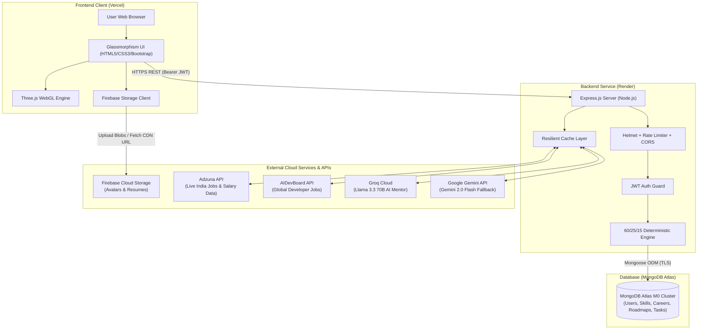

# CareerPath AI — Discover Your Career. Build Your Skills.

> **Hack2Ignite 2026–27 · Round 1 Qualifier**  
> **Domain:** EduTech / AI for Good  
> **Team Name:** 404 Brain Not Found  
> **Tagline:** Discover Your Career. Build Your Skills.

---

[](https://careerpath-ai-jade.vercel.app)
[](https://careerpath-ai-bdbt.onrender.com)
[](https://careerpath-ai-bdbt.onrender.com/api/health)
[](LICENSE)

---

### 🚀 Quick Links & Deployment Endpoints

| Resource | URL | Description |
| :--- | :--- | :--- |
| 🌐 **Live Web Application** | [https://careerpath-ai-jade.vercel.app](https://careerpath-ai-jade.vercel.app) | Production client app deployed on Vercel |
| ⚡ **Live Backend REST API** | [https://careerpath-ai-bdbt.onrender.com](https://careerpath-ai-bdbt.onrender.com) | Express.js API gateway hosted on Render |
| 🩺 **Backend Health Status** | [https://careerpath-ai-bdbt.onrender.com/api/health](https://careerpath-ai-bdbt.onrender.com/api/health) | Uptime telemetry and server health monitor |
| 👥 **Hackathon Team** | **404 Brain Not Found** | Hack2Ignite 2026–27 Competitors |
| 🔑 **Demo Onboarding** | Instant 1-Click Registration & Direct Login | Frictionless test flow for hackathon evaluators |

---

## 📖 Executive Summary & Problem Overview

**CareerPath AI** is an intelligent, interactive 3D web platform built to solve the widening gap between academic university curricula and fast-moving industry tech expectations.

Every year, millions of undergraduate computer science and IT students graduate without clear visibility into modern production stacks, how their university coursework maps to actual corporate job descriptions, or what concrete steps are required to become job-ready.

Traditional career counseling relies on subjective personality quizzes or high-level surveys that yield vague advice, while online learning portals overwhelm students with thousands of disconnected courses without a time-boxed execution plan.

CareerPath AI solves this through an **objective, deterministic AI recommendation engine**, an **immersive Three.js 3D learning experience**, **real-time job market telemetry**, and an **interactive AI Career Mentor**:

1. **Top 3 Matched Career Paths** ranked using a mathematically transparent, explainable formula (60% Skill Match, 25% Interest Match, 15% Education Match).
2. **Granular Skill-Gap Analysis** dividing required competencies into **Matched**, **Upgrade Needed**, and **Missing**.
3. **Personalized 4, 8, or 12-Week Roadmaps** with structured weekly milestones, task checkboxes, curated free documentation, and 1-click print/PDF export.
4. **Interactive 3D WebGL Visualizations** (Three.js & GSAP) that turn abstract data into celestial constellations, planetary orbits, and milestone journeys.
5. **Live Job & Salary Telemetry** pulling active tech hiring data across India and worldwide via the Adzuna and AIDevBoard APIs.
6. **Dual-Engine AI Career Mentor** offering instant, context-aware technical guidance powered by Groq Llama 3.3 70B with Google Gemini 2.0 Flash failover.
7. **Cloud Asset Management** with Firebase Storage for student profile photos and resume/CV attachments.

---

## 👥 The Team — 404 Brain Not Found

| Member | Role & Workstream | Key Responsibilities |
| :--- | :--- | :--- |
| **Parth Patil** | Team Leader & Backend Architect | System architecture, Express REST API, MongoDB models, recommendation engine, Render deployment, API ecosystem |
| **Suyog Pawar** | Frontend & Integration Lead | HTML5/CSS3/Bootstrap structuring, DOM controllers, asynchronous API client, Vercel deployment, PDF export |
| **Asmita Lokhande** | UI/UX & 3D WebGL Lead | Glassmorphism design system, Three.js 3D visual modules, GSAP micro-animations, slide deck aesthetics |
| **Aditi Vispute** | QA, Data & Documentation Lead | Skill matrix standardization, career seed curation, manual test matrix, Postman collections, demo rehearsal |

---

## 🌟 Core Platform Features

### 🔐 1. Resilient Authentication & Profile Onboarding
- **Stateless JWT Security:** Industry-standard JSON Web Tokens stored securely in browser storage.
- **Instant 1-Click Demo Mode:** Bypass OTP hurdles during evaluation with pre-filled test profiles or rapid registration.
- **Optional Real-Time OTP Verification:** Gmail SMTP nodemailer integration for live email verification.
- **Cloud Profile Assets (Firebase Storage):** Upload student avatars and PDF/DOC resumes with instant UI preview and backend linkage.

### 📝 2. Multi-Step Student Assessment
- **Education Profiling:** Captures degree (B.Tech, BCA, BSc CS, MCA), graduation year, and academic focus.
- **Domain Interests:** Multi-tag interest selection (Web Development, Cloud, AI/ML, DevOps, Cybersecurity, Mobile).
- **Categorized Skill Matrix (45+ Technologies):** Filter by Frontend, Backend, Database, Cloud, DevOps, AI/ML, Mobile, and Soft Skills.
- **Granular Proficiency Ratings:** Beginner (1), Intermediate (2), Advanced (3).
- **Custom Skill Registration:** Input any modern or niche technology not in the default seed catalog.

### 🧮 3. Deterministic Career Matching Engine
- **100% Explainable & Transparent:** No black-box AI hallucinations or erratic scoring.
- **Mathematical Formula:**
  $$\text{Match Score} = (\text{Skill Match} \times 0.60) + (\text{Interest Match} \times 0.25) + (\text{Education Match} \times 0.15)$$
- **Granular Skill-Gap Classification:**
  - 🟢 **Matched Skills:** Student proficiency $\ge$ required role proficiency.
  - 🟡 **Upgrade Needed:** Student has the skill but requires higher proficiency.
  - 🔴 **Missing Skills:** Critical mandatory competency not present in student profile.

### 🗺️ 4. Adaptive Learning Roadmaps & Task Tracking
- **Configurable Durations:** Dynamic 4-Week (Intensive), 8-Week (Balanced), or 12-Week (Comprehensive) learning paths.
- **Priority-Driven Scheduling:** Missing and upgrade-needed skills are sequenced first to close the largest gaps immediately.
- **Curated Learning Resources:** Free, high-quality documentation links (MDN, official docs, freeCodeCamp).
- **Interactive Checkbox Milestones:** Check off completed tasks with atomic MongoDB updates and live percentage recalculation.
- **🖨️ 1-Click Print & PDF Export:** Dedicated CSS media print stylesheets allow clean, paper-ready roadmap exports.

### 📊 5. Student Command Center (Dashboard)
- **Active Goal Telemetry:** Current target career, total progress percentage, completed vs. pending tasks.
- **Quick Skills Manager Modal:** Add, edit, or remove skills directly from the dashboard without redoing the entire assessment.
- **Resume & Avatar Cloud Manager:** Direct upload and access to attached resume and profile photo.
- **Next Recommended Action:** Real-time suggestion on which milestone to tackle next.

### 💼 6. Real-Time Job Market & Salary Intelligence
- **Adzuna Developer API:** Live real-time Indian tech job postings (TCS, Capco, Mphasis, Deutsche Bank, etc.) across Bengaluru, Pune, Hyderabad, and Mumbai, complete with CTC salary ranges (e.g., ₹5.5 LPA – ₹14.0 LPA).
- **AIDevBoard API:** Global remote developer job listings filtered by active career target.
- **Resilient Offline Cache:** Localized fallback vacancies ensure zero network-related failures during live hackathon judging.

### 🤖 7. Dual-Engine AI Career Mentor
- **Primary Engine:** Groq Cloud running **Llama 3.3 70B Versatile** (<500ms response time).
- **Secondary Fallback:** **Google Gemini 2.0 Flash** for seamless, automated failover if rate limits are reached.
- **Context-Aware Prompts:** Grounds responses in the student's active career goal, missing skills, and current roadmap week.

---

## 🌌 3D WebGL Interactive Experiences (Three.js + GSAP)

CareerPath AI integrates four custom Three.js WebGL modules:

| 3D Experience | Canvas Selector | Page Location | Visual Concept & Purpose |
| :--- | :--- | :--- | :--- |
| **Career Universe** | `#careerUniverse` | `client/index.html` | Constellation of glowing career nodes and floating stardust; represents infinite career pathways. |
| **Skill Orbit** | `#skill-orbit` | `client/recommendations.html` | Concentric orbital rings placing matched (green), upgrade (yellow), and missing (red) skills around the student. |
| **Roadmap Path** | `#roadmap-path` | `client/roadmap.html` | 3D stepping-stone milestone trail that illuminates as the student moves from Week 1 to completion. |
| **Progress Orb** | `#progress-orb` | `client/dashboard.html` | Holographic energy sphere that pulses faster and shifts hue based on active roadmap completion. |

> **Graceful 2D Fallback:** If a client device or browser disables WebGL or hardware acceleration, all pages automatically degrade to clean, high-contrast **2D Glassmorphism cards** with zero loss of interactive functionality.

---

## 🏗️ System Architecture & Multi-API Topology



---

## 🛠️ Technology Stack

| Layer | Technologies | Rationale |
| :--- | :--- | :--- |
| **Frontend UI** | HTML5, CSS3, JavaScript (ES6+), Bootstrap 5.3, Bootstrap Icons | Zero-build latency, near-instant first paint, universal browser compatibility |
| **3D & Animation** | Three.js (r128), GSAP (GreenSock) | High-performance WebGL rendering, orbit physics, buttery smooth transitions |
| **Backend API** | Node.js (v18+), Express.js (CommonJS) | Fast asynchronous event loop, battle-tested REST architectural style |
| **Database & ODM** | MongoDB Atlas (M0 Free Tier), Mongoose 8.x | Dynamic document schemas for multi-week roadmaps and nested skill matrices |
| **Cloud Storage** | Google Firebase Storage Client SDK (v10 / v12 compat) | Secure, high-throughput cloud storage for avatars and PDF resumes |
| **AI & LLM Services** | Groq Cloud (Llama 3.3 70B), Google Gemini 2.0 Flash | Ultra-fast (<500ms) inferencing with secondary cloud failover redundancy |
| **Market Data** | Adzuna Developer API, AIDevBoard REST API | Live Indian tech job openings, CTC salary ranges, and remote vacancies |
| **Security & Utilities** | bcryptjs, jsonwebtoken, helmet, express-rate-limit, cors, nodemailer | Cryptographic hashing, stateless sessions, API brute-force throttling |
| **Deployments** | Vercel (Client CDN), Render (Backend Web Service) | Production-ready free-tier cloud deployment with zero maintenance overhead |

---

## 📁 Repository Directory Structure

```text
careerpath-ai/
├── README.md                                ← Main project documentation (this file)
├── LICENSE                                  ← MIT Open Source License
├── .gitignore                               ← Git exclusion patterns
├── package.json                             ← Monorepo run scripts
├── package-lock.json                        ← Root dependency lockfile
│
├── client/                                  ← Frontend static web application (Vercel)
│   ├── index.html                           ← Landing page with Career Universe 3D
│   ├── login.html                           ← Student login portal
│   ├── register.html                        ← Registration & instant demo onboarding
│   ├── assessment.html                      ← 3-Step skill, education & interest profiling
│   ├── recommendations.html                 ← Career matches & 3D Skill Orbit
│   ├── roadmap.html                         ← Milestone roadmap, 3D path & 1-click PDF export
│   ├── dashboard.html                       ← Student dashboard & 3D Progress Orb
│   ├── 404.html                             ← Custom styled 404 error page
│   ├── vercel.json                          ← Vercel CDN routing configuration
│   ├── css/                                 ← Glassmorphism design tokens & page styles
│   │   ├── style.css                        ← Design tokens & shared components
│   │   └── dashboard.css                    ← Dashboard & quick-skills modal styling
│   ├── js/                                  ← Client application logic & modules
│   │   ├── config.js                        ← API gateway base URL configuration
│   │   ├── api.js                           ← Asynchronous HTTP client & error handler
│   │   ├── auth.js                          ← JWT session manager & user state
│   │   ├── firebase-config.js               ← Firebase client credentials & app init
│   │   ├── firebase-service.js              ← Cloud avatar & resume upload handler
│   │   ├── assessment.js                    ← Profiling form & skill category selector
│   │   ├── recommendations.js               ← Recommendation cards & job telemetry
│   │   ├── roadmap.js                       ← Task toggling & print/PDF export
│   │   ├── dashboard.js                     ← Dashboard state & Quick Skills Manager
│   │   ├── chat.js                          ← AI Career Mentor drawer controller
│   │   ├── three-career-universe.js         ← Landing page 3D starfield
│   │   ├── three-skill-orbit.js             ← Planetary skill rings 3D module
│   │   ├── three-roadmap-path.js            ← Milestone stepping-stone 3D module
│   │   └── three-progress.js                ← Pulsing holographic progress sphere
│   └── README.md                            ← Frontend setup & architecture guide
│
├── server/                                  ← Backend REST API service (Render)
│   ├── server.js                            ← Express entry point & route mounting
│   ├── package.json                         ← Backend dependencies & scripts
│   ├── render.yaml                          ← Render web service blueprint
│   ├── .env.example                         ← Backend environment configuration template
│   ├── seed.js                              ← Database seed runner (npm run seed)
│   ├── config/db.js                         ← MongoDB Atlas connection manager
│   ├── models/                              ← Mongoose schemas
│   │   ├── User.js                          ← Student schema with skills, avatar & resume
│   │   ├── Skill.js                         ← Standardized skill dictionary
│   │   ├── Career.js                        ← Career paths & skill requirements
│   │   ├── Roadmap.js                       ← Generated weekly learning plans
│   │   └── Task.js                          ← Atomic milestone tasks
│   ├── controllers/                         ← REST API route controllers
│   ├── routes/                              ← Express route endpoints
│   │   ├── authRoutes.js                    ← Auth & OTP routes
│   │   ├── userRoutes.js                    ← Profile & cloud asset updates
│   │   ├── careerRoutes.js                  ← Career catalog routes
│   │   ├── assessmentRoutes.js              ← Student profiling routes
│   │   ├── recommendationRoutes.js          ← 60/25/15 scoring computation
│   │   ├── roadmapRoutes.js                 ← Roadmap generation & task toggle
│   │   ├── dashboardRoutes.js               ← Dashboard telemetry aggregator
│   │   ├── chatRoutes.js                    ← Dual-Engine AI Mentor chat
│   │   ├── jobRoutes.js                     ← Adzuna & AIDevBoard job search
│   │   └── skillRoutes.js                   ← Skill catalog & custom skill additions
│   ├── services/                            ← Core business logic
│   │   ├── recommendationService.js         ← Match engine algorithm
│   │   ├── roadmapService.js                ← Milestone scheduling engine
│   │   ├── chatService.js                   ← Groq + Gemini AI orchestrator
│   │   └── jobBoardService.js               ← Adzuna & AIDevBoard integration
│   ├── middleware/                          ← Security & request validation
│   ├── data/                                ← Curated seed datasets (45+ skills, 5 careers)
│   └── README.md                            ← Backend API documentation
│
├── docs/                                    ← Complete technical documentation suite
│   ├── README.md                            ← Documentation index
│   ├── PRD.md                               ← Product Requirements Document
│   ├── TRD.md                               ← Technical Requirements Document
│   ├── APP-FLOW.md                          ← Visual Mermaid user flow diagrams
│   ├── UI-UX-DESIGN.md                      ← Design tokens & 3D visual guidelines
│   ├── BACKEND-SCHEMA.md                    ← Database schemas & data dictionary
│   ├── IMPLEMENTATION-PLAN.md               ← 48-Hour development roadmap
│   ├── API.md                               ← REST API payload contracts
│   ├── API-ECOSYSTEM.md                     ← Multi-API integration architecture
│   ├── DEPLOYMENT.md                        ← Cloud deployment manual
│   ├── TESTING.md                           ← QA plan & manual test cases matrix
│   ├── DEMO-SCRIPT.md                       ← 3–4 Min live presentation script
│   ├── PPT-CONTENT.md                       ← 10-Slide pitch deck outline
│   └── SUBMISSION-CHECKLIST.md              ← Final pre-submission checklist
│
├── postman/                                 ← API testing assets
│   ├── README.md                            ← Postman usage guide
│   └── CareerPath-AI.postman_collection.json← Postman v2.1 test collection
│
├── assets/                                  ← Visual diagrams & screenshot placeholders
└── presentation/                            ← Final pitch deck storage (.pptx / .pdf)
```

---

## ⚙️ Local Development Setup

### Prerequisites
- [Node.js](https://nodejs.org/) v18.0.0 or higher
- [MongoDB](https://www.mongodb.com/) (Local Community Server or free MongoDB Atlas URI)
- Terminal / PowerShell

### 1. Clone the Repository
```bash
git clone https://github.com/parthpatil1234p-svg/careerpath-ai.git
cd careerpath-ai
```

### 2. Backend Setup & Seeding
```bash
# Navigate to server
cd server

# Install backend dependencies
npm install

# Create environment configuration
cp .env.example .env
# Edit .env with your MongoDB URI and JWT Secret

# Seed database with standardized skills and careers
npm run seed

# Start development server
npm run dev
# Backend runs at: http://localhost:5000
```

### 3. Frontend Setup
In a new terminal window:
```bash
# Navigate to client
cd client

# Serve static files using Python
python -m http.server 5500
# Alternatively using Node:
# npx serve . -p 5500

# Open in browser: http://localhost:5500
```

---

## 🔐 Environment Variables Specification

Create `server/.env` with the following variables:

```env
# ── Core Server Config ─────────────────────────────────────────
PORT=5000
NODE_ENV=development
CLIENT_URL=http://localhost:5500

# ── Database & Authentication ──────────────────────────────────
MONGODB_URI=mongodb+srv://<username>:<password>@cluster0.mongodb.net/careerpath-ai?retryWrites=true&w=majority
JWT_SECRET=your_super_secret_jwt_key_at_least_32_characters
JWT_EXPIRES_IN=7d

# ── AI Mentor Cloud Engines (Optional — has static fallback) ───
GROQ_API_KEY=gsk_your_groq_api_key_here
GEMINI_API_KEY=AIzaSy_your_gemini_api_key_here

# ── Live Job Market Intelligence ───────────────────────────────
ADZUNA_APP_ID=your_adzuna_app_id
ADZUNA_APP_KEY=your_adzuna_app_key

# ── Email OTP Delivery (Optional — has 1-Click Demo mode) ──────
EMAIL_USER=your_email@gmail.com
EMAIL_PASS=your_16_character_google_app_password
```

---

## 📡 REST API Endpoint Reference

All backend API routes are prefixed with `/api`. Protected routes require the header:  
`Authorization: Bearer <JWT_TOKEN>`

| Method | Endpoint | Access | Description |
| :--- | :--- | :--- | :--- |
| **GET** | `/api/health` | Public | System uptime & server health status |
| **GET** | `/api/version` | Public | API version & environment info |
| **POST** | `/api/auth/register` | Public | Register new student profile & issue JWT |
| **POST** | `/api/auth/login` | Public | Authenticate student credentials & issue JWT |
| **POST** | `/api/auth/send-otp` | Public | Send verification OTP to email |
| **POST** | `/api/auth/verify-otp` | Public | Verify 6-digit OTP code |
| **GET** | `/api/users/me` | Protected | Fetch authenticated student profile |
| **PUT** | `/api/users/me` | Protected | Update profile fields (skills, avatarUrl, resumeUrl) |
| **PUT** | `/api/assessment` | Protected | Save initial 3-step student evaluation |
| **GET** | `/api/careers` | Public | List all available career target tracks |
| **GET** | `/api/careers/:slug` | Public | Fetch career details with required skill proficiencies |
| **GET** | `/api/skills` | Public | Search & filter standardized skills catalog by category |
| **POST** | `/api/skills/custom` | Protected | Register a custom user-defined skill |
| **POST** | `/api/recommendations/generate` | Protected | Compute 60/25/15 match score & skill-gap breakdown |
| **POST** | `/api/roadmaps/generate` | Protected | Create a personalized 4, 8, or 12-week roadmap |
| **GET** | `/api/roadmaps/current` | Protected | Fetch student's current active learning roadmap |
| **PATCH**| `/api/roadmaps/tasks/:taskId/toggle`| Protected | Toggle completion status of a milestone task |
| **DELETE**| `/api/roadmaps/current` | Protected | Archive current active roadmap |
| **GET** | `/api/dashboard` | Protected | Retrieve unified student dashboard telemetry |
| **GET** | `/api/jobs/adzuna` | Public | Query live real-time Indian tech job listings & salaries |
| **GET** | `/api/jobs/career/:slug` | Public | Fetch live market jobs mapped to a career slug |
| **GET** | `/api/jobs` | Public | General job search with keyword & workplace filters |
| **POST** | `/api/jobs/match` | Public | Match live jobs against an arbitrary skills array |
| **POST** | `/api/chat/message` | Public/Protected | Chat with Dual-Engine AI Career Mentor (Groq + Gemini) |

---

## 🧪 Testing & Verification

1. **Automated Postman Test Suite:** Located at [`postman/CareerPath-AI.postman_collection.json`](postman/CareerPath-AI.postman_collection.json). Covers health check, registration, login, profile updates, recommendation calculations, and roadmap generation.
2. **Quality Assurance Matrix:** Comprehensive 19-test case manual test plan documented in [`docs/TESTING.md`](docs/TESTING.md).
3. **Cross-Browser Compatibility:** Tested on Google Chrome 120+, Microsoft Edge 120+, Mozilla Firefox 120+, and Mobile Safari/Chrome.
4. **WebGL Graceful Fallback:** Tested by disabling hardware acceleration in browser flags; verifies automatic 2D card presentation.

---

## 📚 Complete Technical Documentation Suite

| Document | File Path | Focus Area |
| :--- | :--- | :--- |
| 📑 **PRD** | [`docs/PRD.md`](docs/PRD.md) | Product vision, user personas, MVP boundary scope |
| 🛠️ **TRD** | [`docs/TRD.md`](docs/TRD.md) | Architecture, data modeling, algorithm specifications |
| 🔄 **App Flow** | [`docs/APP-FLOW.md`](docs/APP-FLOW.md) | Visual Mermaid diagrams for all platform lifecycles |
| 🎨 **UI/UX Design** | [`docs/UI-UX-DESIGN.md`](docs/UI-UX-DESIGN.md) | Glassmorphism design tokens, typography, 3D guidelines |
| 🗃️ **Backend Schema** | [`docs/BACKEND-SCHEMA.md`](docs/BACKEND-SCHEMA.md) | Mongoose schemas, relationships, indexing rules |
| 📅 **Implementation**| [`docs/IMPLEMENTATION-PLAN.md`](docs/IMPLEMENTATION-PLAN.md) | 48-Hour qualifier milestone execution plan |
| 📡 **API Contract** | [`docs/API.md`](docs/API.md) | Request and response JSON payload contracts |
| 🌐 **API Ecosystem** | [`docs/API-ECOSYSTEM.md`](docs/API-ECOSYSTEM.md) | External API integrations (Adzuna, Groq, Gemini, AIDevBoard) |
| 🚀 **Deployment** | [`docs/DEPLOYMENT.md`](docs/DEPLOYMENT.md) | Cloud provisioning on Vercel, Render, and MongoDB Atlas |
| 🧪 **QA & Testing** | [`docs/TESTING.md`](docs/TESTING.md) | Test cases, browser matrix, WebGL failover validation |
| 🎤 **Demo Script** | [`docs/DEMO-SCRIPT.md`](docs/DEMO-SCRIPT.md) | Rehearsed 3–4 minute live pitch script & judge Q&A |
| 📊 **Pitch Deck** | [`docs/PPT-CONTENT.md`](docs/PPT-CONTENT.md) | 10-Slide presentation deck structure and speaker notes |
| 📋 **Checklist** | [`docs/SUBMISSION-CHECKLIST.md`](docs/SUBMISSION-CHECKLIST.md) | Pre-submission verification matrix |

---

## 🔮 Scalability & Future Roadmap (Post-Round 1)

1. **Automated Resume & GitHub Analyzer:** Direct parsing of PDF resumes and GitHub commit histories to auto-populate student skills.
2. **Interactive Coding Sandbox (Judge0 CE):** Embedded compiler to let students test code snippets directly within weekly roadmap tasks.
3. **Competitive Programming Radar (Kontests API):** Real-time calendar of upcoming LeetCode, Codeforces, and HackerRank contests.
4. **Verified Credential Badging:** Integration with Open Badges to verify skill milestone completion.
5. **Direct Employer Internship Pipeline:** Matching students who achieve $\ge 80\%$ roadmap completion with hiring partner entry-level roles.

---

## 🔒 Security & Privacy Posture

- Passwords salted and hashed with `bcryptjs` (10 rounds).
- Stateless JWT authentication with standard expiration limits.
- HTTP security headers enforced via `helmet`.
- Strict IP-based rate limiting via `express-rate-limit` prevents brute-force abuse.
- Sensitive credentials, API keys, and database connection strings strictly isolated in environment variables.

---

## 📄 License

This project is licensed under the **MIT License** — see the [`LICENSE`](LICENSE) file for details.

---

## 🙏 Acknowledgements

- **[Hack2Ignite 2026–27](https://hack2ignite.com):** For organizing the hackathon and providing a platform to build high-impact EduTech solutions.
- **Open-Source Ecosystem:** [Three.js](https://threejs.org/), [GSAP](https://greensock.com/), [Bootstrap](https://getbootstrap.com/), [Express](https://expressjs.com/), [Mongoose](https://mongoosejs.com/), [Groq](https://groq.com/), and [Adzuna](https://www.adzuna.com/).
