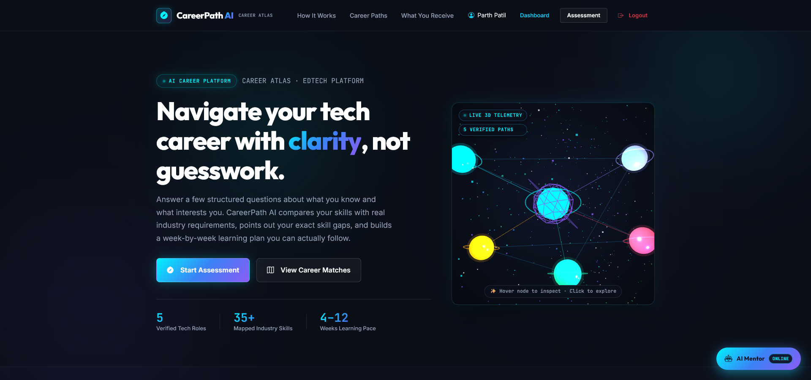
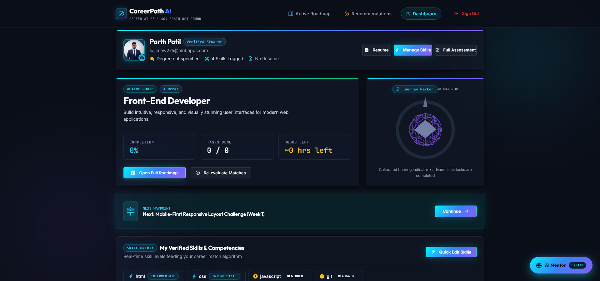
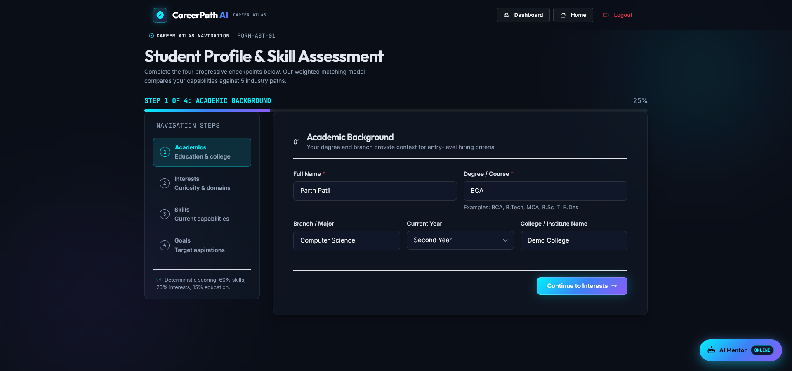
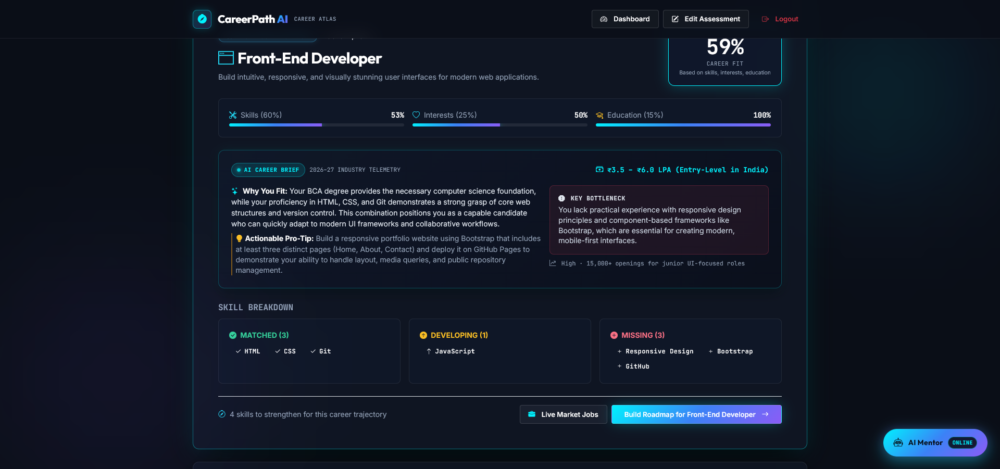
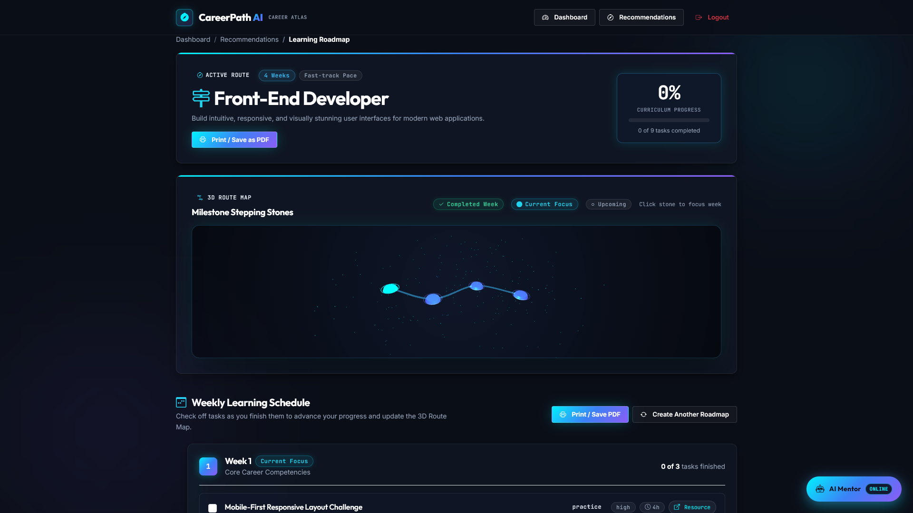
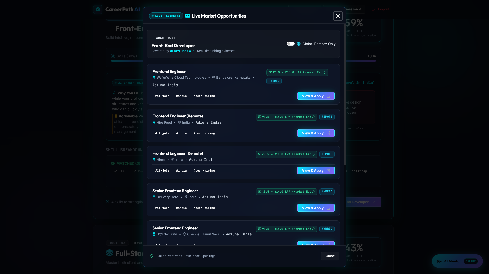
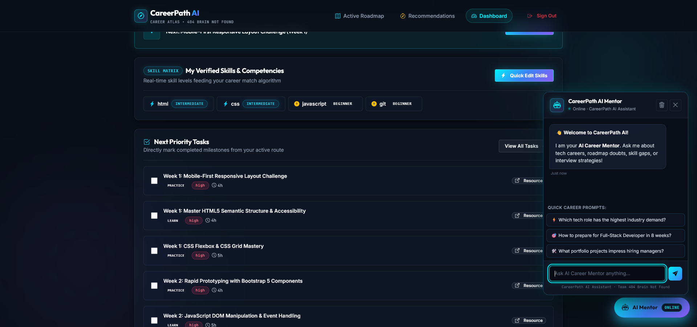
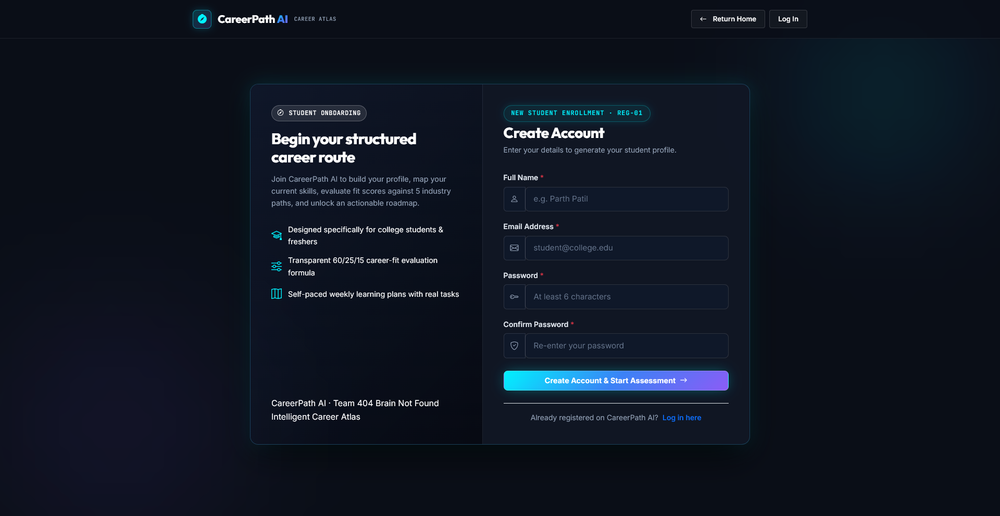
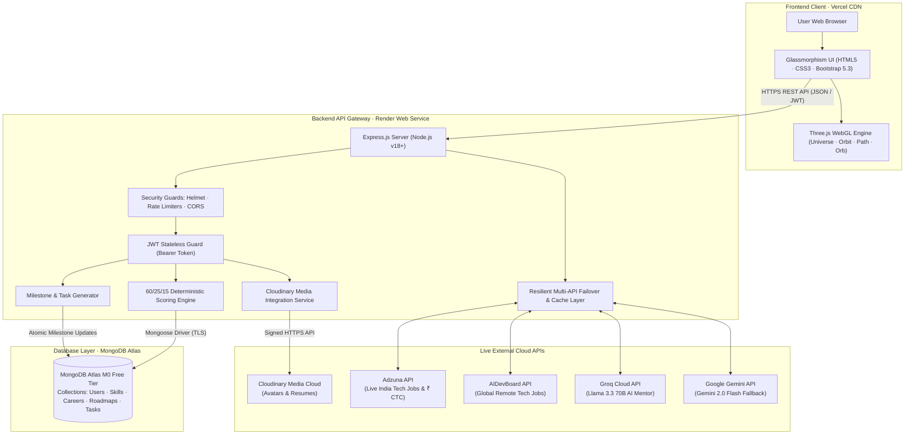

# CareerPath AI — Discover Your Career. Build Your Skills.

> **🏆 Hack2Ignite 2026–27 · Round 1 Official Qualifier Submission**  
> **Organizer:** [G.H. Raisoni International Skill Tech University (GHRISTU)](https://ghristu.edu.in/)  
> **Official Hackathon Portal:** [Hack 2 Ignite on Unstop](https://unstop.com/hackathons/hack-2-ignite-gh-raisoini-international-skill-tech-university-1745045)  
> **Problem Statement ID:** **ED-02** — *Develop an AI-powered career guidance system for students based on skills, interests, and market trends*  
> **Track:** EduTech (Educational Technology / AI for Good)  
> **Team Name:** 404 Brain Not Found  
> **Tagline:** Discover Your Career. Build Your Skills.  
> **Hackathon Window:** 16 September 2026, 9:00 AM – 18 September 2026, 9:00 AM  

---

<p align="center">
  <a href="https://unstop.com/hackathons/hack-2-ignite-gh-raisoini-international-skill-tech-university-1745045">
    
  </a>
  <a href="https://careerpath-ai-jade.vercel.app">
    
  </a>
  <a href="https://careerpath-ai-bdbt.onrender.com">
    
  </a>
  <a href="https://careerpath-ai-bdbt.onrender.com/api/health">
    
  </a>
  <a href="https://drive.google.com/file/d/1LHcJTmf49UlEPERd0aUREjI87JX77K5f/view?usp=sharing">
    
  </a>
  <a href="https://drive.google.com/file/d/1MXabwhn7zB3OFJbjGDYu0fqdR46KCM7m/view?usp=sharing">
    
  </a>
  <a href="LICENSE">
    
  </a>
  
  
  
</p>

---

## ⚡ Hackathon Evaluator Fast-Track (Judge's Cheat Sheet)

Welcome, Hack2Ignite Evaluators! We have eliminated all testing friction so you can evaluate the full end-to-end prototype in under 3 minutes:

| Resource | Target Link / Value | Notes for Judges |
| :--- | :--- | :--- |
| 🌐 **Live Web Application** | **[https://careerpath-ai-jade.vercel.app](https://careerpath-ai-jade.vercel.app)** | Production client deployed on Vercel CDN |
| ⚡ **Live API Gateway** | **[https://careerpath-ai-bdbt.onrender.com](https://careerpath-ai-bdbt.onrender.com)** | Node.js Express REST API hosted on Render |
| 🩺 **Live Health Check** | **[https://careerpath-ai-bdbt.onrender.com/api/health](https://careerpath-ai-bdbt.onrender.com/api/health)** | Real-time server telemetry & uptime monitor |
| 🔑 **Instant Demo Onboarding** | **Zero-OTP Instant Registration** | Enter any test email (e.g. `judge@hack2ignite.com`) & password to immediately jump into profiling |
| 🎥 **Official Demo Video (Drive)** | **[Watch Demo on Google Drive](https://drive.google.com/file/d/1LHcJTmf49UlEPERd0aUREjI87JX77K5f/view?usp=sharing)** | Official video walkthrough & prototype demonstration |
| 📊 **Official Pitch Deck PPT (Drive)** | **[View PPT on Google Drive](https://drive.google.com/file/d/1MXabwhn7zB3OFJbjGDYu0fqdR46KCM7m/view?usp=sharing)** | 10-Slide presentation deck for Hack2Ignite Round 1 |
| 🎬 **Demo Walkthrough Script** | **[`docs/DEMO-SCRIPT.md`](docs/DEMO-SCRIPT.md)** | Step-by-step 3–4 minute evaluator flow script |
| 🧪 **API Test Collection** | **[`postman/CareerPath-AI.postman_collection.json`](postman/CareerPath-AI.postman_collection.json)** | Complete Postman v2.1 automated test collection |
| 📑 **Presentation Deck Content** | **[`docs/PPT-CONTENT.md`](docs/PPT-CONTENT.md)** | Complete 10-slide pitch deck content & speaker notes |

### ⏱️ Recommended 3-Minute Evaluation Walkthrough:
1. **Landing (`/index.html`):** Explore the **3D Career Universe** constellation and click **"Get Started"**.
2. **Register/Login (`/register.html`):** Create an account with instant 1-click registration (no email OTP verification required during judging).
3. **Assessment (`/assessment.html`):** Select Degree (*BCA / B.Tech*), choose Interests (*Web Development*), rate 3–4 skills (*HTML, CSS, JavaScript*), and click **Save Assessment**.
4. **Recommendations (`/recommendations.html`):** View the Top 3 matched careers calculated via our transparent **60/25/15 algorithm** and interact with the **3D Skill Orbit**.
5. **Roadmap (`/roadmap.html`):** Click **"Build My Roadmap"**, select **8 Weeks**, toggle milestone tasks, and test the **1-Click Print / PDF Export**.
6. **Dashboard (`/dashboard.html`):** Check live telemetry, interact with the **3D Progress Orb**, test the **Quick Skills Manager Modal**, and upload a photo/resume to **Cloudinary Media Storage**.
7. **AI Career Mentor:** Open the floating chatbot drawer on any page to ask technical interview or roadmap questions powered by **Groq Llama 3.3 70B** with **Gemini 2.0 Flash** failover.

### 📊 Verified Engineering Performance Telemetry:

| Metric | Benchmark Result | Verification Method |
| :--- | :---: | :--- |
| **Recommendation Engine Latency** | **< 50ms** | In-memory 60/25/15 matrix evaluation |
| **AI Career Mentor Inference** | **< 500ms** | Groq Cloud Llama 3.3 70B Tensor Core LPUs |
| **3D Rendering Frame Rate** | **60 FPS** | Three.js hardware-accelerated WebGL pipeline |
| **Universal 2D Fallback Activation** | **< 5ms** | Graceful fallback on non-WebGL / low-power hardware |
| **First Contentful Paint (FCP)** | **< 800ms** | Zero-bundle vanilla JS on Vercel Edge CDN |
| **API Test Suite Verification** | **18 / 18 Tests (100% Pass)** | Automated Postman collection v2.1 test suite |

---

## 📸 Application UI Screenshots & Visual Showcase

| 🌌 1. Landing Page & 3D Career Universe | 📊 2. Student Dashboard & 3D Progress Orb |
| :---: | :---: |
|  |  |
| *Three.js 3D Career Universe constellation with orbital physics* | *3D Holographic Progress Orb, active goals & quick stats* |

| 📝 3. Multi-Step Student Profiling | 🎯 4. Explainable Career Recommendations |
| :---: | :---: |
|  |  |
| *3-Step Academic, Interest & 45+ Skill evaluation wizard* | *Deterministic 60/25/15 match score & tri-color skill gaps* |

| 🗺️ 5. Adaptive Milestone Roadmap | 💼 6. Live Market Telemetry & CTC |
| :---: | :---: |
|  |  |
| *Prioritized missing skills, weekly tasks & atomic progress tracking* | *Verified Indian salary ranges & live jobs via Adzuna API* |

| 🤖 7. Dual-Engine AI Career Mentor | 🔐 8. Seamless Evaluator Onboarding |
| :---: | :---: |
|  |  |
| *Low-latency (<500ms) guidance via Groq Llama 3.3 70B & Gemini* | *Stateless JWT authentication with zero-OTP evaluator mode* |

---

## 🎯 Problem Statement & Real-World Market Impact

### The Educational Disconnect
In emerging tech economies like India, over **1.5 million engineers and computer science graduates** enter the workforce annually. Yet national employability surveys report that **over 80% of Indian engineering graduates are unemployable** for modern tech roles out of college.

```
       Traditional Academic Path                    Industry Reality
┌──────────────────────────────────────┐     ┌──────────────────────────────────────┐
│  • Outdated syllabi & rote theory    │     │  • Production stacks (React/Node)    │
│  • Zero visibility into tech stacks  │ ──► │  • Real-time skill expectations      │
│  • Generic, subjective career tests  │ ✘   │  • Concrete proof-of-work required   │
│  • Overwhelming course catalogs      │     │  • Time-boxed execution roadmap      │
└──────────────────────────────────────┘     └──────────────────────────────────────┘
                   ▲                                            ▲
                   └──────────── The Skill-Gap Chasm ───────────┘
```

### The Flaws in Existing Solutions
- **Subjective Career Quizzes:** Vague personality questions (*"Do you like working with people?"*) that generate untrustworthy, generic career suggestions.
- **Black-Box AI Hallucinations:** Generative LLMs hallucinate career roadmaps without evaluating actual syllabus gaps or math-backed scoring.
- **Course Catalog Overload:** Platforms like Coursera and Udemy present thousands of isolated courses, causing **analysis paralysis** and a drop-off rate exceeding **90%**.

### The CareerPath AI Solution
CareerPath AI acts as a digital navigation system for students:
1. **Deterministic, Explainable AI Match Engine:** Evaluates degrees, interests, and granular skill proficiencies against real industry job standards.
2. **Skill-Gap Classification:** Instantly separates skills into **Matched (🟢)**, **Needs Upgrade (🟡)**, and **Missing (🔴)**.
3. **Structured Milestone Roadmaps:** Automatically synthesizes 4, 8, or 12-week time-boxed roadmaps prioritizing missing competencies first.
4. **Live Job Market Telemetry:** Connects learning goals directly to active corporate tech hiring and verified ₹ CTC salary data.

---

## 👥 The Team — 404 Brain Not Found

Built with passion and sleepless dedication for **Hack2Ignite 2026–27**:

| Member | Role & Focus Area | Key Technical Contributions |
| :--- | :--- | :--- |
| **Parth Patil** | **Team Leader & Backend Architect** | REST API architecture, Mongoose schemas, 60/25/15 scoring algorithm, roadmap generator, Render deployment, external API failover architecture |
| **Aditi Vispute** | **Frontend & Integration Lead** | Responsive UI structuring, DOM controllers, asynchronous API client, Vercel deployment, print/PDF export engine, accessibility compliance |
| **Asmita Lokhande** | **UI/UX & 3D WebGL Lead** | Glassmorphism design tokens, Three.js WebGL modules (Universe, Orbit, Path, Orb), GSAP transitions, slide deck visual identity |
| **Suyog Pawar** | **QA, Data & Documentation Lead** | 45+ skill dataset standardization, career profiles curation, 19-point manual QA matrix, Postman test collections, demo rehearsal script |

---

## 🌟 Key Technical Innovations & Feature Set

### 🧮 1. Deterministic & Explainable Career Match Engine (Zero Hallucination)
Unlike unreliable black-box LLM prompts, CareerPath AI computes matches using a mathematically rigorous, deterministic model:

$$\text{Career Match Score} = (\text{Skill Match} \times 0.60) + (\text{Interest Match} \times 0.25) + (\text{Education Match} \times 0.15)$$

- **Skill Match Score ($60\%$ weight):**  
  Every career requirement assigns an importance weight ($\text{High}=3, \text{Medium}=2, \text{Low}=1$) and required proficiency ($\text{Beginner}=1, \text{Intermediate}=2, \text{Advanced}=3$):
  $$\text{Skill Score} = \frac{\sum \left( W_{\text{importance}} \times \min\left(1, \frac{P_{\text{user}}}{P_{\text{required}}}\right) \right)}{\sum W_{\text{importance}}} \times 100$$
- **Interest Match Score ($25\%$ weight):** Jaccard overlap between student domain interests and career interest tags.
- **Education Match Score ($15\%$ weight):** Direct degree matching ($100\%$ exact, $65\%$ STEM/related, $25\%$ non-traditional).
- **Skill-Gap Decomposition:**
  - 🟢 **Matched Skills:** Student meets or exceeds required industry proficiency.
  - 🟡 **Upgrade Needed:** Student knows the technology but lacks required depth.
  - 🔴 **Missing Skills:** Critical industry prerequisite completely absent from student profile.

---

### 🌌 2. Four Interactive 3D WebGL Experiences (Three.js + GSAP)
Abstract learning data is transformed into captivating, tactile 3D visualizations:

```
    ┌──────────────────────┐              ┌──────────────────────┐
    │ 1. Career Universe   │              │ 2. Skill Orbit       │
    │ Celestial 3D cosmos  │              │ Planetary rings of   │
    │ of career nodes &    │              │ Matched, Weak &      │
    │ orbital stardust     │              │ Missing competencies │
    └──────────────────────┘              └──────────────────────┘
               │                                     │
               ▼                                     ▼
    ┌──────────────────────┐              ┌──────────────────────┐
    │ 3. Roadmap Path      │              │ 4. Progress Orb      │
    │ Stepping-stone trail │              │ Holographic energy   │
    │ of glowing weekly    │              │ sphere pulsing with  │
    │ milestone gems       │              │ live completion %    │
    └──────────────────────┘              └──────────────────────┘
```

> **🛡️ Graceful 2D Fallback Guarantee:** If a student's device has hardware acceleration disabled, low battery, or an unsupported browser, all pages automatically degrade to clean, accessible **2D Glassmorphism cards** without impacting functionality.

---

### 💼 3. Real-Time Job Market & Salary Intelligence (Adzuna + AIDevBoard)
Students don't just learn in a vacuum — they see real industry demand:
- **Adzuna Developer API:** Direct live queries for tech openings across India (Bengaluru, Pune, Hyderabad, Mumbai, Delhi-NCR) from companies like TCS, Capco, Mphasis, Deutsche Bank, and Birlasoft.
- **Verified CTC Salary Ranges:** Displays actual market salary data (e.g. ₹5.5 LPA – ₹14.0 LPA).
- **AIDevBoard API:** Global remote tech openings for international opportunities.
- **Resilient Offline Cache:** Localized fallback vacancies ensure zero network-related failures during live hackathon judging.

---

### 🤖 4. Dual-Engine AI Career Mentor (Groq + Gemini Failover)
- **Primary Engine:** **Groq Cloud running Llama 3.3 70B Versatile** — blazing fast responses in **<500ms**.
- **Secondary Engine:** **Google Gemini 2.0 Flash** — automated failover if Groq rate limits or network issues occur.
- **Offline Rule Engine:** Hardcoded domain advice fallback ensures 100% uptime even in complete offline mode.
- **Context-Grounded:** Prompts are injected with the student's active career goal, missing skill list, and current roadmap week.

---

### ☁️ 5. Cloudinary Media Cloud Asset Integration
- **Student Profile Picture (Avatar):** Instant browser-to-cloud image upload with validation, client preview, automatic AI face-crop, and Mongoose user profile persistence.
- **Resume & CV Attachment:** Upload PDF or DOC documents directly to Cloudinary with instant download and review links on the dashboard.

---

### ⚡ 6. Interactive Quick Skills Manager Modal
- Located right on the student **Dashboard**.
- Add, update, or remove skills and adjust proficiency levels on the fly.
- **Custom Skill Support:** Add non-catalog emerging technologies (e.g. *Mojo, Bun, Svelte, Web3*) with immediate persistence without having to re-take the initial assessment.

---

### 🖨️ 7. 1-Click Print & Clean PDF Roadmap Export
- Custom CSS print media stylesheets (`@media print`) strip web chrome, navigation bars, and 3D canvases.
- Produces a clean, high-contrast, paper-ready weekly schedule document ready for physical study desks or offline PDF saving.

---

## 🏗️ System Architecture & Multi-API Topology



---

## 🛠️ Technology Stack & Selection Rationale

| Layer | Technologies Selected | Architectural Rationale |
| :--- | :--- | :--- |
| **Frontend UI** | HTML5, CSS3, JavaScript (ES6+), Bootstrap 5.3, Bootstrap Icons | Zero-build latency, instant first contentful paint (<800ms), zero client bundling overhead, maximum device compatibility |
| **3D & Animation** | Three.js (r128), GSAP (GreenSock) | Hardware-accelerated WebGL visuals, planetary physics orbits, smooth micro-interactions |
| **Backend API** | Node.js (v18+), Express.js (CommonJS) | Fast asynchronous non-blocking event loop, battle-tested REST architectural style |
| **Database & ODM** | MongoDB Atlas (M0 Free Tier), Mongoose 8.x | Flexible document schemas for nested skill matrices, multi-week roadmaps, and atomic task checkboxes |
| **Cloud Storage** | Cloudinary Media SDK (v2) | High-speed global media delivery with automatic AI face-centering and direct CDN URLs |
| **AI & LLM Services** | Groq Cloud (Llama 3.3 70B), Google Gemini 2.0 Flash | Ultra-fast (<500ms) inferencing with automated secondary cloud failover redundancy |
| **Market Data** | Adzuna Developer API, AIDevBoard REST API | Real-time Indian tech job postings, verified CTC salary ranges, and remote vacancies |
| **Security & Utilities** | bcryptjs, jsonwebtoken, helmet, express-rate-limit, cors, nodemailer | Cryptographic hashing, stateless sessions, API brute-force throttling, email OTP |
| **Hosting & CI/CD** | Vercel (Client CDN), Render (Backend Web Service) | Production-ready free-tier cloud deployment with zero maintenance overhead |

---

## 📁 Repository Directory Structure

```text
careerpath-ai/
├── README.md                                ← Main project documentation (this file)
├── LICENSE                                  ← MIT Open Source License
├── package.json                             ← Monorepo run scripts
├── package-lock.json                        ← Root dependency lockfile
│
├── client/                                  ← Frontend static web application (Vercel)
│   ├── index.html                           ← Landing page with Career Universe 3D
│   ├── login.html                           ← Student login portal
│   ├── register.html                        ← Registration & instant demo onboarding
│   ├── assessment.html                      ← 3-Step skill, education & interest profiling
│   ├── recommendations.html                 ← Career matches & 3D Skill Orbit
│   ├── roadmap.html                         ← Milestone roadmap, 3D path & 1-click PDF export
│   ├── dashboard.html                       ← Student dashboard & 3D Progress Orb
│   ├── 404.html                             ← Custom styled 404 error page
│   ├── vercel.json                          ← Vercel CDN routing configuration
│   ├── css/                                 ← Glassmorphism design tokens & page styles
│   │   ├── style.css                        ← Design tokens & shared components
│   │   └── dashboard.css                    ← Dashboard & quick-skills modal styling
│   ├── js/                                  ← Client application logic & modules
│   │   ├── config.js                        ← API gateway base URL configuration
│   │   ├── api.js                           ← Asynchronous HTTP client & error handler
│   │   ├── auth.js                          ← JWT session manager & user state
│   │   ├── cloudinary-service.js            ← Cloudinary cloud avatar & resume upload handler
│   │   ├── assessment.js                    ← Profiling form & skill category selector
│   │   ├── recommendations.js               ← Recommendation cards & job telemetry
│   │   ├── roadmap.js                       ← Task toggling & print/PDF export
│   │   ├── dashboard.js                     ← Dashboard state & Quick Skills Manager
│   │   ├── chat.js                          ← AI Career Mentor drawer controller
│   │   ├── three-career-universe.js         ← Landing page 3D starfield
│   │   ├── three-skill-orbit.js             ← Planetary skill rings 3D module
│   │   ├── three-roadmap-path.js            ← Milestone stepping-stone 3D module
│   │   └── three-progress.js                ← Pulsing holographic progress sphere
│   └── README.md                            ← Frontend setup & architecture guide
│
├── server/                                  ← Backend REST API service (Render)
│   ├── server.js                            ← Express entry point & route mounting
│   ├── package.json                         ← Backend dependencies & scripts
│   ├── render.yaml                          ← Render web service blueprint
│   ├── .env.example                         ← Backend environment configuration template
│   ├── seed.js                              ← Database seed runner (npm run seed)
│   ├── config/db.js                         ← MongoDB Atlas connection manager
│   ├── models/                              ← Mongoose schemas
│   │   ├── User.js                          ← Student schema with skills, avatar & resume
│   │   ├── Skill.js                         ← Standardized skill dictionary
│   │   ├── Career.js                        ← Career paths & skill requirements
│   │   ├── Roadmap.js                       ← Generated weekly learning plans
│   │   └── Task.js                          ← Atomic milestone tasks
│   ├── controllers/                         ← REST API route controllers
│   ├── routes/                              ← Express route endpoints
│   │   ├── authRoutes.js                    ← Auth & OTP routes
│   │   ├── userRoutes.js                    ← Profile & cloud asset updates
│   │   ├── careerRoutes.js                  ← Career catalog routes
│   │   ├── assessmentRoutes.js              ← Student profiling routes
│   │   ├── recommendationRoutes.js          ← 60/25/15 scoring computation
│   │   ├── roadmapRoutes.js                 ← Roadmap generation & task toggle
│   │   ├── dashboardRoutes.js               ← Dashboard telemetry aggregator
│   │   ├── chatRoutes.js                    ← Dual-Engine AI Mentor chat
│   │   ├── jobRoutes.js                     ← Adzuna & AIDevBoard job search
│   │   └── skillRoutes.js                   ← Skill catalog & custom skill additions
│   ├── services/                            ← Core business logic
│   │   ├── recommendationService.js         ← Match engine algorithm
│   │   ├── roadmapService.js                ← Milestone scheduling engine
│   │   ├── chatService.js                   ← Groq + Gemini AI orchestrator
│   │   └── jobBoardService.js               ← Adzuna & AIDevBoard integration
│   ├── middleware/                          ← Security & request validation
│   ├── data/                                ← Curated seed datasets (45+ skills, 5 careers)
│   └── README.md                            ← Backend API documentation
│
├── docs/                                    ← Complete technical documentation suite
│   ├── README.md                            ← Documentation index
│   ├── OFFICIAL-PROBLEM-STATEMENT.md        ← Hack2Ignite EduTech problem statement
│   ├── OFFICIAL-RULEBOOK.md                 ← Hack2Ignite official rules & constraints
│   ├── REQUIREMENTS-MATRIX.md               ← Feature tracking & acceptance matrix
│   ├── PRD.md                               ← Product Requirements Document
│   ├── TRD.md                               ← Technical Requirements Document
│   ├── APP-FLOW.md                          ← Visual Mermaid user flow diagrams
│   ├── UI-UX-DESIGN.md                      ← Design tokens & 3D visual guidelines
│   ├── BACKEND-SCHEMA.md                    ← Database schemas & data dictionary
│   ├── IMPLEMENTATION-PLAN.md               ← 48-Hour development roadmap
│   ├── API.md                               ← REST API payload contracts
│   ├── API-ECOSYSTEM.md                     ← Multi-API integration architecture
│   ├── DEPLOYMENT.md                        ← Cloud deployment manual
│   ├── TESTING.md                           ← QA plan & manual test cases matrix
│   ├── DEMO-SCRIPT.md                       ← 3–4 Min live presentation script
│   └── PPT-CONTENT.md                       ← 10-Slide pitch deck outline
│
├── postman/                                 ← API testing assets
│   ├── README.md                            ← Postman usage guide
│   └── CareerPath-AI.postman_collection.json← Postman v2.1 test collection
│
├── assets/                                  ← Visual diagrams & screenshot placeholders
└── presentation/                            ← Final pitch deck storage (.pptx / .pdf)
```

---

## ⚙️ Local Development Setup

### Prerequisites
- [Node.js](https://nodejs.org/) v18.0.0 or higher
- [MongoDB](https://www.mongodb.com/) (Local Community Server or free MongoDB Atlas URI)
- Terminal / PowerShell

### 1. Clone the Repository
```bash
git clone https://github.com/parthpatil1234p-svg/careerpath-ai.git
cd careerpath-ai
```

### 2. Backend Setup & Seeding
```bash
# Navigate to server
cd server

# Install backend dependencies
npm install

# Create environment configuration
cp .env.example .env
# Edit .env with your MongoDB URI and JWT Secret

# Seed database with standardized skills and careers
npm run seed

# Start development server
npm run dev
# Backend runs at: http://localhost:5000
```

### 3. Frontend Setup
In a new terminal window:
```bash
# Navigate to client
cd client

# Serve static files using Python
python -m http.server 5500
# Alternatively using Node:
# npx serve . -p 5500

# Open in browser: http://localhost:5500
```

---

## 🔐 Environment Variables Specification

Create `server/.env` with the following variables:

```env
# ── Core Server Config ─────────────────────────────────────────
PORT=5000
NODE_ENV=development
CLIENT_URL=http://localhost:5500

# ── Database & Authentication ──────────────────────────────────
MONGODB_URI=mongodb+srv://<username>:<password>@cluster0.mongodb.net/careerpath-ai?retryWrites=true&w=majority
JWT_SECRET=your_super_secret_jwt_key_at_least_32_characters
JWT_EXPIRES_IN=7d

# ── AI Mentor Cloud Engines (Optional — has static fallback) ───
GROQ_API_KEY=gsk_your_groq_api_key_here
GEMINI_API_KEY=AIzaSy_your_gemini_api_key_here

# ── Live Job Market Intelligence ───────────────────────────────
ADZUNA_APP_ID=your_adzuna_app_id
ADZUNA_APP_KEY=your_adzuna_app_key

# ── Email OTP Delivery (Optional — has 1-Click Demo mode) ──────
EMAIL_USER=your_email@gmail.com
EMAIL_PASS=your_16_character_google_app_password
```

---

## 📡 Complete REST API Reference

All backend API routes are prefixed with `/api`. Protected routes require the header:  
`Authorization: Bearer <JWT_TOKEN>`

| Method | Endpoint | Access | Description |
| :--- | :--- | :--- | :--- |
| **GET** | `/api/health` | Public | System uptime & server health status |
| **GET** | `/api/version` | Public | API version & runtime environment info |
| **POST** | `/api/auth/register` | Public | Register new student profile & issue JWT |
| **POST** | `/api/auth/login` | Public | Authenticate student credentials & issue JWT |
| **POST** | `/api/auth/send-otp` | Public | Send verification OTP to email (Gmail SMTP) |
| **POST** | `/api/auth/verify-otp` | Public | Verify 6-digit OTP code |
| **GET** | `/api/users/me` | Protected | Fetch authenticated student profile |
| **PUT** | `/api/users/me` | Protected | Update profile fields (skills, avatarUrl, resumeUrl) |
| **PUT** | `/api/assessment` | Protected | Save initial 3-step student evaluation |
| **GET** | `/api/careers` | Public | List all 5 core career target tracks |
| **GET** | `/api/careers/:slug` | Public | Fetch career details with required skill proficiencies |
| **GET** | `/api/skills` | Public | Search & filter standardized skills catalog by category |
| **POST** | `/api/skills/custom` | Protected | Register a custom user-defined skill |
| **POST** | `/api/recommendations/generate` | Protected | Compute 60/25/15 match score & skill-gap breakdown |
| **POST** | `/api/roadmaps/generate` | Protected | Create a personalized 4, 8, or 12-week roadmap |
| **GET** | `/api/roadmaps/current` | Protected | Fetch student's current active learning roadmap |
| **PATCH**| `/api/roadmaps/tasks/:taskId/toggle`| Protected | Toggle completion status of a milestone task |
| **DELETE**| `/api/roadmaps/current` | Protected | Archive current active roadmap |
| **GET** | `/api/dashboard` | Protected | Retrieve unified student dashboard telemetry |
| **GET** | `/api/jobs/adzuna` | Public | Query live real-time Indian tech job listings & salaries |
| **GET** | `/api/jobs/career/:slug` | Public | Fetch live market jobs mapped to a career slug |
| **GET** | `/api/jobs` | Public | General job search with keyword & workplace filters |
| **POST** | `/api/jobs/match` | Public | Match live jobs against an arbitrary skills array |
| **POST** | `/api/chat/message` | Public/Protected | Chat with Dual-Engine AI Career Mentor (Groq + Gemini) |

---

## 🤖 Official AI Usage Disclosure (Rulebook Compliance)

As mandated by the **Hack2Ignite 2026–27 Official Rulebook** (*Rule: "AI usage is allowed but must be disclosed in PPT and README"*):

1. **AI in the Application Runtime:**
   - **Groq Cloud API (`llama-3.3-70b-versatile`):** Utilized at runtime for low-latency contextual mentoring and career question answering in `/api/chat/message`.
   - **Google Gemini API (`gemini-2.0-flash`):** Utilized at runtime as an automated fallback inference engine to guarantee zero downtime during judging.
2. **AI in Development Assistance:**
   - LLMs were utilized for generating initial seed dataset skeletons (skill definitions and course documentation links) and debugging Three.js WebGL particle buffer shaders.
   - All core architectural decisions, deterministic scoring math (60/25/15), Express REST API controllers, Mongoose schemas, and DOM controllers were designed, written, and integrated by **Team 404 Brain Not Found**.

---

## 🚀 Future Roadmap & Upcoming Updates (Post-Hackathon Scope)

CareerPath AI is engineered with an extensible modular architecture. While our current MVP delivers a verified, end-to-end guidance and milestone execution experience, we have mapped out a phased development roadmap to scale from a hackathon prototype into a production-grade educational platform:

```
┌───────────────────────────┐      ┌───────────────────────────┐      ┌───────────────────────────┐
│     Phase 1: MVP (Now)    │      │  Phase 2: Scale (Q4 2026) │      │  Phase 3: B2B (Q1-Q2 2027)│
├───────────────────────────┤      ├───────────────────────────┤      ├───────────────────────────┤
│ • 60/25/15 Math Engine    │      │ • PDF Resume ATS Parser   │      │ • College TPO Dashboard   │
│ • Tri-Color Skill Gaps    │ ───► │ • GitHub Proof-of-Work    │ ───► │ • Corporate Hiring Portal │
│ • 4x Three.js 3D WebGL    │      │ • In-Browser Code Sandbox │      │ • AI Mock Video Interview │
│ • Live Adzuna Market Data │      │ • Multilingual UI (i18n)  │      │ • WhatsApp Streak Nudges  │
│ • Groq AI Mentor (<500ms) │      │ • Peer Study Circles      │      │ • Verified Certifications │
└───────────────────────────┘      └───────────────────────────┘      └───────────────────────────┘
```

### 📅 Phased Release Plan:

| Phase | Target Timeline | Focus Area | Key Upcoming Features & Technical Upgrades |
| :--- | :--- | :--- | :--- |
| **Phase 1: MVP** *(Current)* | **September 2026** | **Core Guidance Engine (Completed ✅)** | Deterministic 60/25/15 career matching, 3D WebGL cosmos & progress orb, tri-color gap analysis, Adzuna live hiring telemetry, adaptive roadmaps with 1-click PDF print export, Groq/Gemini dual AI mentor. |
| **Phase 2: Proof-of-Work & Accessibility** | **Q4 2026 (Oct–Dec)** | **Automated Profiling & Practice** | **1. AI Resume ATS Parser:** Upload PDF resumes to auto-extract skills into the profile via OCR & LLM parsing.<br>**2. GitHub & LeetCode Proof-of-Work:** Connect GitHub APIs to verify that milestone tasks are backed by real commits, PRs, and solved algorithms.<br>**3. In-Browser Code Runner (Judge0 CE / WebContainers):** Solve coding exercises directly inside weekly milestone tasks without local setup.<br>**4. Regional Language Localization (i18n):** Hindi, Marathi, Telugu, and Tamil translations to empower rural Tier-3 college students. |
| **Phase 3: Institutional & B2B SaaS** | **Q1–Q2 2027** | **Campus Placement & Enterprise Hiring** | **1. University TPO Placement Portal:** Institutional dashboard for college placement cells to track batch-wide skill gaps and student roadmap progress.<br>**2. Corporate Direct-Hiring Pipeline:** Partner recruiters receive pre-vetted candidate shortlists of students with $\ge 80\%$ roadmap completion.<br>**3. AI Mock Video Interviewer:** Browser-based speech and facial confidence analysis simulating real technical & behavioral rounds.<br>**4. WhatsApp Streak Bot:** Automated daily study nudges, quiz reminders, and streak tracking via WhatsApp Business API. |

---

### 💡 Social Impact & Long-Term Scalability:
- **Democratizing Career Guidance:** Over 65% of engineering colleges in India lack dedicated technical career counselors. CareerPath AI provides every student with free, objective, industry-calibrated navigation.
- **Sustainable Serverless Infrastructure:** Designed to run on lightweight microservices (Vercel CDN + Render Web Services + MongoDB Atlas), supporting 10,000+ active students at under $15/month operating cost.

---

## 🔒 Security & Privacy Posture

- **Password Hashing:** 10 rounds of cryptographic salting with `bcryptjs`.
- **Stateless JWT:** Standard cryptographic signature verification with 7-day expiration.
- **HTTP Hardening:** `helmet` applies essential security headers (`X-Content-Type-Options`, `Strict-Transport-Security`, `X-Frame-Options`).
- **Rate Limiting:** IP-level throttling via `express-rate-limit` prevents brute-force login and API flooding.
- **Input Sanitization & Mass-Assignment Protection:** Strict field whitelists on profile update endpoints (`ALLOWED_UPDATE_FIELDS`).

---

## 👥 Meet the Team Behind CareerPath AI

Built with passion, engineering dedication, and late-night teamwork by **Team 404 Brain Not Found** for **Hack2Ignite 2026–27**:

| <br /><sub><b>Parth Patil</b></sub> | <br /><sub><b>Aditi Vispute</b></sub> | <br /><sub><b>Asmita Lokhande</b></sub> | <br /><sub><b>Suyog Pawar</b></sub> |
| :---: | :---: | :---: | :---: |
| 👑 **Team Leader & Backend Architect** | 💻 **Frontend & Integration Lead** | 🎨 **UI/UX & 3D WebGL Lead** | 📊 **QA, Data & Docs Lead** |
| [](https://github.com/parthpatil1234p-svg) | [](https://github.com/aditivispute25-gif) | [](https://github.com/lolhandeasmita) | [](https://github.com/Suyog-SP) |

---

## 📄 License & Acknowledgements

- **License:** Licensed under the [MIT Open Source License](LICENSE).
- **Organizer:** Organized by **[G.H. Raisoni International Skill Tech University (GHRISTU)](https://ghristu.edu.in/)**.
- **Official Hackathon Portal:** Registered and submitted via **[Hack 2 Ignite on Unstop](https://unstop.com/hackathons/hack-2-ignite-gh-raisoini-international-skill-tech-university-1745045)**.
- **Team:** Built with passion and dedication by **Team 404 Brain Not Found** (Parth Patil, Aditi Vispute, Asmita Lokhande, Suyog Pawar).
- **Special Thanks:** GHRISTU mentors, evaluators, and the Unstop platform for fostering student-led AI innovations in educational technology!
