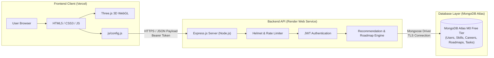

# CareerPath AI — Discover Your Career. Build Your Skills.

> **Hack2Ignite 2026–27 · Round 1 Qualifier**  
> **Domain:** EduTech / AI for Good  
> **Team Name:** 404 Brain Not Found  
> **Tagline:** Discover Your Career. Build Your Skills.

---

> ### 🚀 Live Deployments & Project Links
> - 🌐 **Production Web App:** [https://careerpath-ai-jade.vercel.app](https://careerpath-ai-jade.vercel.app)
> - ⚡ **Production REST API:** [https://careerpath-ai-bdbt.onrender.com](https://careerpath-ai-bdbt.onrender.com)
> - 🩺 **Backend Health Check:** [https://careerpath-ai-bdbt.onrender.com/api/health](https://careerpath-ai-bdbt.onrender.com/api/health)
> - 👥 **Team Name:** 404 Brain Not Found
> - 🔑 **Demo Onboarding:** 1-Click Instant Registration & Direct Login (Zero OTP friction during judging)

---

## 📖 Project Overview

**CareerPath AI** is an intelligent, interactive 3D web platform designed to bridge the gap between academic education and modern industry career expectations. 

Millions of undergraduate students graduate each year without clear visibility into modern tech stacks, how their existing coursework maps to real-world roles, or what concrete steps are required to become job-ready.

CareerPath AI replaces confusing career tests and generic course catalogs with an **objective, deterministic AI recommendation engine** and an **immersive 3D learning experience**. By evaluating a student’s academic background, technical/soft skills, and domain interests, the platform delivers:
1. **Top 3 Matched Career Paths** ranked with a mathematically transparent scoring model.
2. **Granular Skill-Gap Analysis** categorizing skills into Matched, Needs Upgrade, and Missing.
3. **Personalized 4, 8, or 12-Week Roadmaps** with weekly milestone tasks and curated free learning resources.
4. **Interactive 3D WebGL Visualizations** (powered by Three.js & GSAP) that transform abstract skill gaps and roadmaps into engaging planetary orbits and milestone journeys.

---

## 🎯 Problem Statement & Target Users

### The Problem
- **Degree-Industry Disconnect:** Universities focus heavily on theory; students lack visibility into modern tech stacks.
- **Subjective Career Advice:** Traditional career tests rely on high-level surveys rather than objective skill assessments.
- **Analysis Paralysis:** When students identify a career goal, they are overwhelmed by hundreds of uncurated courses without a time-boxed execution plan.

### The Proposed Solution
- **Objective Profiling:** Capture degree, interests, and skills with individual proficiency levels (Beginner, Intermediate, Advanced).
- **Explainable Scoring:** 100% deterministic weighted scoring without black-box AI hallucinations.
- **Actionable Execution:** Dynamic learning roadmaps with built-in task tracking and live dashboard telemetry.

### Target Users
- **Undergraduate Students (BCA, B.Tech, BSc CS):** Seeking clarity on tech specializations and internship readiness.
- **Self-Taught Learners & Career Switchers:** Needing to identify exact skill blind spots and follow a structured curriculum.

---

## 👥 The Team (404 Brain Not Found)

| Member | Role & Workstream | Key Responsibilities |
| :--- | :--- | :--- |
| **Parth Patil** | Team Leader & Backend Architect | System architecture, Express REST API, MongoDB models, recommendation scoring engine, Render deployment |
| **Suyog Pawar** | Frontend & Integration Lead | HTML5/CSS3/Bootstrap structuring, DOM controllers, asynchronous API client, Vercel deployment |
| **Asmita Lokhande** | UI/UX & 3D WebGL Lead | Glassmorphism design system, Three.js 3D experiences, GSAP micro-animations, slide deck design |
| **Aditi Vispute** | QA, Data & Documentation Lead | Skill matrix curation, career seed dataset standardization, manual testing matrix, demo script rehearsal |

---

## 🌟 Key Features

- 🔐 **Stateless JWT Authentication:** Secure registration, password encryption with `bcryptjs`, and protected endpoints.
- 📝 **Structured Student Assessment:** Interactive multi-step profiling of education, domain interests, and granular skill proficiencies.
- 🧮 **Deterministic Career Match Engine:** Weighted scoring model:
  $$\text{Career Match Score} = (\text{Skill Match} \times 0.60) + (\text{Interest Match} \times 0.25) + (\text{Education Match} \times 0.15)$$
- 🔍 **Skill-Gap Analysis:** Categorizes required skills into:
  - 🟢 **Matched Skills:** Student meets or exceeds required proficiency level.
  - 🟡 **Weak / Upgrade Needed:** Student possesses the skill but requires higher depth.
  - 🔴 **Missing Skills:** Critical required skills absent from student profile.
- 🗺️ **Personalized Roadmap Generation:** Flexible 4, 8, or 12-week structured curricula prioritizing missing and weak skills first, complete with curated documentation and tutorial links.
- 🖨️ **1-Click Print & PDF Export:** Instant student schedule export to print or save offline via dedicated media stylesheets.
- 💼 **Live Job Market Integration (AIDevBoard API):** Direct live query of active tech industry developer openings with failover cached vacancies.
- 🤖 **Dual-Engine AI Career Mentor:** Intelligent chatbot powered by Groq Llama 3.3 70B primary, Google Gemini 2.0 Flash secondary fallback, and offline localized guidance.
- ✅ **Real-Time Task Progress Tracking:** Checkbox milestone completion with atomic database persistence and dynamic progress percentage recalculation.
- 📊 **Unified Student Dashboard:** Actionable command center showing active career goal, upcoming weekly tasks, next recommended step, and overall growth metrics.
- 📱 **Progressive Enhancement:** Fully responsive glassmorphism UI with guaranteed 2D fallback behavior if WebGL is unavailable.

---

## 🌌 3D Interactive Web Experience (Three.js + GSAP)

CareerPath AI integrates four purposeful 3D visual modules that represent the student's journey:

| 3D Experience | Canvas Container | Page Location | Purpose & Interaction |
| :--- | :--- | :--- | :--- |
| **Career Universe** | `#careerUniverse` | `client/index.html` | Celestial constellation of career nodes and connecting star dust; represents infinite opportunities. |
| **Skill Orbit** | `#skill-orbit` | `client/recommendations.html` | Concentric planetary orbital tracks visualizing matched (green), weak (amber), and missing (red) skills. |
| **Roadmap Path** | `#roadmap-path` | `client/roadmap.html` | 3D stepping-stone trail of glowing milestones representing the weekly progression. |
| **Progress Orb** | `#progress-orb` | `client/dashboard.html` | Holographic energy sphere pulsing and glowing based on active roadmap completion percentage. |

> **Graceful 2D Fallback:** If WebGL or hardware acceleration is unsupported on the client device, all pages automatically render clean, accessible **2D HTML/CSS cards** without impacting page functionality.

---

## 🏗️ System Architecture



---

## 🛠️ Technology Stack

| Layer | Technologies | Selection Rationale |
| :--- | :--- | :--- |
| **Frontend UI** | HTML5, CSS3, JavaScript (ES6+), Bootstrap 5.3 | Fast load times, zero build-step overhead, universal browser compatibility |
| **3D & Animation** | Three.js (r128), GSAP (GreenSock) | Hardware-accelerated WebGL visuals, planetary orbits, smooth UI micro-animations |
| **Backend API** | Node.js (v18+), Express.js (CommonJS) | Fast asynchronous I/O, lightweight REST API architecture |
| **Database & ODM** | MongoDB Atlas Free Tier (M0), Mongoose 8.x | Flexible document schemas for nested skills, roadmaps, and tasks |
| **Security** | bcryptjs, jsonwebtoken, helmet, express-rate-limit, cors | Cryptographic password hashing, stateless sessions, API hardening |
| **Testing & Tools** | Postman Collection v2.1, nodemon | Standardized API testing and rapid development cycles |
| **Hosting Targets** | Vercel (Frontend), Render (Backend) | Free-tier cloud deployment with zero-cost operation |

---

## 🔄 Main Application User Flow

```text
1. Landing Page (index.html)        ──► Explore 3D Career Universe & click "Get Started"
               │
               ▼
2. Authentication (login/register)  ──► Register student account; JWT token stored in localStorage
               │
               ▼
3. Student Assessment               ──► Select degree, domain interests, and skills with proficiency
               │
               ▼
4. Career Recommendations           ──► View top 3 matches (60/25/15 formula) & 3D Skill Orbit
               │
               ▼
5. Roadmap Generation (roadmap.html)──► Choose 4, 8, or 12 weeks; review weekly milestone tasks
               │
               ▼
6. Execution & Dashboard            ──► Check off tasks; track live progress & 3D Progress Orb
```

---

## 📁 Repository Folder Structure

```text
careerpath-ai/
├── README.md                                ← Main project documentation (this file)
├── LICENSE                                  ← MIT License
├── .gitignore                               ← Root Git ignore rules
├── CONTRIBUTING.md                          ← Team contribution & Git workflow guidelines
├── SECURITY.md                              ← Security policy & reporting procedures
├── CODE_OF_CONDUCT.md                       ← Team code of conduct
├── CHANGELOG.md                             ← Project version changelog
├── package.json                             ← Monorepo helper scripts
│
├── client/                                  ← Frontend static web application
│   ├── index.html                           ← Landing page with Career Universe 3D
│   ├── login.html                           ← User login portal
│   ├── register.html                        ← User registration portal
│   ├── assessment.html                      ← Student skill & interest evaluation
│   ├── recommendations.html                 ← Career recommendations & Skill Orbit 3D
│   ├── roadmap.html                         ← Milestone learning roadmap & 3D Path
│   ├── dashboard.html                       ← Student dashboard & 3D Progress Orb
│   ├── 404.html                             ← Custom styled 404 error page
│   ├── vercel.json                          ← Vercel deployment configuration
│   ├── .env.example                         ← Frontend configuration template
│   ├── css/style.css                        ← Design tokens & glassmorphism system
│   ├── js/                                  ← DOM controllers, API client, Three.js modules
│   └── README.md                            ← Frontend setup & architecture guide
│
├── server/                                  ← Backend REST API service
│   ├── server.js                            ← Express entry point & route mounting
│   ├── package.json                         ← Dependencies & backend scripts
│   ├── render.yaml                          ← Render web service deployment blueprint
│   ├── .env.example                         ← Backend environment configuration template
│   ├── seed.js                              ← Database seed runner (npm run seed)
│   ├── config/db.js                         ← MongoDB Atlas connection manager
│   ├── models/                              ← Mongoose schemas (User, Skill, Career, Roadmap, Task)
│   ├── controllers/                         ← REST API route controllers
│   ├── routes/                              ← Express route handlers
│   ├── services/                            ← Recommendation & roadmap business logic
│   ├── middleware/                          ← JWT auth, request validation, error handler
│   ├── data/                                ← Curated seed datasets (35+ skills, 5 careers)
│   └── README.md                            ← Backend API documentation
│
├── docs/                                    ← Technical documentation suite
│   ├── README.md                            ← Documentation index & owner status table
│   ├── PRD.md                               ← Product Requirements Document
│   ├── TRD.md                               ← Technical Requirements Document
│   ├── APP-FLOW.md                          ← Application User Flow Diagrams (Mermaid)
│   ├── UI-UX-DESIGN.md                      ← UI/UX Design System Specification
│   ├── BACKEND-SCHEMA.md                    ← Database Schemas & Data Dictionary
│   ├── IMPLEMENTATION-PLAN.md               ← 48-Hour Qualifier Development Roadmap
│   ├── API.md                               ← REST API Contract & Payloads
│   ├── DEPLOYMENT.md                        ← Cloud Deployment Manual (Atlas + Render + Vercel)
│   ├── TESTING.md                           ← Quality Assurance Plan & Manual Test Matrix
│   ├── DEMO-SCRIPT.md                       ← 3–4 Min Live Presentation Script
│   ├── PPT-CONTENT.md                       ← 10-Slide Pitch Deck Content Outline
│   └── SUBMISSION-CHECKLIST.md              ← Final Verification Checklist
│
├── postman/                                 ← API testing assets
│   ├── README.md                            ← Postman collection documentation
│   └── CareerPath-AI.postman_collection.json← Postman v2.1 collection
│
├── assets/                                  ← Visual assets & diagrams
│   ├── README.md                            ← Asset guidelines & licensing rules
│   ├── screenshots/                         ← Final application screenshots
│   ├── diagrams/                            ← Architecture & workflow diagrams
│   └── demo/                                ← Demo media assets
│
└── presentation/                            ← Pitch deck storage
    └── README.md                            ← Presentation guidelines & export specifications
```

---

## ⚙️ Local Development Setup

### Prerequisites
- [Node.js](https://nodejs.org/) v18.0.0 or higher
- [MongoDB](https://www.mongodb.com/) (Local Community Server or free MongoDB Atlas cluster)
- Python 3 (or VS Code Live Server) for serving the frontend

### 1. Clone the Repository
```bash
git clone https://github.com/YOUR-USERNAME/careerpath-ai.git
cd careerpath-ai
```

### 2. Backend Setup & Seeding
```bash
# Navigate to server directory
cd server

# Install dependencies
npm install

# Create local environment file
cp .env.example .env

# Seed database with standardized skills and careers
npm run seed

# Start backend development server
npm run dev
# Server will listen on http://localhost:5000
```

### 3. Frontend Setup
```bash
# In a new terminal, navigate to client directory
cd client

# Start static HTTP server
python -m http.server 5500
# Accessible at http://localhost:5500
```

---

## 🔐 Environment Variables

Create `server/.env` with the following template (do **not** commit actual secrets):

```env
PORT=5000
NODE_ENV=development
MONGODB_URI=mongodb://localhost:27017/careerpath-ai
JWT_SECRET=replace_with_a_long_random_secret
JWT_EXPIRES_IN=7d
CLIENT_URL=http://localhost:5500

# Optional integrations — leave blank until used
GEMINI_API_KEY=
CLOUDINARY_CLOUD_NAME=
CLOUDINARY_API_KEY=
CLOUDINARY_API_SECRET=
```

---

## 📡 API Overview

All API routes are prefixed with `/api`. Protected routes require `Authorization: Bearer <token>`.

| Method | Endpoint | Access | Purpose |
| :--- | :--- | :--- | :--- |
| `GET` | `/api/health` | Public | System health check and uptime status |
| `GET` | `/api/version` | Public | API version and runtime environment |
| `POST` | `/api/auth/register` | Public | Create new student account and issue JWT |
| `POST` | `/api/auth/login` | Public | Authenticate student and issue JWT |
| `GET` | `/api/users/me` | Protected | Fetch authenticated student profile |
| `PUT` | `/api/assessment` | Protected | Submit or update student assessment |
| `GET` | `/api/careers` | Public | List all 5 available career paths |
| `GET` | `/api/careers/:slug` | Public | Get career details with populated skill requirements |
| `POST` | `/api/recommendations/generate` | Protected | Compute weighted recommendations & skill gaps |
| `POST` | `/api/roadmaps/generate` | Protected | Generate 4/8/12-week personalized learning roadmap |
| `GET` | `/api/roadmaps/current` | Protected | Fetch current active roadmap and milestone tasks |
| `PATCH`| `/api/roadmaps/tasks/:taskId/toggle`| Protected | Toggle completion of a specific milestone task |
| `DELETE`| `/api/roadmaps/current` | Protected | Archive current active roadmap |
| `GET` | `/api/dashboard` | Protected | Get unified student dashboard telemetry |

---

## 🧪 Testing & Quality Assurance

Comprehensive testing procedures are documented in **[`docs/TESTING.md`](docs/TESTING.md)**, covering:
- Pre-deployment local verification checklist.
- 19 manual test cases across Authentication, Profile, Recommendations, Roadmaps, Tasks, Security, and WebGL fallbacks.
- Cross-browser compatibility checks (Chrome, Edge, Firefox, Mobile Safari/Chrome).
- Standard Postman test collection located at [`postman/CareerPath-AI.postman_collection.json`](postman/CareerPath-AI.postman_collection.json).

---

## ☁️ Deployment Guide

Detailed cloud deployment instructions are documented in **[`docs/DEPLOYMENT.md`](docs/DEPLOYMENT.md)**, including:
- Decoupled cloud architecture: Vercel (Frontend) + Render (Backend) + MongoDB Atlas (Database).
- Step-by-step Atlas provisioning, database seeding, Render deployment, and Vercel configuration.
- Render cold-start mitigation techniques and emergency local failover plans.

---

## 📚 Documentation Index

| Document | Purpose |
| :--- | :--- |
| 📑 **[PRD.md](docs/PRD.md)** | Product Requirements Document, user personas, MVP scope boundaries |
| 🛠️ **[TRD.md](docs/TRD.md)** | Technical Requirements Document, system architecture, algorithm pseudocode |
| 🔄 **[APP-FLOW.md](docs/APP-FLOW.md)** | Visual Mermaid diagrams for auth, assessment, scoring, and roadmaps |
| 🎨 **[UI-UX-DESIGN.md](docs/UI-UX-DESIGN.md)** | Glassmorphism design system tokens, typography, and 3D visual guidelines |
| 🗃️ **[BACKEND-SCHEMA.md](docs/BACKEND-SCHEMA.md)** | Mongoose schemas, relationships, indexing, and data dictionary |
| 📅 **[IMPLEMENTATION-PLAN.md](docs/IMPLEMENTATION-PLAN.md)** | 48-hour qualifier roadmap, phase milestones, and team workstreams |
| 📡 **[API.md](docs/API.md)** | REST API specification, request/response examples, and error formats |
| 🚀 **[DEPLOYMENT.md](docs/DEPLOYMENT.md)** | Step-by-step deployment guide for MongoDB Atlas, Render, and Vercel |
| 🧪 **[TESTING.md](docs/TESTING.md)** | Complete QA test cases matrix, browser compatibility, and smoke tests |
| 🎤 **[DEMO-SCRIPT.md](docs/DEMO-SCRIPT.md)** | Rehearsed 3–4 minute live presentation script with judge Q&A preparation |
| 📊 **[PPT-CONTENT.md](docs/PPT-CONTENT.md)** | Complete 10-slide presentation deck layout and speaker notes |
| 📋 **[SUBMISSION-CHECKLIST.md](docs/SUBMISSION-CHECKLIST.md)** | Final verification matrix and 30-minute pre-submission countdown |

---

## 🖼️ Application Screenshots (Placeholders)

| Landing Page & Career Universe 3D | Student Assessment Form |
| :---: | :---: |
| *(Placeholder: `assets/screenshots/landing-hero.png`)* | *(Placeholder: `assets/screenshots/assessment.png`)* |

| Top 3 Recommendations & Skill Orbit 3D | Milestone Learning Roadmap |
| :---: | :---: |
| *(Placeholder: `assets/screenshots/recommendations.png`)* | *(Placeholder: `assets/screenshots/roadmap.png`)* |

| Student Dashboard & Progress Orb 3D | Custom Styled 404 Error Page |
| :---: | :---: |
| *(Placeholder: `assets/screenshots/dashboard.png`)* | *(Placeholder: `assets/screenshots/404-page.png`)* |

---

## 🔮 Future Scope (Post-Round 1)

1. **Automated Resume & GitHub Parsing:** Extract student skills and projects via PDF analysis and GitHub REST APIs.
2. **Context-Grounded AI Mentor:** Context-aware interactive guidance powered by the Gemini API grounded in student roadmap state.
3. **Verified Skill Credentials:** Integration with open badges and assessment quizzes to scientifically validate skill claims.
4. **Peer Study Hubs:** Collaborative study groups and peer-matching based on shared career milestones.
5. **Corporate Internship Pipeline:** Connecting high-performing roadmap completers with hiring partner entry-level roles.

---

## 🔒 Security Notice

- Passwords are cryptographically salted and hashed using `bcryptjs` with 10 rounds.
- No real database credentials, secret keys, or tokens are committed to source control.
- Rate limiting protects authentication routes against brute-force attacks.
- Refer to [`SECURITY.md`](SECURITY.md) for vulnerability reporting procedures.

---

## 📄 License

This project is licensed under the **MIT License** — see the [`LICENSE`](LICENSE) file for details.

---

## 🙏 Acknowledgements

- **[Hack2Ignite 2026–27](https://hack2ignite.com):** For organizing the hackathon and providing the opportunity to innovate in EduTech / AI for Good.
- **Open-Source Community:** [Three.js](https://threejs.org/), [GSAP](https://greensock.com/), [Bootstrap](https://getbootstrap.com/), [Express](https://expressjs.com/), and [Mongoose](https://mongoosejs.com/).
