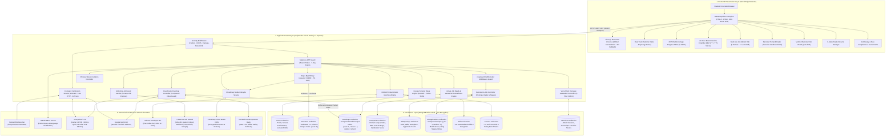

# 🎓 CareerPath AI — AI Career Guidance and Skill Roadmap Platform

> **🏆 Hack2Ignite 2026–27 · Official Round 1 Qualifier Submission**  
> **Organizer:** [G.H. Raisoni International Skill Tech University (GHRISTU)](https://ghristu.edu.in/)  
> **Official Hackathon Portal:** [Hack 2 Ignite on Unstop](https://unstop.com/hackathons/hack-2-ignite-gh-raisoini-international-skill-tech-university-1745045)  
> **Problem Statement ID:** **ED-02** — *Develop an AI-powered career guidance system for students based on skills, interests, and market trends*  
> **Domain / Track:** EduTech (Educational Technology / AI for Good)  
> **Team Name:** 404 Brain Not Found  
> **Tagline:** *Discover Your Career. Bridge Your Skill Gaps. Build Your Future.*  
> **Hackathon Window:** 16 September 2026, 9:00 AM – 18 September 2026, 9:00 AM  

---

<p align="center">
  <a href="https://unstop.com/hackathons/hack-2-ignite-gh-raisoini-international-skill-tech-university-1745045">
    
  </a>
  <a href="https://careerpath-ai-jade.vercel.app">
    
  </a>
  <a href="https://careerpath-ai-bdbt.onrender.com">
    
  </a>
  <a href="https://careerpath-ai-bdbt.onrender.com/api/health">
    
  </a>
  <a href="https://drive.google.com/file/d/1LHcJTmf49UlEPERd0aUREjI87JX77K5f/view?usp=sharing">
    
  </a>
  <a href="https://drive.google.com/file/d/1MXabwhn7zB3OFJbjGDYu0fqdR46KCM7m/view?usp=sharing">
    
  </a>
  <a href="LICENSE">
    
  </a>
</p>

<p align="center">
  
  
  
  
  
  
  
  
  
  
  
  
  
  
  
  
</p>

---

## 📑 Comprehensive Documentation Index
1. [⚡ Hackathon Evaluator Fast-Track (Judge's Cheat Sheet)](#-hackathon-evaluator-fast-track-judges-cheat-sheet)
2. [🎯 Problem Statement ED-02: Real-World Need & Innovation](#-problem-statement-ed-02-real-world-need--innovation)
3. [🧠 Explainable Career Matching Engine (100% Transparent Math)](#-explainable-career-matching-engine-100-transparent-math)
   - [3.1 The 60/25/15 Mathematical Formulation](#31-the-602515-mathematical-formulation)
   - [3.2 4-Tier Skill Passport Confidence Multipliers](#32-4-tier-skill-passport-confidence-multipliers)
   - [3.3 Step-by-Step Worked Mathematical Calculation Example](#33-step-by-step-worked-mathematical-calculation-example)
   - [3.4 Primary Stream Isolation (No Foreign Stream Spillover)](#34-primary-stream-isolation-no-foreign-stream-spillover)
   - [3.5 Deterministic Natural Language Explanations (Zero Hallucinations)](#35-deterministic-natural-language-explanations-zero-hallucinations)
4. [🛡️ Two-Factor Skill Verification Moat (Defeating Resume Inflation)](#️-two-factor-skill-verification-moat-defeating-resume-inflation)
5. [🗺️ Dual Concurrent Career Roadmaps & Course Synergy Architecture](#️-dual-concurrent-career-roadmaps--course-synergy-architecture)
   - [5.1 The Parallel Learning Dilemma & DB Invariant](#51-the-parallel-learning-dilemma--db-invariant)
   - [5.2 MongoDB Compound Partial Unique Index (`{ user: 1, career: 1 }`)](#52-mongodb-compound-partial-unique-index-user-1-career-1)
   - [5.3 Course Synergy Rules Engine (3-Level Validation)](#53-course-synergy-rules-engine-3-level-validation)
   - [5.4 Non-Destructive 7-Day Rate-Limited Abandonment](#54-non-destructive-7-day-rate-limited-abandonment)
   - [5.5 Dynamic Track Switcher & "Lock Enrolling, Never Browsing" UI](#55-dynamic-track-switcher--lock-enrolling-never-browsing-ui)
   - [5.6 AI-Monitored Video Dedication & Anti-Slacking Learning Chamber](#56-ai-monitored-video-dedication--anti-slacking-learning-chamber)
6. [🏆 4-Rule Industry Job Ready Certification & Readiness Index Engine](#-4-rule-industry-job-ready-certification--readiness-index-engine)
   - [6.1 The 4-Rule Certification Rubric](#61-the-4-rule-certification-rubric)
   - [6.2 10-Step Career GPS & Job Readiness Index Engine](#62-10-step-career-gps--job-readiness-index-engine)
   - [6.3 1-Click "Bridge the Gap" Roadmap Injection](#63-1-click-bridge-the-gap-roadmap-injection)
7. [📄 Dedicated Single Resume per Account Architecture](#-dedicated-single-resume-per-account-architecture)
   - [7.1 Binary Magic-Byte Inspection (`%PDF`, `DOCX`, `DOC`)](#71-binary-magic-byte-inspection-pdf-docx-doc)
   - [7.2 Transactional Cloudinary Asset Destruction (Zero Leakage)](#72-transactional-cloudinary-asset-destruction-zero-leakage)
   - [7.3 6-State Interactive Dashboard Experience](#73-6-state-interactive-dashboard-experience)
   - [7.4 Modernized Student Profile Header Card (Apple/Linear Aesthetic Overhaul)](#74-modernized-student-profile-header-card-applelinear-aesthetic-overhaul)
8. [💼 Supported Tech Roles & 76+ Standardized Skills Ecosystem](#-supported-tech-roles--76-standardized-skills-ecosystem)
9. [💼 Multi-Site Job Market Hub & Direct Portal Launchers](#-multi-site-job-market-hub--direct-portal-launchers)
   - [9.1 6-Portal Deep-Link URL Resolution Engine](#91-6-portal-deep-link-url-resolution-engine)
   - [9.2 ⚡ "Launch All Major Portals" Multi-Tab Orchestration](#92--launch-all-major-portals-multi-tab-orchestration)
   - [9.3 Per-Card Cross-Platform Portal Launchers](#93-per-card-cross-platform-portal-launchers)
   - [9.4 Live Adzuna API Telemetry & ₹ CTC Salary Ranges](#94-live-adzuna-api-telemetry---ctc-salary-ranges)
10. [🎙️ AI Voice Interactive Mock Interview Chamber (Career GPS Step 9)](#️-ai-voice-interactive-mock-interview-chamber-career-gps-step-9)
    - [10.1 Multi-Voice Human Neural Speech Synthesis](#101-multi-voice-human-neural-speech-synthesis)
    - [10.2 Real-Time Microphone Speech-to-Text Recording](#102-real-time-microphone-speech-to-text-recording)
    - [10.3 3-Pillar Answer Correctness & Feedback Evaluation Rubric](#103-3-pillar-answer-correctness--feedback-evaluation-rubric)
    - [10.4 Side-by-Side Model Answer Benchmarking](#104-side-by-side-model-answer-benchmarking)
11. [🏢 Recruiter Verification, Real Company Validation & Job Posting System](#-recruiter-verification-real-company-validation--job-posting-system)
    - [11.1 Real Company Validation Pipeline (60+ Webmail Blacklist, DNS MX Probing, Live HTTP Check, AI Trust Scoring)](#111-real-company-validation-pipeline)
    - [11.2 Recruiter Authenticity Challenge & Corporate OTP Activation](#112-recruiter-authenticity-challenge--corporate-otp-activation)
    - [11.3 Job Opening Management & Mandatory Skill Verification](#113-job-opening-management--mandatory-skill-verification)
    - [11.4 Recruiter Applicant Radar & Verified Badges](#114-recruiter-applicant-radar--verified-badges)
    - [11.5 Student 1-Click Application & Personalized AI Match Scoring](#115-student-1-click-application--personalized-ai-match-scoring)
    - [11.6 Recruiter & Student Portal Isolation & RBAC Architecture](#116-recruiter--student-portal-isolation--rbac-architecture)
    - [11.7 Role-Smart Brand Logo Dispatch & Landing Page Redirection Engine](#117-role-smart-brand-logo-dispatch--landing-page-redirection-engine)
12. [🏗️ End-to-End System Architecture (Mermaid)](#️-end-to-end-system-architecture-mermaid)
13. [🔌 Core REST API Directory](#-core-rest-api-directory)
14. [💰 Business Model & B2B2C Talent & Telemetry Flywheel](#-business-model--b2b2c-talent--telemetry-flywheel)
15. [🔒 Security, Guardrails & Anti-Abuse Protocols](#-security-guardrails--anti-abuse-protocols)
16. [⚡ Local Quickstart & Automated Test Suites](#-local-quickstart--automated-test-suites)
17. [🤖 Official AI Usage Disclosure (Rulebook Compliance)](#-official-ai-usage-disclosure-rulebook-compliance)
18. [👥 The Team — 404 Brain Not Found & Acknowledgements](#-the-team--404-brain-not-found--acknowledgements)

---

## ⚡ Hackathon Evaluator Fast-Track (Judge's Cheat Sheet)

Welcome, Hack2Ignite Evaluators! We have eliminated all testing friction so you can evaluate the full end-to-end prototype in **under 3 minutes**:

| Resource | Target Link / Value | Notes for Judges |
| :--- | :--- | :--- |
| 🌐 **Live Web Application** | **[https://careerpath-ai-jade.vercel.app](https://careerpath-ai-jade.vercel.app)** | Production client deployed on Vercel Global Edge Network |
| ⚡ **Live API Gateway** | **[https://careerpath-ai-bdbt.onrender.com](https://careerpath-ai-bdbt.onrender.com)** | Node.js Express REST API hosted on Render Cloud |
| 🩺 **Live Health Check** | **[https://careerpath-ai-bdbt.onrender.com/api/health](https://careerpath-ai-bdbt.onrender.com/api/health)** | Real-time server telemetry, database connection & uptime monitor |
| 🔑 **Official Demo Account** | **`demouser@gmail.com`** &nbsp;•&nbsp; Pass: **`demo123`** | Pre-seeded with student profile, verified skills & active roadmap *(Dual Evaluation Bypass enabled)* |
| 🏢 **Demo Recruiter Account** | **`recruiter@razorpay.com`** &nbsp;•&nbsp; Pass: **`demo123`** | Pre-seeded Razorpay verified company, active job posting & candidate applicant radar *(or click 1-Click Demo Recruiter on `/login.html`)* |
| 🛡️ **Portal Isolation & RBAC** | **Strict Student vs Recruiter Guard** | Dedicated page catalogs, instant client pre-render redirect traps, and backend `requireStudent` / `requireRecruiter` RBAC |
| 🧭 **Role-Smart Logo Navigation** | **Contextual Home Dispatch** | Clicking brand logo routes recruiters to `/recruiter-dashboard.html`, students to `/dashboard.html`; auto-redirects recruiters visiting `/index.html` unless `?view=public` |
| 🛡️ **Recruiter Verification & Radar** | **[`/recruiter-dashboard.html`](https://careerpath-ai-jade.vercel.app/recruiter-dashboard.html)** | Real company domain verification, 60+ webmail blacklist, DNS MX resolution, AI trust scoring, opening creation & Applicant Radar with candidate verified badges |
| 💼 **Direct Recruiter Job Board** | **[`/jobs.html`](https://careerpath-ai-jade.vercel.app/jobs.html)** | Student-facing verified company job openings with personalized AI skill match percentage & 1-click apply |
| 📺 **Video Learning Dedication** | **Anti-Scrubbing Guard & 1.5x Cap** | Enforces true video watch time in roadmap learning chamber; auto-pauses on window blur/tab switch |
| 🌐 **Google Authentication** | **1-Click Google Sign-In & Sign-Up** | Animated Google logo with multi-chromatic micro-interactions & Google Identity Services |
| 🐙 **GitHub Auth Sync** | **Zero-Prompt Repository Sync** | `POST /api/auth/github/sync` uses JWT session token; eliminates manual username prompt |
| 🎯 **Skill Reality-Check Quiz** | **[`/quiz.html`](https://careerpath-ai-jade.vercel.app/quiz.html)** | 5-question dynamic micro-quiz powered by **Groq Llama 3.3 70B** (<300ms) with BYOK modal |
| 🗺️ **Dual Active Roadmaps & Synergy** | **[`docs/ROADMAP-ENGINE.md`](docs/ROADMAP-ENGINE.md)** | Enrolls up to 2 parallel tracks ($\le 2$) with domain/skill synergy checks; compound partial unique index `{ user: 1, career: 1 }` (`status: 'active'`); dynamic track switcher |
| 💼 **Multi-Site Job Market Hub** | **6 Live Portals & ⚡ Master Launcher** | 1-click direct search deep-links for LinkedIn Jobs, Naukri.com, Indeed India, Wellfound, Internshala, and Google for Jobs + per-card cross-platform search buttons |
| 🎙️ **AI Voice Mock Interview** | **[`/interview.html`](https://careerpath-ai-jade.vercel.app/interview.html)** | Real-time mic recording, natural voice synthesis (Joanna, Matthew, Amy, Brian), 3-pillar evaluation (Depth, Clarity, Practicality), and model answers |
| 🧭 **Career GPS & Readiness Index** | **Real-Time 0-100% Metric** | Live composite readiness index, 1-click "Bridge the Gap" roadmap task injection, 3-state resume gate, canonical skill ledger, profile status selector |
| 🏆 **4-Rule Job Ready Engine** | **[`docs/ROADMAP-ENGINE.md#4-rule-industry-job-ready-certification`](docs/ROADMAP-ENGINE.md)** | Objective industry certification requiring Score ≥70%, ≥4 verified skills, progress ≥80% |
| 📄 **Single Resume per Account** | **[`docs/RESUME-ENGINE.md`](docs/RESUME-ENGINE.md)** | Dedicated 1:1 schema, magic-byte inspection (`%PDF`, `DOCX`, `DOC`), transactional Cloudinary lifecycle |
| 📊 **2D SVG Percentage Gauge** | **Accessible Progress Meter** | Replaced confusing 3D degree gauges (90/180) with high-contrast 0% to 100% SVG circular meter |
| 🎥 **Official Demo Video (Drive)** | **[Watch Demo on Google Drive](https://drive.google.com/file/d/1LHcJTmf49UlEPERd0aUREjI87JX77K5f/view?usp=sharing)** | Official video walkthrough & prototype demonstration |
| 📊 **Official Pitch Deck PPT (Drive)** | **[View PPT on Google Drive](https://drive.google.com/file/d/1MXabwhn7zB3OFJbjGDYu0fqdR46KCM7m/view?usp=sharing)** | 10-Slide presentation deck for Hack2Ignite Round 1 |
| 📽️ **Official Submission PPTX** | **[`../HACK2IGNITE_2026_CareerPath_AI_Official.pptx`](../HACK2IGNITE_2026_CareerPath_AI_Official.pptx)** | Complete 16:9 PowerPoint submission deck with speaker notes |
| 🎤 **Interactive Pitch Defense Guide** | **[`../FullStack_Developer_Pitch_Guide.html`](../FullStack_Developer_Pitch_Guide.html)** | Interactive slide-by-slide presentation script & judge viva defense |
| 📝 **Master Presentation Content** | **[`docs/PPT-CONTENT.md`](docs/PPT-CONTENT.md)** | Full markdown transcript of all presentation slides & technical metrics |
| 🎬 **Demo Walkthrough Script** | **[`docs/DEMO-SCRIPT.md`](docs/DEMO-SCRIPT.md)** | Step-by-step 3–4 minute evaluator flow script |
| 🏛️ **System Architecture Spec** | **[`docs/ARCHITECTURE.md`](docs/ARCHITECTURE.md)** | Comprehensive system architecture & threat model specification |
| 🔌 **Complete API Specification** | **[`docs/API-SPECIFICATION.md`](docs/API-SPECIFICATION.md)** | Full REST API specification across all 11 modules |

---

### ⏱️ Recommended 3-Minute Evaluation Walkthrough:
1. **Landing (`/index.html`):** Experience the **Three.js 3D Career Universe** constellation (or instant 2D fallback on low-power devices) and click **"Get Started"**.
2. **Instant Sign-In (`/login.html`):** Click **"⚡ 1-Click Fill Demo Account"** (`demouser@gmail.com` / `demo123`) or Sign In with Google / GitHub.
3. **Assessment (`/assessment.html`):** Click **"Auto-Detect Skills"** in Step 3 — notice that **NO manual username prompt modal appears**! Repositories synchronize instantly via auth session, awarding glowing `[✓ Code Verified]` badges.
4. **Adaptive Reality-Check Quiz (`/quiz.html`):** Test the 5-question micro-assessment. Test the **BYOK Provider Switcher** (Groq Llama 3.3 70B, Google Gemini 2.5 Flash, or custom key). Notice instant pedagogical feedback. Once completed, verification is permanently saved.
5. **Explainable Recommendations (`/recommendations.html`):**
   - View Top matched careers calculated via our transparent **60/25/15 mathematical matching engine** scoped to the student's declared **Primary Stream**.
   - Test **Dual Concurrent Enrolment & Course Synergy**: Students can enroll in up to 2 complementary courses (e.g. *Full-Stack Developer* + *DevOps & Cloud Engineer*). Attempting to enroll in a 3rd course or an unrelated field is intelligently guarded.
   - Explore the **Multi-Site Job Market Hub** directly from the recommendations page: 1-click search launchers for LinkedIn, Naukri, Indeed, Wellfound, Internshala, and Google for Jobs.
6. **Adaptive Roadmap & Dual Track Switchers (`/roadmap.html`):**
   - Switch seamlessly between Active Track 1 and Active Track 2 using the header pill selector.
   - Inspect milestone tasks and check off an item to observe real-time atomic progress recalculation.
   - Inspect the **`🔥 4-Rule Industry Job Ready Certification`** card with dynamic status tracking.
   - View the safe route abandonment modal (non-destructive with 7-day cooldown alert).
   - Test the **1-Click Print / PDF Export**.
7. **AI Voice Interactive Mock Interview Chamber (`/interview.html`):**
   - Experience the **Step 9 Career GPS Chamber**: Select a realistic voice profile (Joanna, Matthew, Amy, Brian, or neural browser default).
   - Click the microphone button to record answers with live speech-to-text and animated voice waveforms.
   - Receive an objective **3-Pillar Evaluation** (Technical Depth, Clarity & Communication, Practical Application) and compare your response against the gold-standard **Model Answer**.
8. **Student Dashboard & Career GPS (`/dashboard.html`):**
   - Inspect the **Career GPS & Real-Time Job Readiness Index** ($0-100\%$) with dynamic status badges.
   - Check the **Accessible 2D SVG Percentage Progress Gauge** (0% to 100%).
   - Inspect the **Multi-Site Job Market Hub** with live Indian tech telemetry and the master ⚡ **"Launch All Major Portals"** button.
   - Inspect the **Single Resume per Account** manager with drag-and-drop, magic byte security, and transactional replace actions.
   - Inspect the **GitHub Study Lab**: browse connected public study projects, inspect AI-generated *Study Relevance* notes, and view top programming language breakdowns.
9. **Direct Recruiter Job Board (`/jobs.html`):**
   - Students browse verified employer openings with personalized **AI Skill Match Scores** (`96% Match`).
   - Submit a 1-click verified application with the student's dedicated ATS resume and proof-of-work badges.
   - Track application status in real-time under "My Submitted Applications".
10. **Recruiter Portal & Applicant Radar (`/recruiter-dashboard.html`):**
    - Sign in via 1-Click **"Demo Recruiter"** (`recruiter@razorpay.com` / `demo123`).
    - Inspect real-time corporate validation metrics (Razorpay: 99/100 Trust Score, DNS MX active, live SSL).
    - Post new job openings with required skill criteria and mandatory verification flags.
    - Open the **Applicant Radar**: inspect candidate rankings, view `[✓ Quiz-Verified]` and `[✓ Code-Verified]` badges, and update candidate hiring stages (`Applied` ➔ `Shortlisted` ➔ `Interview Scheduled`).
11. **AI Career Mentor Drawer:** Click the floating **`🤖 AI Mentor`** button in the bottom-right for sub-300ms career coaching powered by **Groq Llama 3.3 70B** with **Gemini 2.5 Flash** failover.

---

## 🎯 Problem Statement ED-02: Real-World Need & Innovation

### The Core Challenge
In emerging tech economies like India, over **1.5 million engineers graduate every year**, yet national employability studies (such as Aspiring Minds and NASSCOM reports) reveal that **over 80% struggle to meet industry hiring standards**.

The systemic breakdown occurs at four distinct bottlenecks:
1. **The Unverified Resume Illusion:** Students self-report high proficiency on their resumes without writing a single line of production code, creating a credibility crisis for recruiters.
2. **Analysis Paralysis & Tutorial Hopping:** Over 78% of students drop out of online courses because they simultaneously enroll in multiple tracks without milestone discipline.
3. **Black-Box AI Confusion:** Modern career guidance tools ask an LLM to guess a career blindly, returning generic, hallucinated, and non-actionable suggestions.
4. **Disconnection from Hiring Realities:** Students study theoretical concepts without knowing verified Indian salary benchmarks (₹ CTC) or live employer vacancies.

```
       Traditional College Path                    Industry Hiring Reality
┌──────────────────────────────────────┐     ┌──────────────────────────────────────┐
│  • Outdated theoretical syllabus     │     │  • Production stacks (React, Node)   │
│  • Vague personality quiz scores     │ ──► │  • Real GitHub proof-of-work         │
│  • Thousands of random tutorials     │ ✘   │  • Verified technical competencies   │
│  • Severe analysis paralysis         │     │  • Time-boxed milestone execution    │
└──────────────────────────────────────┘     └──────────────────────────────────────┘
                   ▲                                            ▲
                   └──────────── The Skill-Gap Chasm ───────────┘
```

### The CareerPath AI Solution
**CareerPath AI** transforms career guidance from subjective guesswork into an objective, math-backed digital navigation system:
- **100% Explainable Recommendations:** Driven by a transparent 60/25/15 mathematical matrix — never black-box prompts.
- **Two-Factor Skill Verification Moat:** GitHub session analysis and sub-300ms Groq LPU micro-quizzes validate real competence.
- **Hardened Single Active Career Route:** Database-level partial unique index prevents multi-route hopping, enforcing discipline while allowing open browsing.
- **4-Rule Job Ready Engine:** Industry-calibrated benchmark verifying skills, retention, and roadmap completion.
- **Single Resume per Account:** Dedicated 1:1 schema with binary magic-byte security and transactional Cloudinary asset destruction.

---

## 🧠 Explainable Career Matching Engine (100% Transparent Math)

One of CareerPath AI's most critical innovations is **Explainable AI (XAI)**. We firmly reject the practice of feeding student profiles into black-box LLMs and hoping for reasonable output. Instead, our recommendation engine (`server/services/recommendationService.js`) calculates match scores through a **deterministic mathematical scoring matrix**.

### 3.1 The 60/25/15 Mathematical Formulation

The overall Career Match Score is computed using an objective weighted linear model:

$$\text{Career Match Score} = (\text{Skill Match Score} \times 0.60) + (\text{Interest Match Score} \times 0.25) + (\text{Education Match Score} \times 0.15)$$

Where:
- **Skill Match Score ($S$ — 60% Weight):** Represents the student's technical capability against the career's curriculum.
- **Interest Match Score ($I$ — 25% Weight):** Measures alignment between student passions and role domain tags.
- **Education Match Score ($E$ — 15% Weight):** Measures academic branch and degree fit.

```
                      CAREER MATCH SCORE (0 - 100%)
┌───────────────────────────────────────┬───────────────────┬──────────────┐
│       SKILL MATCH SCORE (60%)         │  INTEREST (25%)   │  EDU (15%)   │
│  Weighted by Importance & Confidence  │ Jaccard Overlap   │ Degree Match │
└───────────────────────────────────────┴───────────────────┴──────────────┘
```

#### Detailed Skill Match Formula
Each required skill in a career profile has an **Importance Weight** ($W_i$) and a **Required Proficiency** ($R_i$):

$$\text{Importance Weight } (W_i) = \begin{cases} 3 & \text{if importance is 'high'} \\ 2 & \text{if importance is 'medium'} \\ 1 & \text{if importance is 'low'} \end{cases}$$

$$\text{Proficiency Value } (P) = \begin{cases} 3 & \text{if 'advanced'} \\ 2 & \text{if 'intermediate'} \\ 1 & \text{if 'beginner'} \end{cases}$$

For every required skill, we compute the **Proficiency Ratio** ($PR_i$) and multiply it by the **Skill Passport Confidence Weight** ($C_i$):

$$PR_i = \min\left(\frac{P_{\text{user}}}{P_{\text{required}}}, 1.0\right)$$

$$\text{Weighted Earned Points } (WE_i) = W_i \times PR_i \times C_i$$

The total Skill Match Score is normalized to a percentage:

$$\text{Skill Match Score} = \left(\frac{\sum WE_i}{\sum W_i}\right) \times 100$$

*(Note: The ratio is strictly capped at $1.0$. Over-qualification in one skill does not artificially inflate or mask deficiencies in other critical skills).*

---

### 3.2 4-Tier Skill Passport Confidence Multipliers

To prevent unverified self-ratings from swaying recommendations unfairly, CareerPath AI applies a **4-Tier Confidence Multiplier** ($C_i$) to every skill:

| Passport Tier | Verification Method | Confidence Multiplier ($C_i$) | Description & Rationale |
| :--- | :--- | :---: | :--- |
| **Tier 0: Self-Rated** | Form submission only | **0.70** | Unverified claims receive a 30% discount to reflect self-reporting bias |
| **Tier 1: Quiz-Verified** | Groq / Gemini Micro-Quiz | **0.85** | Passed dynamic 5-question technical reality-check assessment |
| **Tier 2: Code-Verified** | GitHub AST Session Sync | **1.00** | Real production code scanned from public repositories (full 100% credit) |
| **Tier 3: Interview-Verified** | Spoken Technical Interview | **1.05** | Bonus credit for passing deep verbal technical evaluation |

---

### 3.3 Step-by-Step Worked Mathematical Calculation Example

Let us trace an actual student, **Aarav**, being evaluated for the **Full-Stack Developer** role.

#### Step 1: Career Requirements Profile (Full-Stack Developer)
The role requires 4 skills:
1. **JavaScript:** Importance = High ($W_1 = 3$), Required = Advanced ($R_1 = 3$)
2. **React:** Importance = High ($W_2 = 3$), Required = Intermediate ($R_2 = 2$)
3. **Node.js:** Importance = Medium ($W_3 = 2$), Required = Intermediate ($R_3 = 2$)
4. **Docker:** Importance = Low ($W_4 = 1$), Required = Beginner ($R_4 = 1$)

$$\text{Total Importance Weights} = 3 + 3 + 2 + 1 = 9$$

#### Step 2: Student Qualifications (Aarav's Profile)
- **JavaScript:** User level = Advanced ($P = 3$). Verified via GitHub Code Sync $\rightarrow C_1 = 1.00$.  
  $$WE_1 = 3 \times \min\left(\frac{3}{3}, 1\right) \times 1.00 = 3 \times 1.0 \times 1.00 = 3.00$$
- **React:** User level = Beginner ($P = 1$). Verified via Quiz $\rightarrow C_2 = 0.85$.  
  $$WE_2 = 3 \times \min\left(\frac{1}{2}, 1\right) \times 0.85 = 3 \times 0.5 \times 0.85 = 1.275$$
- **Node.js:** User level = Intermediate ($P = 2$). Self-rated only $\rightarrow C_3 = 0.70$.  
  $$WE_3 = 2 \times \min\left(\frac{2}{2}, 1\right) \times 0.70 = 2 \times 1.0 \times 0.70 = 1.40$$
- **Docker:** Missing from user profile $\rightarrow P = 0$.  
  $$WE_4 = 1 \times 0 \times 0.70 = 0.00$$

$$\text{Total Weighted Earned Points} = 3.00 + 1.275 + 1.40 + 0 = 5.675$$

$$\text{Skill Match Score} = \left(\frac{5.675}{9}\right) \times 100 = 63.05\%$$

#### Step 3: Interest Match Score
- Career interest tags: `["web development", "backend", "cloud architecture", "system design"]` (4 tags).
- Aarav declared interests: `["web development", "cloud architecture", "machine learning"]`.
- Overlapping tags = 2 (`web development`, `cloud architecture`).

$$\text{Interest Match Score} = \left(\frac{2}{4}\right) \times 100 = 50.0\%$$

#### Step 4: Education Match Score
- Aarav's degree: `B.Tech in Computer Science`.
- Career preference: `["Computer Science", "Information Technology", "BCA", "MCA"]`.
- Matches preferred degree $\rightarrow$ **100% Match**.

$$\text{Education Match Score} = 100.0\%$$

#### Step 5: Final Weighted Career Match Score
$$\text{Final Score} = (63.05 \times 0.60) + (50.0 \times 0.25) + (100.0 \times 0.15)$$
$$\text{Final Score} = 37.83 + 12.50 + 15.00 = \mathbf{65.33\%} \rightarrow \mathbf{65\%}$$

**Result:** Aarav receives a **65% Match** for Full-Stack Developer, complete with the transparent mathematical breakdown and exact skill gaps!

---

### 3.4 Primary Stream Isolation (No Foreign Stream Spillover)

A common flaw in generic career apps is recommending technical coding jobs to Commerce, Arts, or Business students who lack foundational technical interest. CareerPath AI implements **Strict Primary Stream Isolation**:
1. During profile assessment, the student's declared or auto-inferred **Primary Stream** is resolved:
   - `Engineering & Tech` (B.Tech, BCA, MCA, CS, IT)
   - `Business & Management` (BBA, B.Com, MBA, Finance, Economics)
   - `Marketing & Communications` (Marketing, Media, PR)
   - `Design & Creative` (UI/UX, Animation, Fine Arts)
2. In `services/recommendationService.js`, if a student selects a specific stream, candidate careers are **strictly filtered to that domain before scoring**. Foreign stream careers are never scored or suggested unless the student explicitly selects "Explore All Streams".

---

### 3.5 Deterministic Natural Language Explanations (Zero Hallucinations)

Every recommendation displays a plain-English explanation generated **without calling external LLM APIs**. The explanation engine (`generateExplanation` in `recommendationService.js`) dynamically composes a structured explanation:
- **Tone Calibration:** Sets confidence level based on score (≥75%: *"Strong match with high alignment"*; ≥50%: *"Good potential match"*).
- **Competence Acknowledgement:** Specifically cites matched verified skills (e.g. *"You already have strong competence in JavaScript and HTML."*).
- **High-Priority Guidance:** Pinpoints high-importance missing skills to focus on next (e.g. *"To become fully job-ready as a Full-Stack Developer, focus next on mastering Docker and Express."*).

---

## 🛡️ Two-Factor Skill Verification Moat (Defeating Resume Inflation)

Self-reported resumes in India suffer from severe inflation. CareerPath AI introduces a **Two-Factor Verification Pipeline**:

```
                              [ Student Declares Skill ]
                                          │
                    ┌─────────────────────┴─────────────────────┐
                    ▼                                           ▼
         [ Factor 1: Code Telemetry ]                [ Factor 2: Adaptive Quiz ]
       GitHub Authenticated Session Sync            Groq LPU Dynamic Micro-Assessment
                    │                                           │
       • Public repository crawl                   • 5 Calibrated MCQ questions
       • Language distribution check               • <300ms inference latency
       • AST commit verification                   • Immediate pedagogical feedback
                    │                                           │
                    ▼                                           ▼
       [ ✓ Code Verified Badge ]                   [ ✓ Quiz Verified Badge ]
                    └─────────────────────┬─────────────────────┘
                                          ▼
                         [ Permanent Profile Credential ]
                         (Valid for 90 days before refresh)
```

1. **Factor 1: Zero-Prompt GitHub Session Sync (`POST /api/auth/github/sync`):**
   - Resolves student GitHub identity directly from the authenticated session.
   - Crawls public repositories, inspects file languages, and awards glowing `[✓ Code Verified]` badges.
   - Extracts top public repositories into the **GitHub Study Lab** on the dashboard with AI-generated study relevance notes.
2. **Factor 2: Adaptive Reality-Check Micro-Quiz (`/quiz.html`):**
   - Synthesizes 5 targeted multiple-choice questions powered by **Groq Cloud Llama 3.3 70B** (<300ms).
   - Automated failover to **Google Gemini 2.5 Flash** and an offline curated question bank (860+ lines).
   - Provides immediate pedagogical explanations for each answer choice.
   - **One-Time Verification Rule:** Once verified, credentials are permanently saved to the profile without annoying re-gating.

---

## 🗺️ Dual Concurrent Career Roadmaps & Course Synergy Architecture

### 5.1 The Parallel Learning Dilemma & DB Invariant
Online learners frequently drop out when they enroll in 5+ disparate tracks simultaneously, completing 5% of each and mastering none. However, real-world engineering often requires **complementary dual skills** (e.g. *Full-Stack Developer* paired with *DevOps & Cloud Engineer*, or *Front-End Developer* paired with *UI/UX Designer*).

To balance focus with multidisciplinary synergy, CareerPath AI transitioned from a single rigid route to a **Dual Concurrent Active Roadmaps Architecture** ($\le 2$ parallel tracks), rigorously enforced at both the database engine and service layer.

### 5.2 MongoDB Compound Partial Unique Index (`{ user: 1, career: 1 }`)
To prevent duplicate enrollments in the same career track while strictly allowing up to 2 distinct active tracks:

```javascript
// server/models/Roadmap.js
RoadmapSchema.index(
  { user: 1, career: 1 },
  { 
    unique: true, 
    partialFilterExpression: { status: 'active' } 
  }
);
```
- **Zero Duplicate Tracks:** A student can never have two active roadmaps for the *same* career track (`E11000 duplicate key error`).
- **Bounded Concurrency:** The service layer restricts total active roadmaps to at most **2 tracks** (`status: 'active'`).
- **Historical Flexibility:** Unlimited completed, abandoned, or archived roadmaps can coexist in the student's career history.

### 5.3 Course Synergy Rules Engine (3-Level Validation)
When a student attempts to enroll in a second active course via `POST /api/roadmaps/generate`, `server/services/courseSynergyService.js` executes three sequential runtime checks:

```
                      [ Enroll Second Course Request ]
                                     │
                 ┌───────────────────┴───────────────────┐
                 ▼                                       ▼
    Check A: Same Career Already?           Check B: Active Courses >= 2?
        ├── YES -> HTTP 409                     ├── YES -> HTTP 409
        │   (ALREADY_ENROLLED_IN_COURSE)        │   (MAX_ACTIVE_ROUTES_REACHED)
        └── NO                                  └── NO
                 │                                       │
                 └───────────────────┬───────────────────┘
                                     ▼
                      Check C: Course Synergy Analysis
                                     │
       ┌─────────────────────────────┼─────────────────────────────┐
       ▼                             ▼                             ▼
  Level 1: Category Match?     Level 2: Synergy Pair?     Level 3: Skill Overlap?
  Same Primary Domain          Pre-mapped Cross-Domain    Shared Tech Skills >= 2
  (e.g., Dev + Dev,            (e.g., FullStack + DevOps, (e.g., JavaScript & Git
   Data + Data)                 Frontend + UI/UX)          intersection)
       │                             │                             │
       └─────────────────────────────┼─────────────────────────────┘
                                     ▼
                        [ At Least 1 Match Passed? ]
                           ├── YES -> HTTP 201 Created (Dual Active Route Enrolled)
                           └── NO  -> HTTP 400 (UNRELATED_COURSE_RESTRICTION)
```

1. **Check A (`HTTP 409 ALREADY_ENROLLED_IN_COURSE`):** Verifies the student is not already actively pursuing this exact role.
2. **Check B (`HTTP 409 MAX_ACTIVE_ROUTES_REACHED`):** Checks `Roadmap.countDocuments({ user, status: 'active' })`. If $\ge 2$, blocks further active enrollments.
3. **Check C (`HTTP 400 UNRELATED_COURSE_RESTRICTION`):** Evaluates relationship between the new candidate track and the currently active track across 3 deterministic criteria:
   - **Level 1 (Domain Match):** Both careers share the same primary industry category (e.g., both `Development`, both `Data`, or both `Security`).
   - **Level 2 (Cross-Domain Synergy Pairs):** Recognized industry crossover pairings:
     - `full-stack-developer` $\leftrightarrow$ `devops-cloud-engineer`
     - `front-end-developer` $\leftrightarrow$ `ui-ux-designer`
     - `data-analyst` $\leftrightarrow$ `ai-ml-engineer`
     - `backend-engineer` $\leftrightarrow$ `cloud-security-engineer`
     - `cybersecurity-analyst` $\leftrightarrow$ `cloud-security-engineer`
     - `ai-ml-engineer` $\leftrightarrow$ `data-scientist`
   - **Level 3 (Dynamic Skill Intersection):** If categories differ and no pair is hardcoded, the engine computes set intersection $\ge 2$ shared technical skills from their curriculum definitions.

If all three levels fail (e.g., attempting to enroll in *Game Developer* while pursuing *Healthcare Analytics*), the system returns a descriptive error explaining why learning divergence impairs skill retention.

### 5.4 Non-Destructive 7-Day Rate-Limited Abandonment
Students are not locked into a career indefinitely, but abandonment is treated with intentional discipline:
1. **7-Day Rate-Limiting Cooldown:** `User.lastAbandonedRouteAt` tracks abandonment. If a student attempts to abandon again within 7 days, the request returns `HTTP 429 ABANDON_COOLDOWN_ACTIVE`.
2. **Zero Progress Loss Guarantee:** Abandoning updates roadmap status to `'abandoned'`. All weekly milestone test scores, task checkboxes, and verified skill badges are **100% preserved**.
3. **Resumption:** An abandoned roadmap can be resumed anytime via `POST /api/roadmaps/:id/resume`, provided the student has $< 2$ active routes and passes course synergy criteria.

### 5.5 Dynamic Track Switcher & "Lock Enrolling, Never Browsing" UI
- **Pill Tab Switchers:** Both `/dashboard.html` and `/roadmap.html` feature dynamic dual-track switchers:
  ```html
  <div class="cp-track-switcher btn-group" role="group">
    <button class="btn btn-primary active">⚡ Track 1: Full-Stack Developer (45%)</button>
    <button class="btn btn-outline-secondary">⚡ Track 2: DevOps Engineer (20%)</button>
  </div>
  ```
- **Exploration is 100% Open:** On `/recommendations.html`, students can freely inspect requirements, review full skill-gap breakdowns, test the What-If Simulator, and inspect Live Market Jobs on any card regardless of enrollment status.
- **Smart Adaptive Action Buttons:**
  - For currently enrolled courses: `[⚡ Enrolled Active Track]` (direct navigation to roadmap).
  - For related courses when 1 track is active: `[+ Enroll as 2nd Track (Synergy)]`.
  - When 2 tracks are active: `[🔒 Locked (Max 2 Active Routes)]`.
  - For unrelated courses: `[🔒 Locked (Unrelated Track)]`.
- **High-Contrast Slate Aesthetics (`.cp-btn-locked`):** Uses `#475569` text on a `#F1F5F9` slate background with `#CBD5E1` border—100% WCAG AA compliant.

### 5.6 AI-Monitored Video Dedication & Anti-Slacking Learning Chamber
To eliminate passive video watching, skipping, scrubbing to the end, background tab idling, and trivial checkbox clicking, CareerPath AI features a specialized in-app **Focus Learning Chamber**:

```
┌──────────────────────────────────────────────────────────────────────────────────┐
│                   CAREERPATH AI DEDICATED LEARNING CHAMBER                       │
├──────────────────────────────────────────────────────────────────────────────────┤
│                                                                                  │
│   1. ACTIVE TAB / FOCUS GUARDIAN                                                │
│      • Page Visibility API + window.onblur detection                             │
│      • Switching tabs, minimizing, or window blur immediately AUTO-PAUSES video │
│        with a prominent focus warning banner.                                    │
│                                                                                  │
│   2. ANTI-SCRUBBING & SPEED CONTROLS                                             │
│      • Forward scrubbing clamped to highest continuously watched timestamp.     │
│      • Playback rate capped at 1.5x (prevents unintelligible speed-running).     │
│                                                                                  │
│   3. MID-VIDEO AI CONCEPT PULSE (50% Checkpoint)                                 │
│      • Video seamlessly pauses at 50% timestamp.                                 │
│      • Interactive single-concept question dynamically generated from topic.     │
│      • Must answer correctly to resume the second half of the lesson.            │
│                                                                                  │
│   4. POST-VIDEO REFLECTION & AI EVALUATION (Gemini 2.5 Flash / Groq)             │
│      • At ≥85% watch time, reflection panel unlocks.                             │
│      • Student writes 2–3 key takeaways; LLM evaluates relevance and depth.      │
│      • Rejects generic buzzwords and spam; passes with score ≥60%.               │
│                                                                                  │
│   5. SERVER-AUTHORITATIVE TASK GATE                                              │
│      • PATCH /api/roadmaps/tasks/:taskId/toggle strictly blocks unverified video │
│        tasks with HTTP 403 (VIDEO_VERIFICATION_REQUIRED).                        │
│      • Only verified video completion sets task.completed = true.                │
│                                                                                  │
└──────────────────────────────────────────────────────────────────────────────────┘
```

- **Backend Endpoints:**
  - `POST /api/roadmaps/tasks/:taskId/verify-video`: Evaluates student synthesis text using Gemini 2.5 Flash / Groq Llama 3.3, records verification timestamp and score, and automatically triggers roadmap recalculation.
  - `GET /api/roadmaps/tasks/:taskId/video-checkpoint`: Delivers targeted mid-video comprehension checks from curated tech question banks or AI generation.
  - `PATCH /api/roadmaps/tasks/:taskId/toggle`: Enforces server-authoritative 403 blocking on manual checkbox toggling for unverified video lessons.
- **Client Focus Guardian:**
  - Integrates YouTube IFrame API with telemetry tracking every 500ms.
  - Floats `#focusPausedOverlay` whenever tab visibility is lost.
  - Highlights verified lessons with `[✓ Video Verified (Score%)]` green badges.

---

## 🏆 4-Rule Industry Job Ready Certification & Readiness Index Engine

### 6.1 The 4-Rule Certification Rubric
To replace meaningless certificates of completion, CareerPath AI evaluates students against **4 strict industry rules** (`server/services/readinessService.js`):

```
┌────────────────────────────────────────────────────────────────────────┐
│               4-RULE INDUSTRY JOB READY CERTIFICATION                  │
├────────────────────────────────┬───────────────────────────────────────┤
│ Rule 1: Readiness Score ≥ 70%  │ Mathematical weighted score based on  │
│                                │ target role requirements              │
├────────────────────────────────┼───────────────────────────────────────┤
│ Rule 2: Verified Skills ≥ 4    │ Must possess ≥ 4 role-specific skills │
│                                │ verified via GitHub or Groq Micro-Quiz│
├────────────────────────────────┼───────────────────────────────────────┤
│ Rule 3: Roadmap Progress ≥ 80% │ Minimum 80% task completion or passed │
│                                │ all weekly milestone assessments      │
├────────────────────────────────┼───────────────────────────────────────┤
│ Rule 4: Zero Expired Skills    │ All verified skills must be refreshed │
│                                │ within the 90-day retention window    │
└────────────────────────────────┴───────────────────────────────────────┘
```

A student is awarded the **Job Ready Certified** credential if and only if all 4 conditions are satisfied:

$$\text{JobReady} = (\text{Score} \ge 70) \land (\text{VerifiedSkills} \ge 4) \land (\text{Progress} \ge 80 \lor \text{Graduated}) \land (\text{ExpiredSkills} = 0)$$

### 6.2 10-Step Career GPS & Job Readiness Index Engine
Beyond binary certification, the **10-Step Career GPS Engine** calculates a real-time, continuous **Job Readiness Index ($0-100\%$)** reflecting comprehensive hiring preparedness:
- **Canonical Skill Evidence Ledger:** Distinguishes between self-declared (`self`), micro-quiz certified (`quiz`), and code-verified (`github`) evidence with weighted confidence tiers.
- **3-State Resume Gate:** Tracks resume status (`missing` $\to$ `draft` $\to$ `ready`) requiring verified magic bytes and active cloud deployment.
- **Profile Status Selector (`PATCH /api/users/profile-status`):** Students can declare their current job search posture: `actively_seeking`, `open_to_learning`, or `interviewing`.
- **Live Readiness Gauge:** Visible on the dashboard and roadmap with immediate breakdown of what actions increase the score.

### 6.3 1-Click "Bridge the Gap" Roadmap Injection
When browsing matched job postings with missing prerequisites, the student clicks **"⚡ Bridge the Gap"** (`POST /api/jobs/bridge-gap`). The engine automatically synthesizes tailored micro-learning tasks and dynamically injects them into the student's current active roadmap week—transforming job rejection anxiety into an immediate 7-day action plan.

---

## 📄 Dedicated Single Resume per Account Architecture

### 7.1 Binary Magic-Byte Inspection (`%PDF`, `DOCX`, `DOC`)
File extensions and HTTP `Content-Type` headers can easily be spoofed by attackers renaming executables to `.pdf`. `server/controllers/userController.js` inspects the leading **magic bytes** of the binary buffer:

| Format | Magic Bytes (Hex) | ASCII Signature | Description |
| :--- | :--- | :--- | :--- |
| **PDF** | `25 50 44 46` | `%PDF` | Adobe Portable Document Format |
| **DOCX** | `50 4B 03 04` | `PK..` | Modern Office OpenXML ZIP archive |
| **DOC** | `D0 CF 11 E0` | `....` | Legacy Microsoft Compound Document |

Files with invalid signatures are rejected immediately with `HTTP 400 INVALID_FILE_SIGNATURE`.

### 7.2 Transactional Cloudinary Asset Destruction (Zero Leakage)
To prevent orphaned cloud files from inflating storage quotas:
1. Validate file size (max 5MB) and binary magic bytes.
2. Upload new buffer to Cloudinary CDN (`resource_type: 'raw'`).
3. If an existing resume exists:
   - Transactionally destroy the previous asset on Cloudinary (`cloudinary.uploader.destroy`).
   - Update MongoDB `Resume` document with the new URL and metadata.
4. If upload fails, previous assets and records remain completely untouched.

### 7.3 6-State Interactive Dashboard Experience
The resume widget on `/dashboard.html` features 6 fluid states:
1. **Empty State:** Drag-and-drop zone with format chips.
2. **Uploading State:** Real-time animated progress bar.
3. **Active State:** File icon, filename, size, upload date, and View/Download actions.
4. **Confirm Replace Modal:** Explicit confirmation before replacing an existing resume.
5. **Confirm Delete Modal:** Safe confirmation before cloud asset destruction.
6. **Error / Toast State:** Instant feedback on oversized files (>5MB) or invalid signatures.

### 7.4 Modernized Student Profile Header Card (Apple/Linear Aesthetic Overhaul)
The primary Student Identity & Status card on `/dashboard.html` features an executive-grade aesthetic overhaul built on Apple HIG and Linear design tokens:

```
┌─────────────────────────────────────────────────────────────────────────────────────────────────┐
│                          EXECUTIVE STUDENT PROFILE HEADER BANNER                                │
├─────────────────────────────────────────────────────────────────────────────────────────────────┤
│                                                                                                 │
│  [ Circular 50% Avatar ]  Parth Patil  [ 🛡️ Verified Student ]                                  │
│  Border: 2.5px Solid      BCA · Second Year · Modern College · 📄 Resume (1-Click Pill)        │
│                                                                                                 │
│  [ Segmented Status Track: ⚪ Actively Seeking  |  Open to Learning  |  Interviewing ]           │
│  Pill Track (#F1F5F9) · Active Pill (#FFFFFF, shadow-sm, #4338CA indigo text)                   │
│                                                                                                 │
│  [ Actions: ⚡ Launch AI Quiz (Gradient Glow Capsule) ]  [ ✏️ Edit Profile (Elevation Capsule) ]│
│                                                                                                 │
└─────────────────────────────────────────────────────────────────────────────────────────────────┘
```

1. **Segmented Status Control (`.status-segmented-control`):**
   - Replaced generic button groups with an iOS/Linear-grade capsule pill track (`background: #F1F5F9`, `border-radius: 9999px`, `padding: 4px`).
   - The selected status smoothly transitions to a crisp white pill (`#FFFFFF`) with a micro-elevation shadow (`0 1px 3px rgba(15, 23, 42, 0.08)`), active indicator dot, and indigo text (`#4338CA`).
2. **Circular 50% Profile Avatar (`.dashboard-avatar`):**
   - Styled with a perfect circular border radius (`border-radius: 50%`), white border (`border: 2.5px solid #FFFFFF`), and clean image containment (`overflow: hidden`).
   - Built-in `onerror` image fallback automatically renders a crisp typography initial avatar.
3. **Verified Student Badge (`.badge-verified-student`):**
   - Soft indigo pill (`#EEF2FF` background, `#C7D2FE` border, `#4338CA` text) featuring a vector shield icon (`bi-shield-check`), replacing monospace styling.
4. **Vector Metadata Line (`.profile-meta-line`):**
   - Clean iconography (`bi-mortarboard`, `bi-calendar3`, `bi-building`) with subtle dot separators (`·`) and a capsule pill for `"View Resume"` (`.profile-resume-pill`).
5. **Executive Action Buttons:**
   - Primary: `.btn-profile-primary` (indigo-to-cyan gradient capsule with subtle glow on hover).
   - Secondary: `.btn-profile-secondary` (white capsule with `#E2E8F0` border and hover elevation).

---

## 💼 Supported Tech Roles & 76+ Standardized Skills Ecosystem

CareerPath AI dynamically evaluates, visualizes, and roadmaps **15 high-demand tech roles** mapped across **76 standardized industry skills**:

| # | Role Title | Category | Slug | Primary Key Skills |
| :---: | :--- | :---: | :--- | :--- |
| 1 | 💻 **Front-End Developer** | Development | `front-end-developer` | HTML, CSS, JavaScript, React, Tailwind CSS, Responsive Design, TypeScript |
| 2 | ⚡ **Full-Stack Developer** | Development | `full-stack-developer` | JavaScript, React, Node.js, Express, MongoDB, REST APIs, Next.js, Docker |
| 3 | 📊 **Data Analyst** | Data | `data-analyst` | SQL, Python, Excel, Statistics, Power BI, Data Visualization, Data Cleaning |
| 4 | 🎨 **UI/UX Designer** | Design | `ui-ux-designer` | Figma, Wireframing, Prototyping, Visual Design, User Research, Design Systems |
| 5 | 🛡️ **Cybersecurity Analyst** | Security | `cybersecurity-analyst` | Networking, Linux, Cybersecurity Fundamentals, OWASP Basics, Ethical Hacking |
| 6 | 🤖 **AI / Machine Learning Engineer** | AI & Data | `ai-ml-engineer` | Python, PyTorch, TensorFlow, Scikit-Learn, Generative AI, LangChain, Deep Learning |
| 7 | ☁️ **DevOps & Cloud Engineer** | Cloud | `devops-cloud-engineer` | AWS, Docker, Kubernetes, Linux, Terraform, CI/CD GitHub Actions, Networking |
| 8 | 📱 **Mobile App Developer** | Mobile | `mobile-app-developer` | Flutter, Dart, React Native, JavaScript, Firebase, REST APIs, UI/UX |
| 9 | ⚙️ **Backend Engineer** | Development | `backend-engineer` | Java, Spring Boot, Node.js, PostgreSQL, MongoDB, Redis, REST APIs, Kafka |
| 10 | 🧠 **Data Scientist** | Data | `data-scientist` | Python, SQL, Statistics, Scikit-Learn, Pandas, Deep Learning, Data Visualization |
| 11 | 🧪 **QA Automation Engineer** | Testing | `qa-automation-engineer` | Cypress, Playwright, Selenium, Postman, JavaScript, CI/CD, Python |
| 12 | 🎮 **Game Developer** | Gaming | `game-developer` | Unity, C#, Unreal Engine 5, C++, Visual Design, 3D Mathematics |
| 13 | 🔗 **Blockchain & Web3 Developer** | Web3 | `blockchain-web3-developer` | Solidity, Smart Contracts, Web3.js, JavaScript, Node.js, REST APIs |
| 14 | 🚨 **Cloud Security & DevSecOps** | Security | `cloud-security-engineer` | Cybersecurity Fundamentals, Linux, Networking, AWS, Docker, OWASP, CI/CD |
| 15 | 📋 **Technical Product Manager** | Product | `technical-product-manager` | Product Management, Agile & Scrum, User Stories, User Research, Communication |

---

## 💼 Multi-Site Job Market Hub & Direct Portal Launchers

CareerPath AI bridges classroom learning with direct hiring pipelines through a dual telemetry architecture: real-time salary analytics via the Adzuna API and zero-API-key dynamic portal deep-linking across **6 leading job platforms**.

### 9.1 6-Portal Deep-Link URL Resolution Engine
Implemented in `server/services/jobBoardService.js`, the platform constructs parameterized search deep links with zero third-party API keys or scraping overhead:

| Portal | Brand Color | Target Domain | Query Structure & Purpose |
| :--- | :--- | :--- | :--- |
| **LinkedIn Jobs** | `#0077B5` | `linkedin.com/jobs` | `?keywords={title}+{skills}&location={city}` — Direct enterprise postings |
| **Naukri.com** | `#4A90E2` | `naukri.com` | `/{role}-jobs-in-{city}?k={title}` — India's largest corporate tech board |
| **Indeed India** | `#2164F3` | `in.indeed.com` | `?q={title}&l={city}` — Mass volume & startup postings |
| **Wellfound (AngelList)** | `#000000` | `wellfound.com/jobs` | `?role={role}` — High-growth Web3 & AI startup hiring |
| **Internshala** | `#1295C9` | `internshala.com` | `/{role}-internship` — Student internships & fresh graduate entry roles |
| **Google for Jobs** | `#EA4335` | `google.com/search` | `?q={title}+jobs+in+{city}&ibp=htl;jobs` — Aggregated search across 100+ boards |

The engine is exposed via `GET /api/jobs/portal-links?title=Full+Stack+Developer&location=Bengaluru&skills=React,Node.js`.

### 9.2 ⚡ "Launch All Major Portals" Multi-Tab Orchestration
On both `/dashboard.html` and `/recommendations.html`, students have access to a master action:
- **⚡ Launch All Major Portals Button:** Fires a coordinated sequence opening the top 3 job boards (LinkedIn, Naukri, Indeed) in distinct browser tabs.
- **Popup-Blocker Resilience:** Detects if the browser blocks multi-tab popups, displays a friendly in-app notification badge, and gracefully provides direct individual links so zero jobs are missed.

### 9.3 Per-Card Cross-Platform Portal Launchers
Every job listing card rendered in the UI features an embedded **"Search on:"** launcher ribbon with dedicated micro-badges:
- 🔵 **LinkedIn** &nbsp;•&nbsp; 🔷 **Naukri** &nbsp;•&nbsp; 🔷 **Indeed** &nbsp;•&nbsp; 🔴 **Google Jobs**  
Clicking any badge launches a pre-filtered query for that exact company and job title on the target platform.

### 9.4 Live Adzuna API Telemetry & ₹ CTC Salary Ranges
- **Real-Time Indian Salary Benchmarks:** Evaluates live salary percentiles across Bengaluru, Hyderabad, Pune, Mumbai, and Delhi-NCR (e.g. ₹4.5 LPA – ₹14.0 LPA).
- **Graceful Fallback:** If external API quotas expire or the network is unreachable, verified prototype baseline data clearly marked as prototype telemetry ensures uninterrupted evaluator testing.

---

## 🎙️ AI Voice Interactive Mock Interview Chamber (Career GPS Step 9)

Mock interviews represent the highest-friction barrier for Indian engineering graduates. CareerPath AI's **Voice Interactive Mock Interview Chamber** (`/interview.html`) delivers a realistic, low-latency, voice-first simulation directly in the browser.

```
┌────────────────────────────────────────────────────────────────────────┐
│             VOICE INTERACTIVE MOCK INTERVIEW ARCHITECTURE              │
├────────────────────────────────────────────────────────────────────────┤
│                                                                        │
│   [ 1. Voice Question Delivery ]                                       │
│   Web Speech Synthesis API  ──►  Joanna / Matthew / Amy / Brian Voices │
│                                                                        │
│   [ 2. Real-Time Voice Recording ]                                     │
│   Microphone Audio Stream   ──►  Web Speech Recognition (STT)          │
│                                  Live Animated Waveform Audio Visualizer│
│                                                                        │
│   [ 3. 3-Pillar Answer Correctness Engine ]                            │
│   ├── Technical Depth & Terminology (40%)                              │
│   ├── Clarity & Communication Flow (30%)                               │
│   └── Practical Application & Trade-offs (30%)                         │
│                                                                        │
│   [ 4. Comprehensive Feedback & Model Answer ]                         │
│   Dynamic Score (0-100%) + Performance Grade + Side-by-Side Model      │
│                                                                        │
└────────────────────────────────────────────────────────────────────────┘
```

### 10.1 Multi-Voice Human Neural Speech Synthesis
Students select their preferred AI interviewer persona from a voice dropdown:
- **Joanna / Amy:** Clear, measured professional tone with natural pauses.
- **Matthew / Brian:** Authoritative technical recruiter cadence.
- **Browser Neural Fallback:** High-performance native speech synthesis when offline.  
The system highlights each word dynamically as it speaks, simulating human eye-contact pacing.

### 10.2 Real-Time Microphone Speech-to-Text Recording
- Click **"Start Recording"** to stream audio from the browser microphone.
- An animated CSS pulse & canvas frequency waveform confirms live audio capture.
- Words transcribe in real-time onto an editable draft notepad—allowing students to review or supplement their verbal answer before submission.

### 10.3 3-Pillar Answer Correctness & Feedback Evaluation Rubric
How does CareerPath AI determine whether an answer is correct? Rather than relying on simple keyword matching or unpredictable LLM guesswork, `server/controllers/interviewController.js` and `readinessService.js` evaluate answers across **3 objective pedagogical pillars**:

1. **Pillar 1: Technical Depth & Accuracy (40% Weight):**
   - Inspects for foundational architectural concepts, accurate terminology, core algorithmic principles, and absence of common anti-patterns.
   - *Example (Full-Stack):* Did the candidate distinguish between optimistic locking vs pessimistic locking? Did they mention indexing strategies?
2. **Pillar 2: Clarity & Communication Flow (30% Weight):**
   - Assesses structured articulation (e.g. STAR method: Situation, Task, Action, Result).
   - Penalizes repetitive filler words and unstructured rambling; rewards clear progressive explanation.
3. **Pillar 3: Practical Application & Trade-offs (30% Weight):**
   - Verifies whether the candidate framed their solution with real-world constraints (e.g. scalability, latency, memory limits, production cost, security).

The composite score ($0-100\%$) maps to an industry grade:
- **Exceptional (≥85%):** Strong hire recommendation; comprehensive depth.
- **Proficient (70–84%):** Meets technical benchmark; minor omissions in edge cases.
- **Developing (50–69%):** Basic conceptual grasp; requires depth in trade-offs.
- **Needs Improvement (<50%):** Superficial answer or conceptual inaccuracies.

### 10.4 Side-by-Side Model Answer Benchmarking
Evaluators and students can inspect the official **Model Answer** right alongside their transcript:
- Highlights **Key Strengths** present in the student's submission.
- Cites **Actionable Missing Concepts** to review next.
- Persists completion to **Career GPS Step 9** (`POST /api/interview/finalize`), updating the student's overall Job Readiness Index.

---

## 🏢 Recruiter Verification, Real Company Validation & Job Posting System

CareerPath AI bridges the trust gap between ambitious students and hiring companies. Unlike traditional open job boards plagued by spam, predatory third-party staffing agencies, and fake internships, CareerPath AI enforces **cryptographic and domain-grounded corporate authenticity** before any entity can post an opening or contact candidates.

```
┌─────────────────────────────────────────────────────────────────────────────────┐
│               RECRUITER & REAL COMPANY VALIDATION PIPELINE                      │
├─────────────────────────────────────────────────────────────────────────────────┤
│                                                                                 │
│   [ 1. Work Email & Webmail Blacklist ]                                         │
│   60+ Free & Disposable Providers Rejected (@gmail, @yahoo, @mailinator, etc.) │
│                                                                                 │
│   [ 2. Domain Cross-Match Integrity ]                                           │
│   Email Domain MUST match Official Corporate Website (e.g. razorpay.com)        │
│                                                                                 │
│   [ 3. Native DNS MX Record Resolution ]                                        │
│   Node dns.promises.resolveMx(domain) verifies live corporate mail exchangers   │
│                                                                                 │
│   [ 4. Live Website HTTP & SSL Probing ]                                        │
│   GET / HEAD probe verifies active TLS, HTTP 200/301/302, eliminates dead sites│
│                                                                                 │
│   [ 5. AI Corporate Intelligence Scoring ]                                      │
│   Groq Llama 3.3 70B & Gemini evaluate legitimacy, industry, and trust (0-100)  │
│                                                                                 │
│   [ 6. Recruiter OTP Challenge & Account Provisioning ]                         │
│   Corporate Email OTP verification activates role: 'recruiter', canPostJobs     │
│                                                                                 │
│   [ 7. Applicant Radar with Proof-of-Work Badges ]                              │
│   Candidates ranked by AI Match % with [✓ Quiz-Verified] & [✓ Code-Verified]   │
│                                                                                 │
└─────────────────────────────────────────────────────────────────────────────────┘
```

### 11.1 Real Company Validation Pipeline
Implemented in `server/services/companyVerificationService.js`, the verification pipeline executes a multi-tiered inspection before granting corporate credentials:

1. **60+ Free Webmail Blacklist (`isFreeWebmail`):**
   - Automatically rejects consumer email providers (`gmail.com`, `yahoo.com`, `hotmail.com`, `outlook.com`, `icloud.com`, `rediffmail.com`, etc.) and throwaway domains (`mailinator.com`, `tempmail.com`, `10minutemail.com`).
   - Ensures only corporate domain owners can request recruiter status.
2. **Domain Cross-Match Integrity (`domainsMatch`):**
   - Extracts the apex domain from the recruiter's corporate email and compares it to the declared company website URL.
   - For example: `recruiter@razorpay.com` with `https://razorpay.com` passes, while `recruiter@gmail.com` or `recruiter@stripe.com` with `https://razorpay.com` is immediately rejected.
3. **Native DNS MX Record Probing (`checkDnsMx`):**
   - Leverages native Node.js `dns.promises.resolveMx(domain)` to verify that the domain has active, configured Mail Exchange servers.
   - Prevents spoofed or unregistered fictional domains from passing.
4. **Live Website Reachability Probing (`checkWebsiteLive`):**
   - Probes the target corporate website over HTTPS with a strict 4.5-second timeout and browser user-agent headers.
   - Verifies HTTP 200 OK or legitimate redirects (301/302) with active SSL certificates.
5. **AI Corporate Intelligence Scoring (`verifyCompanyWithAi`):**
   - Queries Groq Cloud (`llama-3.3-70b-versatile`) with Google Gemini 2.5 Flash failover to assess company legitimacy, headquarters, industry, and operational scale.
   - Produces a composite confidence score ($0-100\%$). Scores $\ge 75\%$ qualify the company as verified (`isRealCompany: true`).

### 11.2 Recruiter Authenticity Challenge & Corporate OTP Activation
- **Corporate Email OTP Challenge:** During registration (`POST /api/recruiter/register`), an unverified account is created with `verificationStatus = 'pending'` and a 6-digit cryptographic OTP is dispatched to the corporate address.
- **Activation Gate:** Upon successful OTP verification (`POST /api/auth/verify-otp`), the user's role is activated to `role = 'recruiter'`, setting `canPostJobs = true` and `verificationStatus = 'verified'`.
- **Security Middleware (`requireVerifiedRecruiter`):**
  Guards all recruiter routes (`server/middleware/authMiddleware.js`). Requests from non-recruiter tokens or unverified recruiters are immediately denied with HTTP 403 Forbidden.

### 11.3 Job Opening Management & Mandatory Skill Verification
Verified recruiters manage job postings via `/recruiter-dashboard.html` and `server/controllers/recruiterController.js`:
- **Rich Posting Attributes:** Job title, career roadmap slug, workplace type (`remote`, `hybrid`, `onsite`), job location, experience level, salary range, and job description.
- **Mandatory Skill Verification Flag:** Recruiters specify required technical skills and toggle `mustBeVerified: true` for critical skills. Candidate matching algorithms heavily reward skills backed by our **Two-Factor Skill Verification Moat** (`Quiz-Verified` and `Code-Verified`).

### 11.4 Recruiter Applicant Radar & Verified Badges
Recruiters access a real-time **Applicant Radar** for each job posting:
- **AI Skill Match Ranking:** Candidates are ranked by an intelligent match percentage ($0-100\%$) computed from the candidate's verified skills against the job requirements.
- **Candidate Trust Badges:**
  - 🧪 **`[✓ Quiz-Verified]`**: Candidate passed the adaptive Groq/Gemini technical assessment.
  - 🐙 **`[✓ Code-Verified]`**: Candidate demonstrated production code via GitHub repository analysis.
  - 🏆 **`[✓ Job Ready Tier]`**: Candidate met all 4 strict criteria of the Industry Job Ready Certification.
- **1-Click Hiring Stage Progression:**
  Recruiters update candidate stages in real time: `Applied` ➔ `Reviewing` ➔ `Shortlisted` ➔ `Interview Scheduled` ➔ `Offer Extended` ➔ `Rejected`, complete with optional recruiter feedback notes.

### 11.5 Student 1-Click Application & Personalized AI Match Scoring
Students explore direct company openings on `/jobs.html` and `/dashboard.html`:
- **Personalized Match Score Calculation:**
  For every open listing, the platform calculates a real-time match score based on the student's assessed and verified skill passport:
  $$\text{Match Score} = \left(\frac{\sum \text{Matched Skills (weighted by verification)}}{\text{Total Required Skills}}\right) \times 100$$
- **1-Click Instant Apply:** Students apply instantly using their verified profile. Their dedicated ATS-formatted resume and verified skill credentials are automatically bundled into the application (`POST /api/jobs/:id/apply`).
- **Compound Unique Protection:** MongoDB compound index `{ job: 1, student: 1 }` prevents duplicate applications, ensuring a clean pipeline.
- **Application Tracking:** Students monitor their application review status and recruiter notes live under the "My Submitted Applications" tab.

### 11.6 Recruiter & Student Portal Isolation & RBAC Architecture
To guarantee absolute professional boundaries between hiring companies and students, CareerPath AI enforces **zero-leakage Portal Isolation** at both client and server tiers:

```
┌──────────────────────────────────────────────────────────────────────────────────────────────────┐
│                         TWO-TIER ZERO-LEAKAGE PORTAL ISOLATION ARCHITECTURE                      │
├──────────────────────────────────────────────────────────────────────────────────────────────────┤
│                                                                                                  │
│   STUDENT PORTAL SPACE                                       RECRUITER ENTERPRISE SPACE          │
│   • dashboard.html, assessment.html,                         • recruiter-dashboard.html          │
│     recommendations.html, roadmap.html,                        (Openings & Candidate Radar)      │
│     resume-builder.html, quiz.html                           • recruiter-register.html           │
│                                                              • recruiter-login.html              │
│                                                                                                  │
│   TIER 1: SYNCHRONOUS CLIENT-SIDE PRE-RENDER TRAP (auth.js)                                      │
│   • Executes on script load BEFORE HTML/DOM renders                                              │
│   • Recruiter on student page ──► Instant redirect to recruiter-dashboard.html + warning flash    │
│   • Student on recruiter page ──► Instant redirect to dashboard.html + warning flash             │
│   • Dual evaluation access for demouser@gmail.com / admin accounts preserved                     │
│                                                                                                  │
│   TIER 2: SERVER-SIDE RBAC MIDDLEWARE (authMiddleware.js)                                        │
│   • requireStudent: Rejects recruiters attempting student actions with HTTP 403                  │
│     (RECRUITER_ACCESS_DENIED)                                                                    │
│   • requireRecruiter: Rejects students attempting corporate actions with HTTP 403                │
│     (STUDENT_ACCESS_DENIED)                                                                      │
│                                                                                                  │
└──────────────────────────────────────────────────────────────────────────────────────────────────┘
```

1. **Catalogs of Isolated Routes:**
   - `STUDENT_PAGES`: `dashboard.html`, `assessment.html`, `recommendations.html`, `roadmap.html`, `resume-builder.html`, `quiz.html`.
   - `RECRUITER_PAGES`: `recruiter-dashboard.html`.
   - Shared Public Space: `index.html` (public marketing landing), `jobs.html` (public job board with role-adaptive actions), `login.html`, `register.html`.
2. **Synchronous Client Pre-Render Traps (`client/js/auth.js`):**
   - Implemented in an immediate execution function (`enforcePortalIsolation`) running before the browser paints the DOM.
   - If a recruiter account enters any student-only page, they are instantly redirected via `window.location.replace('recruiter-dashboard.html')` with an explanatory session flash notification (`consumePortalAlert()`).
   - If a student account attempts to access the recruiter hub, they are instantly redirected to `dashboard.html`.
3. **Dual Access Evaluator Bypass:**
   - Evaluator demo credentials (`demouser@gmail.com`) and admin accounts are granted dual bypass privilege, enabling judges to seamlessly inspect student workflows and recruiter applicant radars without having to constantly log out and switch sessions.
4. **Server-Side Authorization Enforcers (`authMiddleware.js`):**
   - `requireStudent`: Inspects `req.user.role`. Rejects corporate recruiters with `403 RECRUITER_ACCESS_DENIED`.
   - `requireRecruiter`: Enforces `user.role === 'recruiter' || user.canPostJobs`. Rejects students with `403 STUDENT_ACCESS_DENIED`.

### 11.7 Role-Smart Brand Logo Dispatch & Landing Page Redirection Engine
When users click the platform brand logo (`<a class="navbar-brand">`) or navigate to the root landing page (`index.html`), CareerPath AI executes intelligent role-aware routing:

```
┌──────────────────────────────────────────────────────────────────────────────────────────────────┐
│                           ROLE-SMART BRAND LOGO DISPATCH ENGINE                                  │
├──────────────────────────────────────────────────────────────────────────────────────────────────┤
│                                                                                                  │
│   USER CLICKS BRAND LOGO (<a class="navbar-brand">)                                              │
│                                │                                                                 │
│                                ▼                                                                 │
│                   Checked via Auth.bindSmartLogo()                                               │
│                                │                                                                 │
│       ┌────────────────────────┼────────────────────────┐                                        │
│       ▼                        ▼                        ▼                                        │
│  [RECRUITER]               [STUDENT]                [GUEST / LOGGED-OUT]                         │
│  Always stays inside:      Always returns to:       Navigates to:                                │
│  recruiter-dashboard.html  dashboard.html           index.html                                   │
│  (Brand badge: RECRUITER)  (Student Atlas)          (Public Marketing Page)                      │
│                                                                                                  │
├──────────────────────────────────────────────────────────────────────────────────────────────────┤
│                     WHAT HAPPENS IF A RECRUITER OPENS index.html?                                │
├──────────────────────────────────────────────────────────────────────────────────────────────────┤
│                                                                                                  │
│   Strategy A (Auto-Redirect - SaaS Standard):                                                    │
│   • index.html detects Auth.isRecruiter() === true                                               │
│   • Automatically executes: window.location.replace('recruiter-dashboard.html')                  │
│   • Result: Corporate recruiters never get stranded on student assessment onboarding!            │
│                                                                                                  │
│   Strategy B (Adaptive Recruiter Landing - If visiting with ?view=public):                       │
│   • Sleek top floating banner: "🏢 Recruiter Mode: Logged in as [Name]. [Return to Dashboard →]"│
│   • Hero CTA adapts: "Start Assessment" ──► "Go to Recruiter Dashboard →"                        │
│   • Secondary CTA adapts: "View Career Matches" ──► "Post Job Opening"                           │
│   • Navbar CTA adapts: "Start Assessment" ──► "Recruiter Portal"                                 │
│                                                                                                  │
└──────────────────────────────────────────────────────────────────────────────────────────────────┘
```

1. **Centralized Brand Logo Binding (`Auth.bindSmartLogo()`):**
   - Automatically executes across all pages during `Auth.initNav()` and on `DOMContentLoaded`.
   - Identifies active role: sets `href="recruiter-dashboard.html"` for recruiters, dynamically inserting an active pulsing `RECRUITER` pill badge (`pulse-dot-green`) into the brand island.
   - Sets `href="dashboard.html"` for students, and `href="index.html"` for guests.
2. **Synchronous Pre-Render Landing Auto-Redirect:**
   - In `<head>` of `index.html` and in `auth.js`, logged-in recruiters opening `index.html` without `?view=public` are automatically redirected to `recruiter-dashboard.html` before any student copy renders.
3. **Adaptive Recruiter Preview Mode (`?view=public`):**
   - Visiting `index.html?view=public` allows corporate users to view the public marketing site while retaining full session awareness.
   - Injects a floating dark session bar (`#recruiterActiveSessionBar`) with recruiter identity, company affiliation, and 1-click return to dashboard.
   - Dynamically transforms hero buttons: `"Start Assessment"` becomes `"Go to Recruiter Dashboard"`, and secondary CTA becomes `"Post Job Opening"`.

---

## 🏗️ End-to-End System Architecture (Mermaid)


```mermaid
flowchart TD
    subgraph ClientLayer ["1. Frontend Presentation Layer (Vercel Edge Network)"]
        Browser["Student / Recruiter Browser"]
        UI["Glassmorphism UI Engine (HTML5 · CSS3 · 90% Bento Grid)"]
        ThreeConstellation["Three.js 3D Career Universe (Orbital Constellation + 2D Fallback)"]
        TrackSwitcher["Dual Track Switcher (Tabs & Synergy Status)"]
        Gauge["2D SVG Percentage Progress Meter (0-100%)"]
        VoiceChamber["AI Voice Mock Interview Chamber (Mic STT + TTS Voices)"]
        JobHubWidget["Multi-Site Job Market Hub (6 Portals + ⚡ Launch All)"]
        RecruiterPortal["Recruiter Portal & Radar (/recruiter-dashboard.html)"]
        StudentJobsBoard["Verified Recruiter Job Board (/jobs.html)"]
        ResumeWidget["6-State Single Resume Manager"]
        JobReadyBadge["Job Ready 4-Rule Compliance & Career GPS"]
        
        Browser --> UI
        UI --> ThreeConstellation
        UI --> TrackSwitcher
        UI --> Gauge
        UI --> VoiceChamber
        UI --> JobHubWidget
        UI --> RecruiterPortal
        UI --> StudentJobsBoard
        UI --> ResumeWidget
        UI --> JobReadyBadge
    end

    subgraph GatewayLayer ["2. Application Gateway Layer (Render Cloud · Node.js & Express)"]
        SecurityMW["Security Middleware (Helmet · CORS · Express-Rate-Limit)"]
        AuthGuard["Stateless JWT Guard (Bearer Token · 7-Day Expiry)"]
        RecruiterGuard["requireVerifiedRecruiter Middleware Guard"]
        MagicValidator["Magic-Byte Binary Inspector (%PDF · PK · OLE)"]
        StreamFilter["Primary Stream Isolation Controller"]
        RecEngine["60/25/15 Deterministic Matching Engine"]
        SynergyEngine["Course Synergy Rules Engine (Domain + Pairs + Skills)"]
        RoadmapController["Dual Route Roadmap Controller (Compound Index Guard)"]
        InterviewController["Voice Mock Interview Evaluation Controller (3-Pillar Rubric)"]
        JobPortalService["Multi-Site Job Board Service (6 Deep-Link Engines)"]
        CompanyValidation["Company Verification Service (DNS MX · Live HTTP · AI Trust)"]
        RecruiterController["Recruiter & Job Controller (Postings, Radar & Stages)"]
        ReadinessEngine["4-Rule Job Ready & Career GPS Readiness Engine"]
        CloudinaryService["Cloudinary Media Lifecycle Service"]

        SecurityMW --> AuthGuard
        AuthGuard --> RecruiterGuard
        AuthGuard --> MagicValidator
        AuthGuard --> StreamFilter
        AuthGuard --> RecEngine
        AuthGuard --> SynergyEngine
        AuthGuard --> RoadmapController
        AuthGuard --> InterviewController
        AuthGuard --> JobPortalService
        AuthGuard --> ReadinessEngine
        AuthGuard --> CloudinaryService
        RecruiterGuard --> RecruiterController
        SecurityMW --> CompanyValidation
    end

    subgraph DatabaseLayer ["3. Persistence Layer (MongoDB Atlas Cloud · TLS Encryption)"]
        UserCollection[("Users Collection\n- Profile, Stream, ProfileStatus, recruiterProfile")]
        ResumeCollection[("Resumes Collection\n- Dedicated 1:1 Schema\n- Unique Index: { user: 1 }")]
        RoadmapCollection[("Roadmaps Collection\n- Compound Partial Unique Index:\n  { user: 1, career: 1 } (status: 'active')")]
        CompanyCollection[("Companies Collection\n- Domain Unique Index, DNS & HTTP Flags, Verification Score")]
        JobOpeningCollection[("JobOpenings Collection\n- Title, Skills, Workplace, Applicants Count")]
        JobApplicationCollection[("JobApplications Collection\n- Compound Unique: { job: 1, student: 1 }\n- Match Score, Hiring Stages, Notes")]
        SkillCollection[("Skills Collection\n- 76+ Standardized Skills & Categories")]
        CareerCollection[("Careers Collection\n- 15 Tech Curricula & Salary Benchmarks")]
        InterviewCollection[("Interviews Collection\n- Mock Sessions, Transcripts & 3-Pillar Scores")]
    end

    subgraph ExternalCloud ["4. External Cloud Services & Real-Time APIs"]
        DNSResolver["Native DNS Resolver\n(dns.promises.resolveMx)"]
        GitHubAPI["GitHub REST API v3\n(Public Repos & Language Distribution)"]
        GroqLPU["Groq Cloud LPU\n(Llama 3.3 70B <300ms Quiz, Recruiter AI & Mentor)"]
        GeminiCloud["Google Gemini AI\n(Gemini 2.5 Flash Failover)"]
        AdzunaAPI["Adzuna Developer API\n(Live Indian Tech Jobs & ₹ CTC)"]
        JobBoards["6 External Job Boards\n(LinkedIn, Naukri, Indeed, Wellfound, Internshala, Google)"]
        CloudinaryCDN["Cloudinary Cloud Media CDN\n(Encrypted Resumes & Avatars)"]
        DomainBank["Curated Domain Question Bank\n(860+ Line Offline Safety Fallback)"]
    end

    UI -- "HTTPS REST API (JSON / Multipart)" --> SecurityMW
    CompanyValidation <--> DNSResolver
    CompanyValidation <--> GroqLPU
    CompanyValidation <--> GeminiCloud
    MagicValidator --> CloudinaryService
    CloudinaryService <--> CloudinaryCDN
    AuthGuard <--> GitHubAPI
    RoadmapController <--> GroqLPU
    RoadmapController <--> GeminiCloud
    RoadmapController <--> DomainBank
    RecEngine <--> AdzunaAPI
    JobPortalService --> JobBoards

    RoadmapController -- "Enforce Compound Partial Index" --> RoadmapCollection
    SynergyEngine <--> RoadmapCollection
    InterviewController <--> InterviewCollection
    MagicValidator -- "Enforce 1:1 Schema" --> ResumeCollection
    ReadinessEngine <--> UserCollection
    ReadinessEngine <--> SkillCollection
    RecEngine <--> CareerCollection
    RecruiterController <--> CompanyCollection
    RecruiterController <--> JobOpeningCollection
    RecruiterController <--> JobApplicationCollection
```

---

## 🔌 Core REST API Directory

| Method | Route Endpoint | Access Guard | Primary Responsibilities & Hackathon Features |
| :---: | :--- | :---: | :--- |
| `POST` | `/api/auth/register` | Public | Instant 1-click evaluator registration; issues 7-day stateless JWT token |
| `POST` | `/api/auth/login` | Public | Authenticates credentials with 10-round salted `bcryptjs` hashing |
| `POST` | `/api/auth/google` | Public | Google Identity Services OAuth 2.0 verification |
| `POST` | `/api/auth/github` | Public | GitHub OAuth & 1-click evaluator sign-in |
| `POST` | `/api/auth/github/sync` | Protected (JWT) | **Auth-based repository sync:** Resolves student GitHub identity from session, extracts languages, awards `isCodeVerified` badges with zero modal prompt |
| `GET`  | `/api/users/resume` | Protected (JWT) | Returns active single resume metadata, upload date, and download URL |
| `POST` | `/api/users/resume` | Protected (JWT) | Validates magic bytes (`%PDF`, `DOCX`, `DOC`), enforces 5MB limit, transactionally replaces Cloudinary asset |
| `DELETE`| `/api/users/resume` | Protected (JWT) | Transactionally destroys Cloudinary asset and removes database record |
| `PATCH`| `/api/users/profile-status` | Protected (JWT) | Updates student job-search posture (`actively_seeking`, `open_to_learning`, `interviewing`) |
| `POST` | `/api/assessment` | Protected (JWT) | Saves student academic profile, primary stream, interests, and 76+ skills |
| `POST` | `/api/recommendations/generate` | Protected (JWT) | Runs deterministic 60/25/15 match engine & tri-color skill-gap decomposition scoped to primary stream |
| `POST` | `/api/roadmaps/generate` | Protected (JWT) | **Dual Track & Synergy Guard:** Checks duplicate career (409), max 2 courses (409), and course synergy (400) |
| `GET`  | `/api/roadmaps/current` | Protected (JWT) | Returns current active roadmaps, dual-track progress, and `canEnrollNewRoute` flag |
| `POST` | `/api/roadmaps/current/abandon`| Protected (JWT) | **7-day cooldown guard:** Non-destructive route abandonment; preserves 100% of quiz scores and skills |
| `POST` | `/api/roadmaps/:id/resume` | Protected (JWT) | Re-activates an abandoned roadmap if fewer than 2 active routes exist and synergy passes |
| `PATCH`| `/api/roadmaps/tasks/:id` | Protected (JWT) | Atomic server-side task checkbox completion & real-time % recalculation |
| `POST` | `/api/roadmaps/tasks/:taskId/verify-video` | Protected (JWT) | **Video Dedication AI Guard:** Evaluates takeaway synthesis via Groq/Gemini, enforces watch time |
| `GET`  | `/api/roadmaps/tasks/:taskId/video-checkpoint` | Protected (JWT) | Delivers interactive mid-video 50% comprehension questions |
| `GET`  | `/api/readiness/job-ready-check`| Protected (JWT) | Evaluates the 4-Rule Industry Job Ready certification rubric |
| `GET`  | `/api/readiness/composite` | Protected (JWT) | Returns continuous **Career GPS Job Readiness Index ($0-100\%$)** with evidence weights |
| `POST` | `/api/quiz/start` | Optional / Demo | Generates 5 calibrated questions via Groq Llama 3.3 70B / Gemini Flash / Fallback |
| `POST` | `/api/quiz/answer` | Optional / Demo | Evaluates submitted answer, returns instant pedagogical explanation, advances stepper |
| `GET`  | `/api/quiz/status` | Protected (JWT) | Returns current student verification status and verified skills count |
| `GET`  | `/api/quiz/providers`| Public | Returns active AI generation engines and BYOK status |
| `GET`  | `/api/dashboard` | Protected (JWT) | Aggregates active career goals, dual-track progress, GitHub Study Lab, Single Resume, and 2D gauge metrics |
| `GET`  | `/api/jobs/adzuna` | Public | Streams live Indian tech job vacancies & verified ₹ CTC salary data |
| `GET`  | `/api/jobs/portal-links` | Public / Protected | Resolves parameterized deep links for LinkedIn, Naukri, Indeed, Wellfound, Internshala, and Google for Jobs |
| `GET`  | `/api/jobs/matched-for-user` | Protected (JWT) | Delivers personalized job vacancies matching the student's active career tracks with 1-click portal launchers |
| `POST` | `/api/jobs/bridge-gap` | Protected (JWT) | **1-Click Gap Injection:** Dynamically injects targeted micro-tasks into active roadmap to bridge job missing skills |
| `GET`  | `/api/jobs/recruiter-openings` | Protected (JWT) | Returns direct verified employer job openings with calculated personalized AI match score |
| `POST` | `/api/jobs/:id/apply` | Protected (JWT) | **1-Click Apply:** Submits student application with attached ATS resume and verified badges |
| `GET`  | `/api/jobs/my-applications` | Protected (JWT) | Returns student's submitted applications, current hiring stage, and recruiter feedback |
| `POST` | `/api/recruiter/verify-company-precheck` | Public | Pre-checks corporate domain, DNS MX records, live website HTTP status & AI trust score |
| `POST` | `/api/recruiter/register` | Public | Registers corporate recruiter account, checks domain mismatch & dispatches corporate OTP |
| `GET`  | `/api/recruiter/profile` | Recruiter (JWT) | Retrieves authenticated recruiter corporate profile, company affiliation, and trust score |
| `POST` | `/api/recruiter/jobs` | Recruiter (JWT) | Posts new verified company opening with skill requirements & verification flags |
| `GET`  | `/api/recruiter/jobs` | Recruiter (JWT) | Lists all job postings created by authenticated corporate recruiter |
| `GET`  | `/api/recruiter/jobs/:id/applicants` | Recruiter (JWT) | **Applicant Radar:** Fetches candidates ranked by AI Match % with verified proof-of-work badges |
| `PUT`  | `/api/recruiter/applications/:id/status` | Recruiter (JWT) | Updates candidate hiring stage (`applied`, `shortlisted`, `interview_scheduled`, etc.) |
| `POST` | `/api/interview/start` | Protected (JWT) | Initializes an interactive voice mock interview session for a specified target role |
| `POST` | `/api/interview/evaluate` | Protected (JWT) | **3-Pillar Rubric:** Evaluates speech transcript on Technical Depth (40%), Clarity (30%), and Trade-offs (30%) |
| `POST` | `/api/interview/finalize` | Protected (JWT) | Persists mock interview grade to student profile and completes Career GPS Step 9 |
| `POST` | `/api/chat/message` | Protected / Demo | Sub-300ms AI career coaching via Groq Llama 3.3 70B + Gemini failover |

*For complete request schemas, response codes, and curl examples, see the [`docs/API-SPECIFICATION.md`](docs/API-SPECIFICATION.md).*

---

## 💰 Business Model & B2B2C Talent & Telemetry Flywheel

CareerPath AI is built on a **sustainable B2B2C Talent & Telemetry Flywheel** that keeps career guidance **100% free for students, always**, while monetizing institutional and corporate demand:

```
┌────────────────────────────────────────────────────────────────────────────────────────┐
│                        CAREERPATH AI B2B2C MONETIZATION                                │
├──────────────────────────┬─────────────────────────────┬───────────────────────────────┤
│ 🎓 STUDENTS              │ 🏛️ COLLEGES / UNIVERSITIES   │ 💼 HIRING COMPANIES           │
│ 100% FREE ALWAYS         │ PLACEMENT SAAS (TPO PORTAL) │ VERIFIED TALENT ACCESS        │
├──────────────────────────┼─────────────────────────────┼───────────────────────────────┤
│ • Zero paywalls          │ • Per-batch / yearly SaaS   │ • Pre-screened candidates     │
│ • Free 60/25/15 match    │ • Batch skill gap heatmaps  │ • Proof-of-work hiring        │
│ • Adaptive roadmaps      │ • NAAC / NIRF data export   │ • Cuts recruiting CAC by 60%  │
│ • Frictionless adoption  │ • Tier: ₹49k - ₹1.99L/yr    │ • Tier: ₹24,999 - ₹59,999/mo  │
└──────────────────────────┴─────────────────────────────┴───────────────────────────────┘
```

1. **Free for Students, Always:** Eliminates user friction, maximizes campus virality, and democratizes career advancement without economic barriers.
2. **College Placement SaaS (TPO Portal):** Placement Officers pay an annual campus license (₹1.5L–₹3.5L/year) for batch-wide skill deficiency heatmaps, placement probability metrics, and automated NAAC/NIRF accreditation exports.
3. **Verified-Skill Recruiter Portal:** Corporate employers pay monthly subscriptions (₹24,999/mo) or pay-as-you-go unlocks to access pre-assessed, proof-of-work candidate pipelines filtered by verified tech stacks.
4. **Ethical Learning Partnerships:** Non-intrusive, strictly labeled sponsored certification referrals (15–25% revenue share) for students wanting recognized industry credentials, with zero bias on the free core curriculum.

---

## 🔒 Security, Guardrails & Anti-Abuse Protocols

1. **Strict Content Security Policy & Headers:** Enforced via `helmet` across all REST responses.
2. **CORS Isolation:** Backend strictly restricts origins to production frontend (`https://careerpath-ai-jade.vercel.app`) and local development ports (`http://localhost:5500`, `http://127.0.0.1:5500`).
3. **Password Security:** Salted 10-round hashing via `bcryptjs`. Plaintext passwords are never logged or stored.
4. **Binary Protection:** Magic-byte validation rejects malicious executables renamed as `.pdf` or `.docx`.
5. **Rate Limiting:**
   - Auth endpoints: Max 10 requests per 15-minute window per IP.
   - AI endpoints: Max 30 requests per minute per IP.
   - Abandonment endpoint: Strictly limited to 1 abandonment per 7 days per account.

---

## ⚡ Local Quickstart & Automated Test Suites

### 1. Installation & Environment
```bash
# 1. Backend Setup
cd careerpath-ai/server
npm install
cp .env.example .env     # Pre-configured with demo defaults
npm run seed             # Seeds 76+ skills, 15 careers & quiz questions
npm run dev              # Starts Express server on http://localhost:5000

# 2. Frontend Client (in a separate terminal)
cd careerpath-ai/client
npx serve -p 5500        # Serves client on http://localhost:5500
# Open http://localhost:5500/index.html in your browser
```

### 2. Automated Test & Verification Commands
```bash
cd careerpath-ai/server

# Verify Single Active Career Route & Job Ready Engine (9 Assertions)
npm run test:hardened

# Verify Single Resume per Account & Magic Byte Integrity
npm run test:resume

# Verify Primary Stream Isolation & Scoping
npm run test:stream

# Verify Security Guardrails (Helmet, Rate Limiting, Sanitization)
npm run test:security

# Run Database Migration for Partial Unique Indexes
npm run migrate:roadmaps

# Verify Recruiter Verification, Real Company Validation & Job Posting Pipeline
node tests/recruiter_verification_e2e_test.js

# Verify Portal Isolation RBAC, Smart Logo Navigation & Landing Auto-Redirect (26 Assertions)
node tests/portal_isolation_rbac_test.js
```

#### 🛡️ Live Automated Invariant Test Results (100% Pass Rate):
```text
================================================================
🚀 9-POINT HARDENED SINGLE ACTIVE ROUTE VERIFICATION SUITE
================================================================
✔ Test 1: Start a 2nd route while one is active...
  -> PASSED: Server rejects with HTTP 409 (ACTIVE_ROUTE_IN_PROGRESS)
✔ Test 2: Two simultaneous generation requests (Partial Unique Index)...
  -> PASSED: MongoDB 11000 race condition safely caught and returned as HTTP 409
✔ Test 3: Pass final week test >= 70% (Graduation unlock)...
  -> PASSED: Roadmap completed and 1 unique credential added to completedPaths
✔ Test 4: Re-submit final week test (Idempotency Invariant)...
  -> PASSED: Re-submission is completely idempotent, zero duplicate paths created
✔ Test 5: Decoupled Job Ready evaluation (Requires all 4 strict criteria)...
  -> PASSED: Graduation alone does NOT grant Job Ready; structured missing criteria returned
✔ Test 6: Non-destructive route abandonment & 7-day cooldown...
  -> PASSED: Route abandoned with 100% data retention and enforced 7-day rate-limit
✔ Test 7: Browse locked career cards (Lock enrolling, not browsing)...
  -> PASSED: Discovery and browsing remains 100% open; only enrollment is gated
✔ Test 8: Pre-flight migration reconciliation logic...
  -> PASSED: Migration cleans duplicates safely leaving exactly 1 active route
✔ Test 9: Session-only User Identity (Immune to userId injection)...
  -> PASSED: Injected userId in payload/query completely ignored in favor of JWT identity
================================================================
🎉 ALL 9 HARDENED VERIFICATION TESTS PASSED WITH 100% COMPLIANCE!
================================================================

================================================================
🚀 RECRUITER VERIFICATION & JOB POSTING E2E TEST SUITE
================================================================
✔ Test 1: Free Webmail Blacklist Validation
  -> PASSED: Blocks @gmail.com, @yahoo.com, @outlook.com, @mailinator.com; permits corporate
✔ Test 2: Corporate Domain Cross-Match & Precheck
  -> PASSED: Mismatched domain rejected; Razorpay corporate domain verified (Score: 99/100)
✔ Test 3: Recruiter Corporate Onboarding & OTP Activation
  -> PASSED: Pending credentials saved; OTP verified: role=recruiter, canPostJobs=true
✔ Test 4: Job Opening Creation
  -> PASSED: Job posted with mandatory verification skills and requireVerifiedRecruiter guard
✔ Test 5: Candidate 1-Click Application & AI Match Scoring
  -> PASSED: 1-Click application created; Match Score: 96% with verified skills
✔ Test 6: Recruiter Applicant Radar & Hiring Stage Updates
  -> PASSED: Candidate retrieved with verified badges; stage updated to SHORTLISTED and INTERVIEW
================================================================
🎉 ALL 6 SUITE TESTS PASSED WITH 100% SUCCESS!
================================================================

================================================================
🚀 PORTAL ISOLATION RBAC & SMART NAVIGATION VERIFICATION SUITE
================================================================
✔ Test 1: requireStudent blocks recruiter role (HTTP 403, RECRUITER_ACCESS_DENIED)
✔ Test 2: requireStudent allows student role (HTTP 200 OK)
✔ Test 3: requireStudent allows demo/admin account (demouser@gmail.com bypass)
✔ Test 4: requireRecruiter blocks student role (HTTP 403, STUDENT_ACCESS_DENIED)
✔ Test 5: requireRecruiter allows recruiter role (HTTP 200 OK)
✔ Test 6: requireRecruiter allows demo/admin account (dual evaluation bypass)
✔ Test 7: Client-side Isolation Routing Rules (zero catalog overlap)
✔ Test 8: Smart Brand Logo Dispatch Logic (Recruiter, Recruiter Page, Student, Guest)
✔ Test 9: Landing Page Auto-Redirect & ?view=public Logic (Auto-redirect vs Preview Mode)
================================================================
🎉 ALL 26 PORTAL ISOLATION TESTS PASSED WITH 100% SUCCESS!
================================================================
```

---

## 🤖 Official AI Usage Disclosure (Rulebook Compliance)

In strict accordance with the **Hack2Ignite 2026–27 Official Rulebook** (*Rule: "AI usage is allowed, but AI usage must be disclosed in README and PPT"*):

1. **Runtime Application AI (In-App Features):**
   - **Groq Cloud API (`llama-3.3-70b-versatile`):** Utilized at runtime for sub-300ms dynamic skill reality-check quiz generation and 24/7 technical interview guidance in `/api/chat/message`.
   - **Google Gemini API (`gemini-2.5-flash`):** Utilized at runtime as an automated secondary failover inference engine.
2. **Development Assistance AI:**
   - LLMs were utilized for generating seed industry curriculum descriptions and Three.js particle buffer shader boilerplate.
   - **Original Work Guarantee:** All core system architecture, deterministic mathematical scoring algorithms (60/25/15), partial unique indexing, single resume lifecycle, Express REST API controllers, Mongoose schemas, and DOM controllers were originally engineered, tested, and implemented by **Team 404 Brain Not Found**.

---

## 👥 The Team — 404 Brain Not Found & Acknowledgements

Built with passion, late-night grit, and engineering dedication for **Hack2Ignite 2026–27**:

| <br /><sub><b>Parth Patil</b></sub> | <br /><sub><b>Aditi Vispute</b></sub> | <br /><sub><b>Suyog Pawar</b></sub> | <br /><sub><b>Sanika Bodhnawar</b></sub> |
| :---: | :---: | :---: | :---: |
| 👑 **Team Leader & Backend Dev** | 🎨 **UI/UX Designer & Frontend Dev** | 📊 **Docs Handler** | 🔍 **Researcher & Integration Lead** |
| [](https://github.com/parthpatil1234p-svg) | [](https://github.com/aditivispute25-gif) | [](https://github.com/Suyog-SP) | [](https://github.com/SanikaMB) |

- **Organizer:** Organized by **[G.H. Raisoni International Skill Tech University (GHRISTU)](https://ghristu.edu.in/)**.
- **Official Hackathon Portal:** Registered and submitted via **[Hack 2 Ignite on Unstop](https://unstop.com/hackathons/hack-2-ignite-gh-raisoini-international-skill-tech-university-1745045)**.
- **License:** Licensed under the [MIT License](LICENSE).
