# 🎓 CareerPath AI — AI Career Guidance and Skill Roadmap Platform

> **🏆 Hack2Ignite 2026–27 · Official Round 1 Qualifier Submission**  
> **Organizer:** [G.H. Raisoni International Skill Tech University (GHRISTU)](https://ghristu.edu.in/)  
> **Official Hackathon Portal:** [Hack 2 Ignite on Unstop](https://unstop.com/hackathons/hack-2-ignite-gh-raisoini-international-skill-tech-university-1745045)  
> **Problem Statement ID:** **ED-02** — *Develop an AI-powered career guidance system for students based on skills, interests, and market trends*  
> **Domain / Track:** EduTech (Educational Technology / AI for Good)  
> **Team Name:** 404 Brain Not Found  
> **Tagline:** *Discover Your Career. Bridge Your Skill Gaps. Build Your Future.*  
> **Hackathon Window:** 16 September 2026, 9:00 AM – 18 September 2026, 9:00 AM  

---

<p align="center">
  <a href="https://unstop.com/hackathons/hack-2-ignite-gh-raisoini-international-skill-tech-university-1745045">
    
  </a>
  <a href="https://careerpath-ai-jade.vercel.app">
    
  </a>
  <a href="https://careerpath-ai-bdbt.onrender.com">
    
  </a>
  <a href="https://careerpath-ai-bdbt.onrender.com/api/health">
    
  </a>
  <a href="https://drive.google.com/file/d/1LHcJTmf49UlEPERd0aUREjI87JX77K5f/view?usp=sharing">
    
  </a>
  <a href="https://drive.google.com/file/d/1MXabwhn7zB3OFJbjGDYu0fqdR46KCM7m/view?usp=sharing">
    
  </a>
  <a href="LICENSE">
    
  </a>
  
  
  
  
</p>

---

## ⚡ Hackathon Evaluator Fast-Track (Judge's Cheat Sheet)

Welcome, Hack2Ignite Evaluators! We have eliminated all testing friction so you can evaluate the full end-to-end prototype in **under 3 minutes**:

| Resource | Target Link / Value | Notes for Judges |
| :--- | :--- | :--- |
| 🌐 **Live Web Application** | **[https://careerpath-ai-jade.vercel.app](https://careerpath-ai-jade.vercel.app)** | Production client deployed on Vercel Global Edge Network |
| ⚡ **Live API Gateway** | **[https://careerpath-ai-bdbt.onrender.com](https://careerpath-ai-bdbt.onrender.com)** | Node.js Express REST API hosted on Render Cloud |
| 🩺 **Live Health Check** | **[https://careerpath-ai-bdbt.onrender.com/api/health](https://careerpath-ai-bdbt.onrender.com/api/health)** | Real-time server telemetry, database connection & uptime monitor |
| 🔑 **Official Demo Account** | **`demouser@gmail.com`** &nbsp;•&nbsp; Pass: **`demo123`** | Pre-seeded with student profile, verified skills & active roadmap *(or click 1-Click Auto-Fill)* |
| 🌐 **Google Authentication** | **1-Click Google Sign-In & Sign-Up** | Animated Google logo with multi-chromatic micro-interactions & Google Identity Services |
| 🐙 **GitHub Auth Sync** | **Zero-Prompt Repository Sync** | `POST /api/auth/github/sync` uses JWT session token; eliminates manual username prompt |
| 🎯 **Skill Reality-Check Quiz** | **[`/quiz.html`](https://careerpath-ai-jade.vercel.app/quiz.html)** | 5-question dynamic micro-quiz powered by **Groq Llama 3.3 70B** (<300ms) with BYOK modal |
| 📊 **2D SVG Percentage Gauge** | **Accessible Progress Meter** | Replaced confusing 3D degree gauges (90/180) with high-contrast 0% to 100% SVG circular meter |
| 🎥 **Official Demo Video (Drive)** | **[Watch Demo on Google Drive](https://drive.google.com/file/d/1LHcJTmf49UlEPERd0aUREjI87JX77K5f/view?usp=sharing)** | Official video walkthrough & prototype demonstration |
| 📊 **Official Pitch Deck PPT (Drive)** | **[View PPT on Google Drive](https://drive.google.com/file/d/1MXabwhn7zB3OFJbjGDYu0fqdR46KCM7m/view?usp=sharing)** | 10-Slide presentation deck for Hack2Ignite Round 1 |
| 🎬 **Demo Walkthrough Script** | **[`docs/DEMO-SCRIPT.md`](docs/DEMO-SCRIPT.md)** | Step-by-step 3–4 minute evaluator flow script |
| 🧪 **API Test Collection** | **[`postman/CareerPath-AI.postman_collection.json`](postman/CareerPath-AI.postman_collection.json)** | Automated Postman v2.1 test suite covering all REST endpoints |

---

### ⏱️ Recommended 3-Minute Evaluation Walkthrough:
1. **Landing (`/index.html`):** Experience the **Three.js 3D Career Universe** constellation (or instant 2D fallback on low-power devices) and click **"Get Started"**.
2. **Instant Sign-In (`/login.html`):** Click **"⚡ 1-Click Fill Demo Account"** (`demouser@gmail.com` / `demo123`) or Sign In with Google / GitHub.
3. **Assessment (`/assessment.html`):** Click **"Auto-Detect Skills"** in Step 3 — notice that **NO manual username prompt modal appears**! Repositories synchronize instantly via auth session, awarding glowing `[✓ Code Verified]` badges.
4. **Adaptive Reality-Check Quiz (`/quiz.html`):** Test the 5-question micro-assessment. Test the **BYOK Provider Switcher** (Groq Llama 3.3 70B, Google Gemini 2.5 Flash, or custom key). Notice instant pedagogical feedback. Once completed, verification is permanently saved.
5. **Explainable Recommendations (`/recommendations.html`):** View the Top 3 matched careers calculated via our transparent **60/25/15 mathematical matching engine** and inspect the tri-color skill gaps (🟢 Matched, 🟡 Upgrade, 🔴 Missing).
6. **Live Market Telemetry (Modal):** Click **"Live Market Telemetry & CTC"** to see Indian tech salary ranges and live job vacancies via the **Adzuna Developer API**.
7. **Adaptive Roadmap (`/roadmap.html`):** Click **"Build My Roadmap"**, select **8 Weeks**, check off milestone tasks to watch atomic progress recalculate, and test the **1-Click Print / PDF Export**.
8. **Student Dashboard (`/dashboard.html`):**
   - Check the **Accessible 2D SVG Percentage Progress Gauge** (0% to 100%).
   - Inspect the **GitHub Study Lab**: browse connected public study projects, inspect AI-generated *Study Relevance* notes, and view top programming language breakdowns.
   - Click **"Sync Repos"** on dashboard to see inline spinner and live auth sync.
9. **AI Career Mentor Drawer:** Click the floating **`🤖 AI Mentor`** button in the bottom-right for sub-300ms career coaching powered by **Groq Llama 3.3 70B** with **Gemini 2.5 Flash** failover.

---

### 📊 Verified Engineering Performance Telemetry:

| Metric | Benchmark Result | Verification Method |
| :--- | :---: | :--- |
| **Recommendation Engine Latency** | **< 50ms** | In-memory 60/25/15 matrix evaluation |
| **AI Quiz & Mentor Inference** | **< 300ms** | Groq Cloud Llama 3.3 70B Tensor Core LPUs |
| **3D Rendering Frame Rate** | **60 FPS** | Three.js hardware-accelerated WebGL pipeline |
| **Universal 2D Fallback Activation** | **< 5ms** | Graceful fallback on non-WebGL / low-power hardware |
| **Container Width Calibration** | **90% Viewport** | Balanced 10% breathing room margins, zero dead whitespace |
| **First Contentful Paint (FCP)** | **< 800ms** | Zero-bundle vanilla JS on Vercel Edge CDN |
| **API Test Suite Verification** | **100% Pass** | Automated Postman collection v2.1 test suite |

---

## 📸 Application UI Screenshots & Visual Showcase

| 🌌 1. Landing Page & 3D Career Universe | 📊 2. Student Dashboard & 2D % Progress Gauge |
| :---: | :---: |
| 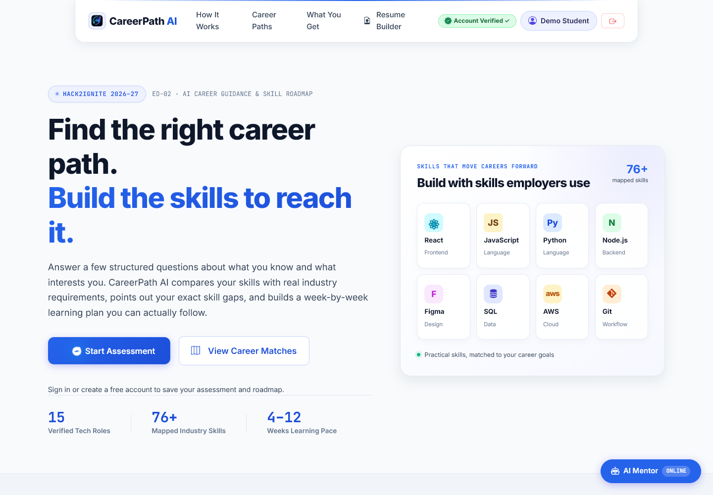 | 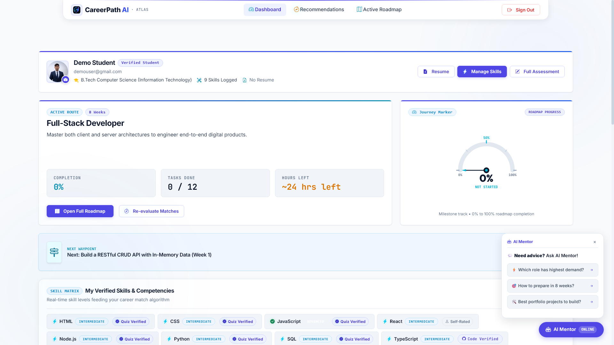 |
| *Three.js 3D Career Universe constellation with orbital physics* | *Accessible 2D SVG Percentage Gauge (0-100%) & quick stats* |

| 🐙 3. GitHub Study Lab & Repositories | 🎯 4. Explainable Career Recommendations |
| :---: | :---: |
| 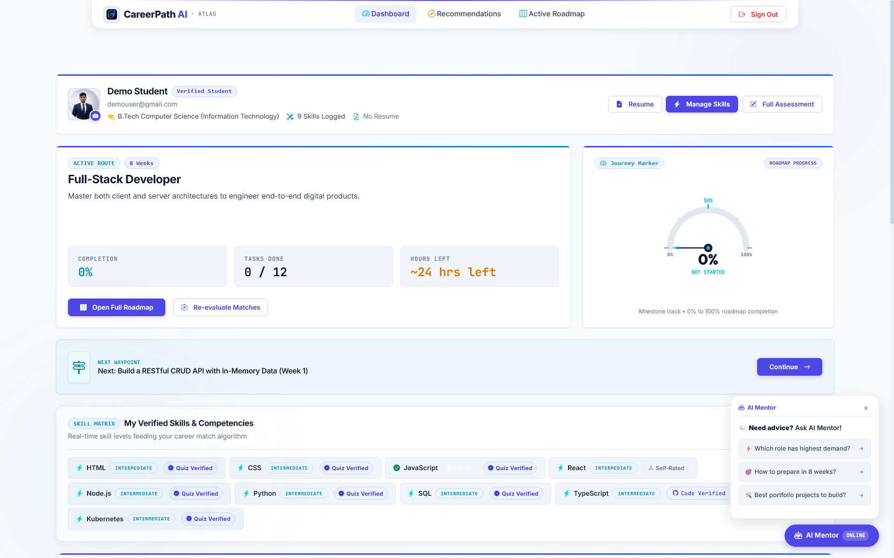 | 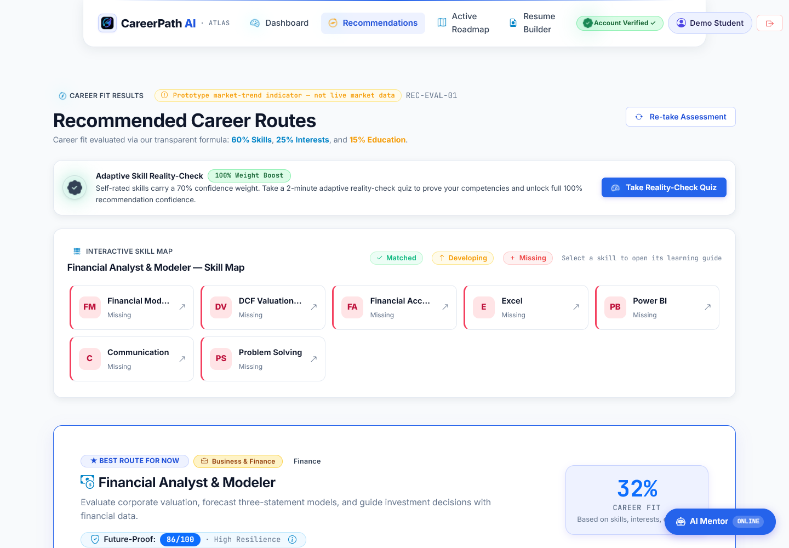 |
| *Code-grounded skill verification & study relevance annotations* | *Deterministic 60/25/15 match score & tri-color skill gaps* |

| 🗺️ 5. Adaptive Milestone Roadmap | 💼 6. Live Market Telemetry & CTC |
| :---: | :---: |
| 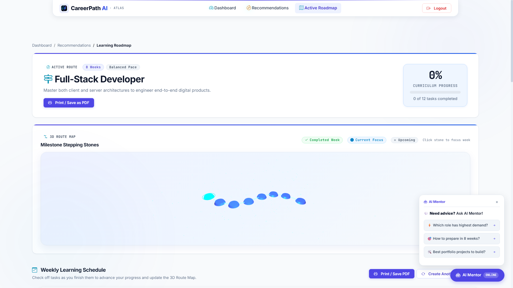 | 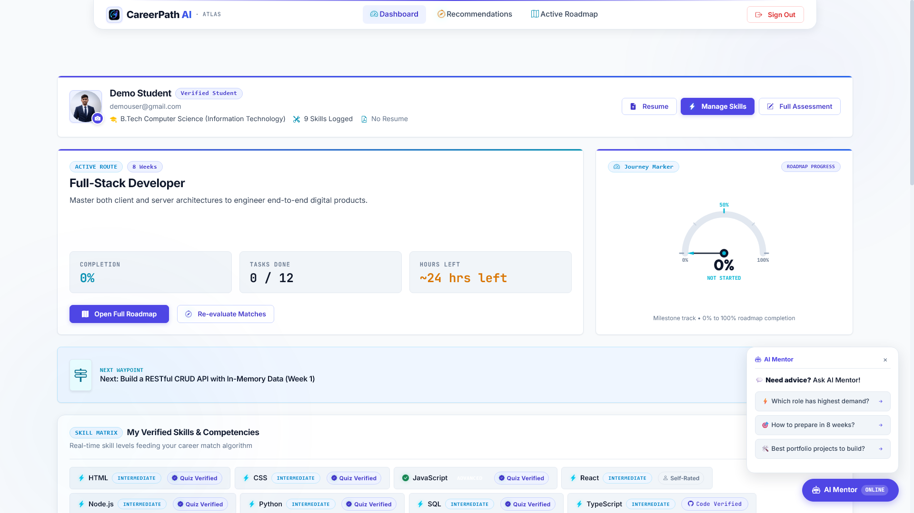 |
| *Prioritized missing skills, weekly tasks & atomic progress tracking* | *Verified Indian salary ranges & live jobs via Adzuna API* |

| 🤖 7. Dual-Engine AI Career Mentor | 🔐 8. Social Auth Stack (Google & GitHub) |
| :---: | :---: |
| 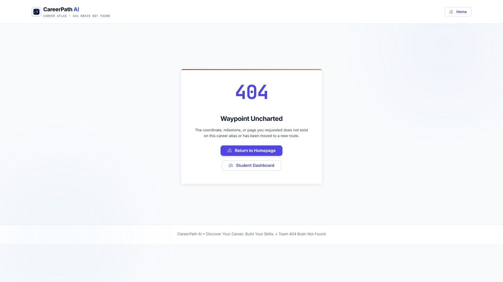 | 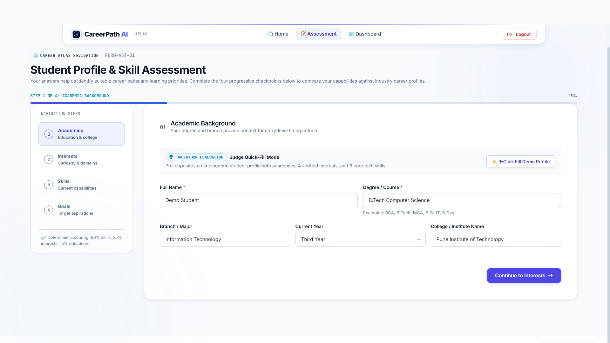 |
| *Low-latency (<300ms) guidance via Groq Llama 3.3 70B & Gemini* | *Animated Google logo + GitHub OAuth + 1-Click Fast Track* |

| 🧠 9. Adaptive Reality-Check Quiz | 🔑 10. Multi-Provider AI Engine (BYOK) |
| :---: | :---: |
| 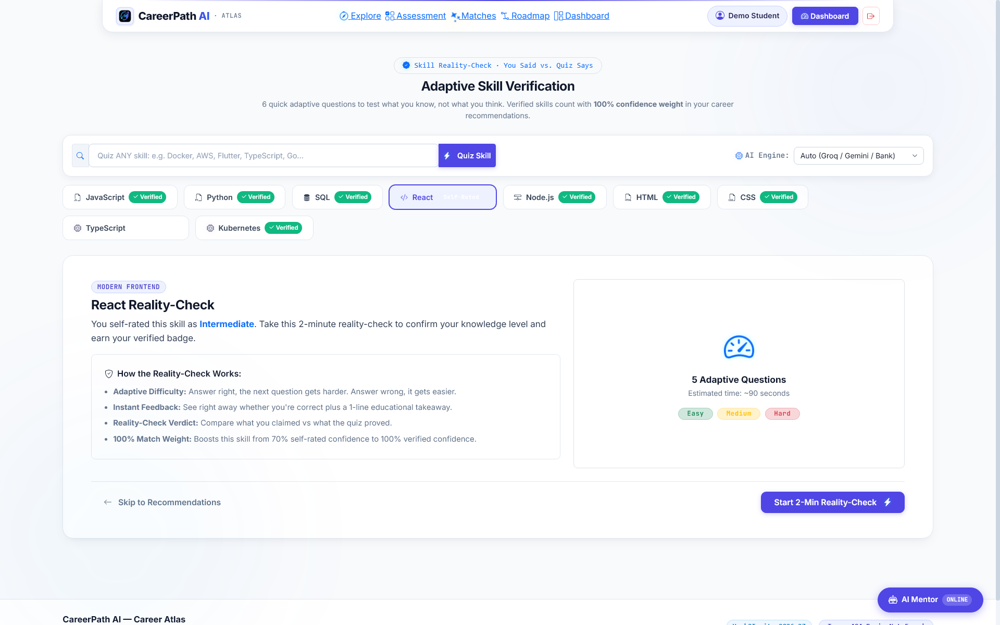 | 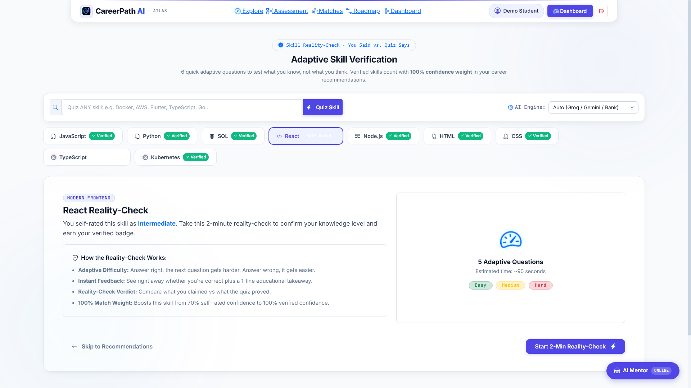 |
| *Adaptive technical quizzes testing real concept retention & mastery* | *BYOK modal for Gemini, Groq, Ollama & DeepSeek custom keys* |

---

## 🎯 Problem Statement ED-02: Real-World Need & Solution

### The Core Challenge
In emerging tech economies like India, over **1.5 million engineers graduate every year**, yet national employability reports reveal that **over 80% struggle to meet industry hiring standards**.

```
       Traditional College Path                    Industry Hiring Reality
┌──────────────────────────────────────┐     ┌──────────────────────────────────────┐
│  • Outdated theoretical syllabus     │     │  • Production stacks (React, Node)   │
│  • Vague personality quiz scores     │ ──► │  • Real GitHub proof-of-work         │
│  • Thousands of random tutorials     │ ✘   │  • Verified technical competencies   │
│  • Severe analysis paralysis         │     │  • Time-boxed milestone execution    │
└──────────────────────────────────────┘     └──────────────────────────────────────┘
                   ▲                                            ▲
                   └──────────── The Skill-Gap Chasm ───────────┘
```

### The CareerPath AI Solution
**CareerPath AI** transforms career guidance from subjective guesswork into an objective, math-backed digital navigation system:
1. **Explainable Matching Engine:** Uses our deterministic **60/25/15 mathematical formula** (60% Skills, 25% Interests, 15% Academics) — zero LLM hallucination.
2. **Two-Factor Skill Verification Moat:**
   - **Factor 1 (Code-Grounded GitHub Telemetry):** Connects public repositories via authenticated session (`POST /api/auth/github/sync`), parses code languages, and awards `[✓ Code Verified]` badges.
   - **Factor 2 (Adaptive Reality-Check Micro-Quiz):** Generates calibrated 5-question technical assessments via Groq Llama 3.3 70B and Gemini 2.5 Flash, awarding permanent `[✓ Quiz Verified]` credentials.
3. **Actionable Skill-Gap Breakdown:** Categorizes requirements into **Matched (🟢)**, **Upgrade Needed (🟡)**, and **Missing (🔴)** so students know exactly what to learn next.
4. **Adaptive Time-Boxed Roadmaps:** Synthesizes 4, 8, or 12-week structured roadmaps prioritizing missing competencies first with curated reference links (MDN, freeCodeCamp).
5. **Live Job Market Telemetry:** Integrates the **Adzuna Developer API** to stream verified Indian CTC salary data (₹4.5 LPA – ₹9.0 LPA) and live vacancies.
6. **High-Contrast 2D Percentage Circular Gauge:** Lightweight, accessible SVG circular meter tracking 0% to 100% completion on the dashboard.
7. **Dual-Engine AI Mentor:** Round-the-clock guidance powered by **Groq Llama 3.3 70B** (<300ms) with **Google Gemini 2.5 Flash** failover.
8. **Cloud Media Management:** **Cloudinary Media SDK** for profile avatars and PDF resume attachments.

---

## 💼 Supported Tech Roles & 76+ Standardized Skills Ecosystem

CareerPath AI dynamically evaluates, visualizes, and roadmaps **15 high-demand tech roles** mapped across **76 standardized industry skills**:

| # | Role Title | Category | Slug | Primary Key Skills |
| :---: | :--- | :---: | :--- | :--- |
| 1 | 💻 **Front-End Developer** | Development | `front-end-developer` | HTML, CSS, JavaScript, React, Tailwind CSS, Responsive Design, TypeScript |
| 2 | ⚡ **Full-Stack Developer** | Development | `full-stack-developer` | JavaScript, React, Node.js, Express, MongoDB, REST APIs, Next.js, Docker |
| 3 | 📊 **Data Analyst** | Data | `data-analyst` | SQL, Python, Excel, Statistics, Power BI, Data Visualization, Data Cleaning |
| 4 | 🎨 **UI/UX Designer** | Design | `ui-ux-designer` | Figma, Wireframing, Prototyping, Visual Design, User Research, Design Systems |
| 5 | 🛡️ **Cybersecurity Analyst** | Security | `cybersecurity-analyst` | Networking, Linux, Cybersecurity Fundamentals, OWASP Basics, Ethical Hacking |
| 6 | 🤖 **AI / Machine Learning Engineer** | AI & Data | `ai-ml-engineer` | Python, PyTorch, TensorFlow, Scikit-Learn, Generative AI, LangChain, Deep Learning |
| 7 | ☁️ **DevOps & Cloud Engineer** | Cloud | `devops-cloud-engineer` | AWS, Docker, Kubernetes, Linux, Terraform, CI/CD GitHub Actions, Networking |
| 8 | 📱 **Mobile App Developer** | Mobile | `mobile-app-developer` | Flutter, Dart, React Native, JavaScript, Firebase, REST APIs, UI/UX |
| 9 | ⚙️ **Backend Engineer** | Development | `backend-engineer` | Java, Spring Boot, Node.js, PostgreSQL, MongoDB, Redis, REST APIs, Kafka |
| 10 | 🧠 **Data Scientist** | Data | `data-scientist` | Python, SQL, Statistics, Scikit-Learn, Pandas, Deep Learning, Data Visualization |
| 11 | 🧪 **QA Automation Engineer** | Testing | `qa-automation-engineer` | Cypress, Playwright, Selenium, Postman, JavaScript, CI/CD, Python |
| 12 | 🎮 **Game Developer** | Gaming | `game-developer` | Unity, C#, Unreal Engine 5, C++, Visual Design, 3D Mathematics |
| 13 | 🔗 **Blockchain & Web3 Developer** | Web3 | `blockchain-web3-developer` | Solidity, Smart Contracts, Web3.js, JavaScript, Node.js, REST APIs |
| 14 | 🚨 **Cloud Security & DevSecOps** | Security | `cloud-security-engineer` | Cybersecurity Fundamentals, Linux, Networking, AWS, Docker, OWASP, CI/CD |
| 15 | 📋 **Technical Product Manager** | Product | `technical-product-manager` | Product Management, Agile & Scrum, User Stories, User Research, Communication |

---

## 🏗️ High-Level System Architecture

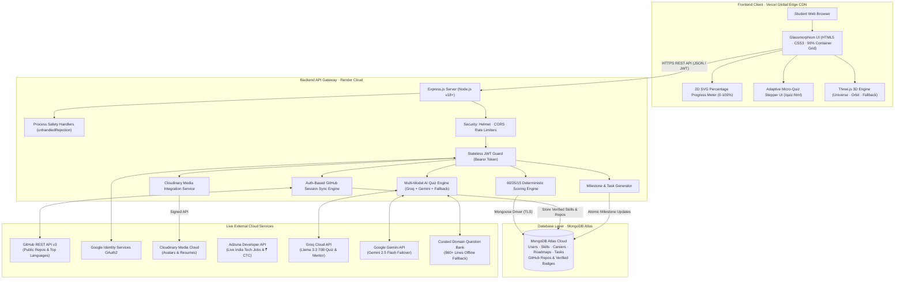
```mermaid
flowchart TD
    subgraph Client ["Frontend Client · Vercel Global Edge CDN"]
        Browser["Student Web Browser"]
        UI["Glassmorphism UI (HTML5 · CSS3 · 90% Container Grid)"]
        Gauge["2D SVG Percentage Progress Meter (0-100%)"]
        QuizView["Adaptive Micro-Quiz Stepper UI (/quiz.html)"]
        WebGL["Three.js 3D Engine (Universe · Orbit · Fallback)"]
        Browser --> UI
        UI --> Gauge
        UI --> QuizView
        UI --> WebGL
    end

    subgraph Gateway ["Backend API Gateway · Render Cloud"]
        Express["Express.js Server (Node.js v18+)"]
        Safety["Process Safety Handlers (unhandledRejection)"]
        Security["Security: Helmet · CORS · Rate Limiters"]
        Auth["Stateless JWT Guard (Bearer Token)"]
        GitHubSync["Auth-Based GitHub Session Sync Engine"]
        QuizEngine["Multi-Model AI Quiz Engine (Groq + Gemini + Fallback)"]
        Engine["60/25/15 Deterministic Scoring Engine"]
        RoadmapGen["Milestone & Task Generator"]
        MediaService["Cloudinary Media Integration Service"]

        Express --> Safety
        Express --> Security
        Security --> Auth
        Auth --> GitHubSync
        Auth --> QuizEngine
        Auth --> Engine
        Auth --> RoadmapGen
        Auth --> MediaService
    end

    subgraph Database ["Database Layer · MongoDB Atlas"]
        Cluster[("MongoDB Atlas Cloud\nUsers · Skills · Careers · Roadmaps · Tasks\nGitHub Repos & Verified Badges")]
    end

    subgraph CloudAPIs ["Live External Cloud Services"]
        GitHubAPI["GitHub REST API v3\n(Public Repos & Top Languages)"]
        GoogleOAuth["Google Identity Services OAuth2"]
        CloudinaryCloud["Cloudinary Media Cloud\n(Avatars & Resumes)"]
        AdzunaAPI["Adzuna Developer API\n(Live India Tech Jobs & ₹ CTC)"]
        GroqAPI["Groq Cloud API\n(Llama 3.3 70B Quiz & Mentor)"]
        GeminiAPI["Google Gemini API\n(Gemini 2.5 Flash Failover)"]
        DomainBank["Curated Domain Question Bank\n(860+ Lines Offline Fallback)"]
    end

    UI -- "HTTPS REST API (JSON / JWT)" --> Express
    GitHubSync <--> GitHubAPI
    Auth <--> GoogleOAuth
    MediaService -- "Signed API" --> CloudinaryCloud
    QuizEngine <--> GroqAPI
    QuizEngine <--> GeminiAPI
    QuizEngine <--> DomainBank
    Engine -- "Mongoose Driver (TLS)" --> Cluster
    GitHubSync -- "Store Verified Skills & Repos" --> Cluster
    RoadmapGen -- "Atomic Milestone Updates" --> Cluster
```

---

## 🔌 Core REST API Architecture (Key Endpoints)

| Method | Route Endpoint | Access Guard | Primary Responsibilities & Hackathon Features |
| :---: | :--- | :---: | :--- |
| `POST` | `/api/auth/register` | Public | Instant 1-click evaluator registration; issues 7-day stateless JWT token |
| `POST` | `/api/auth/login` | Public | Authenticates credentials with 10-round salted `bcryptjs` hashing |
| `POST` | `/api/auth/google` | Public | Google Identity Services OAuth 2.0 verification |
| `POST` | `/api/auth/github` | Public | GitHub OAuth & 1-click evaluator sign-in |
| `POST` | `/api/auth/github/sync` | Protected (JWT) | **Auth-based repository sync:** Resolves student GitHub identity from session, extracts languages, awards `isCodeVerified` badges with zero modal prompt |
| `POST` | `/api/quiz/start` | Optional / Demo | Generates 5 calibrated questions via Groq Llama 3.3 70B / Gemini Flash / Fallback |
| `POST` | `/api/quiz/answer` | Optional / Demo | Evaluates submitted answer, returns instant pedagogical explanation, advances stepper |
| `GET`  | `/api/quiz/status` | Protected (JWT) | Returns current student verification status and verified skills count |
| `GET`  | `/api/quiz/providers`| Public | Returns active AI generation engines and BYOK status |
| `POST` | `/api/assessment` | Protected (JWT) | Saves student academic profile, interests, and 76+ skills |
| `POST` | `/api/recommendations/generate` | Protected (JWT) | Runs deterministic 60/25/15 match engine & tri-color skill-gap decomposition |
| `POST` | `/api/roadmaps/generate` | Protected (JWT) | Synthesizes personalized 4, 8, or 12-week prioritized milestone roadmaps |
| `PATCH`| `/api/roadmaps/tasks/:id` | Protected (JWT) | Atomic server-side task checkbox completion & real-time % recalculation |
| `GET`  | `/api/dashboard` | Protected (JWT) | Aggregates active career goal, GitHub Study Lab, next milestone, and 2D gauge metrics |
| `GET`  | `/api/jobs/adzuna` | Public | Streams live Indian tech job vacancies & verified ₹ CTC salary data |
| `POST` | `/api/chat/message` | Protected / Demo | Sub-300ms AI career coaching via Groq Llama 3.3 70B + Gemini failover |

---

## 💰 Business Model & Financial Sustainability (How It Makes Money)

CareerPath AI is built on a **sustainable B2B2C Talent & Telemetry Flywheel** that keeps career guidance **100% free for students, always**, while monetizing institutional and corporate demand:

```
┌────────────────────────────────────────────────────────────────────────────────────────┐
│                        CAREERPATH AI B2B2C MONETIZATION                                │
├──────────────────────────┬─────────────────────────────┬───────────────────────────────┤
│ 🎓 STUDENTS              │ 🏛️ COLLEGES / UNIVERSITIES   │ 💼 HIRING COMPANIES           │
│ 100% FREE ALWAYS         │ PLACEMENT SAAS (TPO PORTAL) │ VERIFIED TALENT ACCESS        │
├──────────────────────────┼─────────────────────────────┼───────────────────────────────┤
│ • Zero paywalls          │ • Per-batch / yearly SaaS   │ • Pre-screened candidates     │
│ • Free 60/25/15 match    │ • Batch skill gap heatmaps  │ • Proof-of-work hiring        │
│ • Adaptive roadmaps      │ • NAAC / NIRF data export   │ • Cuts recruiting CAC by 60%  │
│ • Frictionless adoption  │ • Tier: ₹49k - ₹1.99L/yr    │ • Tier: ₹24,999 - ₹59,999/mo  │
└──────────────────────────┴─────────────────────────────┴───────────────────────────────┘
```

1. **Free for Students, Always:** Eliminates user friction, maximizes campus virality, and democratizes career advancement without economic barriers.
2. **College Placement SaaS (TPO Portal):** Placement Officers pay an annual campus license (₹1.5L–₹3.5L/year) for batch-wide skill deficiency heatmaps, placement probability metrics, and automated NAAC/NIRF accreditation exports.
3. **Verified-Skill Recruiter Portal:** Corporate employers pay monthly subscriptions (₹24,999/mo) or pay-as-you-go unlocks to access pre-assessed, proof-of-work candidate pipelines filtered by verified tech stacks.
4. **Ethical Learning Partnerships:** Non-intrusive, strictly labeled sponsored certification referrals (15–25% revenue share) for students wanting recognized industry credentials, with zero bias on the free core curriculum.

---

## 👥 The Team — 404 Brain Not Found

Built with passion, late-night grit, and engineering dedication for **Hack2Ignite 2026–27**:

| <br /><sub><b>Parth Patil</b></sub> | <br /><sub><b>Aditi Vispute</b></sub> | <br /><sub><b>Suyog Pawar</b></sub> | <br /><sub><b>Sanika Bodhnawar</b></sub> |
| :---: | :---: | :---: | :---: |
| 👑 **Team Leader & Full Stack WebDev** | 🔍 **Researcher, Web Explorer & Integration Lead** | 🎨 **UI/UX & Frontend Systems Lead** | 📊 **QA, Data & Docs Lead & Presenter / Speaker** |
| [](https://github.com/parthpatil1234p-svg) | [](https://github.com/aditivispute25-gif) | [](https://github.com/Suyog-SP) | [](https://github.com/SanikaMB) |

---

## ⚡ Local Quickstart (For Local Evaluation)

```bash
# 1. Backend Setup
cd careerpath-ai/server
npm install
cp .env.example .env     # Pre-configured with demo defaults
npm run seed             # Seeds 76+ skills, 15 careers & quiz questions
npm run dev              # Starts Express server on http://localhost:5000

# 2. Frontend Client (in a new terminal)
cd careerpath-ai/client
npx serve -p 5500        # Serves client on http://localhost:5500
# Open http://localhost:5500/index.html in your browser
```

---

## 🤖 Official AI Usage Disclosure (Rulebook Compliance)

In strict accordance with the **Hack2Ignite 2026–27 Official Rulebook** (*Rule: "AI usage is allowed, but AI usage must be disclosed in README and PPT"*):

1. **Runtime Application AI (In-App Features):**
   - **Groq Cloud API (`llama-3.3-70b-versatile`):** Utilized at runtime for sub-300ms dynamic skill reality-check quiz generation and 24/7 technical interview guidance in `/api/chat/message`.
   - **Google Gemini API (`gemini-2.5-flash`):** Utilized at runtime as an automated secondary failover inference engine.
2. **Development Assistance AI:**
   - LLMs were utilized for generating seed industry curriculum descriptions and Three.js particle buffer shader boilerplate.
   - **Original Work Guarantee:** All core system architecture, deterministic mathematical scoring algorithms (60/25/15), Express REST API controllers, Mongoose schemas, and DOM controllers were originally engineered, tested, and implemented by **Team 404 Brain Not Found**.

---

## 📄 License & Acknowledgements

- **License:** Licensed under the [MIT License](LICENSE).
- **Organizer:** Organized by **[G.H. Raisoni International Skill Tech University (GHRISTU)](https://ghristu.edu.in/)**.
- **Official Hackathon Portal:** Registered and submitted via **[Hack 2 Ignite on Unstop](https://unstop.com/hackathons/hack-2-ignite-gh-raisoini-international-skill-tech-university-1745045)**.
- **Team:** Built with dedication by **Team 404 Brain Not Found** (Parth Patil, Aditi Vispute, Suyog Pawar, Sanika Bodhnawar).
