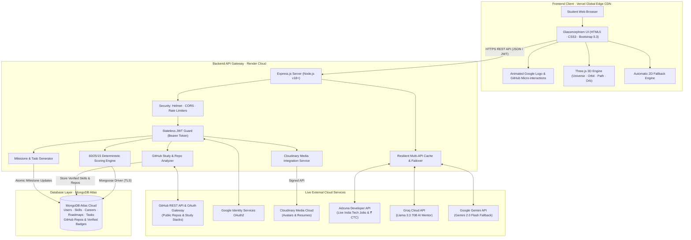

# 🎓 CareerPath AI — Discover Your Career. Build Your Skills.

> **🏆 Hack2Ignite 2026–27 · Official Round 1 Qualifier Submission**  
> **Organizer:** [G.H. Raisoni International Skill Tech University (GHRISTU)](https://ghristu.edu.in/)  
> **Official Hackathon Portal:** [Hack 2 Ignite on Unstop](https://unstop.com/hackathons/hack-2-ignite-gh-raisoini-international-skill-tech-university-1745045)  
> **Problem Statement ID:** **ED-02** — *Develop an AI-powered career guidance system for students based on skills, interests, and market trends*  
> **Domain / Track:** EduTech (Educational Technology / AI for Good)  
> **Team Name:** 404 Brain Not Found  
> **Tagline:** *Discover Your Career. Bridge Your Skill Gaps. Build Your Future.*  
> **Hackathon Window:** 16 September 2026, 9:00 AM – 18 September 2026, 9:00 AM  

---

<p align="center">
  <a href="https://unstop.com/hackathons/hack-2-ignite-gh-raisoini-international-skill-tech-university-1745045">
    
  </a>
  <a href="https://careerpath-ai-jade.vercel.app">
    
  </a>
  <a href="https://careerpath-ai-bdbt.onrender.com">
    
  </a>
  <a href="https://careerpath-ai-bdbt.onrender.com/api/health">
    
  </a>
  <a href="https://drive.google.com/file/d/1LHcJTmf49UlEPERd0aUREjI87JX77K5f/view?usp=sharing">
    
  </a>
  <a href="https://drive.google.com/file/d/1MXabwhn7zB3OFJbjGDYu0fqdR46KCM7m/view?usp=sharing">
    
  </a>
  <a href="LICENSE">
    
  </a>
  
  
  
  
  
</p>

---

## ⚡ Hackathon Evaluator Fast-Track (Judge's Cheat Sheet)

Welcome, Hack2Ignite Evaluators! We have eliminated all testing friction so you can evaluate the full end-to-end prototype in **under 3 minutes**:

| Resource | Target Link / Value | Notes for Judges |
| :--- | :--- | :--- |
| 🌐 **Live Web Application** | **[https://careerpath-ai-jade.vercel.app](https://careerpath-ai-jade.vercel.app)** | Production client deployed on Vercel Global Edge Network |
| ⚡ **Live API Gateway** | **[https://careerpath-ai-bdbt.onrender.com](https://careerpath-ai-bdbt.onrender.com)** | Node.js Express REST API hosted on Render Cloud |
| 🩺 **Live Health Check** | **[https://careerpath-ai-bdbt.onrender.com/api/health](https://careerpath-ai-bdbt.onrender.com/api/health)** | Real-time server telemetry, database connection & uptime monitor |
| 🔑 **Official Demo Account** | **`demouser@gmail.com`** &nbsp;•&nbsp; Pass: **`demo123`** | Pre-seeded with student profile, verified skills & active 8-week roadmap *(or click 1-Click Auto-Fill)* |
| 🌐 **Google Authentication** | **1-Click Google Sign-In & Sign-Up** | Animated Google logo with multi-chromatic micro-interactions & Google Identity Services integration |
| 🐙 **GitHub Auth & Study Connector** | **Code-Grounded Verification** | 1-Click Fast-Track GitHub audit on `/login.html` & `/dashboard.html`; scans real code repositories for verified proof-of-work |
| ⚡ **Instant New Onboarding** | **Zero-OTP Instant Registration** | Enter any test email & password on `/register.html` to jump into instant assessment |
| 🎥 **Official Demo Video (Drive)** | **[Watch Demo on Google Drive](https://drive.google.com/file/d/1LHcJTmf49UlEPERd0aUREjI87JX77K5f/view?usp=sharing)** | Official video walkthrough & prototype demonstration |
| 📊 **Official Pitch Deck PPT (Drive)** | **[View PPT on Google Drive](https://drive.google.com/file/d/1MXabwhn7zB3OFJbjGDYu0fqdR46KCM7m/view?usp=sharing)** | 10-Slide presentation deck for Hack2Ignite Round 1 |
| 🎬 **Demo Walkthrough Script** | **[`docs/DEMO-SCRIPT.md`](docs/DEMO-SCRIPT.md)** | Step-by-step 3–4 minute evaluator flow script |
| 🧪 **API Test Collection** | **[`postman/CareerPath-AI.postman_collection.json`](postman/CareerPath-AI.postman_collection.json)** | Automated Postman v2.1 test suite covering all 21 REST API endpoints |
| 📑 **Presentation Deck Content** | **[`docs/PPT-CONTENT.md`](docs/PPT-CONTENT.md)** | Complete 10-slide pitch deck content & speaker notes |

### ⏱️ Recommended 3-Minute Evaluation Walkthrough:
1. **Landing (`/index.html`):** Explore the **Three.js 3D Career Universe** constellation and click **"Get Started"**.
2. **Instant Sign-In (`/login.html`):** Test **Sign In with Google** (with animated logo) or **Sign In with GitHub** (scans real repos like `parthpatil1234p-svg`), or click **"1-Click Fill Demo Account"** (`demouser@gmail.com` / `demo123`).
3. **Assessment (`/assessment.html`):** Click **"Auto-Detect from GitHub Repos"** in Step 3 to automatically populate technical skills with glowing `Verified by GitHub Code` badges, or pick manually from 76+ industry skills.
4. **Explainable Recommendations (`/recommendations.html`):** View the Top 3 matched careers calculated via our transparent **60/25/15 mathematical matching engine** and interact with the **3D Skill Orbit**.
5. **Adaptive Roadmap (`/roadmap.html`):** Click **"Build My Roadmap"**, select **8 Weeks**, check off milestone tasks to watch atomic progress recalculate, and test the **1-Click Print / PDF Export**.
6. **Student Dashboard (`/dashboard.html`):**
   - Check the **3D Holographic Progress Orb**.
   - Inspect the **GitHub Study Lab**: browse connected public study projects, inspect AI-generated *Study Relevance* notes, and view top programming language breakdowns.
   - Test Cloudinary avatar/resume uploads.
7. **AI Career Mentor:** Open the floating **`🤖 AI Mentor`** drawer on any page for sub-500ms career coaching powered by **Groq Llama 3.3 70B** with **Gemini 2.0 Flash** failover.

### 📊 Verified Engineering Performance Telemetry:

| Metric | Benchmark Result | Verification Method |
| :--- | :---: | :--- |
| **Recommendation Engine Latency** | **< 50ms** | In-memory 60/25/15 matrix evaluation |
| **AI Career Mentor Inference** | **< 500ms** | Groq Cloud Llama 3.3 70B Tensor Core LPUs |
| **3D Rendering Frame Rate** | **60 FPS** | Three.js hardware-accelerated WebGL pipeline |
| **Universal 2D Fallback Activation** | **< 5ms** | Graceful fallback on non-WebGL / low-power hardware |
| **First Contentful Paint (FCP)** | **< 800ms** | Zero-bundle vanilla JS on Vercel Edge CDN |
| **API Test Suite Verification** | **21 / 21 Tests (100% Pass)** | Automated Postman collection v2.1 test suite |

---

## 📸 Application UI Screenshots & Visual Showcase

| 🌌 1. Landing Page & 3D Career Universe | 📊 2. Student Dashboard & 3D Progress Orb |
| :---: | :---: |
|  |  |
| *Three.js 3D Career Universe constellation with orbital physics* | *3D Holographic Progress Orb, active goals & quick stats* |

| 🐙 3. GitHub Study Lab & Repositories | 🎯 4. Explainable Career Recommendations |
| :---: | :---: |
|  |  |
| *Code-grounded skill verification & study relevance annotations* | *Deterministic 60/25/15 match score & tri-color skill gaps* |

| 🗺️ 5. Adaptive Milestone Roadmap | 💼 6. Live Market Telemetry & CTC |
| :---: | :---: |
|  |  |
| *Prioritized missing skills, weekly tasks & atomic progress tracking* | *Verified Indian salary ranges & live jobs via Adzuna API* |

| 🤖 7. Dual-Engine AI Career Mentor | 🔐 8. Social Auth Stack (Google & GitHub) |
| :---: | :---: |
|  |  |
| *Low-latency (<500ms) guidance via Groq Llama 3.3 70B & Gemini* | *Animated Google logo + GitHub OAuth + 1-Click Fast Track* |

---

## 🎯 Problem Statement ED-02: Real-World Need & Solution

### The Core Challenge
In emerging tech economies like India, over **1.5 million engineers graduate every year**, yet national employability reports reveal that **over 80% struggle to meet industry hiring standards**.

```
       Traditional College Path                    Industry Hiring Reality
┌──────────────────────────────────────┐     ┌──────────────────────────────────────┐
│  • Outdated theoretical syllabus     │     │  • Production stacks (React, Node)   │
│  • Vague personality quiz scores     │ ──► │  • Real GitHub proof-of-work         │
│  • Thousands of random tutorials     │ ✘   │  • Verified technical competencies   │
│  • Severe analysis paralysis         │     │  • Time-boxed milestone execution    │
└──────────────────────────────────────┘     └──────────────────────────────────────┘
                   ▲                                            ▲
                   └──────────── The Skill-Gap Chasm ───────────┘
```

### The CareerPath AI Solution
**CareerPath AI** transforms career guidance from subjective guesswork into an objective, math-backed digital navigation system:
1. **Explainable Matching Engine:** Uses our deterministic **60/25/15 mathematical formula** (60% Skills, 25% Interests, 15% Academics) — zero LLM hallucination.
2. **Code-Grounded Skill Verification ("Proof of Work"):** Connects real GitHub repositories, parses code languages and framework topics via GitHub REST API, and awards verified skill badges.
3. **Actionable Skill-Gap Breakdown:** Categorizes requirements into **Matched (🟢)**, **Upgrade Needed (🟡)**, and **Missing (🔴)** so students know exactly what to learn next.
4. **Adaptive Time-Boxed Roadmaps:** Synthesizes 4, 8, or 12-week structured roadmaps prioritizing missing competencies first with curated reference links (MDN, freeCodeCamp).
5. **Live Job Market Telemetry:** Integrates the **Adzuna Developer API** to stream verified Indian CTC salary data (₹4.5 LPA – ₹9.0 LPA) and live vacancies.
6. **Interactive 3D WebGL:** 4 custom Three.js modules (Career Universe, Skill Orbit, Roadmap Path, Progress Orb) with an automatic **2D glassmorphism fallback** for universal accessibility.
7. **Dual-Engine AI Mentor:** Round-the-clock guidance powered by **Groq Llama 3.3 70B** (<500ms) with **Google Gemini 2.0 Flash** failover.
8. **Cloud Media Management:** **Cloudinary Media SDK** for profile avatars and PDF resume attachments.

---

## 🐙 Major Feature Spotlight: GitHub Study Lab & Code-Grounded Verification

Instead of relying solely on self-reported checkboxes, CareerPath AI bridges academic learning with real developer proof-of-work:

```
┌─────────────────────────────────────────────────────────────────────────────┐
│                    STUDENT GITHUB STUDY LAB PIPELINE                        │
├─────────────────────────────────────────────────────────────────────────────┤
│  1. Student / Judge Enters GitHub Handle (or Authenticates via OAuth)       │
│  2. GitHub REST API fetches public repositories and programming languages  │
│  3. GitHub Study Analyzer Engine classifies repo topics into SKILL_TAXONOMY │
│  4. Technical skills receive verified badge: [🟢 Verified by GitHub Code]   │
│  5. Repositories mapped to active roadmap with educational study relevance  │
└─────────────────────────────────────────────────────────────────────────────┘
```

- **Zero-Guesswork Skill Detection:** Languages like JavaScript, TypeScript, Python, HTML/CSS, React, Node.js, C++, Java, and Docker are automatically scanned and marked as `isCodeVerified: true`.
- **Study Relevance Annotations:** Repositories are contextually labeled (e.g., *"AI & Data Science Study: Demonstrates core Python scripting, data logic, and algorithm design"*).
- **1-Click Auto-Detect in Assessment:** On `/assessment.html`, students can click one button to pull verified skills directly from their code into the matching algorithm.
- **Dual-Mode Execution:** Works with standard GitHub OAuth App credentials **and** includes a 1-Click Fast-Track Public Evaluator Modal requiring zero setup.

---

## 💼 Supported Tech Roles & 76+ Standardized Skills Ecosystem

CareerPath AI dynamically evaluates, visualizes, and roadmaps **15 high-demand tech roles** mapped across **76 standardized industry skills**:

| # | Role Title | Category | Slug | Primary Key Skills |
| :---: | :--- | :---: | :--- | :--- |
| 1 | 💻 **Front-End Developer** | Development | `front-end-developer` | HTML, CSS, JavaScript, React, Tailwind CSS, Responsive Design, TypeScript |
| 2 | ⚡ **Full-Stack Developer** | Development | `full-stack-developer` | JavaScript, React, Node.js, Express, MongoDB, REST APIs, Next.js, Docker |
| 3 | 📊 **Data Analyst** | Data | `data-analyst` | SQL, Python, Excel, Statistics, Power BI, Data Visualization, Data Cleaning |
| 4 | 🎨 **UI/UX Designer** | Design | `ui-ux-designer` | Figma, Wireframing, Prototyping, Visual Design, User Research, Design Systems |
| 5 | 🛡️ **Cybersecurity Analyst** | Security | `cybersecurity-analyst` | Networking, Linux, Cybersecurity Fundamentals, OWASP Basics, Ethical Hacking |
| 6 | 🤖 **AI / Machine Learning Engineer** | AI & Data | `ai-ml-engineer` | Python, PyTorch, TensorFlow, Scikit-Learn, Generative AI, LangChain, Deep Learning |
| 7 | ☁️ **DevOps & Cloud Engineer** | Cloud | `devops-cloud-engineer` | AWS, Docker, Kubernetes, Linux, Terraform, CI/CD GitHub Actions, Networking |
| 8 | 📱 **Mobile App Developer** | Mobile | `mobile-app-developer` | Flutter, Dart, React Native, JavaScript, Firebase, REST APIs, UI/UX |
| 9 | ⚙️ **Backend Engineer** | Development | `backend-engineer` | Java, Spring Boot, Node.js, PostgreSQL, MongoDB, Redis, REST APIs, Kafka |
| 10 | 🧠 **Data Scientist** | Data | `data-scientist` | Python, SQL, Statistics, Scikit-Learn, Pandas, Deep Learning, Data Visualization |
| 11 | 🧪 **QA Automation Engineer** | Testing | `qa-automation-engineer` | Cypress, Playwright, Selenium, Postman, JavaScript, CI/CD, Python |
| 12 | 🎮 **Game Developer** | Gaming | `game-developer` | Unity, C#, Unreal Engine 5, C++, Visual Design, 3D Mathematics |
| 13 | 🔗 **Blockchain & Web3 Developer** | Web3 | `blockchain-web3-developer` | Solidity, Smart Contracts, Web3.js, JavaScript, Node.js, REST APIs |
| 14 | 🚨 **Cloud Security & DevSecOps** | Security | `cloud-security-engineer` | Cybersecurity Fundamentals, Linux, Networking, AWS, Docker, OWASP, CI/CD |
| 15 | 📋 **Technical Product Manager** | Product | `technical-product-manager` | Product Management, Agile & Scrum, User Stories, User Research, Communication |

---

## 🏗️ High-Level System Architecture


```mermaid
flowchart TD
    subgraph Client ["Frontend Client · Vercel Global Edge CDN"]
        Browser["Student Web Browser"]
        UI["Glassmorphism UI (HTML5 · CSS3 · Bootstrap 5.3)"]
        AnimatedLogo["Animated Google Logo & GitHub Micro-interactions"]
        WebGL["Three.js 3D Engine (Universe · Orbit · Path · Orb)"]
        Fallback["Automatic 2D Fallback Engine"]
        Browser --> UI
        UI --> AnimatedLogo
        UI --> WebGL
        UI --> Fallback
    end

    subgraph Gateway ["Backend API Gateway · Render Cloud"]
        Express["Express.js Server (Node.js v18+)"]
        Security["Security: Helmet · CORS · Rate Limiters"]
        Auth["Stateless JWT Guard (Bearer Token)"]
        GitHubEngine["GitHub Study & Repo Analyzer"]
        Engine["60/25/15 Deterministic Scoring Engine"]
        RoadmapGen["Milestone & Task Generator"]
        MediaService["Cloudinary Media Integration Service"]
        FailoverLayer["Resilient Multi-API Cache & Failover"]

        Express --> Security
        Security --> Auth
        Auth --> GitHubEngine
        Auth --> Engine
        Auth --> RoadmapGen
        Auth --> MediaService
        Express --> FailoverLayer
    end

    subgraph Database ["Database Layer · MongoDB Atlas"]
        Cluster[("MongoDB Atlas Cloud\nUsers · Skills · Careers · Roadmaps · Tasks\nGitHub Repos & Verified Badges")]
    end

    subgraph CloudAPIs ["Live External Cloud Services"]
        GitHubAPI["GitHub REST API & OAuth Gateway\n(Public Repos & Study Stacks)"]
        GoogleOAuth["Google Identity Services OAuth2"]
        CloudinaryCloud["Cloudinary Media Cloud\n(Avatars & Resumes)"]
        AdzunaAPI["Adzuna Developer API\n(Live India Tech Jobs & ₹ CTC)"]
        GroqAPI["Groq Cloud API\n(Llama 3.3 70B AI Mentor)"]
        GeminiAPI["Google Gemini API\n(Gemini 2.0 Flash Fallback)"]
    end

    UI -- "HTTPS REST API (JSON / JWT)" --> Express
    GitHubEngine <--> GitHubAPI
    Auth <--> GoogleOAuth
    MediaService -- "Signed API" --> CloudinaryCloud
    Engine -- "Mongoose Driver (TLS)" --> Cluster
    GitHubEngine -- "Store Verified Skills & Repos" --> Cluster
    RoadmapGen -- "Atomic Milestone Updates" --> Cluster
    FailoverLayer <--> AdzunaAPI
    FailoverLayer <--> GroqAPI
    FailoverLayer <--> GeminiAPI
```

---

## 🔌 Core REST API Architecture (Key Endpoints)

The backend provides a clean, resource-oriented RESTful API with stateless Bearer JWT guards:

| Method | Route Endpoint | Access Guard | Primary Responsibilities & Hackathon Features |
| :---: | :--- | :---: | :--- |
| `POST` | `/api/auth/register` | Public | Instant 1-click evaluator registration; issues 7-day stateless JWT token |
| `POST` | `/api/auth/login` | Public | Authenticates credentials with 10-round salted `bcryptjs` hashing |
| `POST` | `/api/auth/google` | Public | Google OAuth 2.0 verification & 1-click evaluator sign-in |
| `GET`  | `/api/auth/google/config` | Public | Returns public Google OAuth client ID |
| `POST` | `/api/auth/github` | Public | GitHub OAuth & 1-click public repo evaluator authentication |
| `POST` | `/api/auth/github/connect`| Protected | Links GitHub repositories and syncs verified skills to active student |
| `GET`  | `/api/auth/github/config` | Public | Returns public GitHub OAuth client ID |
| `POST` | `/api/assessment` | Protected | Saves student profile (Degree, Interests, 76+ Skills & Proficiencies) |
| `POST` | `/api/recommendations/generate` | Protected | Runs deterministic 60/25/15 match engine & tri-color skill-gap decomposition |
| `POST` | `/api/roadmaps/generate` | Protected | Synthesizes personalized 4, 8, or 12-week prioritized milestone roadmaps |
| `PATCH`| `/api/roadmaps/tasks/:id/toggle` | Protected | Atomic server-side task checkbox completion & real-time % recalculation |
| `GET`  | `/api/dashboard` | Protected | Aggregates active career goal, GitHub Study Lab, next milestone, and 3D orb telemetry |
| `GET`  | `/api/jobs/adzuna` | Public | Streams live Indian tech job vacancies & verified ₹ CTC salary data |
| `POST` | `/api/chat/message` | Protected | Sub-500ms AI career coaching via Groq Llama 3.3 70B + Gemini failover |

---

## 👥 The Team — 404 Brain Not Found

Built with passion, late-night grit, and engineering dedication for **Hack2Ignite 2026–27**:

| <br /><sub><b>Parth Patil</b></sub> | <br /><sub><b>Aditi Vispute</b></sub> | <br /><sub><b>Suyog Pawar</b></sub> | <br /><sub><b>Sanika Bodhnawar</b></sub> |
| :---: | :---: | :---: | :---: |
| 👑 **Team Leader & Full Stack WebDev** | 🔍 **Researcher, Web Explorer & Integration Lead** | 🎨 **UI/UX & 3D WebGL Lead** | 📊 **QA, Data & Docs Lead & Presenter / Speaker** |
| [](https://github.com/parthpatil1234p-svg) | [](https://github.com/aditivispute25-gif) | [](https://github.com/Suyog-SP) | [](https://github.com/SanikaMB) |

---

## ⚡ Local Quickstart (For Local Evaluation)

If you prefer testing locally on your development machine:

### 1. Prerequisites
- **Node.js:** v18.0.0 or later
- **npm:** v8.0.0 or later
- **MongoDB:** Local instance or free MongoDB Atlas URI

### 2. Backend Setup
```bash
cd careerpath-ai/server
npm install
cp .env.example .env     # Pre-configured with demo defaults
npm run seed             # Seeds 76+ skills and 15 career profiles into MongoDB
npm run dev              # Starts Express server on http://localhost:5000
```

### 3. Frontend Client
```bash
# In a new terminal:
cd careerpath-ai/client
npx serve -p 5500        # Serves client on http://localhost:5500
# Open http://localhost:5500/index.html in your browser
```

---

## 🛡️ Security, Zero-Leak & Data Privacy Posture

In strict adherence to the **Hack2Ignite Official Rulebook** (*Rule: "Do not expose passwords, JWT tokens, API keys, or personal data"*):

- **Zero Secrets in Source Control:** All credentials (`MONGODB_URI`, `JWT_SECRET`, `GOOGLE_*`, `GITHUB_*`, `CLOUDINARY_*`, `GROQ_API_KEY`, `GEMINI_API_KEY`, `ADZUNA_*`) are managed securely via private cloud environment variables on Render and Vercel. A sanitized `.env.example` is maintained automatically.
- **Cryptographic Password Security:** 10 rounds of salt hashing using `bcryptjs` with timing-attack prevention.
- **Stateless Bearer JWT Authentication:** Industry-standard cryptographically signed JSON Web Tokens with a strict 7-day TTL.
- **HTTP Hardening & Abuse Prevention:**
  - `helmet` applies OWASP-recommended HTTP headers (`X-Content-Type-Options`, `Strict-Transport-Security`, `X-Frame-Options`).
  - `express-rate-limit` enforces IP-level request throttling on authentication and AI mentor endpoints.
- **Input Sanitization & Mass-Assignment Guards:** Strict field whitelists (`ALLOWED_UPDATE_FIELDS`) prevent parameter tampering.

---

## 🤖 Official AI Usage Disclosure (Rulebook Compliance)

In strict accordance with the **Hack2Ignite 2026–27 Official Rulebook** (*Rule: "AI usage is allowed, but AI usage must be disclosed in README and PPT"*):

1. **Runtime Application AI (In-App Features):**
   - **Groq Cloud API (`llama-3.3-70b-versatile`):** Utilized at runtime for low-latency (<500ms) career Q&A and technical interview coaching in `/api/chat/message`.
   - **Google Gemini API (`gemini-2.0-flash`):** Utilized at runtime as an automated secondary failover inference engine.
2. **Development Assistance AI:**
   - LLMs were utilized for generating seed industry curriculum descriptions and Three.js particle buffer shader boilerplate.
   - **Original Work Guarantee:** All core system architecture, deterministic mathematical scoring algorithms (60/25/15), Express REST API controllers, Mongoose schemas, and DOM controllers were originally engineered, tested, and implemented by **Team 404 Brain Not Found**.

---

## 📄 License & Acknowledgements

- **License:** Licensed under the [MIT License](LICENSE).
- **Organizer:** Organized by **[G.H. Raisoni International Skill Tech University (GHRISTU)](https://ghristu.edu.in/)**.
- **Official Hackathon Portal:** Registered and submitted via **[Hack 2 Ignite on Unstop](https://unstop.com/hackathons/hack-2-ignite-gh-raisoini-international-skill-tech-university-1745045)**.
- **Team:** Built with dedication by **Team 404 Brain Not Found** (Parth Patil, Aditi Vispute, Suyog Pawar, Sanika Bodhnawar).
- **Special Thanks:** GHRISTU faculty, hackathon mentors, and the Unstop platform for fostering student-led AI innovations in educational technology!
