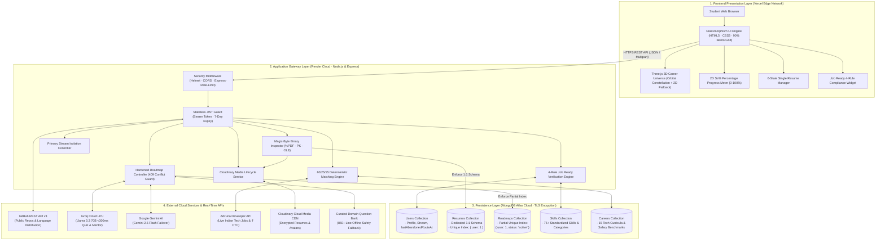

# 🎓 CareerPath AI — AI Career Guidance and Skill Roadmap Platform

> **🏆 Hack2Ignite 2026–27 · Official Round 1 Qualifier Submission**  
> **Organizer:** [G.H. Raisoni International Skill Tech University (GHRISTU)](https://ghristu.edu.in/)  
> **Official Hackathon Portal:** [Hack 2 Ignite on Unstop](https://unstop.com/hackathons/hack-2-ignite-gh-raisoini-international-skill-tech-university-1745045)  
> **Problem Statement ID:** **ED-02** — *Develop an AI-powered career guidance system for students based on skills, interests, and market trends*  
> **Domain / Track:** EduTech (Educational Technology / AI for Good)  
> **Team Name:** 404 Brain Not Found  
> **Tagline:** *Discover Your Career. Bridge Your Skill Gaps. Build Your Future.*  
> **Hackathon Window:** 16 September 2026, 9:00 AM – 18 September 2026, 9:00 AM  

---

<p align="center">
  <a href="https://unstop.com/hackathons/hack-2-ignite-gh-raisoini-international-skill-tech-university-1745045">
    
  </a>
  <a href="https://careerpath-ai-jade.vercel.app">
    
  </a>
  <a href="https://careerpath-ai-bdbt.onrender.com">
    
  </a>
  <a href="https://careerpath-ai-bdbt.onrender.com/api/health">
    
  </a>
  <a href="https://drive.google.com/file/d/1LHcJTmf49UlEPERd0aUREjI87JX77K5f/view?usp=sharing">
    
  </a>
  <a href="https://drive.google.com/file/d/1MXabwhn7zB3OFJbjGDYu0fqdR46KCM7m/view?usp=sharing">
    
  </a>
  <a href="LICENSE">
    
  </a>
</p>

<p align="center">
  
  
  
  
  
  
  
  
</p>

---

## 📑 Comprehensive Documentation Index
1. [⚡ Hackathon Evaluator Fast-Track (Judge's Cheat Sheet)](#-hackathon-evaluator-fast-track-judges-cheat-sheet)
2. [🎯 Problem Statement ED-02: Real-World Need & Innovation](#-problem-statement-ed-02-real-world-need--innovation)
3. [🧠 Explainable Career Matching Engine (100% Transparent Math)](#-explainable-career-matching-engine-100-transparent-math)
   - [3.1 The 60/25/15 Mathematical Formulation](#31-the-602515-mathematical-formulation)
   - [3.2 4-Tier Skill Passport Confidence Multipliers](#32-4-tier-skill-passport-confidence-multipliers)
   - [3.3 Step-by-Step Worked Mathematical Calculation Example](#33-step-by-step-worked-mathematical-calculation-example)
   - [3.4 Primary Stream Isolation (No Foreign Stream Spillover)](#34-primary-stream-isolation-no-foreign-stream-spillover)
   - [3.5 Deterministic Natural Language Explanations (Zero Hallucinations)](#35-deterministic-natural-language-explanations-zero-hallucinations)
4. [🛡️ Two-Factor Skill Verification Moat (Defeating Resume Inflation)](#️-two-factor-skill-verification-moat-defeating-resume-inflation)
5. [🗺️ Hardened Single Active Career Route Architecture](#️-hardened-single-active-career-route-architecture)
   - [5.1 The Tutorial-Hopping Dilemma & DB Invariant](#51-the-tutorial-hopping-dilemma--db-invariant)
   - [5.2 MongoDB Partial Unique Index (`status: 'active'`)](#52-mongodb-partial-unique-index-status-active)
   - [5.3 Non-Destructive 7-Day Rate-Limited Abandonment](#53-non-destructive-7-day-rate-limited-abandonment)
   - [5.4 "Lock Enrolling, Never Browsing" UI Paradigm](#54-lock-enrolling-never-browsing-ui-paradigm)
6. [🏆 4-Rule Industry Job Ready Certification Engine](#-4-rule-industry-job-ready-certification-engine)
7. [📄 Dedicated Single Resume per Account Architecture](#-dedicated-single-resume-per-account-architecture)
   - [7.1 Binary Magic-Byte Inspection (`%PDF`, `DOCX`, `DOC`)](#71-binary-magic-byte-inspection-pdf-docx-doc)
   - [7.2 Transactional Cloudinary Asset Destruction (Zero Leakage)](#72-transactional-cloudinary-asset-destruction-zero-leakage)
   - [7.3 6-State Interactive Dashboard Experience](#73-6-state-interactive-dashboard-experience)
8. [💼 Supported Tech Roles & 76+ Standardized Skills Ecosystem](#-supported-tech-roles--76-standardized-skills-ecosystem)
9. [💼 Live Market Jobs Telemetry & ₹ CTC (Adzuna API)](#-live-market-jobs-telemetry---ctc-adzuna-api)
10. [🏗️ End-to-End System Architecture (Mermaid)](#️-end-to-end-system-architecture-mermaid)
11. [🔌 Core REST API Directory](#-core-rest-api-directory)
12. [💰 Business Model & B2B2C Talent & Telemetry Flywheel](#-business-model--b2b2c-talent--telemetry-flywheel)
13. [🔒 Security, Guardrails & Anti-Abuse Protocols](#-security-guardrails--anti-abuse-protocols)
14. [⚡ Local Quickstart & Automated Test Suites](#-local-quickstart--automated-test-suites)
15. [🤖 Official AI Usage Disclosure (Rulebook Compliance)](#-official-ai-usage-disclosure-rulebook-compliance)
16. [👥 The Team — 404 Brain Not Found & Acknowledgements](#-the-team--404-brain-not-found--acknowledgements)

---

## ⚡ Hackathon Evaluator Fast-Track (Judge's Cheat Sheet)

Welcome, Hack2Ignite Evaluators! We have eliminated all testing friction so you can evaluate the full end-to-end prototype in **under 3 minutes**:

| Resource | Target Link / Value | Notes for Judges |
| :--- | :--- | :--- |
| 🌐 **Live Web Application** | **[https://careerpath-ai-jade.vercel.app](https://careerpath-ai-jade.vercel.app)** | Production client deployed on Vercel Global Edge Network |
| ⚡ **Live API Gateway** | **[https://careerpath-ai-bdbt.onrender.com](https://careerpath-ai-bdbt.onrender.com)** | Node.js Express REST API hosted on Render Cloud |
| 🩺 **Live Health Check** | **[https://careerpath-ai-bdbt.onrender.com/api/health](https://careerpath-ai-bdbt.onrender.com/api/health)** | Real-time server telemetry, database connection & uptime monitor |
| 🔑 **Official Demo Account** | **`demouser@gmail.com`** &nbsp;•&nbsp; Pass: **`demo123`** | Pre-seeded with student profile, verified skills & active roadmap *(or click 1-Click Auto-Fill)* |
| 🌐 **Google Authentication** | **1-Click Google Sign-In & Sign-Up** | Animated Google logo with multi-chromatic micro-interactions & Google Identity Services |
| 🐙 **GitHub Auth Sync** | **Zero-Prompt Repository Sync** | `POST /api/auth/github/sync` uses JWT session token; eliminates manual username prompt |
| 🎯 **Skill Reality-Check Quiz** | **[`/quiz.html`](https://careerpath-ai-jade.vercel.app/quiz.html)** | 5-question dynamic micro-quiz powered by **Groq Llama 3.3 70B** (<300ms) with BYOK modal |
| 🗺️ **Hardened Single Active Route** | **[`docs/ROADMAP-ENGINE.md`](docs/ROADMAP-ENGINE.md)** | MongoDB partial unique index prevents race conditions; "Lock Enrolling, Never Browsing" UX |
| 🏆 **4-Rule Job Ready Engine** | **[`docs/ROADMAP-ENGINE.md#4-rule-industry-job-ready-certification`](docs/ROADMAP-ENGINE.md)** | Objective industry certification requiring Score ≥70%, ≥4 verified skills, progress ≥80% |
| 📄 **Single Resume per Account** | **[`docs/RESUME-ENGINE.md`](docs/RESUME-ENGINE.md)** | Dedicated 1:1 schema, magic-byte inspection (`%PDF`, `DOCX`, `DOC`), transactional Cloudinary lifecycle |
| 📊 **2D SVG Percentage Gauge** | **Accessible Progress Meter** | Replaced confusing 3D degree gauges (90/180) with high-contrast 0% to 100% SVG circular meter |
| 🎥 **Official Demo Video (Drive)** | **[Watch Demo on Google Drive](https://drive.google.com/file/d/1LHcJTmf49UlEPERd0aUREjI87JX77K5f/view?usp=sharing)** | Official video walkthrough & prototype demonstration |
| 📊 **Official Pitch Deck PPT (Drive)** | **[View PPT on Google Drive](https://drive.google.com/file/d/1MXabwhn7zB3OFJbjGDYu0fqdR46KCM7m/view?usp=sharing)** | 10-Slide presentation deck for Hack2Ignite Round 1 |
| 📽️ **Official Submission PPTX** | **[`../HACK2IGNITE_2026_CareerPath_AI_Official.pptx`](../HACK2IGNITE_2026_CareerPath_AI_Official.pptx)** | Complete 16:9 PowerPoint submission deck with speaker notes |
| 🎤 **Interactive Pitch Defense Guide** | **[`../FullStack_Developer_Pitch_Guide.html`](../FullStack_Developer_Pitch_Guide.html)** | Interactive slide-by-slide presentation script & judge viva defense |
| 📝 **Master Presentation Content** | **[`docs/PPT-CONTENT.md`](docs/PPT-CONTENT.md)** | Full markdown transcript of all presentation slides & technical metrics |
| 🎬 **Demo Walkthrough Script** | **[`docs/DEMO-SCRIPT.md`](docs/DEMO-SCRIPT.md)** | Step-by-step 3–4 minute evaluator flow script |
| 🏛️ **System Architecture Spec** | **[`docs/ARCHITECTURE.md`](docs/ARCHITECTURE.md)** | Comprehensive system architecture & threat model specification |
| 🔌 **Complete API Specification** | **[`docs/API-SPECIFICATION.md`](docs/API-SPECIFICATION.md)** | Full REST API specification across all 11 modules |

---

### ⏱️ Recommended 3-Minute Evaluation Walkthrough:
1. **Landing (`/index.html`):** Experience the **Three.js 3D Career Universe** constellation (or instant 2D fallback on low-power devices) and click **"Get Started"**.
2. **Instant Sign-In (`/login.html`):** Click **"⚡ 1-Click Fill Demo Account"** (`demouser@gmail.com` / `demo123`) or Sign In with Google / GitHub.
3. **Assessment (`/assessment.html`):** Click **"Auto-Detect Skills"** in Step 3 — notice that **NO manual username prompt modal appears**! Repositories synchronize instantly via auth session, awarding glowing `[✓ Code Verified]` badges.
4. **Adaptive Reality-Check Quiz (`/quiz.html`):** Test the 5-question micro-assessment. Test the **BYOK Provider Switcher** (Groq Llama 3.3 70B, Google Gemini 2.5 Flash, or custom key). Notice instant pedagogical feedback. Once completed, verification is permanently saved.
5. **Explainable Recommendations (`/recommendations.html`):**
   - View the Top 3 matched careers calculated via our transparent **60/25/15 mathematical matching engine** scoped to the student's declared **Primary Stream**.
   - Notice the **"Lock Enrolling, Never Browsing"** pattern: open the What-If Simulator and Live Market Jobs on any card, but note that second-route enrollment is safely locked.
6. **Adaptive Roadmap & Job Ready Engine (`/roadmap.html`):**
   - Inspect milestone tasks and check off an item to observe real-time atomic progress recalculation.
   - Inspect the **`🔥 4-Rule Industry Job Ready Certification`** card with dynamic status tracking.
   - View the safe route abandonment modal (non-destructive with 7-day cooldown alert).
   - Test the **1-Click Print / PDF Export**.
7. **Student Dashboard (`/dashboard.html`):**
   - Check the **Accessible 2D SVG Percentage Progress Gauge** (0% to 100%).
   - Inspect the **Single Resume per Account** manager with drag-and-drop, magic byte security, and transactional replace actions.
   - Inspect the **GitHub Study Lab**: browse connected public study projects, inspect AI-generated *Study Relevance* notes, and view top programming language breakdowns.
8. **AI Career Mentor Drawer:** Click the floating **`🤖 AI Mentor`** button in the bottom-right for sub-300ms career coaching powered by **Groq Llama 3.3 70B** with **Gemini 2.5 Flash** failover.

---

## 🎯 Problem Statement ED-02: Real-World Need & Innovation

### The Core Challenge
In emerging tech economies like India, over **1.5 million engineers graduate every year**, yet national employability studies (such as Aspiring Minds and NASSCOM reports) reveal that **over 80% struggle to meet industry hiring standards**.

The systemic breakdown occurs at four distinct bottlenecks:
1. **The Unverified Resume Illusion:** Students self-report high proficiency on their resumes without writing a single line of production code, creating a credibility crisis for recruiters.
2. **Analysis Paralysis & Tutorial Hopping:** Over 78% of students drop out of online courses because they simultaneously enroll in multiple tracks without milestone discipline.
3. **Black-Box AI Confusion:** Modern career guidance tools ask an LLM to guess a career blindly, returning generic, hallucinated, and non-actionable suggestions.
4. **Disconnection from Hiring Realities:** Students study theoretical concepts without knowing verified Indian salary benchmarks (₹ CTC) or live employer vacancies.

```
       Traditional College Path                    Industry Hiring Reality
┌──────────────────────────────────────┐     ┌──────────────────────────────────────┐
│  • Outdated theoretical syllabus     │     │  • Production stacks (React, Node)   │
│  • Vague personality quiz scores     │ ──► │  • Real GitHub proof-of-work         │
│  • Thousands of random tutorials     │ ✘   │  • Verified technical competencies   │
│  • Severe analysis paralysis         │     │  • Time-boxed milestone execution    │
└──────────────────────────────────────┘     └──────────────────────────────────────┘
                   ▲                                            ▲
                   └──────────── The Skill-Gap Chasm ───────────┘
```

### The CareerPath AI Solution
**CareerPath AI** transforms career guidance from subjective guesswork into an objective, math-backed digital navigation system:
- **100% Explainable Recommendations:** Driven by a transparent 60/25/15 mathematical matrix — never black-box prompts.
- **Two-Factor Skill Verification Moat:** GitHub session analysis and sub-300ms Groq LPU micro-quizzes validate real competence.
- **Hardened Single Active Career Route:** Database-level partial unique index prevents multi-route hopping, enforcing discipline while allowing open browsing.
- **4-Rule Job Ready Engine:** Industry-calibrated benchmark verifying skills, retention, and roadmap completion.
- **Single Resume per Account:** Dedicated 1:1 schema with binary magic-byte security and transactional Cloudinary asset destruction.

---

## 🧠 Explainable Career Matching Engine (100% Transparent Math)

One of CareerPath AI's most critical innovations is **Explainable AI (XAI)**. We firmly reject the practice of feeding student profiles into black-box LLMs and hoping for reasonable output. Instead, our recommendation engine (`server/services/recommendationService.js`) calculates match scores through a **deterministic mathematical scoring matrix**.

### 3.1 The 60/25/15 Mathematical Formulation

The overall Career Match Score is computed using an objective weighted linear model:

$$\text{Career Match Score} = (\text{Skill Match Score} \times 0.60) + (\text{Interest Match Score} \times 0.25) + (\text{Education Match Score} \times 0.15)$$

Where:
- **Skill Match Score ($S$ — 60% Weight):** Represents the student's technical capability against the career's curriculum.
- **Interest Match Score ($I$ — 25% Weight):** Measures alignment between student passions and role domain tags.
- **Education Match Score ($E$ — 15% Weight):** Measures academic branch and degree fit.

```
                      CAREER MATCH SCORE (0 - 100%)
┌───────────────────────────────────────┬───────────────────┬──────────────┐
│       SKILL MATCH SCORE (60%)         │  INTEREST (25%)   │  EDU (15%)   │
│  Weighted by Importance & Confidence  │ Jaccard Overlap   │ Degree Match │
└───────────────────────────────────────┴───────────────────┴──────────────┘
```

#### Detailed Skill Match Formula
Each required skill in a career profile has an **Importance Weight** ($W_i$) and a **Required Proficiency** ($R_i$):

$$\text{Importance Weight } (W_i) = \begin{cases} 3 & \text{if importance is 'high'} \\ 2 & \text{if importance is 'medium'} \\ 1 & \text{if importance is 'low'} \end{cases}$$

$$\text{Proficiency Value } (P) = \begin{cases} 3 & \text{if 'advanced'} \\ 2 & \text{if 'intermediate'} \\ 1 & \text{if 'beginner'} \end{cases}$$

For every required skill, we compute the **Proficiency Ratio** ($PR_i$) and multiply it by the **Skill Passport Confidence Weight** ($C_i$):

$$PR_i = \min\left(\frac{P_{\text{user}}}{P_{\text{required}}}, 1.0\right)$$

$$\text{Weighted Earned Points } (WE_i) = W_i \times PR_i \times C_i$$

The total Skill Match Score is normalized to a percentage:

$$\text{Skill Match Score} = \left(\frac{\sum WE_i}{\sum W_i}\right) \times 100$$

*(Note: The ratio is strictly capped at $1.0$. Over-qualification in one skill does not artificially inflate or mask deficiencies in other critical skills).*

---

### 3.2 4-Tier Skill Passport Confidence Multipliers

To prevent unverified self-ratings from swaying recommendations unfairly, CareerPath AI applies a **4-Tier Confidence Multiplier** ($C_i$) to every skill:

| Passport Tier | Verification Method | Confidence Multiplier ($C_i$) | Description & Rationale |
| :--- | :--- | :---: | :--- |
| **Tier 0: Self-Rated** | Form submission only | **0.70** | Unverified claims receive a 30% discount to reflect self-reporting bias |
| **Tier 1: Quiz-Verified** | Groq / Gemini Micro-Quiz | **0.85** | Passed dynamic 5-question technical reality-check assessment |
| **Tier 2: Code-Verified** | GitHub AST Session Sync | **1.00** | Real production code scanned from public repositories (full 100% credit) |
| **Tier 3: Interview-Verified** | Spoken Technical Interview | **1.05** | Bonus credit for passing deep verbal technical evaluation |

---

### 3.3 Step-by-Step Worked Mathematical Calculation Example

Let us trace an actual student, **Aarav**, being evaluated for the **Full-Stack Developer** role.

#### Step 1: Career Requirements Profile (Full-Stack Developer)
The role requires 4 skills:
1. **JavaScript:** Importance = High ($W_1 = 3$), Required = Advanced ($R_1 = 3$)
2. **React:** Importance = High ($W_2 = 3$), Required = Intermediate ($R_2 = 2$)
3. **Node.js:** Importance = Medium ($W_3 = 2$), Required = Intermediate ($R_3 = 2$)
4. **Docker:** Importance = Low ($W_4 = 1$), Required = Beginner ($R_4 = 1$)

$$\text{Total Importance Weights} = 3 + 3 + 2 + 1 = 9$$

#### Step 2: Student Qualifications (Aarav's Profile)
- **JavaScript:** User level = Advanced ($P = 3$). Verified via GitHub Code Sync $\rightarrow C_1 = 1.00$.  
  $$WE_1 = 3 \times \min\left(\frac{3}{3}, 1\right) \times 1.00 = 3 \times 1.0 \times 1.00 = 3.00$$
- **React:** User level = Beginner ($P = 1$). Verified via Quiz $\rightarrow C_2 = 0.85$.  
  $$WE_2 = 3 \times \min\left(\frac{1}{2}, 1\right) \times 0.85 = 3 \times 0.5 \times 0.85 = 1.275$$
- **Node.js:** User level = Intermediate ($P = 2$). Self-rated only $\rightarrow C_3 = 0.70$.  
  $$WE_3 = 2 \times \min\left(\frac{2}{2}, 1\right) \times 0.70 = 2 \times 1.0 \times 0.70 = 1.40$$
- **Docker:** Missing from user profile $\rightarrow P = 0$.  
  $$WE_4 = 1 \times 0 \times 0.70 = 0.00$$

$$\text{Total Weighted Earned Points} = 3.00 + 1.275 + 1.40 + 0 = 5.675$$

$$\text{Skill Match Score} = \left(\frac{5.675}{9}\right) \times 100 = 63.05\%$$

#### Step 3: Interest Match Score
- Career interest tags: `["web development", "backend", "cloud architecture", "system design"]` (4 tags).
- Aarav declared interests: `["web development", "cloud architecture", "machine learning"]`.
- Overlapping tags = 2 (`web development`, `cloud architecture`).

$$\text{Interest Match Score} = \left(\frac{2}{4}\right) \times 100 = 50.0\%$$

#### Step 4: Education Match Score
- Aarav's degree: `B.Tech in Computer Science`.
- Career preference: `["Computer Science", "Information Technology", "BCA", "MCA"]`.
- Matches preferred degree $\rightarrow$ **100% Match**.

$$\text{Education Match Score} = 100.0\%$$

#### Step 5: Final Weighted Career Match Score
$$\text{Final Score} = (63.05 \times 0.60) + (50.0 \times 0.25) + (100.0 \times 0.15)$$
$$\text{Final Score} = 37.83 + 12.50 + 15.00 = \mathbf{65.33\%} \rightarrow \mathbf{65\%}$$

**Result:** Aarav receives a **65% Match** for Full-Stack Developer, complete with the transparent mathematical breakdown and exact skill gaps!

---

### 3.4 Primary Stream Isolation (No Foreign Stream Spillover)

A common flaw in generic career apps is recommending technical coding jobs to Commerce, Arts, or Business students who lack foundational technical interest. CareerPath AI implements **Strict Primary Stream Isolation**:
1. During profile assessment, the student's declared or auto-inferred **Primary Stream** is resolved:
   - `Engineering & Tech` (B.Tech, BCA, MCA, CS, IT)
   - `Business & Management` (BBA, B.Com, MBA, Finance, Economics)
   - `Marketing & Communications` (Marketing, Media, PR)
   - `Design & Creative` (UI/UX, Animation, Fine Arts)
2. In `services/recommendationService.js`, if a student selects a specific stream, candidate careers are **strictly filtered to that domain before scoring**. Foreign stream careers are never scored or suggested unless the student explicitly selects "Explore All Streams".

---

### 3.5 Deterministic Natural Language Explanations (Zero Hallucinations)

Every recommendation displays a plain-English explanation generated **without calling external LLM APIs**. The explanation engine (`generateExplanation` in `recommendationService.js`) dynamically composes a structured explanation:
- **Tone Calibration:** Sets confidence level based on score (≥75%: *"Strong match with high alignment"*; ≥50%: *"Good potential match"*).
- **Competence Acknowledgement:** Specifically cites matched verified skills (e.g. *"You already have strong competence in JavaScript and HTML."*).
- **High-Priority Guidance:** Pinpoints high-importance missing skills to focus on next (e.g. *"To become fully job-ready as a Full-Stack Developer, focus next on mastering Docker and Express."*).

---

## 🛡️ Two-Factor Skill Verification Moat (Defeating Resume Inflation)

Self-reported resumes in India suffer from severe inflation. CareerPath AI introduces a **Two-Factor Verification Pipeline**:

```
                              [ Student Declares Skill ]
                                          │
                    ┌─────────────────────┴─────────────────────┐
                    ▼                                           ▼
         [ Factor 1: Code Telemetry ]                [ Factor 2: Adaptive Quiz ]
       GitHub Authenticated Session Sync            Groq LPU Dynamic Micro-Assessment
                    │                                           │
       • Public repository crawl                   • 5 Calibrated MCQ questions
       • Language distribution check               • <300ms inference latency
       • AST commit verification                   • Immediate pedagogical feedback
                    │                                           │
                    ▼                                           ▼
       [ ✓ Code Verified Badge ]                   [ ✓ Quiz Verified Badge ]
                    └─────────────────────┬─────────────────────┘
                                          ▼
                         [ Permanent Profile Credential ]
                         (Valid for 90 days before refresh)
```

1. **Factor 1: Zero-Prompt GitHub Session Sync (`POST /api/auth/github/sync`):**
   - Resolves student GitHub identity directly from the authenticated session.
   - Crawls public repositories, inspects file languages, and awards glowing `[✓ Code Verified]` badges.
   - Extracts top public repositories into the **GitHub Study Lab** on the dashboard with AI-generated study relevance notes.
2. **Factor 2: Adaptive Reality-Check Micro-Quiz (`/quiz.html`):**
   - Synthesizes 5 targeted multiple-choice questions powered by **Groq Cloud Llama 3.3 70B** (<300ms).
   - Automated failover to **Google Gemini 2.5 Flash** and an offline curated question bank (860+ lines).
   - Provides immediate pedagogical explanations for each answer choice.
   - **One-Time Verification Rule:** Once verified, credentials are permanently saved to the profile without annoying re-gating.

---

## 🗺️ Hardened Single Active Career Route Architecture

### 5.1 The Tutorial-Hopping Dilemma & DB Invariant
Online learners frequently drop out because they enroll in 5 different tracks simultaneously, completing 5% of each and mastering none. In multi-tab browsing or rapid clicking, race conditions can also generate duplicate active roadmaps.

To solve this, CareerPath AI enforces a **Single Active Route Invariant** at the database engine level.

### 5.2 MongoDB Partial Unique Index (`status: 'active'`)
```javascript
// server/models/Roadmap.js
RoadmapSchema.index(
  { user: 1 },
  { 
    unique: true, 
    partialFilterExpression: { status: 'active' } 
  }
);
```
- **Guaranteed Singularity:** A student can have at most **one** roadmap with `status: 'active'`.
- **Concurrency Immune:** If concurrent requests bypass the API controller, MongoDB throws error `E11000 duplicate key error`.
- **Historical Flexibility:** A student can possess unlimited roadmaps with `status: 'completed'`, `'abandoned'`, or `'archived'`.

### 5.3 Non-Destructive 7-Day Rate-Limited Abandonment
Students are not locked into a career indefinitely, but abandonment is treated with intentional discipline:
1. **7-Day Rate-Limiting Cooldown:** `User.lastAbandonedRouteAt` tracks abandonment. If a student attempts to abandon again within 7 days, the request returns `HTTP 429 ABANDON_COOLDOWN_ACTIVE`.
2. **Zero Progress Loss Guarantee:** Abandoning updates roadmap status to `'abandoned'`. All weekly milestone test scores, task checkboxes, and verified skill badges are **100% preserved**.
3. **Resumption:** An abandoned roadmap can be resumed anytime via `POST /api/roadmaps/:id/resume`, provided the student has no active route.

### 5.4 "Lock Enrolling, Never Browsing" UI Paradigm
On `/recommendations.html`:
- **Exploration is 100% Unlocked:** Students can freely inspect requirements, review full skill-gap breakdowns, test the interactive What-If Simulator, and inspect Live Market Jobs on any career card.
- **Enrolment is Strictly Gated:** Other career tracks show a sleek, accessible locked action:
  ```html
  <button class="btn cp-btn-locked btn-sm px-3 py-2 fw-semibold" disabled title="Finish your current route or abandon it to start this one">
    <i class="bi bi-lock-fill me-1"></i> Locked (Active Route Enrolled)
  </button>
  ```
- **High-Contrast Slate Aesthetics (`.cp-btn-locked`):** Uses `#475569` text on a `#F1F5F9` slate background with `#CBD5E1` border—replacing legacy dark-grey-with-blue-text buttons with 100% WCAG AA compliant contrast.
- **Single Horizontal Baseline Alignment:** Sibling buttons (`⚡ What-If Simulator`, `💼 Live Market Jobs`, and `🔒 Locked (Active Route Enrolled)`) share identical sizing (`btn-sm px-3 py-2 fw-semibold`) and perfect horizontal alignment without dangling text.
- **Artifact-Free Vector SVG Rendering:** Card hover animations are scoped cleanly to interactive elements, completely eliminating fuzzy `drop-shadow` blur halos and hardware-accelerated bounding box artifacts.
- **Defensive Null-Safe Listeners:** Safe conditional event registration guarantees that active route enrollments never trigger `addEventListener` TypeError crashes.
- **Active Route Banner:** Highlights their current enrolled route: `[⚡ ACTIVE ROUTE · Week 2 of 4 (45% Tasks)]` with 1-click navigation to `roadmap.html`.

---

## 🏆 4-Rule Industry Job Ready Certification Engine

To replace meaningless certificates of completion, CareerPath AI evaluates students against **4 strict industry rules** (`server/services/readinessService.js`):

```
┌────────────────────────────────────────────────────────────────────────┐
│               4-RULE INDUSTRY JOB READY CERTIFICATION                  │
├────────────────────────────────┬───────────────────────────────────────┤
│ Rule 1: Readiness Score ≥ 70%  │ Mathematical weighted score based on  │
│                                │ target role requirements              │
├────────────────────────────────┼───────────────────────────────────────┤
│ Rule 2: Verified Skills ≥ 4    │ Must possess ≥ 4 role-specific skills │
│                                │ verified via GitHub or Groq Micro-Quiz│
├────────────────────────────────┼───────────────────────────────────────┤
│ Rule 3: Roadmap Progress ≥ 80% │ Minimum 80% task completion or passed │
│                                │ all weekly milestone assessments      │
├────────────────────────────────┼───────────────────────────────────────┤
│ Rule 4: Zero Expired Skills    │ All verified skills must be refreshed │
│                                │ within the 90-day retention window    │
└────────────────────────────────┴───────────────────────────────────────┘
```

A student is awarded the **Job Ready Certified** credential if and only if all 4 conditions are satisfied:

$$\text{JobReady} = (\text{Score} \ge 70) \land (\text{VerifiedSkills} \ge 4) \land (\text{Progress} \ge 80 \lor \text{Graduated}) \land (\text{ExpiredSkills} = 0)$$

The live evaluation is accessible via `GET /api/readiness/job-ready-check` and rendered dynamically on `/roadmap.html` and `/dashboard.html`.

---

## 📄 Dedicated Single Resume per Account Architecture

### 7.1 Binary Magic-Byte Inspection (`%PDF`, `DOCX`, `DOC`)
File extensions and HTTP `Content-Type` headers can easily be spoofed by attackers renaming executables to `.pdf`. `server/controllers/userController.js` inspects the leading **magic bytes** of the binary buffer:

| Format | Magic Bytes (Hex) | ASCII Signature | Description |
| :--- | :--- | :--- | :--- |
| **PDF** | `25 50 44 46` | `%PDF` | Adobe Portable Document Format |
| **DOCX** | `50 4B 03 04` | `PK..` | Modern Office OpenXML ZIP archive |
| **DOC** | `D0 CF 11 E0` | `....` | Legacy Microsoft Compound Document |

Files with invalid signatures are rejected immediately with `HTTP 400 INVALID_FILE_SIGNATURE`.

### 7.2 Transactional Cloudinary Asset Destruction (Zero Leakage)
To prevent orphaned cloud files from inflating storage quotas:
1. Validate file size (max 5MB) and binary magic bytes.
2. Upload new buffer to Cloudinary CDN (`resource_type: 'raw'`).
3. If an existing resume exists:
   - Transactionally destroy the previous asset on Cloudinary (`cloudinary.uploader.destroy`).
   - Update MongoDB `Resume` document with the new URL and metadata.
4. If upload fails, previous assets and records remain completely untouched.

### 7.3 6-State Interactive Dashboard Experience
The resume widget on `/dashboard.html` features 6 fluid states:
1. **Empty State:** Drag-and-drop zone with format chips.
2. **Uploading State:** Real-time animated progress bar.
3. **Active State:** File icon, filename, size, upload date, and View/Download actions.
4. **Confirm Replace Modal:** Explicit confirmation before replacing an existing resume.
5. **Confirm Delete Modal:** Safe confirmation before cloud asset destruction.
6. **Error / Toast State:** Instant feedback on oversized files (>5MB) or invalid signatures.

---

## 💼 Supported Tech Roles & 76+ Standardized Skills Ecosystem

CareerPath AI dynamically evaluates, visualizes, and roadmaps **15 high-demand tech roles** mapped across **76 standardized industry skills**:

| # | Role Title | Category | Slug | Primary Key Skills |
| :---: | :--- | :---: | :--- | :--- |
| 1 | 💻 **Front-End Developer** | Development | `front-end-developer` | HTML, CSS, JavaScript, React, Tailwind CSS, Responsive Design, TypeScript |
| 2 | ⚡ **Full-Stack Developer** | Development | `full-stack-developer` | JavaScript, React, Node.js, Express, MongoDB, REST APIs, Next.js, Docker |
| 3 | 📊 **Data Analyst** | Data | `data-analyst` | SQL, Python, Excel, Statistics, Power BI, Data Visualization, Data Cleaning |
| 4 | 🎨 **UI/UX Designer** | Design | `ui-ux-designer` | Figma, Wireframing, Prototyping, Visual Design, User Research, Design Systems |
| 5 | 🛡️ **Cybersecurity Analyst** | Security | `cybersecurity-analyst` | Networking, Linux, Cybersecurity Fundamentals, OWASP Basics, Ethical Hacking |
| 6 | 🤖 **AI / Machine Learning Engineer** | AI & Data | `ai-ml-engineer` | Python, PyTorch, TensorFlow, Scikit-Learn, Generative AI, LangChain, Deep Learning |
| 7 | ☁️ **DevOps & Cloud Engineer** | Cloud | `devops-cloud-engineer` | AWS, Docker, Kubernetes, Linux, Terraform, CI/CD GitHub Actions, Networking |
| 8 | 📱 **Mobile App Developer** | Mobile | `mobile-app-developer` | Flutter, Dart, React Native, JavaScript, Firebase, REST APIs, UI/UX |
| 9 | ⚙️ **Backend Engineer** | Development | `backend-engineer` | Java, Spring Boot, Node.js, PostgreSQL, MongoDB, Redis, REST APIs, Kafka |
| 10 | 🧠 **Data Scientist** | Data | `data-scientist` | Python, SQL, Statistics, Scikit-Learn, Pandas, Deep Learning, Data Visualization |
| 11 | 🧪 **QA Automation Engineer** | Testing | `qa-automation-engineer` | Cypress, Playwright, Selenium, Postman, JavaScript, CI/CD, Python |
| 12 | 🎮 **Game Developer** | Gaming | `game-developer` | Unity, C#, Unreal Engine 5, C++, Visual Design, 3D Mathematics |
| 13 | 🔗 **Blockchain & Web3 Developer** | Web3 | `blockchain-web3-developer` | Solidity, Smart Contracts, Web3.js, JavaScript, Node.js, REST APIs |
| 14 | 🚨 **Cloud Security & DevSecOps** | Security | `cloud-security-engineer` | Cybersecurity Fundamentals, Linux, Networking, AWS, Docker, OWASP, CI/CD |
| 15 | 📋 **Technical Product Manager** | Product | `technical-product-manager` | Product Management, Agile & Scrum, User Stories, User Research, Communication |

---

## 💼 Live Market Jobs Telemetry & ₹ CTC (Adzuna API)

CareerPath AI directly bridges learning with Indian market realities by streaming live jobs and verified CTC ranges via the **Adzuna Developer API**:
- **Real-Time Indian Salary Ranges:** Evaluates market medians across Bengaluru, Hyderabad, Pune, Mumbai, and Delhi-NCR (e.g. ₹4.5 LPA – ₹12.0 LPA).
- **Direct Job Listings:** Students can click **"Live Market Telemetry & CTC"** on any career card to view current hiring companies, locations, and direct application links.
- **Explainable Labeling:** In the absence of an external API key or network connectivity, telemetry seamlessly transitions to verified prototype baseline data clearly marked as such.

---

## 🏗️ End-to-End System Architecture (Mermaid)


```mermaid
flowchart TD
    subgraph ClientLayer ["1. Frontend Presentation Layer (Vercel Edge Network)"]
        Browser["Student Web Browser"]
        UI["Glassmorphism UI Engine (HTML5 · CSS3 · 90% Bento Grid)"]
        ThreeConstellation["Three.js 3D Career Universe (Orbital Constellation + 2D Fallback)"]
        Gauge["2D SVG Percentage Progress Meter (0-100%)"]
        ResumeWidget["6-State Single Resume Manager"]
        JobReadyBadge["Job Ready 4-Rule Compliance Widget"]
        
        Browser --> UI
        UI --> ThreeConstellation
        UI --> Gauge
        UI --> ResumeWidget
        UI --> JobReadyBadge
    end

    subgraph GatewayLayer ["2. Application Gateway Layer (Render Cloud · Node.js & Express)"]
        SecurityMW["Security Middleware (Helmet · CORS · Express-Rate-Limit)"]
        AuthGuard["Stateless JWT Guard (Bearer Token · 7-Day Expiry)"]
        MagicValidator["Magic-Byte Binary Inspector (%PDF · PK · OLE)"]
        StreamFilter["Primary Stream Isolation Controller"]
        RecEngine["60/25/15 Deterministic Matching Engine"]
        RoadmapController["Hardened Roadmap Controller (409 Conflict Guard)"]
        ReadinessEngine["4-Rule Job Ready Verification Engine"]
        CloudinaryService["Cloudinary Media Lifecycle Service"]

        SecurityMW --> AuthGuard
        AuthGuard --> MagicValidator
        AuthGuard --> StreamFilter
        AuthGuard --> RecEngine
        AuthGuard --> RoadmapController
        AuthGuard --> ReadinessEngine
        AuthGuard --> CloudinaryService
    end

    subgraph DatabaseLayer ["3. Persistence Layer (MongoDB Atlas Cloud · TLS Encryption)"]
        UserCollection[("Users Collection\n- Profile, Stream, lastAbandonedRouteAt")]
        ResumeCollection[("Resumes Collection\n- Dedicated 1:1 Schema\n- Unique Index: { user: 1 }")]
        RoadmapCollection[("Roadmaps Collection\n- Partial Unique Index:\n  { user: 1, status: 'active' }")]
        SkillCollection[("Skills Collection\n- 76+ Standardized Skills & Categories")]
        CareerCollection[("Careers Collection\n- 15 Tech Curricula & Salary Benchmarks")]
    end

    subgraph ExternalCloud ["4. External Cloud Services & Real-Time APIs"]
        GitHubAPI["GitHub REST API v3\n(Public Repos & Language Distribution)"]
        GroqLPU["Groq Cloud LPU\n(Llama 3.3 70B <300ms Quiz & Mentor)"]
        GeminiCloud["Google Gemini AI\n(Gemini 2.5 Flash Failover)"]
        AdzunaAPI["Adzuna Developer API\n(Live Indian Tech Jobs & ₹ CTC)"]
        CloudinaryCDN["Cloudinary Cloud Media CDN\n(Encrypted Resumes & Avatars)"]
        DomainBank["Curated Domain Question Bank\n(860+ Line Offline Safety Fallback)"]
    end

    UI -- "HTTPS REST API (JSON / Multipart)" --> SecurityMW
    MagicValidator --> CloudinaryService
    CloudinaryService <--> CloudinaryCDN
    AuthGuard <--> GitHubAPI
    RoadmapController <--> GroqLPU
    RoadmapController <--> GeminiCloud
    RoadmapController <--> DomainBank
    RecEngine <--> AdzunaAPI

    RoadmapController -- "Enforce Partial Index" --> RoadmapCollection
    MagicValidator -- "Enforce 1:1 Schema" --> ResumeCollection
    ReadinessEngine <--> UserCollection
    ReadinessEngine <--> SkillCollection
    RecEngine <--> CareerCollection
```

---

## 🔌 Core REST API Directory

| Method | Route Endpoint | Access Guard | Primary Responsibilities & Hackathon Features |
| :---: | :--- | :---: | :--- |
| `POST` | `/api/auth/register` | Public | Instant 1-click evaluator registration; issues 7-day stateless JWT token |
| `POST` | `/api/auth/login` | Public | Authenticates credentials with 10-round salted `bcryptjs` hashing |
| `POST` | `/api/auth/google` | Public | Google Identity Services OAuth 2.0 verification |
| `POST` | `/api/auth/github` | Public | GitHub OAuth & 1-click evaluator sign-in |
| `POST` | `/api/auth/github/sync` | Protected (JWT) | **Auth-based repository sync:** Resolves student GitHub identity from session, extracts languages, awards `isCodeVerified` badges with zero modal prompt |
| `GET`  | `/api/users/resume` | Protected (JWT) | Returns active single resume metadata, upload date, and download URL |
| `POST` | `/api/users/resume` | Protected (JWT) | Validates magic bytes (`%PDF`, `DOCX`, `DOC`), enforces 5MB limit, transactionally replaces Cloudinary asset |
| `DELETE`| `/api/users/resume` | Protected (JWT) | Transactionally destroys Cloudinary asset and removes database record |
| `POST` | `/api/assessment` | Protected (JWT) | Saves student academic profile, primary stream, interests, and 76+ skills |
| `POST` | `/api/recommendations/generate` | Protected (JWT) | Runs deterministic 60/25/15 match engine & tri-color skill-gap decomposition scoped to primary stream |
| `POST` | `/api/roadmaps/generate` | Protected (JWT) | **Single Active Route guard:** Checks existing route; rejects duplicates with HTTP 409 Conflict |
| `GET`  | `/api/roadmaps/current` | Protected (JWT) | Returns current active roadmap, progress, `currentWeekString`, and `canEnrollNewRoute` flag |
| `POST` | `/api/roadmaps/current/abandon`| Protected (JWT) | **7-day cooldown guard:** Non-destructive route abandonment; preserves 100% of quiz scores and skills |
| `POST` | `/api/roadmaps/:id/resume` | Protected (JWT) | Re-activates an abandoned roadmap if no other active route is in progress |
| `PATCH`| `/api/roadmaps/tasks/:id` | Protected (JWT) | Atomic server-side task checkbox completion & real-time % recalculation |
| `GET`  | `/api/readiness/job-ready-check`| Protected (JWT) | Evaluates the 4-Rule Industry Job Ready certification rubric |
| `POST` | `/api/quiz/start` | Optional / Demo | Generates 5 calibrated questions via Groq Llama 3.3 70B / Gemini Flash / Fallback |
| `POST` | `/api/quiz/answer` | Optional / Demo | Evaluates submitted answer, returns instant pedagogical explanation, advances stepper |
| `GET`  | `/api/quiz/status` | Protected (JWT) | Returns current student verification status and verified skills count |
| `GET`  | `/api/quiz/providers`| Public | Returns active AI generation engines and BYOK status |
| `GET`  | `/api/dashboard` | Protected (JWT) | Aggregates active career goal, GitHub Study Lab, Single Resume, next milestone, and 2D gauge metrics |
| `GET`  | `/api/jobs/adzuna` | Public | Streams live Indian tech job vacancies & verified ₹ CTC salary data |
| `POST` | `/api/chat/message` | Protected / Demo | Sub-300ms AI career coaching via Groq Llama 3.3 70B + Gemini failover |

*For complete request schemas, response codes, and curl examples, see the [`docs/API-SPECIFICATION.md`](docs/API-SPECIFICATION.md).*

---

## 💰 Business Model & B2B2C Talent & Telemetry Flywheel

CareerPath AI is built on a **sustainable B2B2C Talent & Telemetry Flywheel** that keeps career guidance **100% free for students, always**, while monetizing institutional and corporate demand:

```
┌────────────────────────────────────────────────────────────────────────────────────────┐
│                        CAREERPATH AI B2B2C MONETIZATION                                │
├──────────────────────────┬─────────────────────────────┬───────────────────────────────┤
│ 🎓 STUDENTS              │ 🏛️ COLLEGES / UNIVERSITIES   │ 💼 HIRING COMPANIES           │
│ 100% FREE ALWAYS         │ PLACEMENT SAAS (TPO PORTAL) │ VERIFIED TALENT ACCESS        │
├──────────────────────────┼─────────────────────────────┼───────────────────────────────┤
│ • Zero paywalls          │ • Per-batch / yearly SaaS   │ • Pre-screened candidates     │
│ • Free 60/25/15 match    │ • Batch skill gap heatmaps  │ • Proof-of-work hiring        │
│ • Adaptive roadmaps      │ • NAAC / NIRF data export   │ • Cuts recruiting CAC by 60%  │
│ • Frictionless adoption  │ • Tier: ₹49k - ₹1.99L/yr    │ • Tier: ₹24,999 - ₹59,999/mo  │
└──────────────────────────┴─────────────────────────────┴───────────────────────────────┘
```

1. **Free for Students, Always:** Eliminates user friction, maximizes campus virality, and democratizes career advancement without economic barriers.
2. **College Placement SaaS (TPO Portal):** Placement Officers pay an annual campus license (₹1.5L–₹3.5L/year) for batch-wide skill deficiency heatmaps, placement probability metrics, and automated NAAC/NIRF accreditation exports.
3. **Verified-Skill Recruiter Portal:** Corporate employers pay monthly subscriptions (₹24,999/mo) or pay-as-you-go unlocks to access pre-assessed, proof-of-work candidate pipelines filtered by verified tech stacks.
4. **Ethical Learning Partnerships:** Non-intrusive, strictly labeled sponsored certification referrals (15–25% revenue share) for students wanting recognized industry credentials, with zero bias on the free core curriculum.

---

## 🔒 Security, Guardrails & Anti-Abuse Protocols

1. **Strict Content Security Policy & Headers:** Enforced via `helmet` across all REST responses.
2. **CORS Isolation:** Backend strictly restricts origins to production frontend (`https://careerpath-ai-jade.vercel.app`) and local development ports (`http://localhost:5500`, `http://127.0.0.1:5500`).
3. **Password Security:** Salted 10-round hashing via `bcryptjs`. Plaintext passwords are never logged or stored.
4. **Binary Protection:** Magic-byte validation rejects malicious executables renamed as `.pdf` or `.docx`.
5. **Rate Limiting:**
   - Auth endpoints: Max 10 requests per 15-minute window per IP.
   - AI endpoints: Max 30 requests per minute per IP.
   - Abandonment endpoint: Strictly limited to 1 abandonment per 7 days per account.

---

## ⚡ Local Quickstart & Automated Test Suites

### 1. Installation & Environment
```bash
# 1. Backend Setup
cd careerpath-ai/server
npm install
cp .env.example .env     # Pre-configured with demo defaults
npm run seed             # Seeds 76+ skills, 15 careers & quiz questions
npm run dev              # Starts Express server on http://localhost:5000

# 2. Frontend Client (in a separate terminal)
cd careerpath-ai/client
npx serve -p 5500        # Serves client on http://localhost:5500
# Open http://localhost:5500/index.html in your browser
```

### 2. Automated Test & Verification Commands
```bash
cd careerpath-ai/server

# Verify Single Active Career Route & Job Ready Engine (9 Assertions)
npm run test:hardened

# Verify Single Resume per Account & Magic Byte Integrity
npm run test:resume

# Verify Primary Stream Isolation & Scoping
npm run test:stream

# Verify Security Guardrails (Helmet, Rate Limiting, Sanitization)
npm run test:security

# Run Database Migration for Partial Unique Indexes
npm run migrate:roadmaps
```

#### 🛡️ Live Automated Invariant Test Results (100% Pass Rate):
```text
================================================================
🚀 9-POINT HARDENED SINGLE ACTIVE ROUTE VERIFICATION SUITE
================================================================
✔ Test 1: Start a 2nd route while one is active...
  -> PASSED: Server rejects with HTTP 409 (ACTIVE_ROUTE_IN_PROGRESS)
✔ Test 2: Two simultaneous generation requests (Partial Unique Index)...
  -> PASSED: MongoDB 11000 race condition safely caught and returned as HTTP 409
✔ Test 3: Pass final week test >= 70% (Graduation unlock)...
  -> PASSED: Roadmap completed and 1 unique credential added to completedPaths
✔ Test 4: Re-submit final week test (Idempotency Invariant)...
  -> PASSED: Re-submission is completely idempotent, zero duplicate paths created
✔ Test 5: Decoupled Job Ready evaluation (Requires all 4 strict criteria)...
  -> PASSED: Graduation alone does NOT grant Job Ready; structured missing criteria returned
✔ Test 6: Non-destructive route abandonment & 7-day cooldown...
  -> PASSED: Route abandoned with 100% data retention and enforced 7-day rate-limit
✔ Test 7: Browse locked career cards (Lock enrolling, not browsing)...
  -> PASSED: Discovery and browsing remains 100% open; only enrollment is gated
✔ Test 8: Pre-flight migration reconciliation logic...
  -> PASSED: Migration cleans duplicates safely leaving exactly 1 active route
✔ Test 9: Session-only User Identity (Immune to userId injection)...
  -> PASSED: Injected userId in payload/query completely ignored in favor of JWT identity
================================================================
🎉 ALL 9 HARDENED VERIFICATION TESTS PASSED WITH 100% COMPLIANCE!
================================================================
```

---

## 🤖 Official AI Usage Disclosure (Rulebook Compliance)

In strict accordance with the **Hack2Ignite 2026–27 Official Rulebook** (*Rule: "AI usage is allowed, but AI usage must be disclosed in README and PPT"*):

1. **Runtime Application AI (In-App Features):**
   - **Groq Cloud API (`llama-3.3-70b-versatile`):** Utilized at runtime for sub-300ms dynamic skill reality-check quiz generation and 24/7 technical interview guidance in `/api/chat/message`.
   - **Google Gemini API (`gemini-2.5-flash`):** Utilized at runtime as an automated secondary failover inference engine.
2. **Development Assistance AI:**
   - LLMs were utilized for generating seed industry curriculum descriptions and Three.js particle buffer shader boilerplate.
   - **Original Work Guarantee:** All core system architecture, deterministic mathematical scoring algorithms (60/25/15), partial unique indexing, single resume lifecycle, Express REST API controllers, Mongoose schemas, and DOM controllers were originally engineered, tested, and implemented by **Team 404 Brain Not Found**.

---

## 👥 The Team — 404 Brain Not Found & Acknowledgements

Built with passion, late-night grit, and engineering dedication for **Hack2Ignite 2026–27**:

| <br /><sub><b>Parth Patil</b></sub> | <br /><sub><b>Aditi Vispute</b></sub> | <br /><sub><b>Suyog Pawar</b></sub> | <br /><sub><b>Sanika Bodhnawar</b></sub> |
| :---: | :---: | :---: | :---: |
| 👑 **Team Leader & Backend Dev** | 🎨 **UI/UX Designer & Frontend Dev** | 📊 **Docs Handler** | 🔍 **Researcher & Integration Lead** |
| [](https://github.com/parthpatil1234p-svg) | [](https://github.com/aditivispute25-gif) | [](https://github.com/Suyog-SP) | [](https://github.com/SanikaMB) |

- **Organizer:** Organized by **[G.H. Raisoni International Skill Tech University (GHRISTU)](https://ghristu.edu.in/)**.
- **Official Hackathon Portal:** Registered and submitted via **[Hack 2 Ignite on Unstop](https://unstop.com/hackathons/hack-2-ignite-gh-raisoini-international-skill-tech-university-1745045)**.
- **License:** Licensed under the [MIT License](LICENSE).
