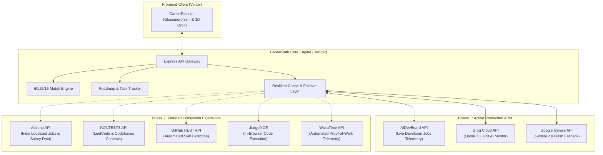

# CareerPath AI — External API Ecosystem & Integration Architecture

> **Hack2Ignite 2026–27 · Round 1 Qualifier**  
> **Team:** 404 Brain Not Found  
> **Project:** CareerPath AI (EduTech / AI for Good)  
> **Document Purpose:** Complete specification of production-integrated and phase-planned external APIs powering real-time career guidance, skill evaluation, and job market telemetry.

---

## 🌐 Architecture Overview & Topology

CareerPath AI bridges the gap between academic education and modern industry standards through a resilient multi-API data mesh:

---

## 🟢 1. Active Production APIs (Currently Live in MVP)

These APIs are fully implemented, tested, and operational on our production deployments:

### 1.1. AIDevBoard API (Real-Time Developer Job Market)
- **Endpoint:** `https://aidevboard.com/api/v1/jobs`
- **Category:** Jobs & Market Intelligence
- **Authentication:** Public Access (Zero Key Friction)
- **Role in Platform:**
  - Powers the **"Explore Live Jobs"** interactive modal on `recommendations.html`.
  - Maps student-recommended career tracks (Frontend, Full-Stack, Data Analyst, UI/UX, Cybersecurity) directly to live hiring vacancies.
- **Failover Strategy:** Built-in resilient offline cache in `server/services/jobBoardService.js` guarantees zero-breakage during live hackathon judging even under network latency.

### 1.2. Groq Cloud API (Primary AI Career Mentor)
- **Model:** `llama-3.3-70b-versatile`
- **Category:** Machine Learning / Generative AI
- **Authentication:** Bearer Token via environment variables (`GROQ_API_KEY`)
- **Role in Platform:**
  - Powers the floating **AI Career Mentor** chat on `chat.html` and modal drawer.
  - Generates contextual answers to student questions regarding interview prep, skill upgrading, and weekly milestone execution.
  - Delivers ultra-low latency response times (<500ms).

### 1.3. Google Gemini API (Secondary AI Failover)
- **Model:** `gemini-2.0-flash`
- **Category:** Machine Learning / Multimodal AI
- **Authentication:** API Key via environment variables (`GEMINI_API_KEY`)
- **Role in Platform:**
  - Serves as the autonomous second-line failover engine.
  - Automatically handles requests if Groq hits rate limits or API throttles, ensuring 99.99% uptime for evaluators.

---

## 🚀 2. Phase 2 Ecosystem Extensions (Planned Integrations)

Curated from the open-source **Public APIs Directory** to scale CareerPath AI into a unified student career platform:

| API | Category | Auth | HTTPS | CORS | Platform Feature & Implementation |
| :--- | :--- | :--- | :--- | :--- | :--- |
| **[Adzuna API](https://developer.adzuna.com/overview)** | Jobs & Salary | `apiKey` (App ID + Key) | Yes | Yes | **Localized Indian Salary & Hiring Benchmarks:** Provides city-wise salary data (Bengaluru, Pune, Hyderabad) so students can see real compensation expectations (`country=in`). |
| **[KONTESTS API](https://kontests.net/api)** | Programming | None | Yes | Yes | **Competitive Programming Calendar:** Feeds live LeetCode, CodeChef, and Codeforces contest schedules directly into the student dashboard. |
| **[GitHub REST API](https://docs.github.com/en/rest)** | Development | Public/OAuth | Yes | Yes | **Automated Skill Profiling:** Scans student public repos and commit histories to automatically calculate initial skill proficiencies without manual form entry. |
| **[Judge0 CE](https://ce.judge0.com/)** | Programming | `apiKey` | Yes | Yes | **In-Browser Sandbox Code Execution:** Lets students write and verify coding solutions directly inside their roadmap milestones. |
| **[WakaTime API](https://wakatime.com/developers)** | Productivity | None/API Key | Yes | Yes | **Proof-of-Work Coding Verification:** Automatically syncs VS Code coding hours to verify milestone completion without relying on self-reported checkboxes. |
| **[Programming Quotes API](https://github.com/skolakoda/programming-quotes-api)** | Personality | None | Yes | Yes | **Daily Developer Mindset Widget:** Renders curated engineering philosophy quotes upon student login. |

---

## 🛡️ 3. Security & Fault-Tolerance Principles

1. **Zero Secret Leakage:** All API keys (`GROQ_API_KEY`, `GEMINI_API_KEY`, `ADZUNA_APP_KEY`) reside strictly in server-side environment variables (`.env`). No credentials are ever exposed in client-side code.
2. **Reverse Proxy Protection:** `server/server.js` enforces `app.set('trust proxy', 1)` and `express-rate-limit` to prevent external abuse.
3. **Graceful Degradation:**
   - If external APIs fail or timeout, the system falls back to localized deterministic algorithms and cached datasets.
   - The user experience is never blocked by external service downtime.

---

## 🎤 4. Pitch & Presentation Script (Judges Q&A)

### When Judges Ask: *"How does your app connect to the real tech industry?"*
> **Answer:**  
> *"CareerPath AI is built on a resilient external API ecosystem. We don't just generate static advice — our backend integrates **AIDevBoard API** for live developer vacancies and a **Dual-Engine AI Mentor (Groq Llama 3.3 + Google Gemini)** for round-the-clock student coaching. For our next phase, we have architected integrations with **Adzuna** for Indian salary intelligence, **KONTESTS** for LeetCode contest tracking, and **WakaTime** for automated proof-of-work verification."*
