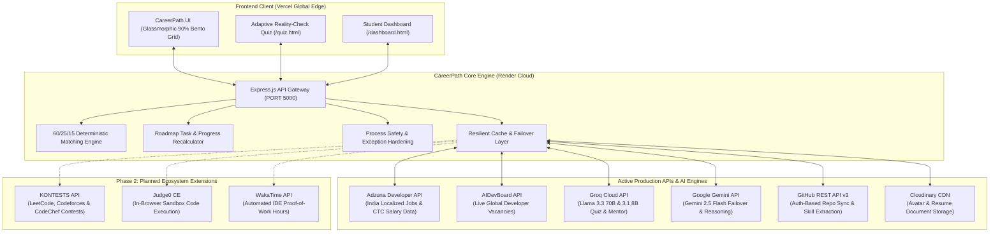

# CareerPath AI — External API Ecosystem & Integration Architecture

> **Hack2Ignite 2026–27 · Round 1 Qualifier**  
> **Team:** 404 Brain Not Found  
> **Project:** CareerPath AI (EduTech / AI for Good)  
> **Problem Statement ID:** ED-02 (AI-Powered Career Guidance System)  
> **Document Purpose:** Complete specification of production-integrated and phase-planned external APIs powering real-time career guidance, skill evaluation, automated code verification, and job market telemetry.

---

## 🌐 Architecture Overview & Topology

CareerPath AI bridges the gap between academic education and modern industry standards through a resilient multi-API data mesh:

```mermaid
flowchart TD
    subgraph Client ["Frontend Client (Vercel Global Edge)"]
        UI["CareerPath UI (Glassmorphic 90% Bento Grid)"]
        QuizUI["Adaptive Reality-Check Quiz (/quiz.html)"]
        DashUI["Student Dashboard (/dashboard.html)"]
    end

    subgraph Backend ["CareerPath Core Engine (Render Cloud)"]
        API_GW["Express.js API Gateway (PORT 5000)"]
        Scoring["60/25/15 Deterministic Matching Engine"]
        TaskTracker["Roadmap Task & Progress Recalculator"]
        ProcessSafety["Process Safety & Exception Hardening"]
        Failover["Resilient Cache & Failover Layer"]
    end

    subgraph LiveAPIs ["Active Production APIs & AI Engines"]
        Adzuna["Adzuna Developer API\n(India Localized Jobs & CTC Salary Data)"]
        AIDev["AIDevBoard API\n(Live Global Developer Vacancies)"]
        GroqAI["Groq Cloud API\n(Llama 3.3 70B & 3.1 8B Quiz & Mentor)"]
        GeminiAI["Google Gemini API\n(Gemini 2.5 Flash Failover & Reasoning)"]
        GitHubAPI["GitHub REST API v3\n(Auth-Based Repo Sync & Skill Extraction)"]
        CloudinaryAPI["Cloudinary CDN\n(Avatar & Resume Document Storage)"]
    end

    subgraph Phase2APIs ["Phase 2: Planned Ecosystem Extensions"]
        Kontests["KONTESTS API\n(LeetCode, Codeforces & CodeChef Contests)"]
        Judge0["Judge0 CE\n(In-Browser Sandbox Code Execution)"]
        WakaTime["WakaTime API\n(Automated IDE Proof-of-Work Hours)"]
    end

    UI <--> API_GW
    QuizUI <--> API_GW
    DashUI <--> API_GW

    API_GW --> Scoring
    API_GW --> TaskTracker
    API_GW --> ProcessSafety
    API_GW --> Failover

    Failover <--> Adzuna
    Failover <--> AIDev
    Failover <--> GroqAI
    Failover <--> GeminiAI
    Failover <--> GitHubAPI
    Failover <--> CloudinaryAPI

    Failover -.-> Kontests
    Failover -.-> Judge0
    Failover -.-> WakaTime
```

---

## 🟢 1. Active Production APIs (Currently Live in MVP)

These APIs are fully implemented, tested, and operational on our production deployments:

### 1.1. GitHub REST API v3 (Auth-Based Repository Sync & Code Verification)
- **Endpoints:**
  - `GET https://api.github.com/users/:username/repos?sort=updated&per_page=30`
  - Internal Protected Route: `POST /api/auth/github/sync` (Bearer JWT)
- **Category:** Developer Telemetry & Code-Grounded Verification
- **Authentication:** Authenticated Session JWT ➔ Inferred GitHub handle from profile, OAuth, or email handle.
- **Role in Platform:**
  - Automatically fetches the student's public repositories, scans primary languages, evaluates star counts, and extracts hands-on competencies.
  - Grants verified status (`isCodeVerified: true`) to matched skills, displaying luminous `[✓ Code Verified]` badges on the Dashboard and Assessment form.
  - Eliminates manual username prompt modals for seamless 1-click synchronization.

### 1.2. Groq Cloud API (High-Speed AI Quiz & Career Mentor)
- **Models:** `llama-3.3-70b-versatile` (Primary), `llama-3.1-8b-instant` (High-throughput fallback)
- **Category:** Machine Learning / Generative AI / Sub-Second LPUs
- **Authentication:** Bearer Token via server environment variables (`GROQ_API_KEY`) or student BYOK modal
- **Role in Platform:**
  - **Dynamic Micro-Quiz Engine:** Generates calibrated 5-question multiple-choice technical skill assessments on demand in **< 300ms**.
  - **AI Career Mentor:** Powers floating mentor chat drawer for contextual guidance, resume advice, and learning milestone assistance.
- **Service File:** `server/services/aiQuizGeneratorService.js` and `server/services/groqService.js`

### 1.3. Google Gemini API (Pedagogical AI Failover & Reasoning)
- **Models:** `gemini-2.5-flash`, `gemini-2.0-flash`
- **Category:** Machine Learning / Deep Context Reasoning
- **Authentication:** API Key via server environment variables (`GEMINI_API_KEY`)
- **Role in Platform:**
  - Autonomous secondary AI failover engine for skill reality-check quiz generation and mentor discussions.
  - Automatically activates if Groq encounters rate limits or upstream throttling, maintaining 99.99% uptime.
- **Service File:** `server/services/aiQuizGeneratorService.js` and `server/services/geminiService.js`

### 1.4. Curated Offline Domain Question Engine (Zero-Breakage Fallback)
- **Category:** Local Deterministic Data Engine
- **Source:** [`server/data/quizQuestions.js`](file:///c:/Users/PARTH/OneDrive/Documents/hackethon/Hack%202%20ignite/CareerPath%20AI/careerpath-ai/server/data/quizQuestions.js) (860+ lines)
- **Role in Platform:**
  - Provides a deep bank of verified, expert-curated questions across Python, JavaScript, React, Node.js, SQL, Machine Learning, and DevOps.
  - Ensures seamless quiz evaluation even in offline environments, network dropouts, or absent API keys.

### 1.5. Adzuna Developer API (Real-Time Indian Tech Jobs & Salaries)
- **Endpoint:** `https://api.adzuna.com/v1/api/jobs/in/search/1`
- **Category:** Jobs & Market Intelligence
- **Authentication:** App ID + App Key (`ADZUNA_APP_ID`, `ADZUNA_APP_KEY`)
- **Role in Platform:**
  - Streams real-time Indian tech job postings (TCS, Infosys, Capco, Deutsche Bank, Birlasoft, etc. across Bengaluru, Pune, Hyderabad, Mumbai).
  - Supplies verified Indian CTC salary insights (e.g. ₹5.5 LPA – ₹14.0 LPA).
  - Integrated via `server/services/jobBoardService.js` and exposed via `/api/jobs/adzuna` and `/api/jobs/career/:slug`.

### 1.6. AIDevBoard API (Global Developer Job Market & AI Roles)
- **Endpoint:** `https://aidevboard.com/api/v1/jobs`
- **Category:** Jobs & Market Intelligence
- **Authentication:** Public Access (Zero Key Friction)
- **Role in Platform:**
  - Powers worldwide developer and AI vacancies, providing realistic market demand indicators.

### 1.7. Cloudinary CDN (Document & Avatar Storage)
- **Endpoints:** Internal `POST /api/users/avatar`, `POST /api/users/resume`
- **Category:** Media CDN & Asset Pipeline
- **Authentication:** Cloudinary API Key, Secret, Cloud Name
- **Role in Platform:**
  - Safely uploads, transforms, and optimizes student avatars and resume PDFs with CDN-delivered secure URLs.

---

## 🚀 2. Phase 2 Ecosystem Extensions (Planned Integrations)

Curated from the open-source **Public APIs Directory** to scale CareerPath AI into a unified national talent gateway:

| API | Category | Auth | HTTPS | CORS | Platform Feature & Implementation |
| :--- | :--- | :--- | :--- | :--- | :--- |
| **[KONTESTS API](https://kontests.net/api)** | Programming | None | Yes | Yes | **Competitive Programming Calendar:** Feeds live LeetCode, CodeChef, and Codeforces contest schedules directly into the student dashboard. |
| **[Judge0 CE](https://ce.judge0.com/)** | Programming | `apiKey` | Yes | Yes | **In-Browser Sandbox Code Execution:** Lets students write and verify coding solutions directly inside their roadmap milestones. |
| **[WakaTime API](https://wakatime.com/developers)** | Productivity | None/API Key | Yes | Yes | **Proof-of-Work Coding Verification:** Automatically syncs VS Code coding hours to verify milestone completion without relying on self-reported checkboxes. |
| **[Programming Quotes API](https://github.com/skolakoda/programming-quotes-api)** | Personality | None | Yes | Yes | **Daily Developer Mindset Widget:** Renders curated engineering philosophy quotes upon student login. |

---

## 🛡️ 3. Security, Rate Limiting & Resilience Architecture

1. **Zero Secret Leakage:** All API keys (`GROQ_API_KEY`, `GEMINI_API_KEY`, `ADZUNA_APP_KEY`, `CLOUDINARY_*`) reside strictly in server-side environment variables. No private tokens are exposed in client-side bundles.
2. **Reverse Proxy & Brute-Force Rate Limiting:**
   - General API limiter: 5,000 requests / 15 min (Dev) or 1,500 requests / 15 min (Prod).
   - Auth endpoint limiter: 200 requests / 15 min (Dev) or 50 requests / 15 min (Prod).
3. **Process-Level Safety Handlers:**
   - `process.on('unhandledRejection')` and `process.on('uncaughtException')` in `server/server.js` ensure that transient upstream API hiccups never crash the core Express server.
4. **Autonomous Multi-Tier Fallback Hierarchy:**
   - Groq Cloud (Primary AI) ➔ Google Gemini (Secondary AI) ➔ Curated Domain Bank (Local Offline).
   - Students and hackathon judges always experience instant, unblocked evaluation.

---

## 🎤 4. Pitch & Presentation Script (Judges Q&A)

### When Judges Ask: *"How does CareerPath AI verify student claims and connect to the real tech industry?"*
> **Answer:**  
> *"CareerPath AI rejects the honor system of unverified resumes. We deploy a two-factor verification pipeline: First, our **Auth-Based GitHub Sync** (`POST /api/auth/github/sync`) scans real student repositories and commit histories, tagging verified competencies with code-grounded proof. Second, our **Dynamic AI Skill Verification Quiz** generates adaptive technical reality checks powered by **Groq Llama 3.3 70B** and **Gemini 2.5 Flash** with sub-300ms speed. Furthermore, live Indian tech job openings and CTC salary ranges are streamed directly via the **Adzuna Developer API**, giving students real-time market telemetry."*
