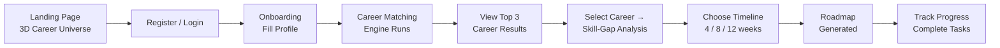
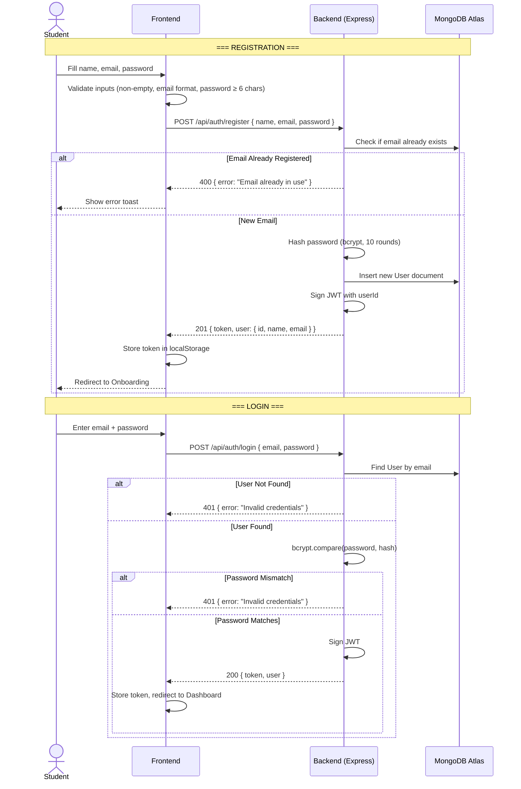
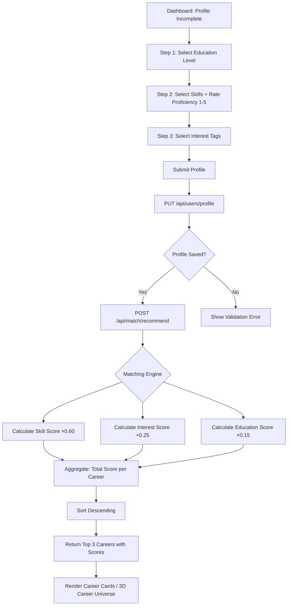
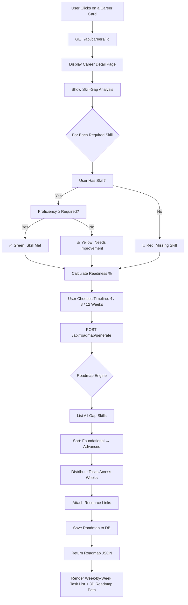
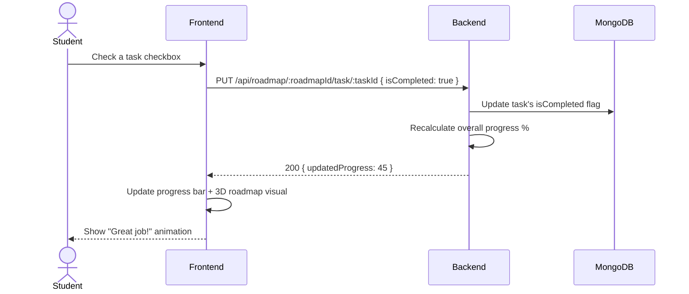
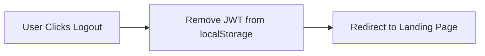

# Application Flow
## CareerPath AI — Hack2Ignite 2026–27

---

## 1. High-Level User Journey

---

## 2. Authentication Flow

---

## 3. Onboarding → Career Matching Flow

---

## 4. Skill-Gap → Roadmap Generation Flow

---

## 5. Progress Tracking Flow

---

## 6. Logout Flow

> **Note:** Since JWT is stateless, no server-side session invalidation is needed. Token simply expires after 24 hours.

---

## 7. Error States Summary

| Scenario | User Sees |
|----------|-----------|
| Invalid email/password on login | Red toast: "Invalid credentials" |
| Registration with existing email | Red toast: "Email already in use" |
| Expired/missing JWT on protected route | Redirect to login page |
| Empty profile fields on submit | Inline validation messages |
| API server unreachable | "Server unavailable, please try later" modal |
| 3D WebGL not supported | Automatic fallback to 2D CSS grid layout |
