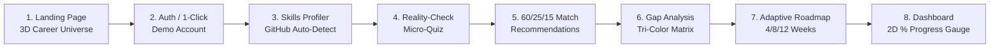
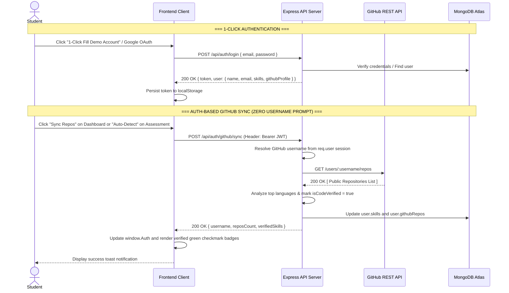
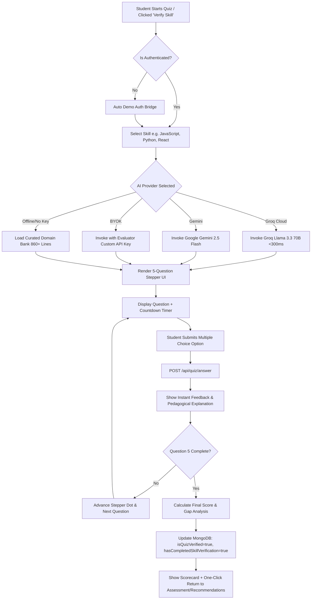
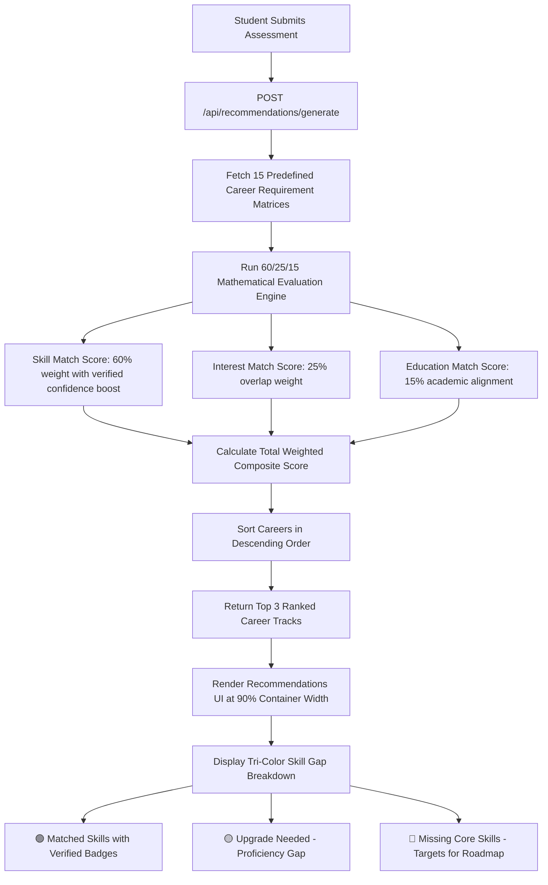
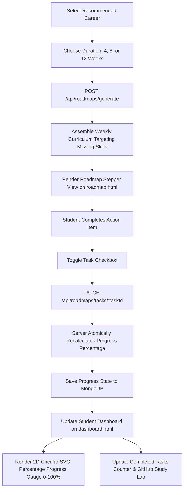
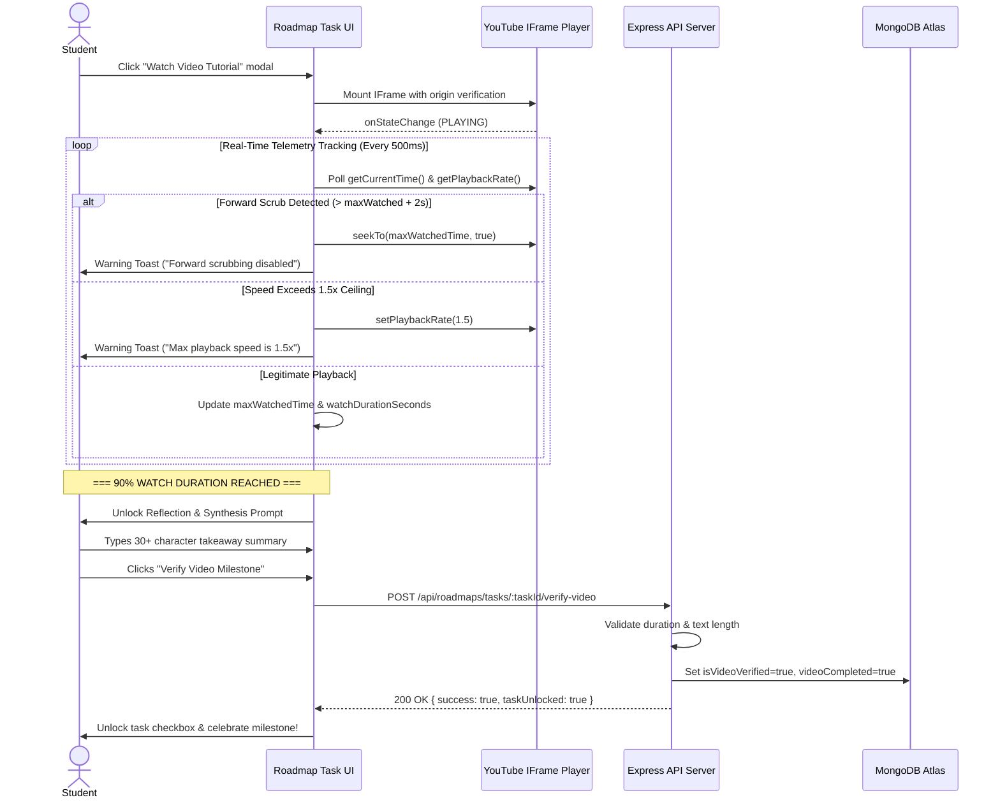
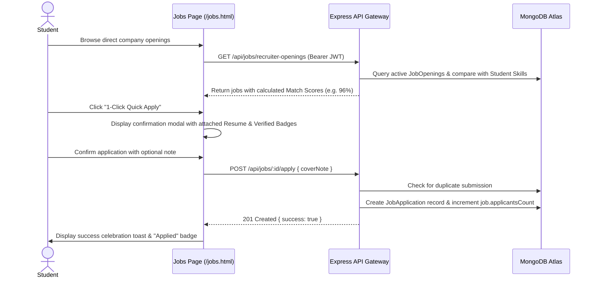
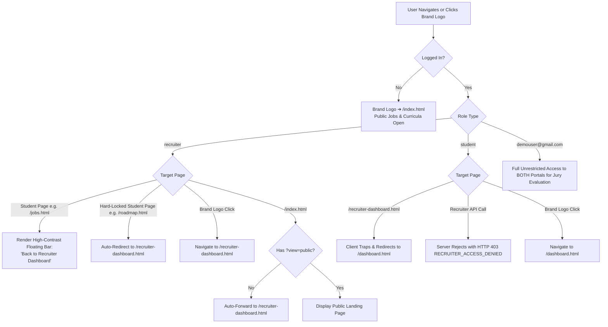

# Application Flow & Interactive User Journeys

> **Hack2Ignite 2026–27 · Team 404 Brain Not Found**  
> **Project:** CareerPath AI (ED-02)  
> **Architecture:** Decoupled Full-Stack Web Application

---

## 1. High-Level User Journey

```mermaid
flowchart LR
    A[1. Landing Page<br/>3D Career Universe] --> B[2. Auth / 1-Click<br/>Demo Account]
    B --> C[3. Skills Profiler<br/>GitHub Auto-Detect]
    C --> D[4. Reality-Check<br/>Micro-Quiz]
    D --> E[5. 60/25/15 Match<br/>Recommendations]
    E --> F[6. Gap Analysis<br/>Tri-Color Matrix]
    F --> G[7. Adaptive Roadmap<br/>4/8/12 Weeks]
    G --> H[8. Dashboard<br/>2D % Progress Gauge]
```

---

## 2. Authentication & GitHub Session Sync Flow

```mermaid
sequenceDiagram
    actor Student
    participant FE as Frontend Client
    participant BE as Express API Server
    participant GH as GitHub REST API
    participant DB as MongoDB Atlas

    Note over Student,DB: === 1-CLICK AUTHENTICATION ===
    Student->>FE: Click "1-Click Fill Demo Account" / Google OAuth
    FE->>BE: POST /api/auth/login { email, password }
    BE->>DB: Verify credentials / Find user
    BE-->>FE: 200 OK { token, user: { name, email, skills, githubProfile } }
    FE->>FE: Persist token to localStorage

    Note over Student,DB: === AUTH-BASED GITHUB SYNC (ZERO USERNAME PROMPT) ===
    Student->>FE: Click "Sync Repos" on Dashboard or "Auto-Detect" on Assessment
    FE->>BE: POST /api/auth/github/sync (Header: Bearer JWT)
    BE->>BE: Resolve GitHub username from req.user session
    BE->>GH: GET /users/:username/repos
    GH-->>BE: 200 OK [ Public Repositories List ]
    BE->>BE: Analyze top languages & mark isCodeVerified = true
    BE->>DB: Update user.skills and user.githubRepos
    BE-->>FE: 200 OK { username, reposCount, verifiedSkills }
    FE->>FE: Update window.Auth and render verified green checkmark badges
    FE-->>Student: Display success toast notification
```

---

## 3. Adaptive Skill Reality-Check Micro-Quiz Flow (`/quiz.html`)

```mermaid
flowchart TD
    Start[Student Starts Quiz / Clicked 'Verify Skill'] --> CheckAuth{Is Authenticated?}
    CheckAuth -- No --> GuestBridge[Auto Demo Auth Bridge]
    CheckAuth -- Yes --> SelectSkill[Select Skill e.g. JavaScript, Python, React]
    GuestBridge --> SelectSkill
    
    SelectSkill --> ProviderCheck{AI Provider Selected}
    ProviderCheck -- Groq Cloud --> GroqCall[Invoke Groq Llama 3.3 70B <300ms]
    ProviderCheck -- Gemini --> GeminiCall[Invoke Google Gemini 2.5 Flash]
    ProviderCheck -- BYOK --> CustomKey[Invoke with Evaluator Custom API Key]
    ProviderCheck -- Offline/No Key --> Fallback[Load Curated Domain Bank 860+ Lines]

    GroqCall & GeminiCall & CustomKey & Fallback --> InitStepper[Render 5-Question Stepper UI]

    InitStepper --> QuestionLoop[Display Question + Countdown Timer]
    QuestionLoop --> SubmitAnswer[Student Submits Multiple Choice Option]
    SubmitAnswer --> EvalAnswer[POST /api/quiz/answer]
    EvalAnswer --> ShowFeedback[Show Instant Feedback & Pedagogical Explanation]
    
    ShowFeedback --> CheckEnd{Question 5 Complete?}
    CheckEnd -- No --> NextQ[Advance Stepper Dot & Next Question]
    NextQ --> QuestionLoop
    
    CheckEnd -- Yes --> CalcScore[Calculate Final Score & Gap Analysis]
    CalcScore --> SaveDB[Update MongoDB: isQuizVerified=true, hasCompletedSkillVerification=true]
    SaveDB --> UnlockNav[Show Scorecard + One-Click Return to Assessment/Recommendations]
```

---

## 4. Career Matching & Recommendations Flow

```mermaid
flowchart TD
    A[Student Submits Assessment] --> B[POST /api/recommendations/generate]
    B --> C[Fetch 15 Predefined Career Requirement Matrices]
    
    C --> D[Run 60/25/15 Mathematical Evaluation Engine]
    D --> E[Skill Match Score: 60% weight with verified confidence boost]
    D --> F[Interest Match Score: 25% overlap weight]
    D --> G[Education Match Score: 15% academic alignment]
    
    E & F & G --> H[Calculate Total Weighted Composite Score]
    H --> I[Sort Careers in Descending Order]
    I --> J[Return Top 3 Ranked Career Tracks]
    
    J --> K[Render Recommendations UI at 90% Container Width]
    K --> L[Display Tri-Color Skill Gap Breakdown]
    L --> M[🟢 Matched Skills with Verified Badges]
    L --> N[🟡 Upgrade Needed - Proficiency Gap]
    L --> O[🔴 Missing Core Skills - Targets for Roadmap]
```

---

## 5. Milestone Roadmap Execution & Dashboard Progress Flow

```mermaid
flowchart TD
    A[Select Recommended Career] --> B[Choose Duration: 4, 8, or 12 Weeks]
    B --> C[POST /api/roadmaps/generate]
    C --> D[Assemble Weekly Curriculum Targeting Missing Skills]
    D --> E[Render Roadmap Stepper View on roadmap.html]
    
    E --> F[Student Completes Action Item]
    F --> G[Toggle Task Checkbox]
    G --> H[PATCH /api/roadmaps/tasks/:taskId]
    H --> I[Server Atomically Recalculates Progress Percentage]
    I --> J[Save Progress State to MongoDB]
    
    J --> K[Update Student Dashboard on dashboard.html]
    K --> L[Render 2D Circular SVG Percentage Progress Gauge 0-100%]
    K --> M[Update Completed Tasks Counter & GitHub Study Lab]
```

---

## 6. AI Video Learning Dedication & Anti-Scrubbing Flow

```mermaid
sequenceDiagram
    actor Student
    participant UI as Roadmap Task UI
    participant YT as YouTube IFrame Player
    participant BE as Express API Server
    participant DB as MongoDB Atlas

    Student->>UI: Click "Watch Video Tutorial" modal
    UI->>YT: Mount IFrame with origin verification
    YT-->>UI: onStateChange (PLAYING)
    
    loop Real-Time Telemetry Tracking (Every 500ms)
        UI->>YT: Poll getCurrentTime() & getPlaybackRate()
        alt Forward Scrub Detected (> maxWatched + 2s)
            UI->>YT: seekTo(maxWatchedTime, true)
            UI->>Student: Warning Toast ("Forward scrubbing disabled")
        else Speed Exceeds 1.5x Ceiling
            UI->>YT: setPlaybackRate(1.5)
            UI->>Student: Warning Toast ("Max playback speed is 1.5x")
        else Legitimate Playback
            UI->>UI: Update maxWatchedTime & watchDurationSeconds
        end
    end

    Note over Student,UI: === 90% WATCH DURATION REACHED ===
    UI->>Student: Unlock Reflection & Synthesis Prompt
    Student->>UI: Types 30+ character takeaway summary
    Student->>UI: Clicks "Verify Video Milestone"
    UI->>BE: POST /api/roadmaps/tasks/:taskId/verify-video
    BE->>BE: Validate duration & text length
    BE->>DB: Set isVideoVerified=true, videoCompleted=true
    BE-->>UI: 200 OK { success: true, taskUnlocked: true }
    UI->>Student: Unlock task checkbox & celebrate milestone!
```

---

## 7. Recruiter Onboarding & Corporate Verification Flow

```mermaid
flowchart TD
    A[Recruiter Visits /recruiter-onboarding.html] --> B[Enter Work Email, Company & Website]
    B --> C[Client-Side Real-Time DNS & Domain Match Precheck]
    C --> D{Free Webmail Check}
    D -- Gmail / Yahoo / Outlook --> E[Reject: "Must use corporate work domain"]
    D -- Corporate Domain --> F[POST /api/recruiter/verify-company-precheck]
    
    F --> G[Server Evaluates Domain Legitimacy Score: 99/100]
    G --> H[Enter Password, Designation & Phone]
    H --> I[POST /api/recruiter/register]
    I --> J[Generate 6-Digit Cryptographic OTP]
    J --> K[Dispatch OTP to Work Inbox]
    
    K --> L[Enter OTP on /recruiter-onboarding.html]
    L --> M[POST /api/auth/verify-otp]
    M --> N[Role Set to 'recruiter', canPostJobs=true]
    N --> O[Redirect to /recruiter-dashboard.html]
```

---

## 8. Recruiter Job Posting & ATS Talent Radar Flow

```mermaid
flowchart LR
    A[Recruiter Dashboard] --> B[Click 'Post New Opening']
    B --> C[Fill Job Form:<br/>Role, CTC, Workplace]
    C --> D[Select Required Skills<br/>& Toggle 'Requires Verification']
    D --> E[POST /api/recruiter/jobs]
    E --> F[Published to Campus Radar]
    
    F --> G[Student Applies with Verified Profile]
    G --> H[Recruiter Opens ATS Radar]
    H --> I[Sort Applicants by AI Match Score]
    I --> J[Inspect Two-Factor Verified Badges]
    J --> K[Update Stage: Applied ➔ Shortlisted ➔ Interview ➔ Offered]
```

---

## 9. Candidate 1-Click Application Flow (`/jobs.html`)

```mermaid
sequenceDiagram
    actor Student
    participant FE as Jobs Page (/jobs.html)
    participant BE as Express API Gateway
    participant DB as MongoDB Atlas

    Student->>FE: Browse direct company openings
    FE->>BE: GET /api/jobs/recruiter-openings (Bearer JWT)
    BE->>DB: Query active JobOpenings & compare with Student Skills
    BE-->>FE: Return jobs with calculated Match Scores (e.g. 96%)
    
    Student->>FE: Click "1-Click Quick Apply"
    FE->>FE: Display confirmation modal with attached Resume & Verified Badges
    Student->>FE: Confirm application with optional note
    FE->>BE: POST /api/jobs/:id/apply { coverNote }
    BE->>DB: Check for duplicate submission
    BE->>DB: Create JobApplication record & increment job.applicantsCount
    BE-->>FE: 201 Created { success: true }
    FE->>Student: Display success celebration toast & "Applied" badge
```

---

## 10. Portal Isolation & Role-Smart Navigation Flow

```mermaid
flowchart TD
    UserAction[User Navigates or Clicks Brand Logo] --> CheckAuth{Logged In?}
    
    CheckAuth -- No --> GuestNav[Brand Logo ➔ /index.html<br/>Public Jobs & Curricula Open]
    
    CheckAuth -- Yes --> RoleSwitch{Role Type}
    
    RoleSwitch -- "recruiter" --> RecruiterBranch{Target Page}
    RecruiterBranch -- Student Page e.g. /jobs.html --> FloatingPill[Render High-Contrast Floating Bar:<br/>'Back to Recruiter Dashboard']
    RecruiterBranch -- Hard-Locked Student Page e.g. /roadmap.html --> ForceRecruiterDash[Auto-Redirect to /recruiter-dashboard.html]
    RecruiterBranch -- Brand Logo Click --> GoRecruiterDash[Navigate to /recruiter-dashboard.html]
    RecruiterBranch -- /index.html --> CheckQuery{Has ?view=public?}
    CheckQuery -- No --> AutoForward[Auto-Forward to /recruiter-dashboard.html]
    CheckQuery -- Yes --> AllowPublic[Display Public Landing Page]
    
    RoleSwitch -- "student" --> StudentBranch{Target Page}
    StudentBranch -- /recruiter-dashboard.html --> TrapStudent[Client Traps & Redirects to /dashboard.html]
    StudentBranch -- Recruiter API Call --> Block403[Server Rejects with HTTP 403 RECRUITER_ACCESS_DENIED]
    StudentBranch -- Brand Logo Click --> GoStudentDash[Navigate to /dashboard.html]
    
    RoleSwitch -- "demouser@gmail.com" --> DualBypass[Full Unrestricted Access to BOTH Portals for Jury Evaluation]
```
