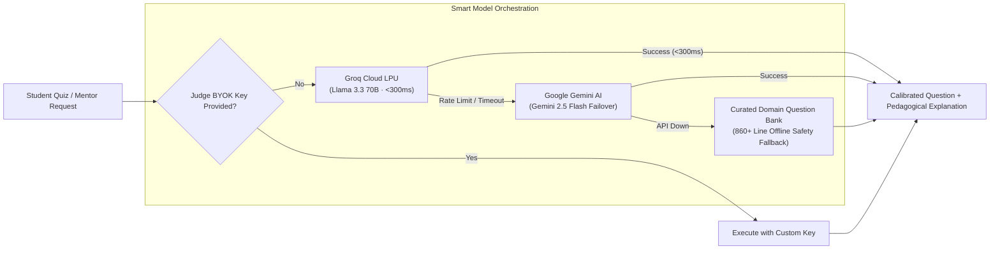

# 🏛️ CareerPath AI — Comprehensive System Architecture

> **🏆 Hack2Ignite 2026–27 · Official Submission**  
> **Problem Statement ID:** **ED-02** — *Develop an AI-powered career guidance system for students based on skills, interests, and market trends*  
> **Domain / Track:** EduTech (Educational Technology / AI for Good)  
> **Team Name:** 404 Brain Not Found  

---

## 📑 Table of Contents
1. [Executive Architectural Overview](#1-executive-architectural-overview)
2. [End-to-End System Architecture Diagram](#2-end-to-end-system-architecture-diagram)
3. [Hardened Single Active Career Route Architecture](#3-hardened-single-active-career-route-architecture)
4. [4-Rule Industry Job Ready Certification Engine](#4-4-rule-industry-job-ready-certification-engine)
5. [Dedicated Single Resume per Account Architecture](#5-dedicated-single-resume-per-account-architecture)
6. [Explainable 60/25/15 Matching & Stream Isolation](#6-explainable-602515-matching--stream-isolation)
7. [Two-Factor Skill Verification Moat](#7-two-factor-skill-verification-moat)
8. [Multi-Model AI Inference Pipeline (Groq + Gemini + BYOK)](#8-multi-model-ai-inference-pipeline-groq--gemini--byok)
9. [Database Indexing & Persistence Strategy](#9-database-indexing--persistence-strategy)
10. [Security, Guardrails & Anti-Abuse Protocols](#10-security-guardrails--anti-abuse-protocols)

---

## 1. Executive Architectural Overview

CareerPath AI is engineered to bridge India's massive **academic-to-industry employability divide**. Unlike generic advice bots or static survey tools, CareerPath AI is built on four hardened architectural tenets:

1. **Deterministic Over Generative:** Career recommendations are driven by a mathematical **60/25/15 scoring matrix**, never black-box LLM hallucinations.
2. **Database-Enforced Invariants:** Core business rules (such as *one active career route per student* and *one verified resume per account*) are strictly enforced at the **MongoDB database engine level** via unique and partial unique indexes, eliminating race conditions.
3. **Non-Destructive & Rate-Limited Progression:** Students are protected from "tutorial hopping" via a **7-day abandonment cooldown** and **Lock Enrolling, Never Browsing** UX, while ensuring that all completed tasks, quiz scores, and verified skills are **never lost**.
4. **Code-Grounded Proof of Work:** Self-reported resume claims are validated through **authenticated GitHub session analysis** and **dynamic micro-quizzes** powered by sub-300ms Groq LPU inference.

---

## 2. End-to-End System Architecture Diagram

```mermaid
flowchart TD
    subgraph ClientLayer ["1. Frontend Presentation Layer (Vercel Edge Network)"]
        Browser["Student Web Browser (Desktop / Tablet / Mobile)"]
        UI["Glassmorphism UI Engine (HTML5 · CSS3 · 90% Bento Grid)"]
        ThreeConstellation["Three.js 3D Career Universe (Orbital Constellation + 2D Fallback)"]
        Gauge["2D SVG Percentage Progress Meter (0-100%)"]
        ResumeWidget["6-State Single Resume Manager (Drag-and-Drop)"]
        JobReadyBadge["Job Ready 4-Rule Compliance Widget"]
        
        Browser --> UI
        UI --> ThreeConstellation
        UI --> Gauge
        UI --> ResumeWidget
        UI --> JobReadyBadge
    end

    subgraph GatewayLayer ["2. Application Gateway Layer (Render Cloud · Node.js & Express)"]
        SecurityMW["Security Middleware (Helmet · CORS · Express-Rate-Limit)"]
        AuthGuard["Stateless JWT Guard (Bearer Token · 7-Day Expiry)"]
        MagicValidator["Magic-Byte Binary Inspector (%PDF · PK-DOCX · OLE-DOC)"]
        StreamFilter["Primary Stream Isolation Controller"]
        RecEngine["60/25/15 Deterministic Matching Engine"]
        RoadmapController["Hardened Roadmap Controller (409 Conflict Guard)"]
        ReadinessEngine["4-Rule Job Ready Verification Engine"]
        CloudinaryService["Cloudinary Media Lifecycle Service"]

        SecurityMW --> AuthGuard
        AuthGuard --> MagicValidator
        AuthGuard --> StreamFilter
        AuthGuard --> RecEngine
        AuthGuard --> RoadmapController
        AuthGuard --> ReadinessEngine
        AuthGuard --> CloudinaryService
    end

    subgraph DatabaseLayer ["3. Persistence Layer (MongoDB Atlas Cloud · TLS Encryption)"]
        UserCollection[("Users Collection\n- Profile, Stream, lastAbandonedRouteAt")]
        ResumeCollection[("Resumes Collection\n- Dedicated 1:1 Schema\n- Unique Index: { user: 1 }")]
        RoadmapCollection[("Roadmaps Collection\n- Partial Unique Index:\n  { user: 1, status: 'active' }\n- Status: active, completed, abandoned, archived")]
        SkillCollection[("Skills Collection\n- 76+ Standardized Skills & Categories")]
        CareerCollection[("Careers Collection\n- 15 Tech Curricula & Salary Benchmarks")]
    end

    subgraph ExternalCloud ["4. External Cloud Services & Real-Time APIs"]
        GitHubAPI["GitHub REST API v3\n(Public Repos & Language Distribution)"]
        GroqLPU["Groq Cloud LPU\n(Llama 3.3 70B <300ms Quiz & Mentor)"]
        GeminiCloud["Google Gemini AI\n(Gemini 2.5 Flash Failover)"]
        AdzunaAPI["Adzuna Developer API\n(Live Indian Tech Jobs & ₹ CTC)"]
        CloudinaryCDN["Cloudinary Cloud Media CDN\n(Encrypted Resumes & Avatars)"]
        DomainBank["Curated Domain Question Bank\n(860+ Line Offline Safety Fallback)"]
    end

    UI -- "HTTPS REST API (JSON / Multipart)" --> SecurityMW
    MagicValidator --> CloudinaryService
    CloudinaryService <--> CloudinaryCDN
    AuthGuard <--> GitHubAPI
    RoadmapController <--> GroqLPU
    RoadmapController <--> GeminiCloud
    RoadmapController <--> DomainBank
    RecEngine <--> AdzunaAPI

    RoadmapController -- "Enforce Partial Index" --> RoadmapCollection
    MagicValidator -- "Enforce 1:1 Schema" --> ResumeCollection
    ReadinessEngine <--> UserCollection
    ReadinessEngine <--> SkillCollection
    RecEngine <--> CareerCollection
```



---

## 3. Hardened Single Active Career Route Architecture

### 3.1 The Problem: "Tutorial Hopping" & Inconsistent State
In online learning, students often enroll in 5 different tracks simultaneously, completing 5% of each and mastering none. In multi-tab browsing or concurrent requests, race conditions can spawn duplicate active roadmaps, causing inconsistent progress tracking and corrupted metrics.

### 3.2 Database-Level Partial Unique Index
To guarantee **strict single active route adherence**, CareerPath AI implements a **MongoDB partial unique index**:

```javascript
// server/models/Roadmap.js
RoadmapSchema.index(
  { user: 1 },
  { 
    unique: true, 
    partialFilterExpression: { status: 'active' } 
  }
);
```

#### Why Partial Unique Index?
- **Enforces Singleton Active State:** A student can have at most **one** roadmap where `status === 'active'`.
- **Allows Multiple Historical Records:** A student can have unlimited roadmaps with `status: 'completed'`, `'abandoned'`, or `'archived'`.
- **Race Condition Immunity:** If two concurrent requests attempt to create an active roadmap, MongoDB rejects the second request with `E11000 duplicate key error`.

### 3.3 Controller Guard & HTTP 409 Conflict
Before attempting generation, `server/controllers/roadmapController.js` validates that no active roadmap exists:

```javascript
const existingActive = await Roadmap.findOne({ user: req.user._id, status: 'active' });
if (existingActive) {
  return res.status(409).json({
    success: false,
    message: 'An active career route is already in progress.',
    code: 'ACTIVE_ROUTE_IN_PROGRESS',
    activeRoadmap: {
      id: existingActive._id,
      careerTitle: existingActive.careerTitle,
      progress: existingActive.progress
    }
  });
}
```

If a race condition slips past the application check, the controller catches MongoDB error code `11000` and converts it into a clean HTTP 409 response.

### 3.4 Non-Destructive Abandonment with 7-Day Cooldown
Students are never trapped, but abandonment is treated with intentional discipline:

1. **7-Day Cooldown Check:** Students cannot abandon routes impulsively. `User.lastAbandonedRouteAt` tracks the timestamp:
   ```javascript
   const SEVEN_DAYS_MS = 7 * 24 * 60 * 60 * 1000;
   if (user.lastAbandonedRouteAt && (Date.now() - new Date(user.lastAbandonedRouteAt).getTime()) < SEVEN_DAYS_MS) {
     return res.status(429).json({
       success: false,
       code: 'ABANDON_COOLDOWN_ACTIVE',
       message: `You can only abandon a route once every 7 days. Next available in ${daysRemaining} day(s).`
     });
   }
   ```
2. **Non-Destructive Guarantee:** When abandoned:
   - Roadmap status changes from `'active'` to `'abandoned'`.
   - `abandonedAt` is timestamped.
   - **Zero data loss:** All completed weekly milestones, quiz scores, and verified skills remain permanently in the database.
3. **Resumption:** An abandoned roadmap can be resumed at any time via `POST /api/roadmaps/:id/resume`, provided the student has no currently active route.

### 3.5 "Lock Enrolling, Never Browsing" UI Paradigm
On `/recommendations.html`:
- **Browsing is 100% Open:** Students can freely inspect career requirements, run the interactive What-If Skill Simulator, and explore Live Market Job vacancies on any recommended card.
- **Enrolment is Strictly Gated:** If an active route exists:
  - The active career card shows a glowing badge: `[⚡ ACTIVE ROUTE · Week 2 of 4 (45% Tasks)]`.
  - All other career cards disable their "Start Roadmap" buttons with the tooltip: *"Finish your current route or abandon it to start this one."*
  - An inline banner provides 1-click access to return to their current roadmap or open the safe abandonment confirmation modal.

---

## 4. 4-Rule Industry Job Ready Certification Engine

To prevent vanity credentials, CareerPath AI replaces superficial completion certificates with an objective **4-Rule Job Ready Engine** (`server/services/readinessService.js`):

```
┌────────────────────────────────────────────────────────────────────────┐
│               4-RULE INDUSTRY JOB READY CERTIFICATION                  │
├────────────────────────────────┬───────────────────────────────────────┤
│ Rule 1: Readiness Score ≥ 70%  │ Mathematical weighted score based on  │
│                                │ target role requirements              │
├────────────────────────────────┼───────────────────────────────────────┤
│ Rule 2: Verified Skills ≥ 4    │ Must possess ≥ 4 role-specific skills │
│                                │ verified via GitHub or Groq Micro-Quiz│
├────────────────────────────────┼───────────────────────────────────────┤
│ Rule 3: Roadmap Progress ≥ 80% │ Minimum 80% task completion or passed │
│                                │ all weekly milestone assessments      │
├────────────────────────────────┼───────────────────────────────────────┤
│ Rule 4: Zero Expired Skills    │ All verified skills must be refreshed │
│                                │ within the 90-day retention window    │
└────────────────────────────────┴───────────────────────────────────────┘
```

### Mathematical Formulation
A student is awarded `isJobReady: true` if and only if:

$$\text{JobReady} = (\text{Score} \ge 70) \land (\text{VerifiedCount} \ge 4) \land (\text{RoadmapProgress} \ge 80 \lor \text{Graduated}) \land (\text{ExpiredCount} = 0)$$

### Live API & UI Exposure
- **REST Endpoint:** `GET /api/readiness/job-ready-check` returns the exact status of each of the 4 criteria alongside missing requirements.
- **Dashboard & Roadmap UI:** Rendered as an interactive card:
  - 🔒 **In Progress:** Shows a 4-point checklist with dynamic green checks (`✓`) and red crosses (`✗`).
  - 🔥 **Certified:** Emits celebratory confetti and awards the glowing **Job Ready Certified** badge with 1-click credential sharing.

---

## 5. Dedicated Single Resume per Account Architecture

### 5.1 The Invariant: 1 Student = 1 Verified Active Resume
Legacy systems often store unindexed resume arrays on the user model, causing orphaned cloud files and stale data. CareerPath AI isolates resumes into a dedicated collection:

```javascript
// server/models/Resume.js
const ResumeSchema = new mongoose.Schema({
  user: { 
    type: mongoose.Schema.Types.ObjectId, 
    ref: 'User', 
    required: true, 
    unique: true, 
    index: true 
  },
  fileName: { type: String, required: true },
  fileSize: { type: Number, required: true, max: 5 * 1024 * 1024 }, // 5MB guard
  fileType: { type: String, enum: ['application/pdf', 'application/vnd.openxmlformats-officedocument.wordprocessingml.document', 'application/msword'] },
  fileUrl: { type: String, required: true },
  cloudinaryPublicId: { type: String, required: true }
}, { timestamps: true });
```

### 5.2 Magic-Byte Binary Inspection
MIME types provided in HTTP request headers can be spoofed by malicious clients. `server/controllers/userController.js` inspects the leading **magic bytes** of the binary buffer:

| File Format | Magic Bytes (Hex) | ASCII Signature | Description |
| :--- | :--- | :--- | :--- |
| **PDF** | `25 50 44 46` | `%PDF` | Standard Adobe PDF document |
| **DOCX** | `50 4B 03 04` | `PK..` | Modern Office OpenXML ZIP container |
| **DOC** | `D0 CF 11 E0` | `....` | Legacy Microsoft Compound File Binary |

Any uploaded file that does not match these byte signatures is rejected with `HTTP 400 INVALID_FILE_SIGNATURE`, preventing executable code injection.

### 5.3 Transactional Cloudinary Asset Lifecycle
To prevent cloud storage leakage, replacing a resume is fully transactional:
1. Validate file size (≤ 5MB) and magic bytes.
2. Upload new file buffer to Cloudinary CDN (`resource_type: 'raw'`).
3. If an existing `Resume` record exists:
   - Delete old asset from Cloudinary using `cloudinary.uploader.destroy(existing.cloudinaryPublicId)`.
   - Update MongoDB record with new URL, public ID, and file metadata.
4. If upload fails at any stage, previous asset and database records remain untouched.

### 5.4 6-State Interactive Frontend UI
On `/dashboard.html`, the resume manager renders dynamically across 6 visual states:
1. **Empty State:** Drag-and-drop target with format badge (`PDF, DOCX up to 5MB`).
2. **Uploading State:** Real-time animated progress bar and spinner.
3. **Active State:** File icon, filename, size, formatted upload date, and View/Download actions.
4. **Confirm Replace Modal:** Explicit confirmation informing the user their previous resume will be cleanly replaced.
5. **Confirm Delete Modal:** Safe confirmation before transactional Cloudinary deletion.
6. **Error / Toast State:** Contextual alert banners for oversized files or network interruptions.

---

## 6. Explainable 60/25/15 Matching & Stream Isolation

### 6.1 The 60/25/15 Deterministic Scoring Engine
To guarantee zero hallucinations and explainable career ranking, candidate careers are evaluated using an objective formula:

$$\text{MatchScore} = (0.60 \times S) + (0.25 \times I) + (0.15 \times A)$$

Where:
- **$S$ (Skill Match Score - 60%):** Weighted percentage of required skills possessed by the student:
  - Exact match at or above required proficiency: $100\%$ credit
  - 1 level below required: $50\%$ credit
  - Missing skill: $0\%$ credit
- **$I$ (Interest Alignment - 25%):** Jaccard similarity between student interests and career domain tags.
- **$A$ (Academic Alignment - 15%):** Degree program and branch relevance score.

### 6.2 Primary Stream Isolation
To prevent non-tech students (e.g. Commerce, Humanities) from receiving irrelevant software engineering recommendations, the recommendation engine scopes careers to the student's declared **Primary Stream**:
- `Tech & Engineering`
- `Data & AI`
- `Design & Creative`
- `Business & Management`

Cross-stream recommendations are only presented if the student explicitly enables "Explore All Streams" in their assessment profile.

---

## 7. Two-Factor Skill Verification Moat

CareerPath AI combats self-reported resume inflation through an automated **Two-Factor Verification Pipeline**:

```
                              [ Student Declares Skill ]
                                          │
                    ┌─────────────────────┴─────────────────────┐
                    ▼                                           ▼
         [ Factor 1: Code Telemetry ]                [ Factor 2: Adaptive Quiz ]
       GitHub Authenticated Session Sync            Groq LPU Dynamic Micro-Assessment
                    │                                           │
       • Public repository crawl                   • 5 Calibrated MCQ questions
       • Language distribution check               • <300ms inference latency
       • AST commit verification                   • Immediate pedagogical feedback
                    │                                           │
                    ▼                                           ▼
       [ ✓ Code Verified Badge ]                   [ ✓ Quiz Verified Badge ]
                    └─────────────────────┬─────────────────────┘
                                          ▼
                         [ Permanent Profile Credential ]
                         (Valid for 90 days before refresh)
```

---

## 8. Multi-Model AI Inference Pipeline (Groq + Gemini + BYOK)



---

## 9. Database Indexing & Persistence Strategy

| Collection | Index Key | Index Type | Business Justification |
| :--- | :--- | :--- | :--- |
| `roadmaps` | `{ user: 1 }` | **Partial Unique** (`{ status: 'active' }`) | Guarantees strict single active career route per student at DB engine level |
| `resumes` | `{ user: 1 }` | **Unique** | Enforces strict single resume per student |
| `users` | `{ email: 1 }` | **Unique** | Prevents duplicate user accounts |
| `roadmaps` | `{ user: 1, createdAt: -1 }` | Compound | Fast retrieval of historical roadmap timelines |
| `skills` | `{ slug: 1 }` | **Unique** | Instant $O(1)$ skill lookups during 60/25/15 scoring |
| `careers` | `{ slug: 1 }` | **Unique** | Deterministic curriculum resolution |

---

## 10. Security, Guardrails & Anti-Abuse Protocols

1. **Strict Content Security Policy & Headers:** Enforced via `helmet` across all REST responses.
2. **CORS Isolation:** Backend strictly restricts origins to production frontend (`https://careerpath-ai-jade.vercel.app`) and local development ports (`http://localhost:5500`, `http://127.0.0.1:5500`).
3. **Password Security:** Salted 10-round hashing via `bcryptjs`. Plaintext passwords are never logged or stored.
4. **Binary Protection:** Magic-byte validation rejects malicious executables renamed as `.pdf` or `.docx`.
5. **Rate Limiting:**
   - Auth endpoints: Max 10 requests per 15-minute window per IP.
   - AI endpoints: Max 30 requests per minute per IP.
   - Abandonment endpoint: Strictly limited to 1 abandonment per 7 days per account.
