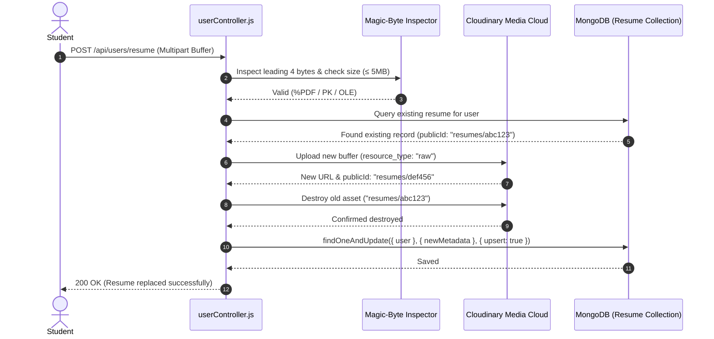

# 📄 CareerPath AI — Single Resume per Account & File Integrity Architecture

> **🏆 Hack2Ignite 2026–27 · Technical Deep-Dive**  
> **Problem Statement ID:** ED-02 (AI Career Guidance and Skill Roadmap Platform)  
> **Authors:** Team 404 Brain Not Found  

---

## 🎯 Executive Summary

In web platforms handling user resumes, two common architecture flaws undermine security and scalability:
1. **Unbounded Cloud Media Bloat:** Users repeatedly upload new resume drafts without deleting old ones, resulting in hundreds of orphaned files wasting Cloudinary storage quotas.
2. **MIME-Type Spoofing Vulnerabilities:** Attackers rename malicious shell scripts or executables with `.pdf` extensions, bypassing basic filename checks.

CareerPath AI implements a **Dedicated Single Resume per Account Architecture** featuring:
- A dedicated 1:1 MongoDB Schema with a database-level unique index on `user`.
- Real binary **Magic-Byte Inspection** (`%PDF`, `PK\x03\x04`, `\xD0\xCF\x11\xE0`).
- **Transactional Cloudinary Asset Lifecycle** with zero orphaned file leakage.
- A **6-State Frontend User Experience** with drag-and-drop file replacement.

---

## 🏗️ Architecture & Data Model

### Dedicated Schema (`server/models/Resume.js`)
```javascript
const mongoose = require('mongoose');

const ResumeSchema = new mongoose.Schema({
  user: {
    type: mongoose.Schema.Types.ObjectId,
    ref: 'User',
    required: true,
    unique: true, // 1 user = 1 resume invariant
    index: true
  },
  fileName: {
    type: String,
    required: true
  },
  fileSize: {
    type: Number,
    required: true,
    max: 5 * 1024 * 1024 // 5 Megabytes hard limit
  },
  fileType: {
    type: String,
    enum: [
      'application/pdf',
      'application/vnd.openxmlformats-officedocument.wordprocessingml.document',
      'application/msword'
    ],
    required: true
  },
  fileUrl: {
    type: String,
    required: true
  },
  cloudinaryPublicId: {
    type: String,
    required: true
  }
}, { timestamps: true });

module.exports = mongoose.model('Resume', ResumeSchema);
```

---

## 🛡️ Magic-Byte Binary Inspection

To defeat extension-spoofing attacks, the backend inspects the leading bytes of the uploaded file buffer:

```javascript
// server/controllers/userController.js
function detectMagicBytes(buffer) {
  if (buffer.length < 4) return null;
  const header = buffer.toString('hex', 0, 4);

  // PDF: %PDF -> 25 50 44 46
  if (header === '25504446') {
    return 'application/pdf';
  }
  // DOCX: PK.. (ZIP archive) -> 50 4b 03 04
  if (header === '504b0304') {
    return 'application/vnd.openxmlformats-officedocument.wordprocessingml.document';
  }
  // DOC: OLE CFBF -> d0 cf 11 e0
  if (header === 'd0cf11e0') {
    return 'application/msword';
  }
  return null;
}
```

If the buffer magic bytes do not match these signatures, the request is immediately aborted with `HTTP 400 INVALID_FILE_SIGNATURE` before contacting Cloudinary.

---

## 🔄 Transactional Cloudinary Asset Lifecycle

When a student uploads a new resume to replace an existing one:



**Zero Orphan Guarantee:**
If the database write or cloud upload fails at any step, rollback routines ensure that stale assets are deleted and current database references are never corrupted.

---

## 🎨 6-State Interactive Frontend UI

The resume interface on `/dashboard.html` (`client/js/dashboard.js`) dynamically shifts between 6 discrete states:

1. **State 1 — Empty / Unenrolled:** Clean drag-and-drop zone with format chips (`PDF, DOCX up to 5MB`).
2. **State 2 — Uploading / Validating:** Real-time upload progress bar and animated spinner.
3. **State 3 — Active Resume Card:**
   - Visual document icon with format label.
   - Clean truncated filename and formatted file size (e.g., `214 KB`).
   - Relative upload timestamp (e.g., `Uploaded 2 hours ago`).
   - Action buttons: **View / Download**, **Replace Resume**, and **Delete**.
4. **State 4 — Replace Confirmation Modal:** Informs student that uploading a new resume will permanently overwrite and replace their current document.
5. **State 5 — Delete Confirmation Modal:** Safety modal preventing accidental deletion.
6. **State 6 — Contextual Toast Notifications:** Immediate feedback for invalid files, network timeouts, or success events.

---

## 🧪 Automated Test Suite

Run the single resume test suite:
```bash
cd careerpath-ai/server
npm run test:resume
```

**Test Coverage:**
- ✔ Magic-byte detection accepts genuine PDF buffers (`%PDF`).
- ✔ Magic-byte detection accepts genuine DOCX buffers (`PK\x03\x04`).
- ✔ Magic-byte detection rejects executable payloads masquerading as `.pdf`.
- ✔ File size limiter rejects buffers > 5MB.
- ✔ Database uniqueness constraint prevents multiple resume records for one user.
- ✔ Replace operation updates record rather than inserting new documents.
