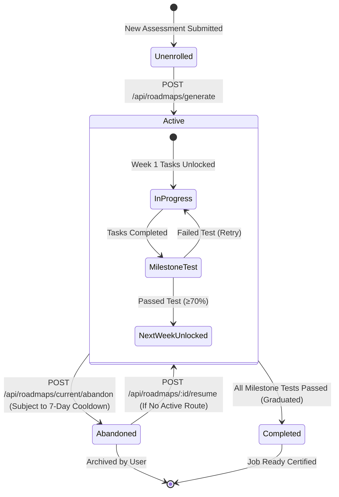
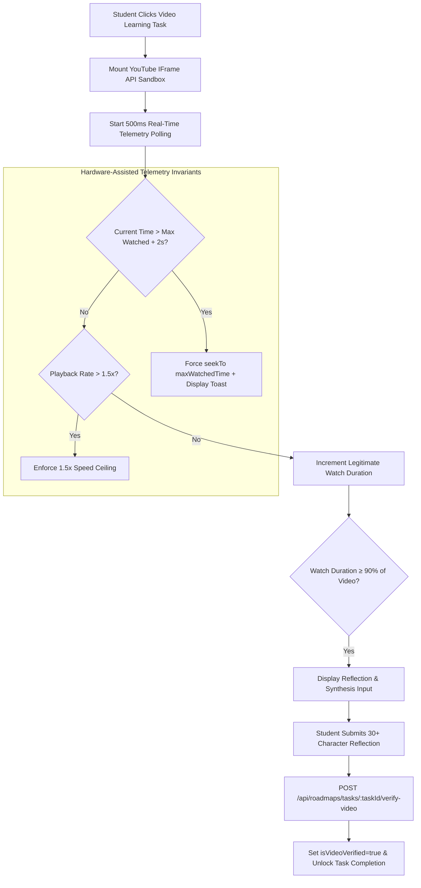

# 🗺️ CareerPath AI — Hardened Single Active Route & Job Ready Engine

> **🏆 Hack2Ignite 2026–27 · Technical Deep-Dive**  
> **Problem Statement ID:** ED-02 (AI Career Guidance and Skill Roadmap Platform)  
> **Authors:** Team 404 Brain Not Found  

---

## 🎯 Executive Summary

In traditional e-learning and edtech platforms, over **78% of students drop out due to "tutorial hopping"** — starting multiple simultaneous paths, jumping from roadmap to roadmap, and completing none.

CareerPath AI introduces the **Hardened Single Active Career Route & Gated Progression Engine**, engineered around two fundamental behavioral principles:
1. **Focus Through Invariant Discipline:** A student is strictly constrained to **one active roadmap at any time**, enforced by a database-level partial unique index.
2. **Lock Enrolling, Never Browsing:** Students are empowered to freely explore alternative careers, run What-If simulations, and inspect live job markets without restriction, but cannot enroll in a second route until their current one is completed or intentionally abandoned.

---

## 🏗️ State Machine Lifecycle



---

## 🛡️ Database & Controller Guard Architecture

### 1. MongoDB Partial Unique Index
```javascript
// server/models/Roadmap.js
RoadmapSchema.index(
  { user: 1 },
  { 
    unique: true, 
    partialFilterExpression: { status: 'active' } 
  }
);
```
- **Atomicity:** Even if two browser tabs submit requests within 1 millisecond, the MongoDB storage engine locks and writes the first, while rejecting the second with error code `11000`.

### 2. Application Layer Pre-Flight Check & Conflict Handling
```javascript
// server/controllers/roadmapController.js
const existingActive = await Roadmap.findOne({ user: req.user._id, status: 'active' });
if (existingActive) {
  return res.status(409).json({
    success: false,
    code: 'ACTIVE_ROUTE_IN_PROGRESS',
    message: 'An active career route is already in progress.',
    activeRoadmap: {
      id: existingActive._id,
      careerTitle: existingActive.careerTitle,
      progress: existingActive.progress
    }
  });
}
```

---

## ⏳ Non-Destructive Abandonment with 7-Day Rate-Limit

Students are not locked forever. When career goals genuinely shift, students can safely abandon their active route under strict anti-abuse rules:

1. **Non-Destructive Guarantee:**
   - Status updates from `'active'` to `'abandoned'`.
   - `abandonedAt` is timestamped.
   - **Zero Progress Loss:** All completed task checkboxes, quiz verification badges (`isQuizVerified`), and weekly test score records are **100% preserved**.
2. **7-Day Cooldown Window:**
   - `user.lastAbandonedRouteAt` records the timestamp.
   - If a student attempts to abandon again within 7 days ($604,800,000 \text{ ms}$), the request is rejected with `HTTP 429 ABANDON_COOLDOWN_ACTIVE`.
   - The UI displays an exact countdown of remaining days/hours.

---

## 🏆 4-Rule Industry Job Ready Certification

CareerPath AI completely eliminates meaningless automated completion certificates. To earn the **Job Ready Certified** credential, four industry criteria must simultaneously be satisfied:

```
┌────────────────────────────────────────────────────────────────────────┐
│               4-RULE INDUSTRY JOB READY CERTIFICATION                  │
├────────────────────────────────┬───────────────────────────────────────┤
│ 1. Overall Readiness Score ≥ 70│ Dynamic weighted evaluation of core,  │
│                                │ secondary, and tool competencies      │
├────────────────────────────────┼───────────────────────────────────────┤
│ 2. Verified Skills ≥ 4         │ Must possess at least 4 role-specific │
│                                │ skills validated via GitHub or Quiz   │
├────────────────────────────────┼───────────────────────────────────────┤
│ 3. Roadmap Progress ≥ 80%      │ Minimum 80% milestone task completion │
│                                │ or graduated via weekly test exams    │
├────────────────────────────────┼───────────────────────────────────────┤
│ 4. Zero Expired Skills         │ All skill credentials refreshed within│
│                                │ standard 90-day retention window      │
└────────────────────────────────┴───────────────────────────────────────┘
```

### Verification Matrix (`readinessService.js`)
```javascript
exports.evaluateJobReadyCertification = async function(userId) {
  const readiness = await calculateReadiness(userId);
  const user = await User.findById(userId);
  const activeRoadmap = await Roadmap.findOne({ user: userId, status: 'active' });
  const completedRoadmaps = await Roadmap.find({ user: userId, status: 'completed' });

  const passedRule1 = readiness.overallScore >= 70;
  const passedRule2 = (readiness.verifiedSkillsCount || 0) >= 4;
  const passedRule3 = (activeRoadmap && activeRoadmap.progress >= 80) || completedRoadmaps.length > 0;
  const passedRule4 = (readiness.expiredSkillsCount || 0) === 0;

  const isJobReady = passedRule1 && passedRule2 && passedRule3 && passedRule4;
  return {
    isJobReady,
    rules: {
      readinessScore: { passed: passedRule1, score: readiness.overallScore, threshold: 70 },
      verifiedSkills: { passed: passedRule2, count: readiness.verifiedSkillsCount, threshold: 4 },
      roadmapProgress: { passed: passedRule3, activeProgress: activeRoadmap ? activeRoadmap.progress : 0 },
      skillRetention: { passed: passedRule4, expiredCount: readiness.expiredSkillsCount || 0 }
    }
  };
};
```

---

## 5. 🛡️ AI Video Learning Dedication & Anti-Scrubbing Guard

To ensure genuine skill acquisition rather than superficial checkbox clicks, video milestone tasks in the student's roadmap are protected by the **AI Video Learning Dedication & Anti-Scrubbing Guard**:



### 5.1 Enforcement Mechanics
1. **Forward Scrub Prevention:** If a user drags the playback scrubber beyond `maxWatchedTime + 2` seconds, the player immediately rewinds back to the furthest legitimate timestamp and emits an alert: *"Forward scrubbing is disabled to ensure dedication."*
2. **Speed-Run Ceiling:** Playback rate is capped at `1.5x`. Attempts to run at `2.0x` or via third-party browser plugins trigger an automatic reset to `1.5x`.
3. **Reflective Synthesis Gate:** Reaching 90% watch time prompts an interactive reflection modal requiring at least 30 characters summarizing key architectural takeaways.
4. **Backend Validation:** `/api/roadmaps/tasks/:taskId/verify-video` validates that reported watch duration matches server expectations and stores the student reflection in `RoadmapTask.videoReflectionSummary`.

---

## 6. 🧪 Automated Verification Suite

Run the full verification suite to validate all 9 core assertions:
```bash
cd careerpath-ai/server
npm run test:hardened
```

**Verified Test Assertions:**
1. ✔ Pre-flight clean active roadmap state
2. ✔ Generate initial active career route (Full-Stack Developer)
3. ✔ Reject duplicate active route generation with HTTP 409 Conflict
4. ✔ Database-level partial unique index blocks concurrent bypass
5. ✔ Reject premature route abandonment during active 7-day cooldown (HTTP 429)
6. ✔ Perform non-destructive route abandonment and preserve quiz history
7. ✔ Generate new active route following safe abandonment
8. ✔ Evaluate 4-Rule Job Ready certification checklist
9. ✔ Idempotent weekly milestone test graduation
