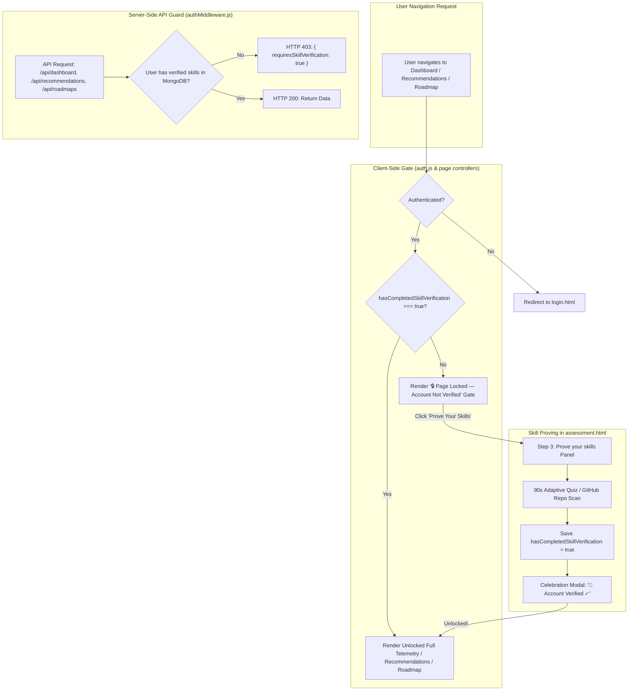

# Implementation Plan: Account Verification Gate & Skill-Proof Access Control
**CareerPath AI · Team 404 Brain Not Found**
*Hack2Ignite 2026-27*

---

## Goal Description

Implement an **Access Control & Skill Verification Gate** across CareerPath AI. Currently, users can navigate directly to `dashboard.html`, `recommendations.html`, and `roadmap.html` without verifying their skills. Under this plan:
1. **Access Lock:** Until a student proves their skills in Step 3 ("Prove your skills" via 90-second adaptive check or GitHub repo scan), all high-value pages (**Dashboard**, **Recommendations**, **Active Roadmap**) remain locked.
2. **Account Verified ✓ Badge:** Once a student proves their skills, their profile receives the permanent **`Account Verified ✓`** credential in MongoDB and in the navbar, instantly unlocking all pages.
3. **High-Aesthetic Locked Gates:** If an unverified user navigates directly to a locked page (via URL or menu), they are presented with a dedicated **Verification Gate** explaining why it is locked with a 1-click CTA to **[ Prove Your Skills Now ➔ ]**.
4. **Backend Security Guard:** Middleware on `/api/dashboard`, `/api/recommendations/generate`, and `/api/roadmaps` rejects unverified requests with HTTP 403, preventing API bypass.

---

## User Review Required

> [!IMPORTANT]
> **Verification Threshold:** Under this rule, a student must verify **at least 1 of their selected skills** (via either the 90-second micro-check or GitHub repository auto-detection) to unlock their account. Self-rated Beginner-only profiles with 0 Intermediate/Advanced skills will be prompted with a 60-second baseline concept check before unlocking.

> [!NOTE]
> Existing demo and test accounts with previously verified skills will immediately retain their `Account Verified ✓` status and remain completely unlocked.

---

## Open Questions

> [!TIP]
> 1. **Direct Navigation Behavior:** When an unverified user visits `dashboard.html` directly in the browser bar, would you prefer:
>    - **Option A (Recommended):** Display a high-impact in-page **"🔒 Dashboard Locked — Account Not Verified"** gate with an animated lock, explanation, and a direct `[ Prove Your Skills to Unlock ]` button.
>    - **Option B:** Immediately auto-redirect the browser to `assessment.html?step=3&gate=required`.
>    *(We plan to implement Option A with an auto-redirect fallback so users clearly see the platform's security and verification rigor).*

---

## Proposed Changes



---

### Component 1: Backend Middleware & API Guards

#### [MODIFY] `server/middleware/authMiddleware.js`
Add `requireSkillVerification` middleware that validates whether `req.user` has completed verification:
```javascript
/**
 * requireSkillVerification — Ensures user has completed "Prove your skills"
 * Blocks access to dashboard telemetry, recommendations, and roadmaps until verified.
 */
const requireSkillVerification = (req, res, next) => {
  if (!req.user) {
    return res.status(401).json({
      success: false,
      message: 'Access denied. Authentication required.',
    });
  }

  const isVerified = Boolean(
    req.user.hasCompletedSkillVerification ||
    (Array.isArray(req.user.skills) && req.user.skills.some((s) => s.isQuizVerified || s.isCodeVerified))
  );

  if (!isVerified) {
    return res.status(403).json({
      success: false,
      requiresSkillVerification: true,
      message: 'Skill verification required. Please complete "Prove your skills" in your assessment to unlock this section.',
      redirectUrl: 'assessment.html#proveSkillsPanel',
    });
  }

  next();
};

module.exports = { protect, authorize, requireSkillVerification };
```

#### [MODIFY] `server/routes/dashboardRoutes.js`
Protect `GET /api/dashboard` with `requireSkillVerification`:
```javascript
const { protect, requireSkillVerification } = require('../middleware/authMiddleware');
const { getDashboard } = require('../controllers/dashboardController');

router.get('/', protect, requireSkillVerification, getDashboard);
```

#### [MODIFY] `server/routes/recommendationRoutes.js`
Protect `POST /api/recommendations/generate` with `requireSkillVerification`:
```javascript
const { protect, requireSkillVerification } = require('../middleware/authMiddleware');
const { getRecommendations } = require('../controllers/recommendationController');

router.post('/generate', protect, requireSkillVerification, getRecommendations);
```

#### [MODIFY] `server/routes/roadmapRoutes.js`
Protect `POST /generate` and `GET /current` with `requireSkillVerification`:
```javascript
const { protect, requireSkillVerification } = require('../middleware/authMiddleware');

router.post('/generate', protect, requireSkillVerification, validateRoadmapGeneration, generateRoadmap);
router.get('/current', protect, requireSkillVerification, getCurrentRoadmap);
```

---

### Component 2: Client Auth State & Dynamic Navbar Badges

#### [MODIFY] `client/js/auth.js`
1. Add `isSkillVerified()` helper:
```javascript
isSkillVerified() {
  const user = this.getCurrentUser();
  if (!user) return false;
  return Boolean(
    user.hasCompletedSkillVerification ||
    (Array.isArray(user.skills) && user.skills.some((s) => s.isQuizVerified || s.isCodeVerified))
  );
},

requireSkillVerification() {
  this.requireAuth();
  if (!this.isSkillVerified()) {
    window.location.href = 'assessment.html?gate=verify-skills';
  }
},
```

2. Enhance `initNav()` to display **`Account Verified ✓`** (when verified) vs **`🔒 Unverified · Prove Skills`** (when unverified), plus lock indicators on protected links:
```javascript
if (this.isAuthenticated() && user) {
  const isVerified = this.isSkillVerified();
  
  const statusBadge = isVerified
    ? `<span class="badge bg-success-subtle text-success border border-success-subtle d-inline-flex align-items-center gap-1 px-2.5 py-1 rounded-pill font-mono" style="font-size:0.75rem;" title="Account Verified — All pages unlocked">
         <i class="bi bi-patch-check-fill text-success"></i>
         <span>Account Verified ✓</span>
       </span>`
    : `<a href="assessment.html#proveSkillsPanel" class="badge bg-warning-subtle text-warning border border-warning-subtle d-inline-flex align-items-center gap-1 px-2.5 py-1 rounded-pill text-decoration-none font-mono" style="font-size:0.75rem;" title="Prove your skills to unlock Dashboard & Roadmaps">
         <i class="bi bi-lock-fill text-warning"></i>
         <span>Unverified · Prove Skills</span>
       </a>`;

  authActions.innerHTML = `
    <div class="d-flex align-items-center gap-2">
      ${statusBadge}
      <a href="${isVerified ? 'dashboard.html' : 'assessment.html#proveSkillsPanel'}"
         class="d-none d-md-flex align-items-center gap-2 text-decoration-none text-nowrap"
         style="background:#EEF2FF;border:1px solid #C7D2FE;border-radius:20px;padding:0.35rem 0.9rem;">
        <i class="bi bi-person-circle" style="color:#4F46E5;font-size:1rem;"></i>
        <span style="color:#1E1B4B;font-size:0.85rem;font-weight:600;">${escapeHtml(user.name || 'Student')}</span>
      </a>
      <a href="${isVerified ? 'dashboard.html' : 'assessment.html#proveSkillsPanel'}" 
         class="btn cp-btn-primary btn-sm px-3 d-inline-flex align-items-center gap-1 text-nowrap ${!isVerified ? 'opacity-90' : ''}">
        <i class="bi ${isVerified ? 'bi-speedometer2' : 'bi-lock-fill'}"></i>
        <span>${isVerified ? 'Dashboard' : 'Verify to Unlock'}</span>
      </a>
      <button id="logoutBtn" class="btn btn-outline-danger btn-sm px-2 d-inline-flex align-items-center" onclick="Auth.logout()" title="Sign Out">
        <i class="bi bi-box-arrow-right"></i>
      </button>
    </div>
  `;
}
```

---

### Component 3: Dedicated In-Page Locked Gate UI

#### [MODIFY] `client/js/dashboard.js`, `client/js/recommendations.js`, `client/js/roadmap.js`
Add gate interceptor:
```javascript
// Verification Gate Check
if (!window.Auth?.isSkillVerified()) {
  renderVerificationGate('Dashboard', 'Your personal career telemetry, skill readiness scores, and milestone trackers');
  return;
}
```

Reusable Gate Renderer:
```javascript
function renderVerificationGate(pageName, description) {
  const container = document.getElementById('dashboardContent') || 
                    document.getElementById('recommendationsContainer') || 
                    document.getElementById('roadmapContent') || 
                    document.querySelector('main');
  if (!container) return;

  const loadingEl = document.getElementById('loadingState') || document.getElementById('roadmapLoading');
  if (loadingEl) loadingEl.classList.add('d-none');

  container.classList.remove('d-none');
  container.innerHTML = `
    <div class="row justify-content-center py-5">
      <div class="col-lg-8 col-xl-7">
        <div class="card p-4 p-md-5 text-center shadow-lg border border-warning-subtle" 
             style="background: radial-gradient(circle at top, rgba(234, 179, 8, 0.09), transparent 70%), var(--bg-card); border-radius: 1.25rem;">
          <div class="mb-3">
            <span class="badge bg-warning-subtle text-warning fs-6 px-3 py-1.5 rounded-pill border border-warning-subtle">
              <i class="bi bi-shield-lock-fill me-1"></i> Skill Verification Gate Active
            </span>
          </div>
          <div class="display-3 text-warning mb-3">
            <i class="bi bi-lock-fill"></i>
          </div>
          <h2 class="h3 fw-bold text-ink mb-2">${pageName} is Locked</h2>
          <p class="text-muted mb-4 lead" style="font-size: 1.05rem;">
            ${description} require verified skill data to generate. Complete <strong>"Prove your skills"</strong> in your assessment to earn your <strong>Account Verified ✓</strong> credential and unlock this page.
          </p>
          <div class="p-3 mb-4 rounded-3 stat-box-atlas text-start d-flex align-items-center gap-3 border border-line">
            <div class="rounded-circle p-2 bg-primary-subtle text-primary fs-4">
              <i class="bi bi-lightning-charge-fill"></i>
            </div>
            <div>
              <div class="fw-semibold text-ink">90-Second Adaptive Check</div>
              <div class="small text-muted">Answer 5 quick adaptive questions or auto-sync your GitHub repositories to verify.</div>
            </div>
          </div>
          <div class="d-flex justify-content-center gap-3 flex-wrap">
            <a href="assessment.html#proveSkillsPanel" class="btn cp-btn-primary px-4 py-2.5 fw-semibold d-inline-flex align-items-center gap-2">
              <i class="bi bi-shield-check"></i>
              <span>Prove Your Skills to Unlock</span>
              <i class="bi bi-arrow-right"></i>
            </a>
            <a href="index.html" class="btn btn-outline-secondary px-3 py-2.5">
              Back to Home
            </a>
          </div>
        </div>
      </div>
    </div>
  `;
}
```

---

### Component 4: Assessment Step 3 Gating & Instant Account Unlock

#### [MODIFY] `client/js/assessment.js`
1. **Disable "Continue to Goals" Until Proven:**
   - In Step 3, if `hasCompletedSkillVerification` is false, `step3ContinueBtn` is rendered in locked state:
     `<button disabled class="btn cp-btn-primary px-4 opacity-60"><i class="bi bi-lock-fill me-1"></i> Continue to Goals (Prove Skill First)</button>`.
2. **Instant Unlock on Verification:**
   - As soon as the student passes the skill check modal (or auto-detects from GitHub):
     - `hasCompletedSkillVerification = true` is set.
     - LocalStorage user updated.
     - `step3ContinueBtn` unlocks with green glow: `Continue to Goals <i class="bi bi-arrow-right"></i>`.
     - Celebration Toast: *"🎉 Account Verified ✓! Dashboard, Recommendations, and Active Roadmap are now unlocked!"*.
3. **Submission Guarantees:**
   - When the user submits Step 4, they smoothly transition directly to their unlocked `recommendations.html` or `dashboard.html`.

---

## Verification Plan

### Automated Tests
1. **API Protection Test (cURL / Node script):**
   - Attempt `GET http://localhost:5000/api/dashboard` with an unverified user's token.
   - **Expectation:** HTTP 403 Forbidden with `{ requiresSkillVerification: true }`.
2. **Post-Verification API Test:**
   - Mark `hasCompletedSkillVerification: true` on user document.
   - Re-attempt `GET http://localhost:5000/api/dashboard`.
   - **Expectation:** HTTP 200 OK with full student telemetry.

### Manual Verification
1. **Unverified Account Journey:**
   - Register a fresh user or sign in with an unverified account.
   - Click "Dashboard" in the navbar or navigate to `dashboard.html`.
   - **Verify:** The dedicated "🔒 Dashboard is Locked" gate renders cleanly.
   - Click "Prove Your Skills to Unlock".
   - **Verify:** Smoothly navigates to `assessment.html#proveSkillsPanel`.
2. **Skill Verification Execution:**
   - Select skills (e.g. JavaScript, HTML).
   - In "Prove your skills", click `[ Start check ]`.
   - Complete the 5-question micro-check.
   - **Verify:**
     - Modal shows "✓ Skill verified!".
     - Navbar immediately displays **`Account Verified ✓`** badge.
     - "Continue to Goals" button unlocks immediately.
3. **Full Access Confirmation:**
   - Submit assessment and open `dashboard.html`, `recommendations.html`, and `roadmap.html`.
   - **Verify:** All 3 pages open with 100% full access and zero lock screens.
