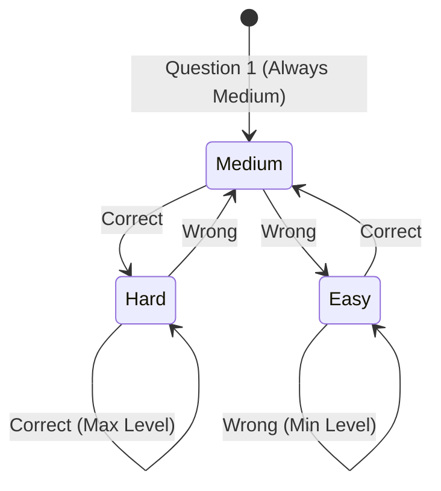

# Implementation Plan: Adaptive Skill Quiz & Reality-Check Verification ("You Said vs. Quiz Says")

> **Status:** Planning Mode Only — No implementation or code changes made.  
> **Brand:** CareerPath AI · **Track:** EduTech / AI for Good · **Team:** 404 Brain Not Found  
> **Core Concept:** *"Instead of blindly trusting what a student claims they know, test them with a 6-question adaptive micro-quiz, reveal the gap between claimed vs. actual proficiency, and weight their roadmap accordingly."*

---

## 1. Goal Description

Currently, CareerPath AI captures self-reported skill proficiencies (Beginner, Intermediate, Advanced) in `assessment.html`. However, **hackathon judges and recruiters always point out that self-assessments are inherently biased or inflated**.

This feature introduces an **Adaptive 6-Question Reality-Check Micro-Quiz**:
1. Students self-rate on skills during onboarding (e.g., *"JavaScript: Advanced"*).
2. The platform selects up to 3 core skills relevant to their target career (JavaScript, Python, SQL) and serves a **5-minute adaptive micro-quiz**.
3. **Adaptive Difficulty Engine:** Starts at **Medium**. Answering correctly triggers a **Hard** question; answering incorrectly drops to an **Easy** question.
4. **Immediate Educational Feedback:** After selecting an option, the student sees immediate right/wrong visual validation and a **punchy 1-line explanation**.
5. **The "Reality Check" Result Screen:** Contrasts *"You said: Advanced"* with *"Quiz says: Intermediate"*, explicitly listing weak topics (e.g., *"Work on closures and async/await"*).
6. **Confidence Badging & Algorithm Weighting:**
   - Skills verified by the quiz carry a glowing **`[Verified]`** badge.
   - Unverified skills carry a **`[Self-rated]`** badge.
   - In the 60/25/15 match algorithm, verified skills count with **100% confidence weight**, while self-rated skills count with **70% confidence weight**.
   - Roadmap generation automatically inserts targeted recovery tasks for topics failed in the quiz.

```
       ┌────────────────────────────────────────────────────────┐
       │                STUDENT ONBOARDING FLOW                 │
       └──────────────────────────┬─────────────────────────────┘
                                  │
                                  ▼
                     [ 1. Self-Rate in Assessment ]
                     "JavaScript: Advanced (4/5)"
                                  │
                                  ▼
                [ 2. Adaptive Micro-Quiz (6 Qs) ]
                     Starts at Medium Difficulty
                     Correct ──► Harder Next
                     Wrong   ──► Easier Next
                     Instant 1-line explanation per answer
                                  │
                                  ▼
               [ 3. Reality-Check Comparison Screen ]
              ┌─────────────────────────────────────────┐
              │  You Said: Advanced (Level 4/5)         │
              │  Quiz Says: Intermediate (Level 3/5)    │
              │  Gaps Detected: Closures, Event Loop    │
              │  Badge Awarded: [✓ Verified]            │
              └───────────────────┬─────────────────────┘
                                  │
                                  ▼
             [ 4. Weighted Recommendations & Roadmap ]
             • Verified skills count at 100% confidence
             • Self-rated skills count at 70% confidence
             • Weak topics (Closures) auto-scheduled in Week 1
```

---

## 2. User Review Required

> [!IMPORTANT]
> **User Journey Placement:** We propose hosting the micro-quiz on a dedicated, distraction-free screen: `client/quiz.html`. 
> - **Immediate Flow:** After clicking *"Save & Continue"* on `assessment.html`, the student is automatically transitioned to `quiz.html?skill=javascript` before viewing recommendations.
> - **Skip Option:** Students can click *"Skip to Recommendations"* at any time; skipped skills remain tagged as `[Self-rated]` (70% weight), preserving complete user freedom.

> [!IMPORTANT]
> **Algorithm Confidence Weighting:** As proposed, verified skills contribute **1.0x (100%)** to the skill score, while unverified self-ratings contribute **0.70x (70%)**. Please confirm if you want to keep 70% or adjust to another ratio.

---

## 3. Open Questions

1. **Retake Policy:** Should students be allowed to retake the quiz immediately if they are unhappy with their verified score, or should there be a learning gate (e.g., complete at least 2 roadmap tasks before retaking)?  
   *(Recommendation: Allow 1 immediate retake during hackathon demo mode for easy evaluator testing).*
2. **Skill Priority:** When a student selects 10+ skills, the system automatically picks the **top 3 foundational skills** (from JavaScript, Python, SQL) that appear most frequently in their career matches.

---

## 4. Adaptive Difficulty Engine & Rubric Rules

### Question Difficulty Transition Matrix



- **Question Count:** Exactly **6 questions** per skill.
- **Starting Level:** Question 1 is always **Medium**.
- **Adaptive Step Size:** $\pm 1$ difficulty tier per question.
- **Topic Extraction:** When an answer is wrong, the question's `topic` (e.g., `'joins'`, `'event-loop'`) is added to the student's `identifiedGaps` array.

### Final Verification Scoring Rubric
| Final Assigned Level | Exact Qualification Criteria | Numerical Level |
| :--- | :--- | :---: |
| **Advanced** | Answers at least **3 Hard questions correctly** (prevents lucky guesses) | **Level 3** (or 5/5) |
| **Intermediate** | Answers at least **3 Medium or Hard questions correctly**, but < 3 Hard | **Level 2** (or 3/5) |
| **Beginner** | Total correct answers $\le 2$, or fails Medium/Easy questions | **Level 1** (or 1/5) |

---

## 5. Curated 45-Question Bank (15 per Skill: 5 Easy, 5 Med, 5 Hard)

Each question is structured with: `id`, `skill`, `difficulty`, `topic`, `question`, `options`, `correctIndex`, `explanation`.

### A. JavaScript Question Bank (15 Questions)

#### Easy (5 Questions):
1. **Topic: Variables & Scope (`var` vs `let`)**  
   *Question:* What is the main difference between `var` and `let` in JavaScript?  
   *Options:*  
   A) `var` is block-scoped; `let` is function-scoped  
   B) `let` is block-scoped; `var` is function-scoped  
   C) `let` can be redeclared; `var` cannot  
   D) There is no difference  
   *Correct:* B  
   *Explanation:* `let` honors curly-brace `{}` block scope, whereas `var` is hoisted to the enclosing function scope.

2. **Topic: Data Types (Primitives)**  
   *Question:* What does `typeof null` return in JavaScript?  
   *Options:* A) `"null"` | B) `"undefined"` | C) `"object"` | D) `"number"`  
   *Correct:* C  
   *Explanation:* In JavaScript, `typeof null` returns `"object"` due to a legacy implementation quirk in the original JS engine.

3. **Topic: Array Methods (`map` vs `forEach`)**  
   *Question:* Which array method returns a brand-new array transformed by a callback function?  
   *Options:* A) `.forEach()` | B) `.map()` | C) `.filter()` | D) `.push()`  
   *Correct:* B  
   *Explanation:* `.map()` creates a new array with the results of calling the function on every element, whereas `.forEach()` returns `undefined`.

4. **Topic: Equality Operators (`==` vs `===`)**  
   *Question:* What is the result of `'5' == 5` and `'5' === 5`?  
   *Options:* A) `true` and `true` | B) `false` and `false` | C) `true` and `false` | D) `false` and `true`  
   *Correct:* C  
   *Explanation:* `==` performs type coercion before comparison, whereas `===` strictly checks both value and type without coercion.

5. **Topic: DOM Manipulation**  
   *Question:* Which method retrieves an HTML element using its unique ID?  
   *Options:* A) `document.getElementsByClassName()` | B) `document.querySelector()` | C) `document.getElementById()` | D) `document.findId()`  
   *Correct:* C  
   *Explanation:* `document.getElementById('id')` is the native DOM method designed for fast single-element lookup by ID.

#### Medium (5 Questions):
6. **Topic: Closures**  
   *Question:* What is a closure in JavaScript?  
   *Options:*  
   A) A function that immediately self-destructs after execution  
   B) A function bundled with references to its surrounding lexical state  
   C) A method to close browser tabs securely  
   D) A callback that only executes when an error occurs  
   *Correct:* B  
   *Explanation:* A closure gives an inner function access to its outer enclosing scope even after the outer function has finished executing.

7. **Topic: Asynchronous JavaScript (Promises)**  
   *Question:* What are the three possible states of a JavaScript Promise?  
   *Options:*  
   A) `starting`, `running`, `finished`  
   B) `pending`, `fulfilled`, `rejected`  
   C) `waiting`, `success`, `error`  
   D) `init`, `resolved`, `failed`  
   *Correct:* B  
   *Explanation:* Promises are state machines that begin as `pending` and settle as either `fulfilled` or `rejected`.

8. **Topic: Keyword `this` Binding**  
   *Question:* How do arrow functions handle the `this` keyword differently from regular functions?  
   *Options:*  
   A) Arrow functions create their own dynamic `this`  
   B) Arrow functions retain the `this` value of the enclosing lexical context  
   C) Arrow functions cannot use `this` at all  
   D) Arrow functions bind `this` to the global `window` exclusively  
   *Correct:* B  
   *Explanation:* Arrow functions do not define their own `this`; they lexically inherit `this` from the surrounding outer scope.

9. **Topic: Event Bubbling & Capturing**  
   *Question:* What does `event.stopPropagation()` accomplish when an event fires?  
   *Options:*  
   A) Cancels the default browser action (like following a hyperlink)  
   B) Prevents the event from traveling further up or down the DOM tree  
   C) Deletes the DOM node emitting the event  
   D) Pauses JavaScript execution entirely  
   *Correct:* B  
   *Explanation:* `stopPropagation()` halts the event from propagating (bubbling/capturing) to parent ancestor elements in the DOM.

10. **Topic: Destructuring & Rest/Spread**  
    *Question:* Given `const obj = { a: 1, b: 2 }; const copy = { ...obj, b: 3 };`, what is `copy.b`?  
    *Options:* A) `2` | B) `3` | C) `undefined` | D) Throws a SyntaxError  
    *Correct:* B  
    *Explanation:* Spread properties are evaluated left-to-right, so the later `b: 3` overwrites the earlier `b: 2` extracted from `obj`.

#### Hard (5 Questions):
11. **Topic: Event Loop & Microtask Queue**  
    *Question:* What is the exact execution order of: `console.log(1); setTimeout(() => console.log(2), 0); Promise.resolve().then(() => console.log(3)); console.log(4);`?  
    *Options:* A) `1, 2, 3, 4` | B) `1, 4, 2, 3` | C) `1, 4, 3, 2` | D) `1, 3, 4, 2`  
    *Correct:* C  
    *Explanation:* Synchronous code runs first (`1, 4`), then the Microtask queue (`Promise.then` $\to$ `3`), and finally the Macrotask queue (`setTimeout` $\to$ `2`).

12. **Topic: Prototypal Inheritance**  
    *Question:* What occurs when accessing a property on an object that does not exist directly on that object?  
    *Options:*  
    A) Throws an immediate ReferenceError  
    B) JavaScript traverses the object's `__proto__` chain until found or reaches `null`  
    C) Automatically instantiates the missing property as `null`  
    D) Clones the prototype object into memory  
    *Correct:* B  
    *Explanation:* JavaScript uses prototype chaining, looking up parent prototypes sequentially until finding the property or ending at `null`.

13. **Topic: Debouncing vs Throttling**  
    *Question:* What is the behavioral difference between debouncing and throttling a function?  
    *Options:*  
    A) Debounce guarantees execution once every N ms; throttle delays until activity stops  
    B) Debounce delays execution until N ms of inactivity; throttle guarantees execution at most once every N ms  
    C) Debounce is for scroll events only; throttle is for keystroke events only  
    D) They are identical terms for rate-limiting  
    *Correct:* B  
    *Explanation:* Debouncing bunches rapid events into one trailing execution, while throttling enforces a strict maximum execution rate over time.

14. **Topic: Memory Leaks & WeakMaps**  
    *Question:* Why would an engineer use a `WeakMap` instead of a regular `Map` for object caching?  
    *Options:*  
    A) `WeakMap` keys are weakly held, allowing garbage collection when no other references exist  
    B) `WeakMap` supports primitive keys like strings and numbers  
    C) `WeakMap` is always faster for small arrays  
    D) `WeakMap` can be iterated with `.forEach()`  
    *Correct:* A  
    *Explanation:* `WeakMap` keys must be objects and do not prevent garbage collection, making them immune to memory leaks when objects are deleted.

15. **Topic: Currying & Higher-Order Functions**  
    *Question:* What does currying a function `f(a, b, c)` transform it into?  
    *Options:*  
    A) `f(a)(b)(c)`  
    B) `[a, b, c].map(f)`  
    C) `Promise.all([a, b, c])`  
    D) An async generator  
    *Correct:* A  
    *Explanation:* Currying translates a function callable as `f(a, b, c)` into a sequence of unary nested functions callable as `f(a)(b)(c)`.

---

### B. Python Question Bank (15 Questions)

#### Easy (5 Questions):
1. **Topic: Mutable vs Immutable Types**  
   *Question:* Which of the following Python data types is immutable?  
   *Options:* A) `list` | B) `dict` | C) `set` | D) `tuple`  
   *Correct:* D  
   *Explanation:* Tuples cannot be modified after instantiation, unlike lists, dictionaries, and sets.

2. **Topic: List Slicing**  
   *Question:* What does `nums[::-1]` return for the list `nums = [1, 2, 3, 4]`?  
   *Options:* A) `[1, 2, 3, 4]` | B) `[4, 3, 2, 1]` | C) `[4]` | D) SyntaxError  
   *Correct:* B  
   *Explanation:* A step argument of `-1` reverses the sequence from end to beginning.

3. **Topic: Dictionary Lookups**  
   *Question:* What is the safest way to retrieve a key from a dictionary without raising a `KeyError` if it is missing?  
   *Options:* A) `dict[key]` | B) `dict.get(key, default)` | C) `dict.fetch(key)` | D) `dict.find(key)`  
   *Correct:* B  
   *Explanation:* `dict.get()` returns `None` (or a custom fallback default) when the key does not exist.

4. **Topic: Function Arguments**  
   *Question:* What does `*args` unpack in a Python function definition?  
   *Options:* A) Keyword arguments as a dictionary | B) Arbitrary positional arguments as a tuple | C) Global variables | D) Type hints  
   *Correct:* B  
   *Explanation:* `*args` collects extra positional arguments into an immutable tuple, while `**kwargs` collects keyword arguments into a dictionary.

5. **Topic: String Formatting**  
   *Question:* Which syntax denotes a modern Python 3.6+ f-string?  
   *Options:* A) `f"Hello {name}"` | B) `"Hello %s" % name` | C) `"Hello {}".format(name)` | D) `$"Hello {name}"`  
   *Correct:* A  
   *Explanation:* Formatted string literals (f-strings) prefix the string with `f` and interpolate variables directly inside `{}`.

#### Medium (5 Questions):
6. **Topic: List Comprehensions & Filtering**  
   *Question:* What is the output of `[x**2 for x in range(5) if x % 2 == 0]`?  
   *Options:* A) `[0, 1, 4, 9, 16]` | B) `[0, 4, 16]` | C) `[1, 9]` | D) `[4, 16]`  
   *Correct:* B  
   *Explanation:* Even numbers in `range(5)` are `0, 2, 4`. Squaring them yields `0, 4, 16`.

7. **Topic: Generators & Yield**  
   *Question:* What is the primary benefit of using `yield` in a function instead of `return`?  
   *Options:*  
   A) The function executes on multiple threads  
   B) It returns an iterator that computes values lazily one-by-one, saving memory  
   C) It automatically caches all results in Redis  
   D) It runs faster than compiled C code  
   *Correct:* B  
   *Explanation:* `yield` produces a generator that evaluates items on-demand (lazy evaluation), maintaining minimal memory footprints.

8. **Topic: Context Managers (`with` statement)**  
   *Question:* Which magic dunder methods must a Python class implement to work with a `with` statement?  
   *Options:*  
   A) `__open__` and `__close__`  
   B) `__enter__` and `__exit__`  
   C) `__start__` and `__stop__`  
   D) `__init__` and `__del__`  
   *Correct:* B  
   *Explanation:* The context management protocol relies on `__enter__` (setup) and `__exit__` (teardown/cleanup).

9. **Topic: Shallow vs Deep Copy**  
   *Question:* If `b = copy.copy(a)` for a nested list `a = [[1, 2], [3, 4]]`, what happens if you mutate `a[0][0] = 99`?  
   *Options:*  
   A) `b` remains completely unchanged  
   B) `b[0][0]` also becomes `99` because inner lists share references  
   C) Raises an AttributeError  
   D) Python clones the entire memory hierarchy automatically  
   *Correct:* B  
   *Explanation:* A shallow copy duplicates the outer container but retains references to nested mutable child objects. `copy.deepcopy()` is needed for full recursion.

10. **Topic: Decorators**  
    *Question:* What fundamentally is a Python decorator?  
    *Options:*  
    A) A CSS stylesheet applied to Python GUI applications  
    B) A function that takes another function as an argument and returns an enhanced function  
    C) A class that can only be instantiated once (Singleton)  
    D) A compiler directive to speed up loops  
    *Correct:* B  
    *Explanation:* Decorators are higher-order functions that wrap another function to extend its behavior without modifying its original source code.

#### Hard (5 Questions):
11. **Topic: Global Interpreter Lock (GIL)**  
    *Question:* What is the practical implication of CPython's GIL on multi-threaded programs?  
    *Options:*  
    A) Prevents race conditions completely across all data structures  
    B) Restricts execution to only one native thread running Python bytecode at any given moment, limiting CPU-bound speedups  
    C) Disallows asynchronous I/O networking  
    D) Forces all variables to be statically typed  
    *Correct:* B  
    *Explanation:* The GIL prevents concurrent multi-core execution of Python bytecodes in threads, meaning CPU-bound tasks must use multiprocessing rather than threading.

12. **Topic: Metaclasses (`type`)**  
    *Question:* In Python's object model, what is the default metaclass responsible for creating classes?  
    *Options:* A) `object` | B) `type` | C) `ClassFactory` | D) `abc.ABCMeta`  
    *Correct:* B  
    *Explanation:* In Python, classes are instances of the metaclass `type` (`type` creates classes, and classes create object instances).

13. **Topic: Descriptors Protocol**  
    *Question:* Which three methods comprise Python's descriptor protocol?  
    *Options:*  
    A) `__get__`, `__set__`, `__delete__`  
    B) `__read__`, `__write__`, `__remove__`  
    C) `__getattr__`, `__setattr__`, `__delattr__`  
    D) `__call__`, `__init__`, `__new__`  
    *Correct:* A  
    *Explanation:* Descriptors customize attribute access by defining any of `__get__`, `__set__`, or `__delete__` on an object assigned as a class attribute.

14. **Topic: Garbage Collection & Reference Cycles**  
    *Question:* How does CPython detect and reclaim memory from circular references (e.g. `obj_a.ref = obj_b; obj_b.ref = obj_a`)?  
    *Options:*  
    A) Pure reference counting handles all circular references automatically  
    B) A cyclic generational garbage collector inspects isolated reference graphs periodically  
    C) The operating system automatically sweeps Python heaps upon thread exit  
    D) Circular references cause unrecoverable memory leaks in Python  
    *Correct:* B  
    *Explanation:* While reference counting is CPython's primary GC mechanism, a secondary generational cyclic garbage collector identifies and frees self-referential cycles.

15. **Topic: `asyncio` Event Loop & Coroutines**  
    *Question:* What occurs if a coroutine executes a synchronous blocking call like `time.sleep(5)` instead of `await asyncio.sleep(5)`?  
    *Options:*  
    A) `asyncio` spins up a background worker thread automatically  
    B) The entire single-threaded event loop freezes for 5 seconds, blocking all other scheduled concurrent tasks  
    C) The blocking call is immediately cancelled  
    D) Raises a `BlockingIOError`  
    *Correct:* B  
    *Explanation:* `time.sleep()` blocks the operating system thread, freezing the event loop so no other coroutines can advance until it finishes.

---

### C. SQL & Relational Databases Question Bank (15 Questions)

#### Easy (5 Questions):
1. **Topic: Basic Filtering (`WHERE` clause)**  
   *Question:* Which SQL keyword filters rows before any groupings are applied?  
   *Options:* A) `HAVING` | B) `WHERE` | C) `ORDER BY` | D) `GROUP BY`  
   *Correct:* B  
   *Explanation:* `WHERE` filters individual table rows before aggregation, while `HAVING` filters aggregated groups after `GROUP BY`.

2. **Topic: Sorting Records**  
   *Question:* Which SQL clause sorts the result set in descending order by salary?  
   *Options:* A) `ORDER BY salary DESC` | B) `SORT BY salary DOWN` | C) `GROUP BY salary DESC` | D) `FILTER BY salary DESC`  
   *Correct:* A  
   *Explanation:* `ORDER BY <column> DESC` sorts records in descending order (highest to lowest).

3. **Topic: Unique Values (`DISTINCT`)**  
   *Question:* Which keyword eliminates duplicate rows from a query result?  
   *Options:* A) `UNIQUE` | B) `DISTINCT` | C) `DIFFERENT` | D) `SINGLE`  
   *Correct:* B  
   *Explanation:* `SELECT DISTINCT column_name FROM table;` returns only unique, deduplicated values.

4. **Topic: NULL Comparisons**  
   *Question:* What is the proper SQL syntax to check if a column `email` has no value?  
   *Options:* A) `email = NULL` | B) `email IS NULL` | C) `email == NULL` | D) `email.isNull()`  
   *Correct:* B  
   *Explanation:* Because `NULL` represents an unknown value, direct equality (`= NULL`) evaluates to `UNKNOWN` (falsy); `IS NULL` must be used.

5. **Topic: Primary Keys**  
   *Question:* What two constraints are automatically enforced on a relational `PRIMARY KEY` column?  
   *Options:* A) `NOT NULL` and `UNIQUE` | B) `INDEX` and `FOREIGN KEY` | C) `DEFAULT 0` and `CHECK` | D) `AUTO_INCREMENT` and `CASCADE`  
   *Correct:* A  
   *Explanation:* A primary key must uniquely identify each record and therefore cannot contain duplicate values or `NULL`s.

#### Medium (5 Questions):
6. **Topic: Joins (`INNER` vs `LEFT`)**  
   *Question:* What does a `LEFT JOIN` return when a row in the left table has no matching row in the right table?  
   *Options:*  
   A) The row is completely excluded from the result set  
   B) The left row is returned with `NULL` in all right table columns  
   C) Throws an unhandled foreign key exception  
   D) Generates a Cartesian cross-product  
   *Correct:* B  
   *Explanation:* `LEFT JOIN` preserves all rows from the left table, populating right-table fields with `NULL` when no match exists.

7. **Topic: Aggregations (`HAVING` vs `WHERE`)**  
   *Question:* Which query correctly selects departments with an average salary greater than 50,000?  
   *Options:*  
   A) `SELECT dept, AVG(salary) FROM emp WHERE AVG(salary) > 50000 GROUP BY dept;`  
   B) `SELECT dept, AVG(salary) FROM emp GROUP BY dept HAVING AVG(salary) > 50000;`  
   C) `SELECT dept, AVG(salary) FROM emp HAVING salary > 50000;`  
   D) `SELECT dept FROM emp WHERE salary > 50000;`  
   *Correct:* B  
   *Explanation:* Aggregate conditions like `AVG()` cannot be placed in a `WHERE` clause; they must be evaluated in a `HAVING` clause after `GROUP BY`.

8. **Topic: ACID Transactions**  
   *Question:* What does the **Isolation** property in ACID database transactions guarantee?  
   *Options:*  
   A) Data is backed up to an isolated geographic data center  
   B) Concurrent transactions execute without interfering with one another's intermediate states  
   C) Either all transaction operations complete or none do  
   D) Committed data survives system crashes  
   *Correct:* B  
   *Explanation:* Isolation ensures that multiple transactions occurring simultaneously do not see each other's uncommitted, in-flight operations.

9. **Topic: Database Indexing (B-Tree)**  
   *Question:* What is the primary operational trade-off of adding multiple indexes to a database table?  
   *Options:*  
   A) Faster `SELECT` queries at the cost of slower `INSERT`, `UPDATE`, and `DELETE` operations  
   B) Slower `SELECT` queries but faster writes  
   C) Eliminates all need for normalized foreign keys  
   D) Disallows table partitioning  
   *Correct:* A  
   *Explanation:* Indexes accelerate data retrieval (`SELECT`), but every write operation (`INSERT/UPDATE/DELETE`) must update both the table and its associated B-Tree index structures.

10. **Topic: Subqueries vs `EXISTS`**  
    *Question:* Why is `WHERE EXISTS (SELECT 1 ...)` often more performant than `WHERE id IN (SELECT id ...)` for large datasets?  
    *Options:*  
    A) `EXISTS` short-circuits as soon as the first matching record is found  
    B) `IN` cannot handle integer comparisons  
    C) `EXISTS` runs directly on the client rather than the server  
    D) `IN` disables all B-tree indexes  
    *Correct:* A  
    *Explanation:* `EXISTS` stops searching immediately upon discovering the first match (boolean short-circuit), whereas naive `IN` subqueries may materialize the entire dataset.

#### Hard (5 Questions):
11. **Topic: Window Functions (`ROW_NUMBER` vs `RANK` vs `DENSE_RANK`)**  
    *Question:* If two rows tie for 1st place, what ranks do `RANK()` and `DENSE_RANK()` assign to the next row?  
    *Options:*  
    A) `RANK()` assigns 3; `DENSE_RANK()` assigns 2  
    B) `RANK()` assigns 2; `DENSE_RANK()` assigns 3  
    C) Both assign 2  
    D) Both assign 3  
    *Correct:* A  
    *Explanation:* `RANK()` leaves gaps after ties (`1, 1, 3`), whereas `DENSE_RANK()` does not leave gaps (`1, 1, 2`).

12. **Topic: Transaction Isolation Levels & Phantom Reads**  
    *Question:* Which SQL transaction isolation level prevents dirty reads, non-repeatable reads, AND phantom reads?  
    *Options:* A) `READ UNCOMMITTED` | B) `READ COMMITTED` | C) `REPEATABLE READ` | D) `SERIALIZABLE`  
    *Correct:* D  
    *Explanation:* `SERIALIZABLE` is the highest isolation level; it completely eliminates phantom reads via range locks or snapshot isolation.

13. **Topic: Common Table Expressions (Recursive CTEs)**  
    *Question:* What two query parts are mandatory when constructing a `WITH RECURSIVE` CTE?  
    *Options:*  
    A) An Anchor member and a Recursive member joined by `UNION ALL`  
    B) A `CURSOR` and a `WHILE` loop  
    C) A `TRIGGER` and an `INSERT` statement  
    D) A `VIEW` and a `STORED PROCEDURE`  
    *Correct:* A  
    *Explanation:* Recursive CTEs require an initial non-recursive anchor query, combined via `UNION` or `UNION ALL` with a recursive query that references the CTE itself until an empty termination set is reached.

14. **Topic: Index Coverage & SARGability**  
    *Question:* Why does the clause `WHERE YEAR(created_at) = 2026` fail to use an index on `created_at`?  
    *Options:*  
    A) Because `created_at` is a reserved SQL keyword  
    B) Wrapping a column in a function prevents the query optimizer from using index seeks (non-SARGable)  
    C) Indexes only work with string columns  
    D) `YEAR()` automatically converts tables to full table scans in all databases  
    *Correct:* B  
    *Explanation:* Expressions on indexed columns (non-SARGable) force a full scan because index keys cannot be directly matched. The SARGable alternative is `WHERE created_at >= '2026-01-01' AND created_at < '2027-01-01'`.

15. **Topic: Query Optimization (`EXPLAIN ANALYZE`)**  
    *Question:* In an `EXPLAIN ANALYZE` execution plan, what does a `Seq Scan` (Sequential Scan) on a table with 10 million rows indicate?  
    *Options:*  
    A) The database used the fastest hardware index available  
    B) The query read every disk block sequentially because no suitable index was matched or costed lower  
    C) The database successfully executed the query from RAM cache  
    D) An index was created automatically during runtime  
    *Correct:* B  
    *Explanation:* A Sequential Scan reads the entire table from beginning to end without utilizing index pointers, causing major I/O bottlenecks on large tables.

---

## 6. Proposed Code Changes & Architecture

### Backend Extensions

#### 1. [MODIFY] `server/models/User.js`
Extend `SkillSchema` to store quiz verification data:
```javascript
// Inside SkillSchema (server/models/User.js)
selfRatedProficiency: {
  type: String,
  enum: ['beginner', 'intermediate', 'advanced'],
},
isQuizVerified: {
  type: Boolean,
  default: false,
},
verifiedProficiency: {
  type: String,
  enum: ['beginner', 'intermediate', 'advanced'],
  default: null,
},
quizTelemetry: {
  score: { type: Number, default: 0 }, // e.g. 5/6
  questionsAnswered: { type: Number, default: 0 },
  identifiedGaps: [{ type: String }], // e.g. ['closures', 'event-loop']
  verifiedAt: { type: Date, default: null },
}
```

#### 2. [NEW] `server/data/quizQuestions.js`
Export the vetted 45 questions defined in Section 5 above with helper lookup methods by `skill` and `difficulty`.

#### 3. [NEW] `server/services/quizService.js`
Core business logic:
- `startQuiz(userId, skillName)`: Selects initial Medium question, initializes session state.
- `evaluateAnswer(sessionId, questionId, selectedIndex)`: Checks answer, calculates next adaptive difficulty (Easy/Med/Hard), tracks gaps, records one-line explanation.
- `finalizeQuiz(userId, skillName, sessionData)`: Applies the qualification rubric (Section 4), persists verified level to `User.skills`, and updates `identifiedGaps`.

#### 4. [NEW] `server/controllers/quizController.js` & `server/routes/quizRoutes.js`
REST API Endpoints:
- `POST /api/quiz/start`: Initializes adaptive quiz session for a skill (`{ skill: 'javascript' }`).
- `POST /api/quiz/answer`: Submits option choice, returns `{ isCorrect, explanation, nextQuestion, currentStep, totalSteps }`.
- `POST /api/quiz/finish`: Returns reality-check summary comparing self-rating vs quiz result, and updates the user's profile.

#### 5. [MODIFY] `server/services/recommendationService.js`
Incorporate verification confidence weights into the 60% skill score:
```javascript
// Confidence multiplier: 1.0 if quiz-verified, 0.70 if self-rated
const confidenceWeight = userSkill.isQuizVerified ? 1.0 : 0.70;
const weightedEarned = importanceWeight * proficiencyRatio * confidenceWeight;
totalWeightedEarnedPoints += weightedEarned;
```
If a student has `quizTelemetry.identifiedGaps` for a skill, these specific topics are automatically marked as high-priority tasks in `server/controllers/roadmapController.js`.

---

### Frontend UI Extensions

#### 1. [NEW] `client/quiz.html` & `client/js/quiz.js` & `client/css/quiz.css`
A distraction-free, 3-screen interface matching the existing light theme (`tokens.css`):
* **Screen 1 (Intro):** "Ready for your reality check on [Skill]? 6 adaptive questions. Take 2 minutes."
* **Screen 2 (Active Question):**
  - Progress bar: `Question 3 of 6`
  - Difficulty indicator badge: `[Medium]` / `[Hard]`
  - Clean radio option cards with hover elevation.
  - Instant visual feedback: Correct turns `#16A34A` (green), Incorrect turns `#DC2626` (red) with 1-line punchy explanation displayed below.
  - *"Next Question"* action button.
* **Screen 3 (Reality-Check Summary):**
  - **Comparison Card:**
    ```
    ┌──────────────────────────┬──────────────────────────┐
    │ 🗣️ You Said              │ 🎯 Quiz Says             │
    │ Advanced (Level 4/5)     │ Intermediate (Level 3/5) │
    └──────────────────────────┴──────────────────────────┘
    ```
  - **Actionable Gap Highlights:** *"Target for improvement: Closures, Event Loop"*
  - **Badging:** Glowing **`[✓ Verified by Quiz]`** badge unlocked.
  - Action CTA: *"Next Skill Quiz"* or *"View My Verified Career Recommendations"*.

#### 2. [MODIFY] `client/js/assessment.js`
After saving assessment data via `PUT /api/assessment`:
- If the student selected any of `['javascript', 'python', 'sql']`, prompt: *"Would you like to verify your skills with a 2-minute reality-check quiz?"*
- Route to `quiz.html?skill=javascript` or directly to `recommendations.html`.

#### 3. [MODIFY] `client/recommendations.html` & `client/dashboard.html` & `client/roadmap.html`
Render the pill badge next to skills:
- **Verified:** `<span class="badge bg-success-subtle text-success border border-success"><i class="bi bi-patch-check-fill me-1"></i> Verified</span>`
- **Self-Rated:** `<span class="badge bg-secondary-subtle text-secondary border border-secondary"><i class="bi bi-person-fill me-1"></i> Self-Rated (70% Confidence)</span>`

---

## 7. What to Tell Hackathon Judges (The Winning Pitch)

When presenting, Sanika or Parth can deliver this punchy explanation:

> *"Most career guidance tools blindly trust what students say about themselves on registration forms. If a student claims they are 'Advanced in JavaScript', existing tools assume they're ready for senior developer jobs.
> 
> CareerPath AI doesn't rely on guesswork. We run an **adaptive 6-question micro-quiz** that gets harder when students answer correctly and drops difficulty when they struggle.
> 
> At the end, we give students an honest **Reality Check**: 'You said Advanced, but the quiz says Intermediate — here are your exact gaps in closures and async.'
> 
> Verified skills count at 100% weight in our matching algorithm, while self-ratings carry a confidence penalty. This gives recruiters real signal over noise and gives students an honest roadmap they can actually rely on."*

---

## 8. Honest Limitations (To Disclose Proactively to Judges)

1. **Knowledge vs. Real-world Building:** An adaptive quiz tests conceptual and architectural knowledge. Real coding ability is complemented by our **GitHub repository code audit** (which scans actual git commits).
2. **Estimation Scope:** 6 questions provide a dependable statistical estimate, not a university accreditation. We use the label **"Quiz-Verified"**, not "Certified".
3. **Core Trio:** We launch with the 3 most universal technical competencies (JavaScript, Python, SQL) before expanding into non-technical or scenario-based domains.

---

## 9. Verification Plan

Since this plan is strictly in **planning mode**, execution will follow this verification pipeline once approved:

### Automated Testing:
- Write unit tests in `server/tests/quizService.test.js` simulating:
  1. Student answering all 6 correctly $\to$ verifies difficulty stays at Hard and awards Advanced level.
  2. Student alternating right/wrong $\to$ verifies adaptive stepping and awards Intermediate level.
  3. Student failing all questions $\to$ verifies level drops to Beginner and extracts all 6 topics as gaps.
  4. 60/25/15 scoring test ensuring verified skills yield higher match points than identical self-rated skills.

### Manual Verification:
1. Complete `/assessment.html` selecting JavaScript as "Advanced".
2. Take the 6-question quiz on `quiz.html`. Intentionally fail closures and async questions.
3. Observe the Reality-Check screen: verify that the comparison displays "You said Advanced, Quiz says Intermediate" and lists closures as gaps.
4. Check `recommendations.html` and `roadmap.html`: verify that the `[Verified]` badge is rendered and Week 1 roadmap tasks include closures.
