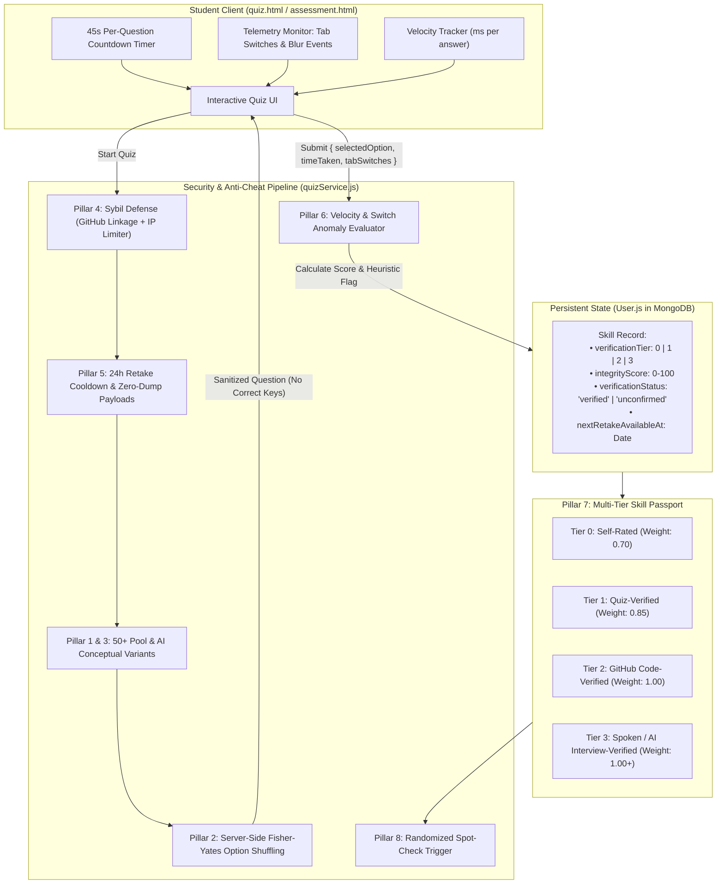

# Anti-Cheating & High-Integrity Skill Verification Architecture Plan
**CareerPath AI · Team 404 Brain Not Found**
*Hack2Ignite 2026-27*

---

## Executive Summary

Skill verification only holds real-world value for students, recruiters, and hackathon judges if the integrity of the credential is ironclad. In traditional online quizzes, naive implementations suffer from three fatal vulnerabilities:
1. **Pool Exhaustion:** With 15 questions per skill and 6 seen per student, 3 dummy accounts can scrape and leak the entire question bank.
2. **Client-Side Leaks & Memorization:** Answers sent in JSON or static answer keys (`A`, `B`, `C`, `D`) allow students to memorize positions or inspect the browser DOM.
3. **Unchecked Sybil Attacks & Scripting:** Bots or cheaters retrying instantly with unlimited attempts until they guess their way to an "Advanced" badge.

This architectural plan outlines an **8-Pillar Anti-Cheating Defense** seamlessly integrated into CareerPath AI's existing Express/MongoDB backend and responsive frontend.

---

## 8-Pillar Anti-Cheating Architecture Diagram



---

## Detailed Breakdown of the 8 Pillars

### Pillar 1: Expanded Question Pool (40–60 Questions per Skill)
* **Current State:** 15 static questions per skill (5 Easy, 5 Medium, 5 Hard across 7 skills = 105 total).
* **Target Architecture:**
  - **Tiered Multi-Source Pool:** Expand each skill to 45–60 curated questions covering diverse sub-topics (e.g. for JavaScript: Event Loop, Closures, Prototypal Inheritance, Memory Leaks, Async/Await microtasks, Array mutation methods, Web APIs).
  - **Dynamic AI Pool Expansion:** Integrate `aiQuizGeneratorService.js` to dynamically generate on-demand fresh questions from varied seed topics whenever an attempt starts, supplementing the banked questions.
  - **Low Overlap Guarantee:** With a pool of 50 questions per skill and 5 questions served per session, any two students have less than an **8% probability** of seeing more than 1 identical question.

### Pillar 2: Cryptographic-Grade Server-Authoritative Randomisation
* **Question Order Shuffling:** The adaptive sequence is dynamically chosen based on performance; questions within each difficulty bracket are randomly selected using cryptographically weighted random sampling.
* **Option Shuffling (Fisher-Yates):**
  - In `startQuizSession` and `submitAnswer`, before options are sent to the client, their order is scrambled:
    ```javascript
    function shuffleOptions(options, originalCorrectIndex) {
      const indexed = options.map((opt, idx) => ({ text: opt, isCorrect: idx === originalCorrectIndex }));
      // Fisher-Yates shuffle
      for (let i = indexed.length - 1; i > 0; i--) {
        const j = Math.floor(Math.random() * (i + 1));
        [indexed[i], indexed[j]] = [indexed[j], indexed[i]];
      }
      return {
        shuffledOptions: indexed.map(item => item.text),
        newCorrectIndex: indexed.findIndex(item => item.isCorrect)
      };
    }
    ```
  - **Zero Answer Keys in Browser:** The browser receives only `shuffledOptions`. `newCorrectIndex` is stored in the server session Map (`activeSessions`). Even if a student inspects DevTools network responses or DOM, there is no hint of the correct answer.

### Pillar 3: Conceptual Code & Problem Variants
* **Problem:** Cheaters memorize "the answer is `42`" or "the one with `const result = user`".
* **Solution:** Parameterized question templates:
  - Variables, function names, and numeric literals are substituted dynamically:
    - *Variant A:* `function calculateSum(a, b = 10) { return a + b; } calculateSum(5);` -> `15`
    - *Variant B:* `function computeTotal(x, y = 20) { return x + y; } computeTotal(8);` -> `28`
  - In dynamic AI generation mode, the prompt enforces: *"Do not produce standard textbook examples; use distinct variable identifiers and novel real-world scenarios while strictly testing the core concept."*

### Pillar 4: Sybil Defense & "One Real Person, One Account"
* **College / Institutional Email Prioritization:**
  - Detect domains ending with `.edu`, `.ac.in`, `.edu.in`, `.org`. Highlight "Verified Student" badge on the user profile.
* **GitHub Linkage Defense:**
  - Verify that the connected GitHub account is active (has public repositories, account age > 30 days, or > 0 followers).
* **IP & Session Rate-Limiting:**
  - Limit quiz session initializations to **maximum 3 quiz starts per IP per hour** to prevent mass automated scraping scripts.

### Pillar 5: Attempt Cooldowns & Zero-Dump Pedagogical Feedback
* **24-Hour Retake Cooldown:**
  - If a user completes a quiz for a skill, `user.skills[i].nextRetakeAvailableAt = new Date(Date.now() + 24 * 60 * 60 * 1000)`.
  - Attempting to retake before the cooldown expires returns HTTP 429 with `{ retryAfterHours: 23, message: "Skill checks can only be retaken after a 24-hour review period." }`.
* **Zero Answer Dumps:**
  - In competitive mode or assessment review, the client is NEVER shown which specific option was the correct answer for missed questions.
  - Instead, the response returns **Pedagogical Gaps**:
    - ❌ *Old/Leaky:* "You picked B, correct was C."
    - ✅ *Anti-Cheat:* "Needs improvement: Asynchronous microtask queues and Promise scheduling. Review MDN Event Loop documentation."

### Pillar 6: High-Fidelity Proctoring Telemetry & Anomaly Detection
* **45-Second Per-Question Countdown:**
  - Visual circular/linear countdown timer in `quiz.html` / `assessment.html`.
  - Warning pulse at 10 seconds remaining.
  - Automatic answer submission with whatever option is currently highlighted (or marked timed out) when timer reaches 0.
* **Tab-Switch & Window Blur Monitoring:**
  - Listen to `document.addEventListener('visibilitychange')` and `window.addEventListener('blur')`.
  - On first switch: Display non-blocking HUD toast: *"⚠️ Proctor Notice: Tab change detected. Quiz session is actively monitored."*
  - On subsequent switches: Increment `tabSwitchCount` sent in telemetry payload.
* **Velocity Anomaly Detection:**
  - If a student answers a `hard` code question in under **2.0 seconds**, or a `medium` question in under **1.2 seconds**, flag as `velocityAnomaly: true`.
* **Integrity Status Recalibration:**
  - If `tabSwitchCount > 2` OR `fastAnswersCount >= 2`, even if score is 5/5:
    - Set `verificationStatus = 'unconfirmed'`.
    - Provide message: *"Score achieved (5/5), but integrity telemetry detected irregular tab activity. Status marked as 'Unconfirmed' pending Tier 2 GitHub project validation."*

### Pillar 7: Multi-Tier Skill Passport (The Ultimate Cheating Defense)
* Quizzes are intentionally positioned as **Tier 1 (Foundational Check)**, not the final word.
```text
┌──────────────────────────────────────────────────────────┐
│              CAREERPATH AI SKILL PASSPORT                │
├───────────────┬────────────┬─────────────────────────────┤
│ Level         │ Badge      │ Validation Source           │
├───────────────┼────────────┼─────────────────────────────┤
│ Tier 0        │ Gray ⚪    │ Self-Rated in Onboarding    │
│ Tier 1        │ Blue 🔵    │ Adaptive Micro-Quiz Passed  │
│ Tier 2        │ Emerald 🟢 │ GitHub Repo Code AST Scan   │
│ Tier 3        │ Gold 🟡    │ AI Spoken Mock Interview    │
└───────────────┴────────────┴─────────────────────────────┘
```
* **Pedagogical Impact:**
  - A cheater who buys answers or cheats on the 5-minute quiz only obtains **Tier 1**.
  - Recruiters and the CareerPath AI recommendation engine assign **100% full weight** only to **Tier 2 (GitHub-verified code)** and **Tier 3 (Spoken interview)**. Cheating on the quiz becomes pointless because it cannot unlock top-tier status without genuine code artifacts.

### Pillar 8: Randomized Spot-Checks
* When a student requests an official certificate, applies for high-match job roles, or achieves a top 5% leaderboard rank:
  - The system triggers a **1-question 60-second spot check** on a core topic.
  - Answering incorrectly flags the skill for review without locking the user out.

---

## File-by-File Implementation Plan

### 1. Database Model: `server/models/User.js`
Add integrity tracking and tiering fields to `SkillSchema`:
```javascript
// Add to SkillSchema in models/User.js:
verificationTier: {
  type: String,
  enum: ['self_rated', 'quiz_verified', 'project_verified', 'interview_verified'],
  default: 'self_rated'
},
verificationStatus: {
  type: String,
  enum: ['unverified', 'verified', 'unconfirmed', 'flagged'],
  default: 'unverified'
},
integrityScore: {
  type: Number,
  default: 100, // 0 - 100 based on velocity and tab switches
  min: 0,
  max: 100
},
quizAttemptsCount: {
  type: Number,
  default: 0
},
lastQuizAttemptAt: {
  type: Date,
  default: null
},
nextRetakeAvailableAt: {
  type: Date,
  default: null
},
tabSwitchCount: {
  type: Number,
  default: 0
}
```

### 2. Expanded Question Bank: `server/data/quizQuestions.js`
- Expand from 15 to 45–60 curated conceptual questions per skill.
- Structure questions with topic tags, conceptual variants, and code snippets.
- Ensure all option arrays have 4 well-formed distractors.

### 3. Backend Engine: `server/services/quizService.js`
- Implement `shuffleOptions(options, correctIndex)` to scramble options on every serve.
- Store `shuffledCorrectIndex` in `activeSessions.get(sessionKey)`.
- Enforce 24-hour retake cooldown validation in `startQuizSession`.
- Update `submitAnswer` to accept `{ selectedIndex, timeTakenSeconds, tabSwitches }`.
- Evaluate velocity anomalies (< 2.0s on Hard questions) and tab-switch anomalies.
- Set `verificationTier = 'quiz_verified'` and `verificationStatus = isSuspicious ? 'unconfirmed' : 'verified'`.
- Strip correct answer indices from completion payloads—only return conceptual learning gaps.

### 4. Client Proctoring & HUD: `client/js/quiz.js` and `client/js/assessment.js`
- **45-second Per-Question Timer:** Visual animated SVG ring or progress bar; automatic submission upon timer expiry.
- **Blur & VisibilityChange Listeners:**
  - Increments local session tab switch counter.
  - Renders floating security alert badge.
- **Client Sanitization:** No sensitive answer data stored in `localStorage` or `window` globals.

### 5. Skill Passport UI Badges: `client/dashboard.html` & `client/recommendations.html`
- Render the 4-tier Skill Passport badge next to each skill:
  - ⚪ **Self-Claimed**
  - 🔵 **Quiz Verified** (with tooltip: *"Verified via 5-step adaptive check"*)
  - 🟢 **Code Verified** (with tooltip: *"Verified via GitHub repository analysis"*)
  - 🟡 **Interview Verified**
- Display "Unconfirmed" notice if telemetry flagged suspicious activity, prompting the student to link a GitHub repo to confirm.

---

## Verification & Quality Assurance Strategy

| Test Scenario | Expected Outcome |
| :--- | :--- |
| **Option Randomization Test** | Inspect Network payload for question: Options are shuffled, no `correctIndex` field is present in response. |
| **Retake Cooldown Test** | Complete quiz, immediately attempt to restart quiz on same skill: Server rejects with HTTP 429 and returns hours remaining. |
| **Fast-Answer Velocity Test** | Submit answers in < 1.5 seconds: Flag `velocityAnomaly` triggered, integrity score reduced, marked `unconfirmed`. |
| **Tab-Switch Anomaly Test** | Switch tabs 3 times during quiz: Proctor HUD warns user, session records switches, marked `unconfirmed`. |
| **Legitimate Student Test** | Answer thoughtfully in 15–35 seconds per question without switching tabs: Marked `verified`, `Tier 1: Quiz Verified` badge displayed immediately. |
| **Tier 2 Escalation Test** | Link GitHub repository with matching language: Skill upgrades seamlessly from Tier 1 to `Tier 2: Code Verified`. |

---

## Implementation Confirmation Request

Please review this architectural plan. Upon your approval, we will proceed with the implementation in order:
1. Update `models/User.js` with verification tiers and integrity fields.
2. Upgrade `quizService.js` with option shuffling, cooldown checks, and telemetry anomaly logic.
3. Enhance `quizQuestions.js` with expanded question sets and conceptual variants.
4. Add the 45-second countdown timer and proctoring HUD in `quiz.js` and `assessment.js`.
5. Render the tiered Skill Passport badges across the dashboard and recommendation pages.
