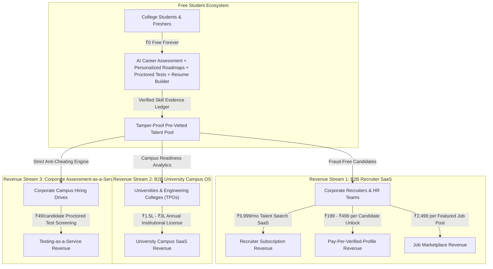

# Startup Monetization Blueprint: 100% Free for Students, Monetized via B2B Enterprise & Universities

## Executive Summary
The user has established a core foundational principle for the startup: **"Our website is free for students, but how to earn money with that?"**

This is the exact business model that built multi-billion dollar tech giants:
- **Handshake** ($3.5B valuation): 100% free for students; monetized via universities and corporate recruiters.
- **LinkedIn**: 100% free for job seekers; over 70% of revenue comes from **Recruiter Talent Solutions**.
- **LeetCode & HackerRank**: Free for developers; enterprise companies pay \$20,000 to \$100,000+ for enterprise recruitment screening and talent sourcing.

In CareerPath AI, **students are the high-quality talent pool (the supply)**. The paying customers are **Corporate Recruiters** (who waste 40+ hours filtering fake resumes) and **Colleges/Universities** (who struggle to track placement readiness and NAAC/NIRF accreditation metrics).

---

## 1. The 4 High-Margin Monetization Engines (B2B Revenue Streams)



---

### Stream 1: Recruiter Talent Radar & Candidate Unlocks (B2B SaaS)
* **The Problem**: When a tech company posts an entry-level opening on LinkedIn or Naukri, they receive 2,000+ resumes within 48 hours. Over 85% are keyword-stuffed spam, and candidates cannot write basic code. HR spends 40+ hours screening.
* **Our Solution**: Recruiters access CareerPath AI's **Talent Radar** (`recruiter-dashboard.html`) to filter candidates by **Verified Scores**, **Proctored Test Attempts**, and **Verified GitHub Projects**.
* **Pricing Plans**:
  1. **Pay-Per-Verified-Unlock**: ₹299 per candidate to unlock full contact info, unredacted verified skill ledger, and verified portfolio link.
  2. **Talent Radar Pro (₹9,999 / month)**: 
     - Search up to 5,000 pre-vetted candidates across 24 streams.
     - 60 verified candidate unlocks per month.
     - Direct interview invitation messaging.
  3. **Featured Job Listings (₹2,499 / job post)**: Pinned at the top of the student job board with automated match-score filtering.

---

### Stream 2: University & College Placement Operating System (Campus SaaS)
* **The Problem**: Engineering and degree colleges in India must maintain high placement ratios for NAAC accreditation and NIRF rankings. Today, Training & Placement Officers (TPOs) have zero real-time visibility into student skill gaps until corporate aptitude drives start.
* **Our Solution**: **CareerPath AI Campus OS**:
  - Centralized TPO analytics dashboard.
  - Real-time batch-wide skill gap heatmaps (e.g., *"64% of 3rd Year IT students lack SQL fundamentals"*).
  - Automated weekly student milestone tracking and placement readiness scores.
* **Pricing**: **₹1,50,000 to ₹3,00,000 per institution per year** (B2B Annual Contract).

---

### Stream 3: Corporate Assessment-as-a-Service (Testing Engine)
* **The Problem**: Conducting online screening tests using HackerEarth, Mettl, or Mercer costs companies ₹150–₹300 per test attempt.
* **Our Solution**: Companies use our **Strict Anti-Cheating Lockdown Engine** (with fullscreen lock, 3-strike tab switch traps, and 24h lockout) to host custom campus aptitude drives.
* **Pricing**: **₹49 per student test attempt** (saving companies 70% while yielding 85% gross margins for CareerPath AI).

---

### Stream 4: Pay-on-Hire / Placement Bounty (Zero Upfront Risk for Employers)
* **The Model**: If a recruiter hires an intern or fresher sourced through CareerPath AI, the company pays a **flat placement success fee** (₹15,000 for full-time hires / ₹5,000 for paid interns).
* **Cost to Student**: **Always ₹0** (charging candidates for jobs is illegal; employers happily pay because agency fees are 8.33% of annual CTC).

---

## 2. Product UI & Landing Page Integration Plan

To communicate this model clearly on the website without confusing students or investors:

### A. Landing Page Hero & Navigation (`index.html`)
1. **Hero Trust Badge**:
   - `<span class="badge badge-teal font-monospace me-2"><i class="bi bi-gift-fill me-1"></i> 100% FREE FOR STUDENTS</span>`
   - Hero subtitle addition: *"Always 100% free for students and job seekers. Backed by corporate hiring partners who value verified talent."*
2. **Navbar**:
   - Links: `Platform`, `For Students (Free)`, `For Recruiters (Hire)`, `For Colleges`, `Pricing`.

### B. Transparent B2B Pricing Section on `index.html` (`#pricing`)
Replace confusing student pricing with an authoritative **Dual-Audience Pricing Table**:

| Plan | Target Audience | Price | Key Features Included |
| :--- | :--- | :--- | :--- |
| **Student Free Tier** 🎓 | Students & Freshers | **₹0 Free Forever** | • 3D Career Universe Exploration<br>• Full Skill Gap Diagnostic Assessment<br>• Personalized Dynamic Learning Roadmaps<br>• Proctored Milestone Verification Quizzes<br>• ATS-Optimized Resume Builder<br>• Verified Credential Certificate |
| **Recruiter Talent Radar** 🏢 | Hiring Teams & Startups | **₹9,999 / mo** | • Filter candidates by verified proctored score<br>• 60 Full Candidate Unlocks / mo<br>• Direct interview invitation system<br>• Zero-cheating verification audit trail |
| **University Campus OS** 🏛️ | Colleges & TPO Cells | **Custom Institutional Quote** | • Batch-wide skill gap heatmaps<br>• Automated placement readiness analytics<br>• NAAC / NIRF accreditation data exports<br>• Custom campus challenge tests |

---

## 3. Implementation Steps

1. **Update `client/index.html`**:
   - Add the **"100% Free for Students, Forever"** badge in the hero section.
   - Insert the **B2B Enterprise & Recruiter Pricing Table** showing ₹0 for students, ₹9,999/mo for recruiters, and institutional pricing for colleges.
   - Add a dedicated **"For Employers"** and **"For Colleges"** solutions showcase.
2. **Update `client/recruiter-dashboard.html` & `client/login.html`**:
   - Showcase Recruiter Pro Plan features (Candidate Unlocks, Talent Radar search, Pre-Vetted Badges).
3. **Update Footer across all pages**:
   - Add: *"CareerPath AI is 100% free for students worldwide. Monetized through enterprise recruiter intelligence & university campus software."*

---

## 4. Verification Plan

```powershell
# 1. Verify responsive rendering of the new B2B Pricing section
git grep -i "100% free for students" client/

# 2. Check no breaking regressions in client files
git status
```
