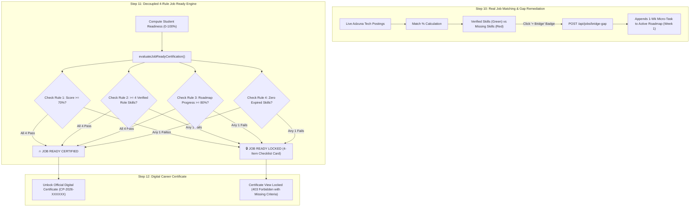

# Implementation Plan: Career GPS Final 15% Pipeline Completion

**CareerPath AI · Team 404 Brain Not Found**  
*Hack2Ignite 2026-27*

---

## Executive Summary & Objectives

The platform currently implements **85% of the 12-step Career GPS pipeline**:
```text
Student → Assessment → Career Match → Skill Gap → Personalized Roadmap → Projects → GitHub Verification → Resume → AI Mock Interview → Real Job Matching → JOB READY & CERTIFICATE
```

To take the pipeline from **85% to 100% complete**, this plan addresses the **4 specific remaining gaps**:

1. **Step 11: Decoupled 4-Rule "Job Ready" Certification Engine & Locked Checklist UI**
   - Graduating a roadmap must **never automatically issue "Job Ready"**.
   - Certificate issuance must be gated strictly by the **4 independent benchmarks**:
     1. Overall Readiness Score $\ge 70\%$
     2. $\ge 4$ role-specific verified skills in active currency
     3. Roadmap milestone progress $\ge 80\%$ (or completed)
     4. Zero expired required skills (`refreshByDate > Date.now()`)
   - Dashboard must render a dynamic **Locked Job Ready Card** displaying exact pass/fail checklist items and actionable remediation guidance when disqualified.
2. **Step 10: "Bridge the Gap" 1-Click Injection Alignment & Recommendations Modal Integration**
   - Align backend parameter handling in `server/routes/jobRoutes.js` (`req.body.skillName || req.body.missingSkill`).
   - Add 1-click **[+ Bridge]** buttons to missing skills in the "Live Market Jobs" modal on `recommendations.html` to inject 1-week micro-tasks into active roadmaps.
3. **Step 5: MongoDB Partial Unique Index Live Engine Migration**
   - Execute `server/scripts/migrate_roadmaps_active_index.js` against MongoDB Atlas to establish the partial unique index `{ user: 1 }, { unique: true, partialFilterExpression: { status: 'active' } }`, preventing race conditions and duplicate active roadmaps at the database engine level.
4. **Step 9: Cross-Page AI Mock Interview Chamber Triggers**
   - Add direct "🎙️ Practice Mock Interview" action buttons on `recommendations.html` (inside career match cards) and `roadmap.html` (in the active track header).

---

## User Review Required

> [!IMPORTANT]
> **Strict 4-Rule Job Ready Qualification vs Composite Score:**
> Previously, reaching $\ge 85\%$ composite readiness or completing a roadmap could prematurely award a credential. Under this decoupled engine:
> - Finishing a route awards **Route Graduation** and verifies proven skills in the Canonical Evidence Ledger.
> - **Job Ready Certification** and the **Official Digital Credential** require all 4 rules to pass simultaneously. If any rule fails (e.g. only 2 of 4 role skills verified), the Certificate remains locked, and the dashboard clearly explains what to do next.

> [!NOTE]
> **Non-Destructive Bridge the Gap:**
> Clicking a red missing skill badge on any job card immediately injects a 4-hour micro-task into Week 1 of the active roadmap without disrupting existing roadmap tasks or resetting progress.

---

## Architecture & Data Flow



---

## Proposed Changes

### Component 1: Backend Gating & Controller Hardening

#### [MODIFY] `server/routes/jobRoutes.js`
- In `POST /api/jobs/bridge-gap`, accept both `req.body.skillName` and `req.body.missingSkill`:
  ```javascript
  const skillName = req.body.skillName || req.body.missingSkill;
  const jobTitle = req.body.jobTitle || 'Target Tech Role';
  ```
- Return updated roadmap summary and task payload.

#### [MODIFY] `server/controllers/readinessController.js`
- Update `getCertificate`:
  ```javascript
  const { evaluateJobReadyCertification } = require('../services/readinessService');
  const jobReadyEval = await evaluateJobReadyCertification(req.user._id);

  if (!jobReadyEval.isJobReady) {
    return res.status(403).json({
      success: false,
      isLocked: true,
      criteriaStatus: jobReadyEval.criteriaStatus,
      missingCriteria: jobReadyEval.missingCriteria,
      message: `Your Job Ready status is locked. Satisfy all 4 benchmarks: ${jobReadyEval.missingCriteria.join(', ')}.`
    });
  }
  ```
- Ensure certificate ID is generated and persisted during `evaluateJobReadyCertification` if and only if `isJobReady === true`.

#### [MODIFY] `server/services/readinessService.js`
- Prevent `computeStudentReadiness` from blindly assigning `certId` solely on composite score $\ge 85\%$.
- In `evaluateJobReadyCertification`, generate and assign `certificateId` and `certifiedAt` when all 4 rules pass.

---

### Component 2: Dashboard 4-Rule Status Card & Certificate Wire

#### [MODIFY] `client/dashboard.html`
- Directly beneath the Readiness Gauge Hero section (lines 280–305), add the dedicated `#dashboardJobReadyCard`:
  ```html
  <!-- 1.5 Decoupled 4-Rule Job Ready Qualification & Checklist Card -->
  <div class="card p-3 p-md-4 rounded-3 border-line shadow-sm mb-4" id="dashboardJobReadyCard">
    <div class="d-flex align-items-center justify-content-between mb-2 flex-wrap gap-2">
      <div class="d-flex align-items-center gap-2">
        <span class="badge" id="dashJobReadyBadge">Job Ready Status</span>
        <span class="small font-mono text-muted" id="dashJobReadyScore">Readiness: --%</span>
      </div>
      <span class="badge badge-navy font-mono text-uppercase" style="font-size: 0.68rem;">4-Criteria Standard</span>
    </div>
    <p class="small text-secondary mb-3" id="dashJobReadySummary">
      Official Job Ready Certification requires satisfying all 4 industry hiring benchmarks:
    </p>
    <div class="row g-2" id="dashJobReadyCriteriaRow">
      <!-- Dynamically populated 4-rule checklist tiles -->
    </div>
  </div>
  ```

#### [MODIFY] `client/js/dashboard.js`
- In `loadJobReadiness`, make an additional asynchronous request to `GET /api/readiness/job-ready-check`.
- Render the 4 checklist items into `#dashJobReadyCriteriaRow`:
  1. **Score $\ge 70\%$**: Green `[✓]` if passed, Amber `[✗]` if pending (`Current: X% / 70% required`).
  2. **$\ge 4$ Verified Role Skills**: Green `[✓]` if passed, Amber `[✗]` if pending (`Verified: X of 4 required`).
  3. **Roadmap Milestone Progress $\ge 80\%$**: Green `[✓]` if passed, Amber `[✗]` if pending (`Completed: X% / 80% required`).
  4. **Skill Currency**: Green `[✓]` if zero expired skills, Red `[✗]` if skills require 180-day refresh.
- Dynamically toggle `#btnViewCertificate`:
  - If `isJobReady === true`: Bright gold button with `View & Share Certificate (Unlocked ✓)`.
  - If `isJobReady === false`: Muted button with `Certificate Locked (4 Criteria Required)`.

---

### Component 3: "Bridge the Gap" on Recommendations Page

#### [MODIFY] `client/recommendations.html` & `client/js/recommendations.js`
- In `loadJobsForCareer` in `client/js/recommendations.js`:
  - Fetch user verified skills and compute match tags.
  - For missing tags, render `<button type="button" class="btn btn-outline-danger btn-sm py-0 px-2 font-mono btn-bridge-gap" data-skill="${s}" data-job="${job.title}">+ Bridge</button>`.
  - Wire click handler to call `POST /api/jobs/bridge-gap` with `{ missingSkill: skill, jobTitle }`.
  - On success, display instant feedback: `✓ Added [Skill] to Week 1 of your active roadmap!`.

---

### Component 4: Cross-Page AI Mock Interview Shortcuts

#### [MODIFY] `client/recommendations.html` & `client/js/recommendations.js`
- Add a **"🎙️ Practice AI Mock Interview"** action button in each career recommendation card (next to "What-If Simulator" and "Live Market Jobs").
- Clicking this redirects to `dashboard.html?action=mock-interview&role=${encodeURIComponent(career.title)}`.

#### [MODIFY] `client/roadmap.html`
- In the active route header card, add a **"🎙️ Practice AI Mock Interview"** quick-link button.

#### [MODIFY] `client/js/dashboard.js`
- In `setupMockInterview`, check URL search params:
  ```javascript
  const urlParams = new URLSearchParams(window.location.search);
  if (urlParams.get('action') === 'mock-interview') {
    const role = urlParams.get('role');
    setTimeout(() => {
      if (btnLaunch) btnLaunch.click();
    }, 500);
  }
  ```

---

### Component 5: Database Migration Execution

#### [EXECUTE] `server/scripts/migrate_roadmaps_active_index.js`
- Run the pre-flight migration script using `node server/scripts/migrate_roadmaps_active_index.js`.
- Confirms:
  - 1. JSON backup generated in `server/backups/`.
  - 2. Any orphan or duplicate active roadmaps normalized to `abandoned`.
  - 3. Partial unique index `{ user: 1 }, { unique: true, partialFilterExpression: { status: 'active' } }` verified in MongoDB Atlas.

---

## Verification Plan

### Automated Verification
```powershell
# 1. Verify Node.js script compilation & syntax
node -c server/routes/jobRoutes.js
node -c server/controllers/readinessController.js
node -c server/services/readinessService.js

# 2. Run Database Partial Unique Index Migration
node server/scripts/migrate_roadmaps_active_index.js
```

### Manual Verification Matrix
1. **Bridge the Gap**:
   - Open `recommendations.html`, open "Live Market Jobs" for Front-End Developer.
   - Click `+ Bridge` on a missing skill tag (e.g. `Docker`).
   - Verify task is created in Week 1 of active roadmap and notification toast appears.
2. **Decoupled 4-Rule Job Ready Gate**:
   - Load `dashboard.html`. Check the `#dashboardJobReadyCard`.
   - Verify that even if composite score is $>70\%$, if role skills $<4$, Job Ready status remains **LOCKED** with checklist showing `2 of 4 skills verified`.
   - Attempt to call `GET /api/readiness/certificate` via console or click certificate button; verify 403 Forbidden with detailed missing criteria.
3. **Cross-Page Interview Launch**:
   - Click "Practice AI Mock Interview" from `recommendations.html`; verify seamless redirection and automatic opening of the voice/microphone interview modal.
