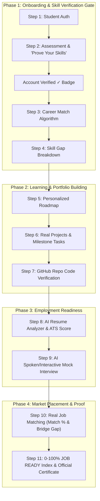

# 10-Step "Career GPS" Complete Journey Implementation Plan
**CareerPath AI · Team 404 Brain Not Found**
*Hack2Ignite 2026-27*

---

## Executive Summary & Journey Audit Alignment

The user's audit clearly established the current state and target vision for the end-to-end Career GPS pipeline:

```text
Student → Assessment → Career Match → Skill Gap → Personalized Roadmap → Projects → GitHub Verification → Resume → AI Mock Interview → Real Job Matching → JOB READY
```

### Current Status vs Target Implementation

| Step | Current Status | Target Architecture in this Plan |
| :--- | :---: | :--- |
| **1. Student** | ✅ **HAI** | JWT Auth + Google & GitHub OAuth + Verification Gate |
| **2. Assessment** | ✅ **HAI** | 4-Step wizard with Step 3 "Prove your skills" gate |
| **3. Career Match** | ✅ **HAI** | 60/25/15 Deterministic explainable scoring algorithm |
| **4. Skill Gap** | ✅ **HAI** | Matched (Green), Weak (Amber), Missing (Red) radar tags |
| **5. Roadmap** | ✅ **HAI** | 4, 8, 12 weeks dynamic milestone roadmap |
| **6. Projects** | 🟡 ➔ ✅ **FULL** | GitHub Repo linking to roadmap milestone tasks with AST code scan |
| **7. GitHub Verify** | ✅ **HAI** | Repository analysis + auto-sync `[✓ Code Verified]` badges |
| **8. Resume Analyzer** | ❌ ➔ ✅ **NEW** | AI ATS scoring (0–100%), skill extraction & keyword gap analysis |
| **9. AI Mock Interview** | ❌ ➔ ✅ **NEW** | Interactive speech/text technical & behavioral role interview |
| **10. Job Matching** | 🟡 ➔ ✅ **FULL** | Live job cards with exact Match % and 1-click "Bridge Gap" to roadmap |
| **11. JOB READY** | 🟡 ➔ ✅ **FULL** | Holistic 0–100% Readiness Index + Official Digital Career Certificate |

---

## Complete Career GPS System Architecture



---

## Detailed Specifications of New & Upgraded Modules

### Module 8: AI Resume Analyzer & ATS Scorer (❌ ➔ ✅)
* **Problem:** Students upload a PDF resume, but receive no automated ATS feedback, keyword gap detection, or alignment with their target career.
* **Architecture:**
  - Connects to existing Cloudinary resume storage (`user.resumeUrl`) or direct file/text upload.
  - Multi-model evaluation using Gemini & Groq (`geminiService.js` / `groqService.js`):
    1. **ATS Score (0–100%):** Weighted by Keyword Match (40%), Quantifiable Impact (25%), Skill Coverage (25%), Structure/Grammar (10%).
    2. **Keyword Extraction:** Identifies detected skills vs target career required keywords (Found in Green, Missing in Red).
    3. **Actionable Bullet Rewrites:** 3 high-impact suggestions that rewrite vague bullets into metric-driven achievements (e.g. *"Assisted with React UI"* ➔ *"Engineered 4 reusable React components, decreasing page load time by 32%"*).
* **Endpoints:**
  - `POST /api/resume/analyze`: Accepts `{ resumeText, targetCareer }` or parses existing uploaded resume from Cloudinary.
  - Returns `{ atsScore, extractedSkills, matchedKeywords, missingKeywords, bulletSuggestions, summary }`.
* **UI Location:** Dedicated **"Resume AI Lab"** tab in `dashboard.html`.

---

### Module 9: AI Mock Interview Chamber (❌ ➔ ✅)
* **Problem:** Quizzes test knowledge, but recruiters test verbal articulation, problem solving, and architecture design under pressure.
* **Architecture:**
  - Dynamic generation of 3 to 5 realistic questions tailored to the student's target role (e.g. Junior Frontend, Full-Stack, Data Analyst) and proven skills.
  - **Speech & Text Mode:**
    - Uses Browser Web Speech API (`speechSynthesis`) for interviewer audio prompts.
    - Allows student to speak via microphone (`webkitSpeechRecognition`) or type their answer.
  - **AI Rubric Scoring:**
    - Technical Depth (0–100)
    - Clarity & Communication (0–100)
    - Example Application (0–100)
    - Instant actionable advice + "Ideal Model Answer" snippet.
  - Stores interview history and computes `mockInterviewScore` for the student's Career Readiness Index.
* **Endpoints:**
  - `POST /api/interview/start`: Generates 3-5 scenario questions based on target role.
  - `POST /api/interview/answer`: Evaluates student's answer and provides instant breakdown.
  - `POST /api/interview/finalize`: Persists overall interview score to user profile.
* **UI Location:** Interactive modal / screen accessible from `dashboard.html` and `recommendations.html`.

---

### Module 6: Project Milestone Linking with GitHub Verification (🟡 ➔ ✅)
* **Problem:** Roadmap tasks mention projects, but students cannot submit proof or link specific repositories to earn verified project credentials.
* **Architecture:**
  - Each capstone/project task in `roadmap.html` has a **[ 🔗 Link Project Repository ]** button.
  - Student inputs their GitHub repo URL (e.g., `https://github.com/parth/ecommerce-cart`).
  - Backend `githubService.js` inspects the repository:
    - Verifies repository exists, has commits, and detects primary languages/frameworks.
    - Marks task `completed: true` and awards `[✓ Project Verified]` badge.
    - Elevates associated skills in `user.skills` to `verificationTier: 'project_verified'` (Tier 2).
* **Endpoints:**
  - `POST /api/roadmaps/tasks/:taskId/link-repo`: Accepts `{ repoUrl }`, scans repo, marks task completed, and attaches verification metadata.

---

### Module 10: Real Job Matching with "Bridge the Gap" (🟡 ➔ ✅)
* **Problem:** Live job listings exist in a modal, but they don't dynamically show exact match percentages against the student's verified skills or allow 1-click gap remediation.
* **Architecture:**
  - Evaluates live tech postings from `jobBoardService.js` against the student's proven skills.
  - Calculates **Exact Match %** (e.g. `88% Match`).
  - Displays skill tags:
    - 🟢 Green: `React (Verified)`
    - 🔴 Red: `Docker (Missing)`
  - **"Bridge the Gap" Action:** Clicking a red missing skill badge automatically appends a targeted 1-week learning micro-task to the student's active roadmap.
  - Direct **Quick Apply** link to live postings.
* **UI Location:** Upgraded Job Board on `recommendations.html` and "Live Market Opportunities" on `dashboard.html`.

---

### Module 11: 0–100% "JOB READY" Index & Digital Career Certificate (🟡 ➔ ✅)
* **Formula:**
  $$\text{Readiness Index} = (\text{Verified Skills} \times 0.35) + (\text{Roadmap Tasks \& Projects} \times 0.30) + (\text{Resume ATS} \times 0.15) + (\text{Mock Interview} \times 0.20)$$
* **Tiers:**
  - `0–40%`: **Foundational Learner**
  - `41–70%`: **Developing Practitioner**
  - `71–84%`: **Interview Ready**
  - `85–100%`: **🔥 JOB READY CERTIFIED**
* **Official Career Certificate:**
  - When $\ge 85\%$, student unlocks the **CareerPath AI Verified Job Ready Certificate**:
    - High-aesthetic printable/downloadable credential.
    - Displays verified skills list, GitHub profile, mock interview score, and cryptographic credential ID.
    - Shareable directly to LinkedIn.

---

## Phased Implementation Roadmap

### Phase 1: Core Foundation & Verification Gate (Immediate)
1. Implement the **Account Verification Gate** (`requireSkillVerification` middleware, locked-gate UI on Dashboard/Roadmap/Recommendations, and `Account Verified ✓` navbar badge).
2. Ensure Step 3 "Prove your skills" strictly unlocks the platform once completed.

### Phase 2: Resume Analyzer & AI Mock Interview (Next)
1. Create `server/services/resumeAnalyzerService.js` & `server/routes/resumeRoutes.js`.
2. Add Resume ATS Scorer UI and bullet suggestions card in `dashboard.html`.
3. Create `server/services/mockInterviewService.js` & `server/routes/interviewRoutes.js`.
4. Build interactive AI Mock Interview chamber with speech synthesis/recognition.

### Phase 3: Project Linking, Job Match % & Job Ready Certificate
1. Add `link-repo` milestone endpoint in `roadmapController.js`.
2. Upgrade job listings with exact Match % and "Bridge the Gap" roadmap injector.
3. Compute the holistic 0–100% Job Ready Index and render the downloadable Certificate.

---

## Verification Plan

| Test Case | Expected Behavior |
| :--- | :--- |
| **Verification Gate** | Unverified user attempting to view Dashboard sees "🔒 Dashboard Locked" gate; after completing Step 3 check, all pages open instantly. |
| **Resume ATS Scorer** | Uploading or pasting resume returns accurate ATS score (e.g. 78/100), detected skills, and 3 metric-driven bullet point rewrites. |
| **AI Mock Interview** | Starting interview presents 3 tailored questions; submitting speech/text yields technical score, feedback, and model answer. |
| **Project Repo Linking** | Submitting GitHub repo for a roadmap project verifies repository commits and marks milestone `[✓ Project Verified]`. |
| **Real Job Matching** | Jobs display accurate Match % (e.g. 90%) with green verified tags and 1-click "Bridge the Gap" button for missing tags. |
| **Job Ready Certificate** | Reaching $\ge 85\%$ readiness unlocks the official CareerPath AI digital credential with verification ID. |
