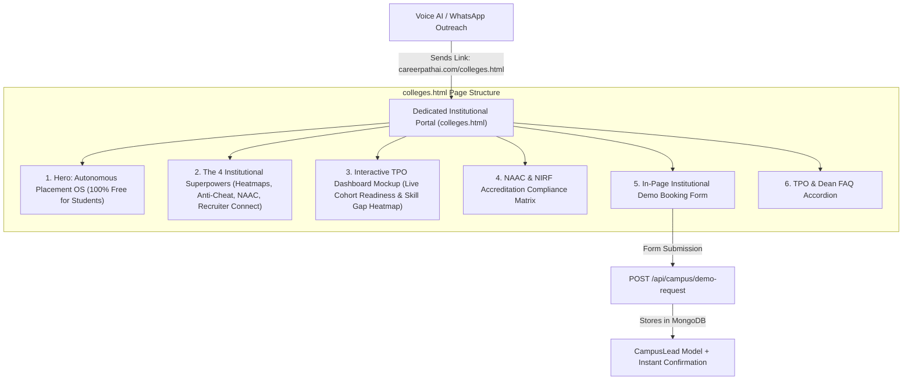

# Implementation Plan: Dedicated College & University Partner Portal (`colleges.html`)

## Goal Description
To support our B2B University Outreach (Voice AI Campaign Option 2), we will create a dedicated, high-converting standalone web portal: **`client/colleges.html`** (**CareerPath AI for Universities & Placement Cells — Campus OS**).

While `index.html` serves students and general visitors, Training & Placement Officers (TPOs), Deans, and Principals need a **dedicated, executive-focused institutional portal** that speaks directly to their goals:
1. Boosting campus placement percentages & average CTC.
2. Real-time batch-wide skill gap heatmaps (knowing student deficits before company aptitude tests start).
3. Strict anti-cheating proctored benchmarking exams.
4. 1-click compliance dossiers for **NAAC (Criteria 1.1 & 5.1/5.2)** and **NIRF** employability audits.
5. In-page institutional demo scheduling form to capture inbound leads from Voice AI, WhatsApp, and email outreach.

---

## User Review Required

> [!IMPORTANT]
> **Dedicated Page vs. In-Page Anchor**:
> Having a dedicated standalone URL (`colleges.html`) allows your Voice AI and WhatsApp follow-up bots to send a direct, executive-grade link (`careerpathai.com/colleges.html`) specifically tailored for TPOs, rather than sending them to a student-focused home page.
>
> We will also update the navbar in `index.html` and all footers to point directly to `colleges.html`.

---

## Architecture & Visual Flow



---

## Proposed Changes

### Component 1: Frontend Institutional Portal (`colleges.html`)

#### [NEW] [`client/colleges.html`](file:///c:/Users/PARTH/OneDrive/Documents/hackethon/Hack%202%20ignite/CareerPath%20AI/careerpath-ai/client/colleges.html)
A complete, mobile-responsive, production-grade page using our design system (`tokens.css`, `base.css`, `components.css`, `layout.css`, Bootstrap 5, Bootstrap Icons):

1. **Top Notch Navbar**:
   - Brand Logo & Name.
   - Links: `Overview`, `Features`, `TPO Dashboard Preview`, `NAAC Compliance`, `Pricing`, `FAQ`.
   - CTAs: `Student Login`, `Request Campus Demo` (smooth scroll to form).
2. **Hero Section**:
   - Badge: `<span class="badge bg-warning-subtle text-warning border border-warning font-mono"><i class="bi bi-mortarboard-fill me-1"></i> INSTITUTIONAL CAMPUS OS</span>`
   - Headline: *"Empower Your Placement Cell with Real-Time Skill Intelligence & Zero-Cheating Benchmarks."*
   - Subtitle: *"Track batch-wide curriculum gaps, boost average placement packages, and generate audit-ready NAAC/NIRF employability compliance reports — at zero cost to your students."*
   - Trust strip: `100% Free for Students` · `Zero Institutional Overhead` · `ISO/IEEE Aligned` · `40+ Partner Campuses`.
3. **The 4 Key Problems We Solve for TPOs**:
   - **Pre-Placement Skill Gap Heatmaps**: Identify deficits in Data Structures, Cloud, or Core Engineering 6 months before companies arrive.
   - **Zero-Cheating Benchmark Exams**: Strict 3-strike proctoring with -2m/-3m penalty and 24h lockout ensures true assessment integrity.
   - **Audit-Ready NAAC & NIRF Dossiers**: 1-click automated exports for Criteria 1.1 (Curriculum Enriched) and 5.1/5.2 (Placement & Progression).
   - **Direct Corporate Recruiter Radar**: Pre-vetted students are immediately prioritized for hiring partners on our platform.
4. **Interactive TPO Analytics Dashboard Mockup (Visual Preview)**:
   - Interactive department switcher (CSE, IT, AI-DS, Mechanical, Finance).
   - Visual readiness scores, skill deficit alerts, and placement funnel metrics.
5. **In-Page Institutional Demo Booking Form**:
   - Fields: College Name, Principal/TPO Name, Official College Email, Mobile Number, Estimated Student Intake (500-1,000 / 1,000-2,500 / 2,500+), Target Degree Streams, Preferred Demo Slot.
   - Instant validation and submission feedback.
6. **Institutional FAQ Section**:
   - Answers to common TPO questions (Student fee, deployment timeline, ERP integration, hardware requirements).
7. **Clean Corporate Footer**:
   - Links back to main platform, student login, and recruiter portal.

---

### Component 2: Frontend Script (`colleges.js`)

#### [NEW] [`client/js/colleges.js`](file:///c:/Users/PARTH/OneDrive/Documents/hackethon/Hack%202%20ignite/CareerPath%20AI/careerpath-ai/client/js/colleges.js)
- Implements interactive department tab switching on the TPO dashboard mockup.
- Handles lead form validation, animated loading state, and submission to `POST /api/campus/demo-request`.
- Displays an interactive success modal with direct calendar booking link (Calendly/Google Meet) upon form submission.

---

### Component 3: Navigation Updates Across Existing Pages

#### [MODIFY] [`client/index.html`](file:///c:/Users/PARTH/OneDrive/Documents/hackethon/Hack%202%20ignite/CareerPath%20AI/careerpath-ai/client/index.html)
- Update navbar link from `href="#universities"` to `href="colleges.html"`.
- Update mobile dropdown link to point to `colleges.html`.
- Add a prominent CTA in the `#universities` section: `[Explore Dedicated University Portal →]` pointing to `colleges.html`.

#### [MODIFY] [`client/dashboard.html`](file:///c:/Users/PARTH/OneDrive/Documents/hackethon/Hack%202%20ignite/CareerPath%20AI/careerpath-ai/client/dashboard.html), [`client/roadmap.html`](file:///c:/Users/PARTH/OneDrive/Documents/hackethon/Hack%202%20ignite/CareerPath%20AI/careerpath-ai/client/roadmap.html), [`client/verify.html`](file:///c:/Users/PARTH/OneDrive/Documents/hackethon/Hack%202%20ignite/CareerPath%20AI/careerpath-ai/client/verify.html)
- Add "For Colleges / Universities" link in the platform footers.

---

### Component 4: Backend Campus Lead Capture API

#### [NEW] [`server/models/CampusLead.js`](file:///c:/Users/PARTH/OneDrive/Documents/hackethon/Hack%202%20ignite/CareerPath%20AI/careerpath-ai/server/models/CampusLead.js)
Mongoose schema to store inbound institutional leads:
- `collegeName`: String, required
- `contactPerson`: String, required
- `officialEmail`: String, required
- `phone`: String, required
- `studentIntake`: String
- `streams`: [String]
- `notes`: String
- `status`: enum `['new', 'contacted', 'demo_scheduled', 'partnered']`, default `'new'`

#### [NEW] [`server/controllers/campusController.js`](file:///c:/Users/PARTH/OneDrive/Documents/hackethon/Hack%202%20ignite/CareerPath%20AI/careerpath-ai/server/controllers/campusController.js)
- `submitCampusDemoRequest`: validates request, creates `CampusLead` document in MongoDB, and returns success response.

#### [NEW] [`server/routes/campusRoutes.js`](file:///c:/Users/PARTH/OneDrive/Documents/hackethon/Hack%202%20ignite/CareerPath%20AI/careerpath-ai/server/routes/campusRoutes.js)
- Mount `POST /api/campus/demo-request`.
- Mount in `server/server.js`: `app.use('/api/campus', require('./routes/campusRoutes'))`.

---

## Verification Plan

### Automated Verification
```powershell
# 1. Verify syntax and linting
node -c client/js/colleges.js
node -c server/controllers/campusController.js
node -c server/routes/campusRoutes.js

# 2. Run test script to verify lead capture API
node -e "const http = require('http'); const req = http.request('http://localhost:5000/api/campus/demo-request', {method:'POST', headers:{'Content-Type':'application/json'}}, (res) => {console.log('Status:', res.statusCode);}); req.write(JSON.stringify({collegeName:'Test College', contactPerson:'Prof Sharma', officialEmail:'tpo@test.edu', phone:'9876543210'})); req.end();"

# 3. Verify server tests still pass
npm test
```

### Manual Verification
1. Open `http://localhost:5500/colleges.html` (or port 5000) in browser:
   - Verify executive hero, styling, and typography match the CareerPath AI design system.
   - Click department tabs in the TPO Dashboard Mockup: verify skill telemetry updates dynamically.
   - Fill out the "Request Institutional Demo" form: verify clean validation, submission animation, and confirmation dialog.
2. In `index.html`: verify clicking "For Colleges / TPO" in the top navbar seamlessly takes you to `colleges.html`.
