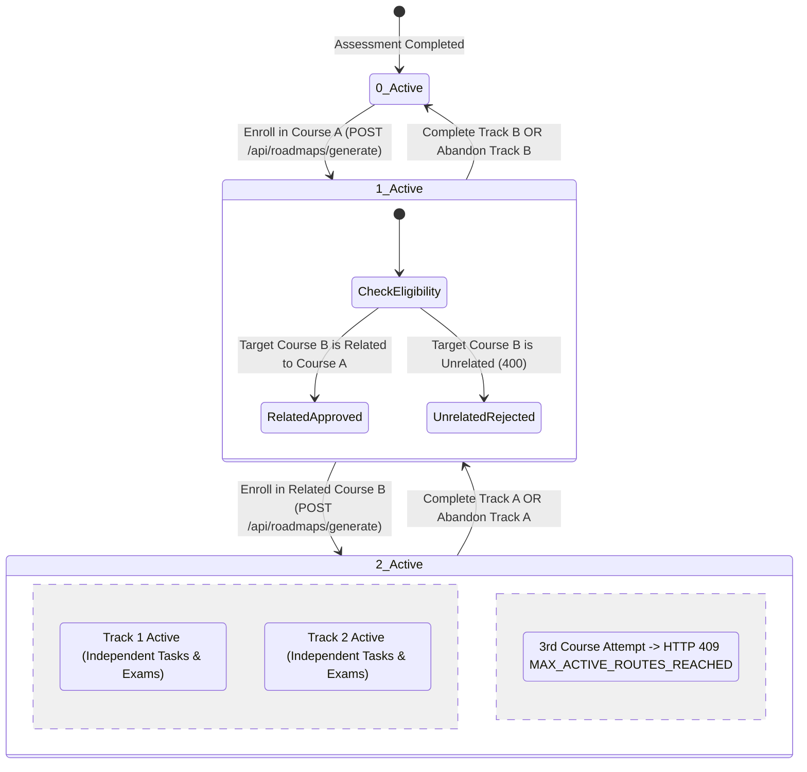

# Implementation Plan: Dual Active Roadmaps & Related Course Synergy

**CareerPath AI · Team 404 Brain Not Found**  
*Hack2Ignite 2026-27*

---

## Goal Description

Enable **Dual Concurrent Career Roadmaps** so that a student can actively pursue **up to 2 career courses simultaneously**, provided the second course is a **related, complementary, or synergistic track** (e.g. *Front-End Developer + UI/UX Designer*, *Full-Stack Developer + Cloud/DevOps Engineer*, *Data Analyst + AI/ML*, *Finance + Business Ops*).

### What this accomplishes:
1. **Parallel Skill Acceleration**: Highly motivated students are not bottlenecked by a single sequential track when two disciplines complement each other.
2. **Quality & Focus Protection ("Related Course Rule")**: Students cannot enroll in completely divergent tracks (e.g. Kernel Driver Dev + Classical Corporate Accounting), but can enroll in synergistic sister tracks that share domain concepts or foundational competencies.
3. **Hardened Concurrency Limit ($\le 2$)**: Database compound partial index `{ user: 1, career: 1 }` prevents enrolling twice in the same career, while the controller strictly enforces a maximum of 2 concurrent active roadmaps with **HTTP 409 Conflict** (`MAX_ACTIVE_ROUTES_REACHED`).
4. **Seamless Multi-Track UI Navigation**:
   - **Dashboard**: Track switcher / dual progress display showing both active courses with independent percentage orbs and priority tasks.
   - **Recommendations**: Dynamic card states (`Active Course #1`, `Active Course #2`, `+ Enroll as 2nd Related Course`, and `Locked (Unrelated / Max 2 Enrolled)`).
   - **Roadmap**: Top-bar track switcher allowing one-click switching between Track 1 and Track 2 without page reloads.

---

## User Review Required

> [!IMPORTANT]
> **Related Course Synergy Qualification Rules:**
> When a student already has 1 active roadmap ($C_1$), the server allows enrolling into a second roadmap ($C_2$) if ANY of the following 3 criteria are satisfied:
> 1. **Same Primary Domain**: Both belong to the same domain (`engineering`, `business`, `marketing`, or `creative`).
> 2. **Cross-Domain Synergy Pairs**:
>    - `engineering` $\longleftrightarrow$ `creative` (e.g. Front-End / Web Dev + UI/UX Design)
>    - `engineering` $\longleftrightarrow$ `business` (e.g. Software/Data + Product Management)
>    - `business` $\longleftrightarrow$ `marketing` (e.g. Business Ops + Digital Marketing / Growth)
> 3. **Shared Skill Overlap**: Both careers share $\ge 2$ common required skills.
> If $C_2$ does not qualify as related, the server rejects enrollment with **400 Bad Request: `UNRELATED_COURSE_RESTRICTION`**, and the UI displays clear guidance on why and which related tracks are eligible.

> [!NOTE]
> **Database Partial Unique Index Update:**
> The previous single-user index `{ user: 1 }` where `status: 'active'` will be updated to a compound index on `{ user: 1, career: 1 }` where `status: 'active'`. This guarantees that:
> - A user can never have 2 active roadmaps for the **same career**.
> - A user can have up to 2 active roadmaps for **different, related careers** simultaneously.

---

## State Transition & Concurrency Machine



---

## Proposed Changes

### Component 1: Data Model & Database Migration

#### [MODIFY] `server/models/Roadmap.js`
- Update index from single active roadmap per user to **single active roadmap per user per career**:
```javascript
// Database-level guarantee: at most ONE active roadmap per user PER CAREER
RoadmapSchema.index(
  { user: 1, career: 1 },
  {
    unique: true,
    partialFilterExpression: { status: 'active' },
  }
);
```

#### [MODIFY] `server/scripts/migrate_roadmaps_active_index.js`
- Drop old index `user_1_single_active_roadmap_unique` if present.
- Create new compound index `user_1_career_1_active_roadmap_unique` on `{ user: 1, career: 1 }` with `partialFilterExpression: { status: 'active' }`.
- If any user currently has $>2$ active roadmaps, safely mark the older ones as `'abandoned'` (with zero data deleted).

---

### Component 2: Related Course Engine & Roadmap Controllers

#### [NEW] `server/services/courseSynergyService.js`
Reusable helper function to determine if two career tracks are related:
```javascript
/**
 * courseSynergyService.js — Evaluates course relation & synergy
 */
function isRelatedCourse(careerA, careerB) {
  if (!careerA || !careerB) return false;

  const domainA = (careerA.domain || 'engineering').toLowerCase();
  const domainB = (careerB.domain || 'engineering').toLowerCase();

  // 1. Same Primary Domain
  if (domainA === domainB) return true;

  // 2. Defined Synergistic Cross-Domain Pairs
  const SYNERGY_PAIRS = [
    ['engineering', 'creative'],
    ['engineering', 'business'],
    ['business', 'marketing'],
  ];
  const isSynergisticDomain = SYNERGY_PAIRS.some(
    ([d1, d2]) => (domainA === d1 && domainB === d2) || (domainA === d2 && domainB === d1)
  );
  if (isSynergisticDomain) return true;

  // 3. Shared Skill Overlap >= 2
  const getSkills = (c) => (c.requiredSkills || []).map(rs => 
    (rs.skill?.name || rs.skillName || rs.name || (typeof rs.skill === 'string' ? rs.skill : '')).toLowerCase().trim()
  ).filter(Boolean);

  const skillsA = getSkills(careerA);
  const skillsB = getSkills(careerB);
  const shared = skillsA.filter(s => skillsB.includes(s));

  return shared.length >= 2;
}

module.exports = { isRelatedCourse };
```

#### [MODIFY] `server/controllers/roadmapController.js`

1. **`generateRoadmap` (`POST /api/roadmaps/generate`)**:
   - Query all active roadmaps: `const activeRoadmaps = await Roadmap.find({ user: user._id, status: 'active' }).populate('career');`
   - **Check 1 (Duplicate Career):** If user already has an active roadmap for `targetSlug`:
     ```javascript
     if (activeRoadmaps.some(r => r.careerSnapshot?.slug === targetSlug)) {
       return res.status(409).json({
         success: false,
         code: 'ALREADY_ENROLLED_IN_COURSE',
         message: `You are already actively pursuing the "${selectedCareer.title}" track.`,
       });
     }
     ```
   - **Check 2 (Max 2 Active Courses):**
     ```javascript
     if (activeRoadmaps.length >= 2) {
       return res.status(409).json({
         success: false,
         code: 'MAX_ACTIVE_ROUTES_REACHED',
         message: `You are already enrolled in 2 active career courses (${activeRoadmaps.map(r => r.careerSnapshot?.title).join(' and ')}). Complete or abandon one route before starting another.`,
       });
     }
     ```
   - **Check 3 (Related Course Synergy when length === 1):**
     ```javascript
     if (activeRoadmaps.length === 1) {
       const activeCareer = activeRoadmaps[0].career;
       const related = isRelatedCourse(activeCareer, selectedCareer);
       if (!related) {
         return res.status(400).json({
           success: false,
           code: 'UNRELATED_COURSE_RESTRICTION',
           message: `Course "${selectedCareer.title}" is not related to your active course "${activeCareer.title}". You can take 2 concurrent courses only in related or complementary domains (e.g. in ${activeCareer.domain || 'engineering'} or synergistic tracks).`,
         });
       }
     }
     ```

2. **`getCurrentRoadmap` (`GET /api/roadmaps/current`)**:
   - Support `req.query.roadmapId`:
     - If provided, fetch that specific active roadmap.
     - If not provided, fetch the latest active roadmap.
   - Return dual-track metadata:
     ```javascript
     data: {
       hasRoadmap: true,
       activeCount: allActiveRoadmaps.length,
       maxAllowed: 2,
       canEnrollSecondCourse: allActiveRoadmaps.length === 1,
       activeRoadmaps: allActiveRoadmaps.map(r => ({
         id: r._id,
         career: r.careerSnapshot,
         progressPercentage: r.progressPercentage,
         durationWeeks: r.durationWeeks,
         currentWeekString: r.currentWeekString,
       })),
       roadmap: currentActiveRoadmap,
       tasks,
       weeks,
     }
     ```

3. **`abandonRoadmap` (`POST /api/roadmaps/current/abandon`)**:
   - Accept optional `roadmapId` in request body:
     ```javascript
     const filter = { user: req.user._id, status: 'active' };
     if (req.body.roadmapId) {
       filter._id = req.body.roadmapId;
     }
     ```

---

### Component 3: Recommendations Page UI & Synergy Badges

#### [MODIFY] `client/recommendations.html` & `client/js/recommendations.js`

1. **Active Route Banner (`#activeRouteLockBanner`)**:
   - Update banner to display multi-course capacity:
     - When 1 active course:
       *"Active Courses (1/2): [💻 Front-End Developer · 45%] &mdash; 🌟 1 Related Course Slot Available!"*
     - When 2 active courses:
       *"Active Courses (2/2): [💻 Front-End Developer · 45%] & [🎨 UI/UX Designer · 20%] &mdash; Maximum 2 Courses In Progress"*
2. **Career Cards Rendering**:
   - For currently active careers: Display `ACTIVE COURSE #1` or `#2` with `Continue Roadmap (X%)` button.
   - If 1 course active and career is **related**:
     - Display: `<span class="badge badge-teal font-mono"><i class="bi bi-link-45deg me-1"></i> RELATED TRACK (2nd Course Eligible)</span>`
     - Button: `+ Enroll as 2nd Active Course`
   - If 1 course active and career is **unrelated**:
     - Display: `<span class="badge bg-secondary text-light font-mono"><i class="bi bi-lock-fill me-1"></i> UNRELATED TRACK</span>`
     - Button: Disabled `Locked (Unrelated to Active Course)`
   - If 2 courses active:
     - Button: Disabled `Locked (2 Courses In Progress)`

---

### Component 4: Dashboard Dual-Track Experience

#### [MODIFY] `client/dashboard.html` & `client/js/dashboard.js`

1. **Active Track Switcher Bar**:
   - Add `#dashboardTrackTabsContainer` above the Active Roadmap Hero Card:
     ```html
     <!-- Dual Active Track Tabs (Visible when 2 courses active) -->
     <div class="d-flex align-items-center gap-2 mb-3 d-none" id="dashboardTrackTabsContainer">
       <button type="button" class="btn btn-sm btn-teal active" id="btnDashTrack1">Track 1: Full-Stack (45%)</button>
       <button type="button" class="btn btn-sm btn-outline-teal" id="btnDashTrack2">Track 2: UI/UX (20%)</button>
     </div>
     ```
2. **Second Course Callout (when 1 active course)**:
   - When user has 1 active course, display:
     *"Enrolled: 1 of 2 courses &middot; [Explore Related Courses to Accelerate &rarr;]"* linking to `recommendations.html`.
3. **Switching Tracks**:
   - Toggling Track 1 / Track 2 dynamically updates the active card title, progress orb percentage, and upcoming priority tasks.

---

### Component 5: Roadmap Page Dual-Track Switcher

#### [MODIFY] `client/roadmap.html` & `client/js/roadmap.js`

1. **Top Track Switcher**:
   - When the student has 2 active roadmaps, render interactive tabs at the top of `roadmap.html`:
     ```html
     <div id="roadmapTrackSwitcher" class="d-none mb-3 p-2 rounded-2 stat-box-atlas border border-line d-flex align-items-center justify-content-between flex-wrap gap-2">
       <div class="d-flex align-items-center gap-2 flex-wrap" id="roadmapTrackTabsContainer"></div>
       <span class="badge badge-navy font-mono" style="font-size: 0.72rem;">PARALLEL TRACK LEARNING</span>
     </div>
     ```
2. **Track Switching Logic**:
   - Clicking Track 1 or Track 2 calls `loadRoadmap(selectedRoadmapId)`, instantly re-rendering that track's milestone weeks, tasks, capstone projects, and weekly test modal.
   - URL search parameter support: `roadmap.html?id=<roadmapId>`.

---

## Verification Plan

### Automated Tests & Syntax Check
```powershell
# 1. Verify Node syntax of new and modified files
node -c server/services/courseSynergyService.js
node -c server/controllers/roadmapController.js
node -c server/models/Roadmap.js

# 2. Run Database Partial Unique Index Migration
node server/scripts/migrate_roadmaps_active_index.js
```

### Manual Verification Scenarios

| Scenario | Expected Behavior |
| :--- | :--- |
| **1. Enroll in 1st Course** | Student selects `Front-End Developer`. Roadmap #1 created (`activeCount: 1`). |
| **2. Attempt Same Course** | Trying to generate `Front-End Developer` again returns **409 Conflict: `ALREADY_ENROLLED_IN_COURSE`**. |
| **3. Enroll in Related 2nd Course** | Student selects `UI/UX Designer` (Engineering + Creative synergy). Server permits enrollment, creates Roadmap #2 (`activeCount: 2`). |
| **4. Attempt Unrelated 2nd Course** | If student instead tries to enroll in a non-synergistic course, server returns **400 Bad Request: `UNRELATED_COURSE_RESTRICTION`** with clear explanation. |
| **5. Attempt 3rd Course** | Student attempts to enroll in a 3rd course. Server returns **409 Conflict: `MAX_ACTIVE_ROUTES_REACHED`**. Card on recommendations shows `Locked (2 Courses In Progress)`. |
| **6. Dashboard Track Switching** | Dashboard displays Track 1 and Track 2 buttons; clicking between them smoothly switches progress orb, stats, and upcoming tasks. |
| **7. Roadmap Page Track Switching** | Roadmap displays both tracks at top; clicking switches week milestones and tasks without page reloads. |
| **8. Independent Graduation** | Completing Track 1 graduates Track 1, awards credential, and frees 1 slot (so student now has 1 active course and can enroll in another related course). |
