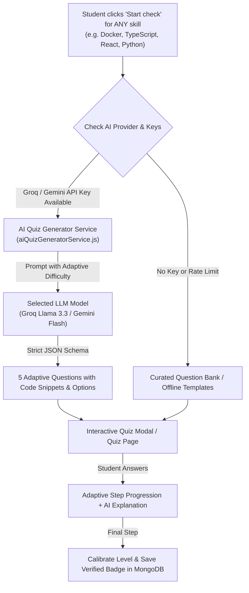

# Implementation Plan: Dynamic Multi-Model AI Quiz System

## Goal Description
Transform the current static 7-skill quiz bank into an **AI-powered dynamic assessment engine** that can run using the **API keys of different AI models/modules** (e.g., **Groq Llama-3.3/Qwen**, **Google Gemini**, and **OpenAI-compatible APIs**).

### What This Accomplishes:
1. **Test ANY Skill on the Fly**: Students can now verify *any* technical skill they add to their profile (e.g., **Docker, TypeScript, AWS, Kubernetes, Flutter, C++, Figma, Go, GraphQL, Tailwind**), not just the 7 hardcoded skills.
2. **Infinite Dynamic Questions**: Questions are generated adaptively with real-world code snippets and practical scenarios, making questions fresh, cheat-proof, and tailored to the student's claimed level.
3. **Flexible API Key Source**: The system can run using:
   - **Server-Managed Keys** (default, using existing `GROQ_API_KEY` or `GEMINI_API_KEY` from `.env`).
   - **User/Judge Custom API Key** (optional: users can provide their own Groq, Gemini, or OpenAI API key in the quiz modal or profile settings).
4. **Resilient 3-Tier Fallback**: If an external API is down or rate-limited, it automatically falls back to curated banked questions or high-quality dynamic templates, guaranteeing 100% uptime with zero user-facing errors.

---

## User Review Required

> [!IMPORTANT]
> **API Key Usage Model**:
> By default, the backend will automatically use its configured `GROQ_API_KEY` (which tested at < 500ms latency) and `GEMINI_API_KEY`. We can also offer an optional *"Use your own API Key"* toggle in the quiz modal for hackathon judges or advanced users.

> [!TIP]
> **Model Recommendation**:
> - **Groq (`llama-3.3-70b-versatile` / `qwen3.8-27b`)**: **Strongly recommended** for quizzes because response latency is ~200-400ms, making the 5-question test feel instant.
> - **Google Gemini (`gemini-2.0-flash` / `gemini-1.5-flash`)**: Excellent reasoning and code snippet generation.
> - **Offline Static Bank**: Always preserved as a instant zero-latency fallback for core skills.

---

## Architecture Diagram



---

## Proposed Changes

### Component 1: Server AI Quiz Engine

#### [NEW] `careerpath-ai/server/services/aiQuizGeneratorService.js`
Create a dedicated multi-model question generator service:
- Accepts `skill`, `difficulty` (`easy`, `medium`, `hard`), `usedTopics`, and optional `customApiKey` / `preferredProvider`.
- Integrates with:
  - **Groq Cloud API** (`llama-3.3-70b-versatile`, `qwen/qwen3.8-27b`, `llama-3.1-8b-instant`).
  - **Google Gemini API** (`gemini-2.0-flash`, `gemini-1.5-flash`).
  - **OpenAI-compatible endpoints** (generic `v1/chat/completions`).
- Uses strict JSON output formatting:
  ```json
  {
    "id": "docker-h1",
    "topic": "Multi-stage builds",
    "difficulty": "hard",
    "question": "Which Dockerfile instruction best reduces image size?",
    "codeSnippet": "FROM node:18 AS builder\n...",
    "options": ["Option A", "Option B", "Option C", "Option D"],
    "correctIndex": 1,
    "explanation": "Multi-stage builds allow discarding intermediate build dependencies."
  }
  ```
- In-memory cache for generated questions so repeated or concurrent steps don't re-query the LLM unnecessarily.

#### [MODIFY] `careerpath-ai/server/services/quizService.js`
- Remove the strict restriction that blocked skills outside the 7 hardcoded ones.
- When `startQuizSession` is called:
  - If the skill is in `QUIZ_QUESTIONS` (banked), it can use the bank or generate with AI.
  - If the skill is NOT in `QUIZ_QUESTIONS` (e.g. Docker, Kubernetes, C++, AWS), it automatically calls `aiQuizGeneratorService` to generate the 5 adaptive questions.
- Update `submitAnswer` to use the session's question list and generate dynamic AI feedback explanations when an answer is evaluated.

#### [MODIFY] `careerpath-ai/server/controllers/quizController.js`
- Add `GET /api/quiz/providers`: returns active AI models status (e.g. `groq: ready`, `gemini: ready`, `static: ready`).
- Update `startQuiz` to optionally accept `provider` (`groq`, `gemini`, `auto`) and optional `userApiKey` in headers or body.

#### [MODIFY] `careerpath-ai/server/routes/quizRoutes.js`
- Expose the `/api/quiz/providers` endpoint.

---

### Component 2: Client Interface & Modal

#### [MODIFY] `careerpath-ai/client/js/assessment.js`
- Update `AVAILABLE_QUIZ_SKILLS` or allow ANY selected skill with `['intermediate', 'advanced']` to be eligible for reality-check verification in the "Prove your skills" panel.
- In `skillCheckModal`:
  - Add a subtle status indicator: `⚡ AI-Powered Reality Check` (with provider badge like `Groq Llama 3.3` or `Gemini`).
  - Add an optional gear icon or dropdown allowing judges to select their preferred AI model or input a custom API key if they want to test their own keys.

#### [MODIFY] `careerpath-ai/client/js/quiz.js` & `client/quiz.html`
- Enable the skill selector tabs to support ANY custom skill in addition to the standard ones.
- Display the active AI provider badge (`Groq Fast Inference` / `Gemini AI`).

---

## Verification Plan

### Automated Tests
1. **Test AI Generation via Groq API**:
   - Run a test script to generate a 5-question adaptive quiz for a custom unbanked skill (e.g. `docker` and `typescript`).
   - Validate response schema (`options.length === 4`, `correctIndex >= 0 && <= 3`, valid `explanation`).
2. **Test Fallback Handling**:
   - Simulate missing/invalid API key and verify it falls back smoothly to offline templates without throwing 500 errors.
3. **End-to-End Quiz Session**:
   - Start session for `docker` $\rightarrow$ Submit answers for all 5 questions $\rightarrow$ Finalize $\rightarrow$ Verify `isQuizVerified: true` and `verifiedProficiency` saved in MongoDB.

### Manual Verification
1. Open [assessment.html](http://localhost:5500/assessment.html) and select a skill like `MongoDB`, `TypeScript`, or `Docker`.
2. Scroll to "Prove your skills" panel; verify that the skill now displays a `[ Start check (90s) ]` button.
3. Click "Start check", answer the 5 AI-generated questions, inspect the live code snippet and explanations, and verify that the green `Verified ✓` badge appears upon completion.
