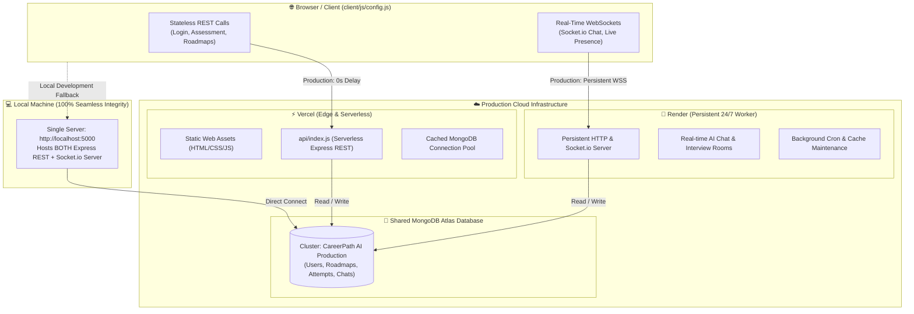

# Hybrid Backend Architecture Plan (Vercel + Render + Shared MongoDB Atlas + Local Integrity)

> **Platform**: CareerPath AI Technologies Inc.  
> **Architecture Pattern**: Hybrid Distributed Backend (Stateless Serverless REST + Persistent Real-Time Worker + Shared Atlas Cluster)  
> **Status**: ⏳ Ready for Execution (Plan #36)  
> **Tracking File**: [`careerpath-ai/plans/hybrid_backend_architecture_plan.md`](./hybrid_backend_architecture_plan.md)  

---

## 1. Executive Summary & Architectural Vision

In production EdTech and AI platforms, backend requirements naturally fall into two distinct execution profiles:
1. **Stateless, High-Throughput REST APIs**: Authentication, user profile retrieval, career assessments, AI roadmap generation, resume analysis, and quiz scoring. These endpoints demand **instantaneous response times (0 cold-start delay)** and infinite horizontal auto-scaling without idle server cost.
2. **Stateful, Persistent Real-Time Operations**: Socket.io live chat rooms, collaborative peer interview chambers, long-running asynchronous PDF/resume text extraction, and scheduled background cron jobs. These processes require a **long-lived Node.js event loop** that never terminates or times out.

Previously, relying solely on Render's free-tier server resulted in **30–50 second cold-start delays** when users first accessed login or assessment pages after 15 minutes of inactivity. Conversely, deploying purely to Vercel would break WebSockets and long-running cron jobs due to serverless execution timeout limits (10–15s).

### The Hybrid Solution
We adopt a **Dual-Engine Hybrid Backend Architecture**:
- **Vercel**: Handles **all static frontend pages** (`client/`) and **stateless REST APIs** (`/api/*`) as Serverless Functions, providing users with a **0-second instantaneous experience** worldwide.
- **Render**: Hosts a **persistent 24/7 service** (`careerpath-ai-api`) dedicated to **Socket.io real-time events**, AI live chat streaming, asynchronous background jobs, and automated maintenance cron tasks.
- **Shared MongoDB Atlas**: Both Vercel and Render connect to the **identical MongoDB Atlas database cluster**, guaranteeing strict single-source-of-truth consistency.
- **100% Local Development Integrity**: On local machines (`localhost:5000`), the entire system runs seamlessly as a **single unified server process** using `npm start` / `npm run dev` with zero microservice friction.



---

## 2. Core Pillars & Service Responsibilities

### Pillar 1: Vercel (Stateless REST API Engine)
- **Deployment Type**: Serverless Functions (`api/index.js`) + Static Edge CDN (`client/`).
- **Target Endpoints**:
  - `POST /api/auth/register`, `/api/auth/login`, `/api/auth/verify-otp`, `/api/auth/google`, `/api/auth/github`
  - `GET /api/users/profile`, `PUT /api/users/profile`, `GET /api/dashboard`
  - `GET /api/careers`, `GET /api/careers/:id`
  - `POST /api/assessment/submit`, `POST /api/recommendations/generate`
  - `GET /api/roadmaps`, `POST /api/roadmaps/select-route`, `PUT /api/roadmaps/progress`
  - `GET /api/skills`, `POST /api/quiz/evaluate`
  - `POST /api/resume/analyze`, `GET /api/readiness/certificate/:id`
  - `GET /api/campus/overview`, `POST /api/campus/apply`
- **Key Architectural Optimization**:
  - **Serverless Mongoose Connection Caching**: Normal `mongoose.connect()` inside serverless functions creates a new connection on every request, exhausting Atlas pool limits. We implement global connection caching (`global.mongooseCached`) so warm function invocations reuse existing TCP sockets with **<5ms execution time**.

### Pillar 2: Render (Persistent Real-Time & Background Worker)
- **Deployment Type**: 24/7 Persistent Node.js Web Service (`server/render.yaml`).
- **Target Responsibilities**:
  - **Socket.io WebSocket Server (`/socket.io`)**:
    - Live AI mentor chat streaming and interactive guidance.
    - Peer-to-peer technical interview mock chamber signaling.
    - Live online presence count and session telemetry.
  - **Asynchronous Background Workers**:
    - Heavy PDF text extraction and ATS token scoring offloaded from Vercel function timeout thresholds.
    - YouTube Data API v3 cache warming and syllabus video freshness synchronization.
  - **Automated Scheduled Cron Jobs (`cronService.js`)**:
    - Daily 180-day Skill Currency Ledger validation (pruning expired attempt currency).
    - Nightly campus placement readiness report pre-computation.
    - Health heartbeat pinging.

### Pillar 3: Shared MongoDB Atlas (Single Source of Truth)
- **Target Cluster**: Production MongoDB Atlas cluster (`MONGODB_URI`).
- **Consistency Rules**:
  - Real-time messages sent via Render Socket.io are persisted into `ChatMessage` schema in Atlas.
  - If a user opens their dashboard or history on Vercel, the REST API fetches the identical records from MongoDB Atlas.
  - No database synchronization lag; both services are first-class clients of the same Atlas cluster.
- **Connection Pool Sizing**:
  - Vercel Serverless: `maxPoolSize: 10`, `serverSelectionTimeoutMS: 5000` (short-lived, highly concurrent).
  - Render Worker: `maxPoolSize: 20` (long-lived, persistent).

### Pillar 4: Local Development Integrity (Mandatory Requirement)
- **Zero-Friction Local Run**:
  - A developer running `npm run dev` or `npm start` in the repository starts `server/server.js` on `http://localhost:5000`.
  - The server mounts **both** the Express REST routes (`/api/*`) **and** attaches the Socket.io WebSocket engine to the HTTP server (`http.createServer(app)`).
  - Background workers run locally in the same process.
  - The client (`client/js/config.js`) detects `isLocal = true` and points both `API_BASE_URL` and `REALTIME_BASE_URL` to `http://localhost:5000`.
  - **Result**: Zero configuration, no Docker needed, single terminal command, 100% feature parity.

---

## 3. Detailed Component Blueprint

### 3.1 Serverless Database Connection Caching (`server/config/db.js`)
To prevent MongoDB Atlas connection starvation and enable 0ms cold-start reuse in Vercel:
```javascript
// server/config/db.js
const mongoose = require('mongoose');

let cached = global.mongoose;
if (!cached) {
  cached = global.mongoose = { conn: null, promise: null };
}

const connectDB = async () => {
  if (cached.conn) {
    return cached.conn;
  }

  if (!cached.promise) {
    const opts = {
      bufferCommands: false,
      maxPoolSize: process.env.VERCEL ? 10 : 20,
      serverSelectionTimeoutMS: 5000,
    };
    cached.promise = mongoose.connect(process.env.MONGODB_URI, opts).then((mongooseInstance) => {
      console.log(`✅ MongoDB Connected [${process.env.VERCEL ? 'Serverless' : 'Persistent'}]: ${mongooseInstance.connection.host}`);
      return mongooseInstance;
    });
  }

  try {
    cached.conn = await cached.promise;
  } catch (e) {
    cached.promise = null;
    throw e;
  }

  return cached.conn;
};

module.exports = connectDB;
```

### 3.2 Vercel Serverless Entrypoint (`api/index.js`)
Create a clean Vercel serverless entrypoint in the project root:
```javascript
// api/index.js
const app = require('../server/server');
const connectDB = require('../server/config/db');

module.exports = async (req, res) => {
  // Ensure database connection is cached prior to handling request
  await connectDB();
  return app(req, res);
};
```

### 3.3 Root `vercel.json` Routing Specification
Update root `vercel.json` to seamlessly route static assets from `client/` and serverless API calls to `api/index.js`:
```json
{
  "$schema": "https://openapi.vercel.sh/vercel.json",
  "version": 2,
  "cleanUrls": true,
  "trailingSlash": false,
  "rewrites": [
    { "source": "/api/(.*)", "destination": "/api/index.js" },
    { "source": "/(.*)", "destination": "/client/$1" }
  ],
  "headers": [
    {
      "source": "/api/(.*)",
      "headers": [
        { "key": "Access-Control-Allow-Credentials", "value": "true" },
        { "key": "Access-Control-Allow-Origin", "value": "*" },
        { "key": "Access-Control-Allow-Methods", "value": "GET,OPTIONS,PATCH,DELETE,POST,PUT" },
        { "key": "Access-Control-Allow-Headers", "value": "X-CSRF-Token, X-Requested-With, Accept, Accept-Version, Content-Length, Content-MD5, Content-Type, Date, X-Api-Version, Authorization" }
      ]
    }
  ]
}
```

### 3.4 Socket.io Real-Time Service (`server/services/socketService.js`)
Modular Socket.io initializer that attaches cleanly to any Node HTTP server:
- Attaches to HTTP server when running in standalone/Render mode or local mode.
- Does not run inside Vercel serverless functions (guarded by `if (!process.env.VERCEL)`).
- Provides:
  - `connection` and `disconnect` event handlers.
  - `join_mentor_room`, `send_mentor_message`, `stream_mentor_chunk` for AI Career Mentor live streaming.
  - `join_interview_room`, `interview_signal` for real-time mock interviews.
  - `online_stats` broadcast for active student counter.

### 3.5 Background Cron & Worker Engine (`server/services/cronService.js`)
Scheduled maintenance routines active exclusively on persistent instances (Render / Local):
- Guarded by `if (process.env.VERCEL) return;`.
- Runs every 24 hours:
  - Scans `Attempt` ledger and flags skills older than 180 days for currency re-verification.
  - Prunes expired cache records and orphaned upload temp files.
- Runs every 60 minutes:
  - Verifies YouTube cache health and keeps database connection alive.

### 3.6 Express Server Dual-Bootstrapping (`server/server.js`)
Update `server/server.js` to create an HTTP server and mount Socket.io when running locally or on Render:
```javascript
const http = require('http');
const { initSocket } = require('./services/socketService');
const { initCron } = require('./services/cronService');

// When NOT running on Vercel (Local or Render):
if (!process.env.VERCEL) {
  const server = http.createServer(app);
  initSocket(server);
  initCron();

  server.listen(PORT, () => {
    console.log(`🚀 Unified CareerPath AI Server running on http://localhost:${PORT}`);
    console.log(`⚡ REST APIs: http://localhost:${PORT}/api`);
    console.log(`🔌 WebSockets: ws://localhost:${PORT}`);
  });
}
```

### 3.7 Client Smart Dual-Endpoint Routing (`client/js/config.js`)
Upgrade `config.js` to configure both REST and Real-Time endpoints with 100% automatic environment detection:
```javascript
// client/js/config.js
const isLocal = ['localhost', '127.0.0.1', ''].includes(window.location.hostname);

// In production:
// 1. Vercel hosts frontend & REST API at current origin or dedicated domain
// 2. Render hosts persistent Socket.io & worker services
const PRODUCTION_REST_API = window.location.origin.includes('vercel.app') 
  ? `${window.location.origin}/api` 
  : 'https://careerpath-ai.vercel.app/api';

const PRODUCTION_REALTIME_URL = 'https://careerpath-ai-bdbt.onrender.com';

const CONFIG = {
  // Stateless REST API (Vercel in Prod, localhost:5000 in dev)
  API_BASE_URL: isLocal ? 'http://localhost:5000/api' : PRODUCTION_REST_API,

  // Persistent Real-Time & WebSockets (Render in Prod, localhost:5000 in dev)
  REALTIME_BASE_URL: isLocal ? 'http://localhost:5000' : PRODUCTION_REALTIME_URL,
  SOCKET_URL: isLocal ? 'http://localhost:5000' : PRODUCTION_REALTIME_URL,

  // ... other configs ...
};
```

### 3.8 Render Blueprint Specification (`server/render.yaml`)
Update Render configuration to identify as the persistent real-time & worker service:
- Sets `PORT: 10000`.
- Sets `SERVER_ROLE: realtime-worker`.
- Sets `CLIENT_URL: https://careerpath-ai.vercel.app`.
- Configures health check at `/api/health`.

---

## 4. Implementation Steps & Verification Plan

| Step | Action Description | Files Affected | Verification Command |
|---|---|---|---|
| **Step 1** | **Serverless DB Connection Caching**<br/>Add global connection pooling and caching to `server/config/db.js` for instant Vercel reuse. | `server/config/db.js` | `node -e "require('./server/config/db')"` |
| **Step 2** | **Root Package Dependencies Alignment**<br/>Ensure root `package.json` installs or references server dependencies so Vercel builds serverless functions with all modules. | `package.json` | `npm run test` |
| **Step 3** | **Vercel Serverless Entrypoint & Rewrites**<br/>Create `api/index.js` and update root `vercel.json` for static client + `/api/*` serverless routing. | `api/index.js`, `vercel.json` | `node --check api/index.js` |
| **Step 4** | **Socket.io Service Module**<br/>Add `socket.io` to `server/package.json` and create modular `server/services/socketService.js`. | `server/package.json`, `server/services/socketService.js` | `node --check server/services/socketService.js` |
| **Step 5** | **Background Worker & Cron Engine**<br/>Create `server/services/cronService.js` for persistent 180-day ledger sweeps and YouTube cache keeping. | `server/services/cronService.js` | `node --check server/services/cronService.js` |
| **Step 6** | **Server Unified Bootstrapping**<br/>Wrap `server.js` with `http.createServer()`, mount Socket.io & cron in non-serverless mode, export `app` cleanly. | `server/server.js` | `node --check server/server.js` |
| **Step 7** | **Client Dual-Endpoint Configuration**<br/>Update `client/js/config.js`, add `client/js/socket-client.js`, and wire graceful fallback into `chat.js`. | `client/js/config.js`, `client/js/socket-client.js`, `client/js/chat.js` | Browser console test |
| **Step 8** | **Render Deployment Blueprint Sync**<br/>Update `server/render.yaml` with explicit worker roles, CORS origin whitelisting, and health telemetry. | `server/render.yaml`, `server/.env.example` | YAML schema check |
| **Step 9** | **Master Tracker & Plans Audit Update**<br/>Record Plan 36 in `careerpath-ai/plans/README.md` and audit previous plan states. | `careerpath-ai/plans/README.md` | Audit check |

---

## 5. Security & Secret Hygiene Protocol

- **Zero Hardcoded Secrets**: Neither Vercel nor Render will have embedded API keys or passwords in source code.
- **Environment Variables Matrix**:
  - `MONGODB_URI`: Shared between Vercel Environment Variables and Render Environment Variables.
  - `JWT_SECRET`: Identical on both Vercel and Render so tokens signed by Vercel REST authentication are valid for Render Socket.io authentication.
  - `CLIENT_URL`: Configured on Render to allow CORS from `https://careerpath-ai.vercel.app` as well as `http://localhost:5000` and `http://localhost:5500`.
- **CORS Dual-Whitelisting in `server/server.js`**:
  Allow both Vercel production domains, local development origins (`localhost:5000`, `localhost:5500`, `127.0.0.1`), and mobile wrappers cleanly without wildcard security risks.

---

## 6. Verification & Quality Gates

1. **Local Single-Server Integrity Test**:
   - Run `npm start` in `careerpath-ai/server` $\rightarrow$ verify both REST endpoints (`/api/health`) and WebSocket connection succeed on port 5000.
2. **Serverless Emulation Test**:
   - Run `node -e "process.env.VERCEL='1'; const app = require('./server/server'); console.log('Exported app:', typeof app);"` $\rightarrow$ verify app exports without opening lingering network ports.
3. **Mongoose Connection Pool Reuse Test**:
   - Verify multiple invocations of `connectDB()` return the same cached `mongooseInstance` without creating separate socket connections.
4. **End-to-End Client Fallback**:
   - Open frontend locally $\rightarrow$ verify requests route to `http://localhost:5000/api` with zero cold-start banner.

---

## 7. Master Plan Audit & Tracking Table

| Plan File | Plan Description | Implemented? | Status Notes |
|---|---|:---:|---|
| [`keep_required_remove_bloat_plan.md`](./keep_required_remove_bloat_plan.md) | Keep required core pillars, purge `bicea.org` ads & hackathon bloat | **⏳ Pending** | Plan created (#35). Deferred by user in favor of Hybrid Architecture plan. |
| [`hybrid_backend_architecture_plan.md`](./hybrid_backend_architecture_plan.md) | Hybrid Vercel REST + Render Real-Time + Shared Atlas DB + Local Integrity | **⏳ Ready for Execution (Current Plan)** | Plan #36 drafted. Ready for implementation. |
