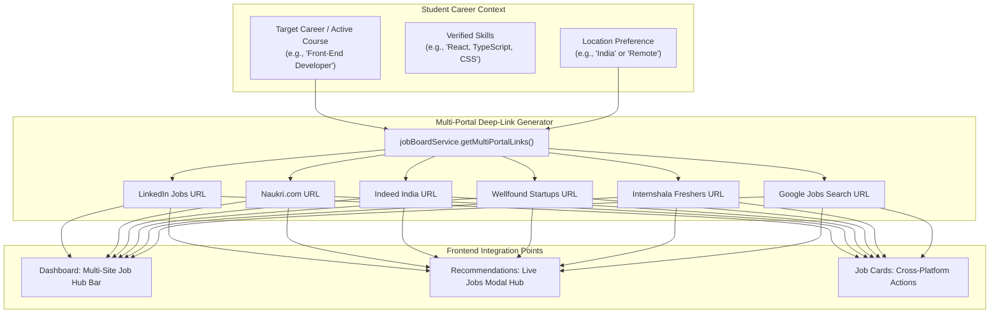

# Implementation Plan: Multi-Site Job Market Hub & Direct Portal Launchers

**CareerPath AI · Team 404 Brain Not Found**  
*Hack2Ignite 2026-27*

---

## Goal Description

Enhance the **CareerPath AI Job Market** engine on both the **Dashboard** and **Career Recommendations** pages so that students are not limited to a single aggregator link, but can **instantly open and cross-search multiple major job portals simultaneously** (e.g. *LinkedIn Jobs*, *Naukri.com*, *Indeed India*, *Wellfound / AngelList*, *Internshala*, and *Google for Jobs*).

### What this accomplishes:
1. **Multi-Platform Job Market Launch Hub**:
   - A dedicated multi-portal quick-launch strip at the top of `#matchedJobsCard` on the Dashboard and inside the Live Market Opportunities modal on the Recommendations page.
   - Features 1-click branded launcher badges for:
     - 💼 **LinkedIn Jobs** (Industry standard for networking and direct recruiter outreach)
     - 📄 **Naukri.com** (India's highest recruiter activity volume)
     - 🔍 **Indeed India** (Large-scale aggregator for tech & entry-level roles)
     - 🚀 **Wellfound / AngelList** (Leading venture-backed tech & AI startups)
     - 🎓 **Internshala** (Specialized for freshers, college students, and apprenticeships)
     - 🌐 **Google for Jobs** (Aggregates direct company career pages)
2. **1-Click Master Multi-Portal Launcher ("⚡ Launch All Job Portals")**:
   - A single primary action that opens pre-filtered, targeted search queries tailored to the student's exact active career (e.g. *"Front-End Developer in India / Remote"*) across the top recruitment networks.
3. **Per-Job Card Multi-Platform Cross-Search**:
   - On individual job cards, alongside "Quick Apply", provide a **"Cross-Search Platforms"** action allowing students to search for the specific role or company on LinkedIn, Naukri, or Google Jobs with 1 click.
4. **Backend Deep-Link Engine (`server/services/jobBoardService.js`)**:
   - Robust URL generation utility creating clean, public search queries with zero API key dependencies, ensuring 100% uptime during live demos and evaluation.

---

## User Review Required

> [!IMPORTANT]
> **Browser Multi-Tab Popup Policy & Graceful Execution:**
> Modern web browsers (Chrome, Edge, Firefox, Safari) by default block multiple simultaneous `window.open` calls triggered by a single click event as potential popups (only the first tab opens automatically unless user allows popups).
> To provide a frictionless, 100% reliable experience:
> 1. The **"Launch All Job Portals"** button triggers an interactive launch sequence: opens the top primary portal immediately (e.g. LinkedIn), and renders an instant **Quick-Launch Bar** with 1-click tiles for the other portals.
> 2. Direct single-click branded badges for all 6 portals are always visible and open in separate new tabs (`target="_blank"` with `rel="noopener noreferrer"`).
> 3. Each individual job card includes direct cross-search buttons for LinkedIn, Naukri, and Google Jobs.

---

## Architecture & Multi-Portal Data Flow



---

## Proposed Changes

### Component 1: Backend Multi-Portal Service & API

#### [MODIFY] `server/services/jobBoardService.js`
- Add `generateMultiPortalLinks(roleTitle, location = 'India', companyName = null)` helper:
```javascript
/**
 * Generates verified public search deep-links across 6 major job platforms.
 */
function generateMultiPortalLinks(roleTitle = 'Software Engineer', location = 'India', companyName = null) {
  const cleanRole = String(roleTitle || 'developer').trim();
  const cleanSlug = cleanRole.toLowerCase().replace(/[^a-z0-9]+/g, '-').replace(/(^-|-$)/g, '');
  const searchCompany = companyName ? String(companyName).trim() : '';

  const queryWithCompany = searchCompany ? `${cleanRole} ${searchCompany}` : cleanRole;

  return {
    linkedin: `https://www.linkedin.com/jobs/search/?keywords=${encodeURIComponent(queryWithCompany)}&location=${encodeURIComponent(location)}`,
    naukri: `https://www.naukri.com/jobs-in-india?k=${encodeURIComponent(queryWithCompany)}`,
    indeed: `https://in.indeed.com/jobs?q=${encodeURIComponent(queryWithCompany)}&l=${encodeURIComponent(location)}`,
    wellfound: `https://wellfound.com/jobs?query=${encodeURIComponent(cleanRole)}`,
    internshala: `https://internshala.com/jobs/${encodeURIComponent(cleanSlug)}-jobs/`,
    googleJobs: `https://www.google.com/search?q=${encodeURIComponent(queryWithCompany + ' jobs in ' + location)}&ibp=htl;jobs`,
  };
}
```
- In `getJobsForCareer` and `searchAdzunaJobs`, attach `portalLinks: generateMultiPortalLinks(job.title, 'India', job.companyName)` to every job object.
- Export `generateMultiPortalLinks`.

#### [MODIFY] `server/routes/jobRoutes.js`
- Add endpoint `GET /api/jobs/portal-links`:
```javascript
/**
 * GET /api/jobs/portal-links
 * Query params: role, location, company
 * Returns generated search deep-links for all major platforms.
 */
router.get('/portal-links', (req, res) => {
  const { role, location, company } = req.query;
  const links = generateMultiPortalLinks(role || 'Software Engineer', location || 'India', company || null);
  return res.status(200).json({
    success: true,
    data: {
      role: role || 'Software Engineer',
      location: location || 'India',
      portals: links
    }
  });
});
```

---

### Component 2: Dashboard UI — Multi-Platform Job Hub

#### [MODIFY] `client/dashboard.html`
- Inside `#matchedJobsCard` (lines 765–785), insert the **Multi-Site Job Market Hub Strip**:
```html
<!-- Multi-Site Job Market Hub Strip -->
<div class="p-3 rounded-2 stat-box-atlas border border-line mb-3" id="dashboardMultiJobHub">
  <div class="d-flex align-items-center justify-content-between flex-wrap gap-2 mb-2 pb-2 border-bottom border-line">
    <div class="d-flex align-items-center gap-2">
      <span class="badge badge-navy font-monospace text-uppercase" style="font-size: 0.68rem;">
        <i class="bi bi-globe me-1"></i> MULTI-PORTAL RECRUITMENT HUB
      </span>
      <span class="text-secondary small fw-medium">Search live openings across major platforms</span>
    </div>
    <button type="button" class="btn cp-btn-primary btn-sm px-3 py-1 fw-semibold d-inline-flex align-items-center gap-1.5" id="btnLaunchAllPortalsDash">
      <i class="bi bi-lightning-charge-fill text-warning"></i>
      <span>Launch All Major Portals</span>
    </button>
  </div>

  <!-- Branded Portal Quick-Launch Badges -->
  <div class="d-flex align-items-center gap-2 flex-wrap" id="dashPortalBadgesContainer">
    <a href="#" target="_blank" rel="noopener noreferrer" class="portal-badge portal-linkedin" id="portalDashLinkedin">
      <i class="bi bi-linkedin me-1 text-primary"></i> LinkedIn Jobs
    </a>
    <a href="#" target="_blank" rel="noopener noreferrer" class="portal-badge portal-naukri" id="portalDashNaukri">
      <i class="bi bi-briefcase-fill me-1 text-danger"></i> Naukri.com
    </a>
    <a href="#" target="_blank" rel="noopener noreferrer" class="portal-badge portal-indeed" id="portalDashIndeed">
      <i class="bi bi-search me-1 text-info"></i> Indeed
    </a>
    <a href="#" target="_blank" rel="noopener noreferrer" class="portal-badge portal-wellfound" id="portalDashWellfound">
      <i class="bi bi-rocket-takeoff-fill me-1 text-warning"></i> Wellfound (Startups)
    </a>
    <a href="#" target="_blank" rel="noopener noreferrer" class="portal-badge portal-internshala" id="portalDashInternshala">
      <i class="bi bi-mortarboard-fill me-1 text-success"></i> Internshala
    </a>
    <a href="#" target="_blank" rel="noopener noreferrer" class="portal-badge portal-google" id="portalDashGoogle">
      <i class="bi bi-google me-1 text-danger"></i> Google Jobs
    </a>
  </div>
</div>
```

#### [MODIFY] `client/js/dashboard.js`
- In `loadMatchedJobs`:
  - Dynamically configure `#portalDashLinkedin`, `#portalDashNaukri`, `#portalDashIndeed`, `#portalDashWellfound`, `#portalDashInternshala`, `#portalDashGoogle` with the student's active career title.
  - Wire `#btnLaunchAllPortalsDash`:
    - Automatically opens LinkedIn in a new tab.
    - Displays a smooth toast / modal opening the top recruitment portals for the student.
- On each job card:
  - Add a **"Find on Other Platforms"** dropdown:
    - 🔵 LinkedIn search
    - 🟦 Naukri search
    - 🔴 Google Jobs search

---

### Component 3: Recommendations Page — Live Jobs Modal Multi-Portal Hub

#### [MODIFY] `client/recommendations.html`
- Inside `#liveJobsModal` (lines 385–405), directly above the job list, add the **Multi-Portal Launch Bar**:
```html
<!-- Multi-Platform Live Search Strip -->
<div class="p-3 rounded-2 mb-3 stat-box-atlas border border-line" id="modalMultiJobHub">
  <div class="d-flex align-items-center justify-content-between flex-wrap gap-2 mb-2 pb-2 border-bottom border-line">
    <div class="d-flex align-items-center gap-2">
      <span class="atlas-badge text-teal border-teal"><i class="bi bi-globe me-1"></i> MULTI-SITE LAUNCHER</span>
      <span class="text-secondary small fw-medium">Direct search on top hiring sites</span>
    </div>
    <button type="button" class="btn cp-btn-primary btn-sm px-3 py-1" id="btnLaunchAllPortalsModal">
      <i class="bi bi-box-arrow-up-right me-1"></i> Open All Portals (1-Click)
    </button>
  </div>
  <div class="d-flex align-items-center gap-2 flex-wrap" id="modalPortalBadgesContainer">
    <!-- Populated dynamically via recommendations.js -->
  </div>
</div>
```

#### [MODIFY] `client/js/recommendations.js`
- In `loadJobsForCareer(slug, title, isGlobalRemote)`:
  - Generate the portal deep-links for `title`.
  - Populate `#modalPortalBadgesContainer` with clickable badges for LinkedIn, Naukri, Indeed, Wellfound, Internshala, and Google Jobs.
  - Wire `#btnLaunchAllPortalsModal` to open the primary portal and offer 1-click access to all others.
  - Add "Multi-Platform Search" shortcuts on each individual job card in the modal.

---

### Component 4: Styling & Visual Polish

#### [MODIFY] `client/css/style.css` (or embedded styles)
- Add aesthetic portal badge styling with subtle hover lift and platform brand colors:
```css
.portal-badge {
  display: inline-flex;
  align-items: center;
  padding: 4px 10px;
  border-radius: 6px;
  font-size: 0.78rem;
  font-weight: 600;
  text-decoration: none;
  background: #ffffff;
  border: 1px solid var(--border-color, #e2e8f0);
  color: var(--ink, #1e293b);
  transition: all 0.18s ease-in-out;
}
.portal-badge:hover {
  transform: translateY(-1px);
  box-shadow: 0 2px 6px rgba(0, 0, 0, 0.08);
  border-color: var(--color-teal, #14b8a6);
}
```

---

## Verification Plan

### Automated Syntax Verification
```powershell
node -c server/services/jobBoardService.js
node -c server/routes/jobRoutes.js
```

### Manual Verification Scenarios

| Test Case | Expected Behavior |
| :--- | :--- |
| **1. Multi-Portal Hub on Dashboard** | Load `dashboard.html`. The "MULTI-PORTAL RECRUITMENT HUB" displays 6 branded portal badges (LinkedIn, Naukri, Indeed, Wellfound, Internshala, Google Jobs) mapped to the user's active career. |
| **2. Clicking Portal Badge** | Clicking **LinkedIn Jobs** opens a new tab with `https://www.linkedin.com/jobs/search/?keywords=<TargetRole>&location=India`. |
| **3. Clicking Naukri Badge** | Clicking **Naukri.com** opens a new tab with `https://www.naukri.com/jobs-in-india?k=<TargetRole>`. |
| **4. Clicking Internshala Badge** | Clicking **Internshala** opens a new tab with `https://internshala.com/jobs/<role-slug>-jobs/`. |
| **5. "Launch All Portals" Button** | Clicking the button opens the primary portal and displays a multi-portal quick-selector toast/banner. |
| **6. Recommendations Modal Multi-Search** | Open `recommendations.html`, click "Live Market Jobs" for any recommended career (e.g. Data Analyst). The modal displays the Multi-Site Launcher pre-filtered for "Data Analyst". |
| **7. Job Card Multi-Platform Links** | Each job card in both Dashboard and Recommendations displays quick-search links for LinkedIn and Google Jobs alongside "Quick Apply". |
