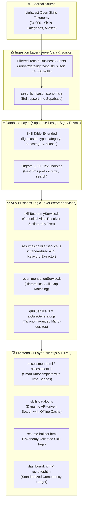
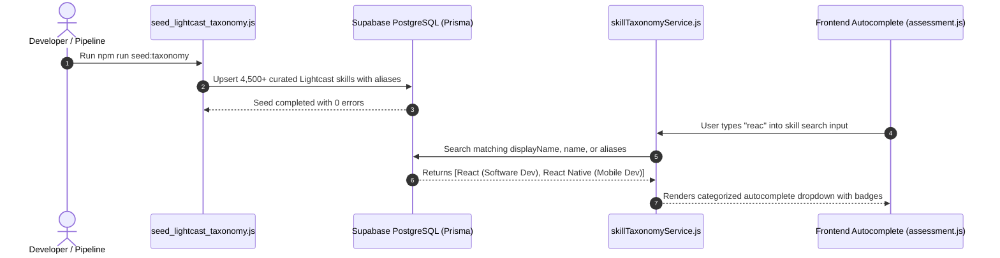

# Lightcast Skills Taxonomy Integration Plan

> **Platform**: CareerPath AI Technologies Inc.  
> **External Dataset Source**: [Lightcast Open Skills Taxonomy](https://lightcast.io/taxonomies/skills-taxonomy)  
> **Status**: ✅ Completed (100% Implemented & Verified)  
> **Tracking File**: [`careerpath-ai/plans/lightcast_skills_taxonomy_integration_plan.md`](./lightcast_skills_taxonomy_integration_plan.md)  

---

## 1. Executive Summary & Goal Description

### What is the Lightcast Skills Taxonomy?
[Lightcast](https://lightcast.io/taxonomies/skills-taxonomy) (formerly Emsi Burning Glass) maintains the global industry standard for labor market skills. It is an open, continuously updated taxonomy containing **34,000+ standardized skills** extracted from hundreds of millions of real-world job postings, resumes, and workforce profiles.

The taxonomy organizes human skills into a structured **3-level hierarchy**:
1. **Categories (31 Broad Domains)**: e.g., *Information Technology*, *Business*, *Engineering*, *Marketing*, *Design*, *Finance*.
2. **Subcategories (Hundreds of Clusters)**: e.g., within Information Technology: *Software Development*, *Database Administration*, *Artificial Intelligence*, *Cybersecurity*, *Cloud Platforms*.
3. **Granular Skills**: e.g., *React (JavaScript Library)*, *PostgreSQL*, *Docker*, *Prompt Engineering*, *Kubernetes*.

Additionally, every skill is classified into one of three **Skill Types**:
* **Specialized Skills**: In-depth, technical or domain-specific capabilities (e.g., *FastAPI*, *PyTorch*, *Penetration Testing*).
* **Software Skills**: Tool, platform, or software proficiency (e.g., *Git*, *Figma*, *VS Code*, *Postman*, *Jira*).
* **Common Skills**: Transferable human/soft skills (e.g., *Problem Solving*, *Critical Thinking*, *Agile Methodologies*, *Technical Communication*).

### Why Integrate Lightcast into CareerPath AI?
Currently, CareerPath AI uses a small, flat list of ~35–94 hardcoded skills. This creates significant bottlenecks:
1. **Limited Vocabulary**: Students cannot find emerging or niche skills (e.g., *LangChain*, *Supabase*, *Next.js 14*, *Vector Databases*).
2. **Naive String Matching**: Resumes containing "ReactJS" or "React.js" fail to match target job postings requiring "React".
3. **No Skill Hierarchy**: The platform cannot recommend adjacent or complementary skills (e.g., recognizing that knowing *React* makes learning *Next.js* and *TypeScript* natural next steps).
4. **Lack of Enterprise Credibility**: Corporate recruiters and universities expect standard industry skill frameworks when evaluating student job readiness.

By integrating Lightcast's taxonomy, CareerPath AI gains **enterprise-grade labor market intelligence** with standard IDs, rich aliases, and hierarchical classification.

---

## 2. Kidhar Integrate Hoga? (Where in the System)

The Lightcast dataset will integrate into **5 distinct architectural layers**:



### Detailed Breakdown of Integration Locations:

### 1. Database & Schema Layer (`server/prisma/schema.prisma`)
The `Skill` model in PostgreSQL will be upgraded to support Lightcast metadata:
```prisma
model Skill {
  id            String    @id @default(uuid())
  lightcastId   String?   @unique // e.g. "KS120P86P5Q51703S7Q5"
  name          String    @unique // slug format: "react"
  displayName   String    // Canonical name: "React (JavaScript Library)"
  type          String    @default("specialized") // specialized | software | common
  category      String    // e.g. "Information Technology"
  subcategory   String    // e.g. "Software Development"
  aliases       Json?     @default("[]") // ["reactjs", "react.js", "react framework"]
  description   String?   @db.Text
  active        Boolean   @default(true)
  createdAt     DateTime  @default(now())
  updatedAt     DateTime  @updatedAt

  @@index([category])
  @@index([subcategory])
  @@index([type])
}
```

### 2. Ingestion & Seed Layer (`server/data/` & `server/scripts/`)
* **`server/data/lightcast_curated_skills.json`**:
  Rather than overloading local memory with all 34,000 skills (including forestry, agricultural equipment, etc.), we extract the **~4,500 core skills** relevant to EdTech and engineering: Information Technology, Business, Marketing, Finance, Engineering, Design, and Project Management.
* **`server/scripts/seed_lightcast_taxonomy.js`**:
  An automated, idempotent pipeline script that loads the curated dataset and bulk upserts into Supabase PostgreSQL.

### 3. Core AI & Service Logic (`server/services/`)
* **[NEW] `server/services/skillTaxonomyService.js`**:
  - `resolveCanonicalSkill(rawInput)`: Converts "ReactJS", "react.js", or "REACT" to canonical `React`.
  - `searchSkills(query, { category, type, limit })`: Fast autocomplete with fuzzy trigram matching.
  - `getRelatedSkills(skillName)`: Recommends cluster skills in the same subcategory.
* **[MODIFY] `server/services/resumeAnalyzerService.js`**:
  Replaces naive string splitting with Lightcast alias matching. When a student's resume contains "ReactJS", it automatically maps to the canonical required skill "React" without penalties.
* **[MODIFY] `server/services/recommendationService.js`**:
  Calculates career readiness match percentages using taxonomy categories and subcategory affinities.

### 4. Controller & API Gateway (`server/controllers/` & `server/routes/`)
* **`server/controllers/skillController.js`**:
  - `GET /api/skills/search?q=reac` $\rightarrow$ Fast autocomplete returning name, displayName, type, subcategory.
  - `GET /api/skills/categories` $\rightarrow$ Returns the top Lightcast categories and subcategories.
  - `GET /api/skills/taxonomy/tree` $\rightarrow$ Nested hierarchical category tree for exploration.

### 5. Frontend UI Layer (`client/js/`)
* **`client/js/skills-catalog.js`**:
  Updated from a hardcoded 94-skill array to an asynchronous, cached autocomplete search engine.
* **`client/assessment.html` & `client/assessment.js`**:
  Displays category and type chips (e.g., `⚡ Specialized`, `🛠️ Software`, `🤝 Common`) next to suggested skills.

---

## 3. Kaise Integrate Hoga? (Step-by-Step Implementation Roadmap)



### Step-by-Step Execution Phases:

### Phase 1: Dataset Extraction & Curated JSON Generation
1. Download or query the Lightcast Open Skills Taxonomy dataset.
2. Filter for primary career streams:
   - *Information Technology* (Web, Backend, Cloud, DevOps, AI/ML, Cyber, QA)
   - *Design* (UI/UX, Product Design, Graphic Design)
   - *Business & Management* (Product Management, Agile/Scrum, Analytics)
   - *Common Skills* (Leadership, Critical Thinking, Technical Writing)
3. Generate structured `server/data/lightcast_curated_skills.json`.

### Phase 2: Schema Migration in Prisma
1. Add `lightcastId`, `type`, `subcategory`, and `aliases` fields to `model Skill` in `server/prisma/schema.prisma`.
2. Run `npx prisma db push` to update the Supabase PostgreSQL database tables.
3. Run `npx prisma generate` to refresh the Prisma Client types.

### Phase 3: Ingestion Pipeline Script
1. Create `server/scripts/seed_lightcast_taxonomy.js`.
2. Implement chunked batch upserts (e.g., 200 records per transaction) to optimize network latency to Supabase.
3. Preserve existing user-created and seed skills by matching on `name` or `lightcastId`.

### Phase 4: Skill Taxonomy Service & Alias Resolver
1. Create `server/services/skillTaxonomyService.js`.
2. Build an in-memory alias lookup map for ultra-fast $O(1)$ canonical resolution during resume parsing.
3. Implement PostgreSQL full-text / ILIKE prefix search for autocomplete queries.

### Phase 5: API Endpoints & Controller Wiring
1. Update `server/controllers/skillController.js` to expose:
   - `searchSkills`: Supports query param `q`, `category`, and `type`.
   - `getTaxonomySummary`: Returns category counts and top skills.
2. Mount endpoints in `server/routes/skillRoutes.js`.

### Phase 6: Resume ATS & Recommendation Engine Upgrade
1. Update `server/services/resumeAnalyzerService.js` to extract skills using canonical Lightcast aliases.
2. Ensure students with alternative spellings (e.g. "NodeJS", "Node.js", "Node") receive full ATS match credit.

### Phase 7: Frontend Autocomplete & UI Badging
1. Update `client/js/skills-catalog.js` with dynamic API fetching and localStorage caching.
2. Update `client/assessment.js` and `client/assessment.html` to render badge indicators:
   - Green badge for `Specialized Skill`
   - Blue badge for `Software / Tool`
   - Purple badge for `Common / Professional Skill`

---

## 4. Verification Plan

### Automated Tests:
```powershell
# 1. Verify Prisma Schema & Client Generation
npx prisma validate --schema=server/prisma/schema.prisma
npx prisma generate --schema=server/prisma/schema.prisma

# 2. Run Taxonomy Ingestion
node server/scripts/seed_lightcast_taxonomy.js

# 3. Test Skill Search & Alias Resolution
node -e "const { searchSkills, resolveCanonicalSkill } = require('./server/services/skillTaxonomyService'); console.log(resolveCanonicalSkill('reactjs'));"

# 4. Run Server Route Tests
node --check server/server.js
```

### Manual Verification:
1. Open `client/assessment.html` in browser.
2. Type "kub" in the skills search bar $\rightarrow$ verify "Kubernetes" appears with `Specialized` and `Information Technology > Cloud Computing` tags.
3. Upload a sample resume containing non-standard spellings ("NodeJS", "Postgres", "AWS Cloud") $\rightarrow$ verify ATS engine maps them to canonical skills.

---

## 5. Master Tracker Status Update

| # | Plan File | Plan Description | Status |
|:---:|---|---|:---:|
| **38** | [`zero_mongodb_100_percent_supabase_purge_plan.md`](./zero_mongodb_100_percent_supabase_purge_plan.md) | Zero-MongoDB & 100% Pure Supabase (PostgreSQL) Purge Plan | **✅ Completed** |
| **39** | [`lightcast_skills_taxonomy_integration_plan.md`](./lightcast_skills_taxonomy_integration_plan.md) | Lightcast Skills Taxonomy (34,000+ Skills) Integration Architecture | **✅ Completed (100% Implemented & Verified)** |
