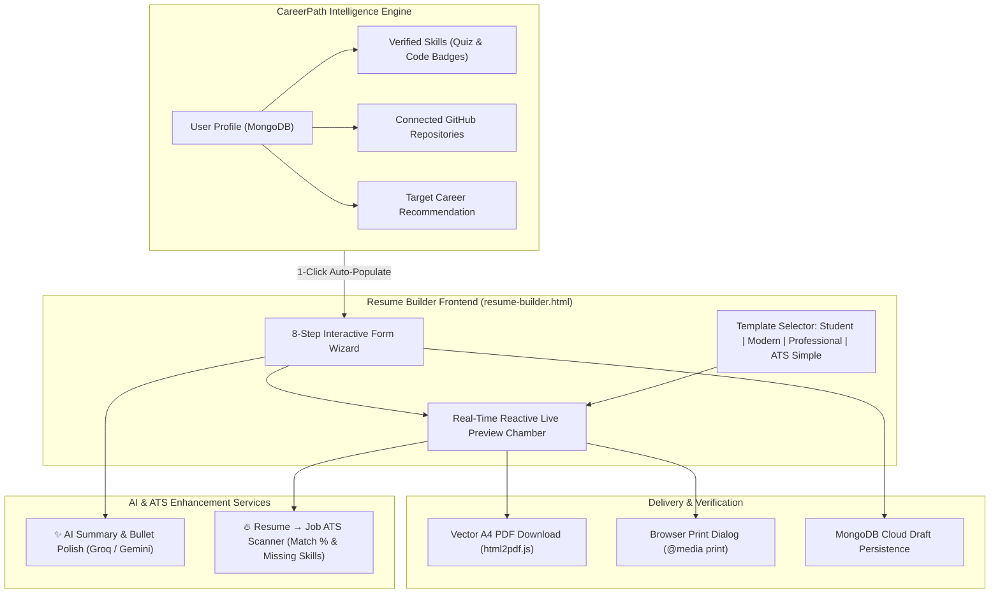

# Implementation Plan: CareerPath AI Resume Builder & ATS Job Matcher
**CareerPath AI · Team 404 Brain Not Found**
*Hack2Ignite 2026-27*

---

## Goal Description

Build an end-to-end, intelligent **Resume Builder** for CareerPath AI that bridges career assessment, verified skills, and job placement into an actionable, job-ready resume:
1. **4 Tailored Resume Templates:** Student/Fresher ⭐, Modern 💎, Professional 💼, and ATS Simple 📄 with instant live preview.
2. **8-Step Form Wizard:** Personal Info, Career Summary, Education, Skills, Projects, Experience, Certifications, and Additional Details.
3. **CareerPath Profile & GitHub Auto-Sync:** Automatically imports verified skills (with `[✓ Verified]` badges), education, and connected GitHub study repositories as pre-populated projects.
4. **AI Bullet & Summary Enhancer (`✨ Improve with AI`):** Rewrites vague summaries and bullet points into metric-driven, action-oriented achievements using Groq LLaMA-3 / Gemini.
5. **Resume → Job Match (ATS Scanner):** Allows students to paste any job description and receive a match percentage (e.g. 78%), matched skills 🟢, missing keywords 🔴, and tailoring advice.
6. **Pixel-Perfect PDF Generation:** Instant vector A4 PDF export with clickable links using `html2pdf.js` and dedicated `@media print` rules.

---

## User Review Required

> [!IMPORTANT]
> **Career Evidence Integration:**
> Unlike generic resume builders (Canva, NovoResume), CareerPath AI highlights which skills are **Quiz Verified** or **GitHub Code Verified**. Recruiters viewing the resume or portfolio link see proven competence, giving our students an unfair advantage in hiring pools.

> [!NOTE]
> **Seamless Autosave:**
> The builder will continuously save drafts to MongoDB (`user.builtResume`) and fallback to `localStorage`, so students never lose their resume progress across sessions or page reloads.

---

## System Architecture & User Flow



---

## Proposed Changes

---

### Component 1: Database Model & Persistence

#### [MODIFY] `server/models/User.js`
Add `builtResume` schema to store structured resume drafts:

```javascript
// ── Sub-schema: Built Resume Structure ────────────────────────
const BuiltResumeSchema = new mongoose.Schema(
  {
    template: {
      type: String,
      enum: ['student', 'modern', 'professional', 'ats_simple'],
      default: 'student',
    },
    personalInfo: {
      fullName: { type: String, default: '' },
      headline: { type: String, default: '' },
      email: { type: String, default: '' },
      phone: { type: String, default: '' },
      location: { type: String, default: '' },
      linkedIn: { type: String, default: '' },
      gitHub: { type: String, default: '' },
      portfolio: { type: String, default: '' },
    },
    summary: { type: String, default: '' },
    education: [
      {
        degree: String,
        college: String,
        university: String,
        startYear: String,
        gradYear: String,
        score: String,
      },
    ],
    skills: [
      {
        name: String,
        level: String,
        isVerified: Boolean,
        category: String,
      },
    ],
    projects: [
      {
        title: String,
        description: String,
        techStack: [String],
        githubUrl: String,
        liveUrl: String,
        isVerified: Boolean,
      },
    ],
    experience: [
      {
        company: String,
        role: String,
        type: { type: String, default: 'Internship' }, // Full-time, Internship, Hackathon, Freelance
        duration: String,
        responsibilities: [String],
      },
    ],
    certifications: [
      {
        name: String,
        issuer: String,
        date: String,
        credentialUrl: String,
      },
    ],
    additional: {
      languages: [String],
      achievements: [String],
      hobbies: [String],
    },
    updatedAt: { type: Date, default: Date.now },
  },
  { _id: false }
);

// In UserSchema:
builtResume: {
  type: BuiltResumeSchema,
  default: () => ({}),
},
```

---

### Component 2: Backend API Endpoints & AI Controllers

#### [MODIFY] `server/controllers/resumeController.js`
Add controllers for fetching, saving, AI polishing, and Job Description matching:
* `getBuiltResume`: Returns existing `user.builtResume`, or auto-generates initial content from `user.education`, `user.skills`, and `user.githubRepos`.
* `saveBuiltResume`: Validates and saves resume state into `user.builtResume`.
* `improveResumeText`: Uses Groq LLaMA-3 / Gemini to transform raw input text into 3 quantified, professional bullet points or an executive summary.
* `matchResumeToJob`: Takes `{ resumeData, jobDescription }`, calculates an ATS Match Score (0–100%), extracts matched keywords 🟢, missing keywords 🔴, and tailoring suggestions.

#### [MODIFY] `server/routes/resumeRoutes.js`
Mount new protected routes:
```javascript
router.get('/builder', protect, getBuiltResume);
router.post('/builder', protect, saveBuiltResume);
router.post('/improve-text', protect, improveResumeText);
router.post('/match-job', protect, matchResumeToJob);
```

---

### Component 3: Frontend Resume Builder UI & Templates

#### [NEW] `client/resume-builder.html`
Dual-pane responsive split screen:
1. **Header & Global Controls:**
   - Template Switcher Bar (cards with visual mini-previews of the 4 templates).
   - Action buttons: `[ 💾 Save Draft ]`, `[ 🔍 Job Match ]`, `[ 📥 Download PDF ]`, `[ 🖨️ Print ]`.
2. **Left Column (Form Wizard):**
   - Accordion / Tab Stepper for the 8 sections.
   - Quick-action buttons:
     - `[ ⚡ Auto-Fill from CareerPath Profile ]`
     - `[ 🐙 Import from Connected GitHub Repos ]`
     - `[ ✨ Improve with AI ]` on summary and bullet points.
3. **Right Column (Live Preview Chamber):**
   - Sticky paper canvas formatted to exact A4 dimensions.
   - Zoom controls (`100%`, `75%`, `Fit Width`).
   - ATS score badge indicator.

#### [NEW] `client/css/resume-templates.css`
Pixel-perfect styling for all 4 templates and print setup:
1. `.template-student`: Clean single-column, Education and Projects highlighted prominently with GitHub badges; optimized for college freshers.
2. `.template-modern`: Stylish two-column layout with sleek sidebar, color-accented headings, and tech pill badges.
3. `.template-professional`: Corporate executive look with classic typography, elegant divider lines, and experience-first flow.
4. `.template-ats`: Minimalist black-and-white, standard system typography, 100% compliant with enterprise ATS parsers (Workday, Taleo, Greenhouse).
5. `@media print` rules ensuring headers, margins, page breaks, and link colors export cleanly without browser UI clutter.

#### [NEW] `client/js/resume-builder.js`
Client controller logic:
- Dynamic two-way data binding: typing in any form input instantly updates the live preview.
- Template switching: swaps CSS classes on the preview canvas without re-rendering form state.
- CareerPath profile loader: pre-populates fields from `GET /api/users/me`.
- GitHub repo importer: turns user's pinned study repositories into formatted project cards.
- AI modal handler: sends text to `/api/resume/improve-text` and replaces form fields with approved AI suggestions.
- ATS Job Match modal: sends current resume + pasted job description to `/api/resume/match-job` and displays visual match scores.
- PDF generation: integrates `html2pdf.js` with A4 dimensions and selectable text.

---

### Component 4: Site-Wide Navigation Integration

#### [MODIFY] `client/dashboard.html`, `client/recommendations.html`, `client/roadmap.html`, `client/index.html`
* Add **`Resume Builder`** to the notch navbar desktop links and mobile menus:
  ```html
  <li>
    <a class="notch-nav-link" href="resume-builder.html">
      <i class="bi bi-file-earmark-person me-1 text-primary"></i> Resume Builder
    </a>
  </li>
  ```
* On `dashboard.html`, add a prominent action card:
  **"📄 Build Your Verified Resume"** with subtitle *"Auto-pull verified skills & GitHub projects into an ATS-ready resume in 2 minutes."*

---

## The 4 Templates in Detail

| Template | Target Audience | Key Characteristics |
| :--- | :--- | :--- |
| **1. Student / Fresher ⭐** | BCA, B.Tech, MCA & College Freshers | Clean single column. Places Education & Projects with GitHub evidence before experience. Ideal for students with internships or hackathon projects. |
| **2. Modern 💎** | Web Developers, Designers & Techies | Contemporary two-column split with styled header, category pills for skills, and modern typography. |
| **3. Professional 💼** | Mid/Senior Engineers, Corporate Roles | Traditional executive layout with dark slate headers, focus on work experience and quantifiable achievements. |
| **4. ATS Simple 📄** | Direct applications to Enterprise Portals | 100% plain text structure, standard fonts (Arial/Helvetica), zero multi-column tables or icons, maximum parser compliance. |

---

## Verification Plan

### Automated Tests
1. **API Endpoints Test:**
   - `GET /api/resume/builder` (authenticated): Returns resume structure with preloaded profile data.
   - `POST /api/resume/builder`: Saves updated resume state to MongoDB.
   - `POST /api/resume/improve-text`: Returns 3 polished AI variations.
   - `POST /api/resume/match-job`: Returns calculated ATS match percentage and skill tags.

### Manual Verification
1. **Auto-Population Check:**
   - Log into CareerPath AI and navigate to `resume-builder.html`.
   - Verify that your name, degree, verified skills, and GitHub repos are automatically populated.
2. **Template Switcher Check:**
   - Toggle between **Student**, **Modern**, **Professional**, and **ATS Simple**.
   - Verify the live preview updates immediately without losing any entered text.
3. **AI Enhancement Check:**
   - Type a rough summary or project bullet.
   - Click `✨ Improve with AI` and verify that AI suggestions appear and can be applied with 1 click.
4. **Job Match Check:**
   - Open the "Job Match" modal, paste a sample job description (e.g. Frontend React Engineer), and verify match score and keyword gap analysis.
5. **PDF Export Check:**
   - Click `[ Download PDF ]`.
   - Inspect the downloaded PDF: verify standard A4 dimensions, sharp vector typography, and working clickable hyperlinks.
