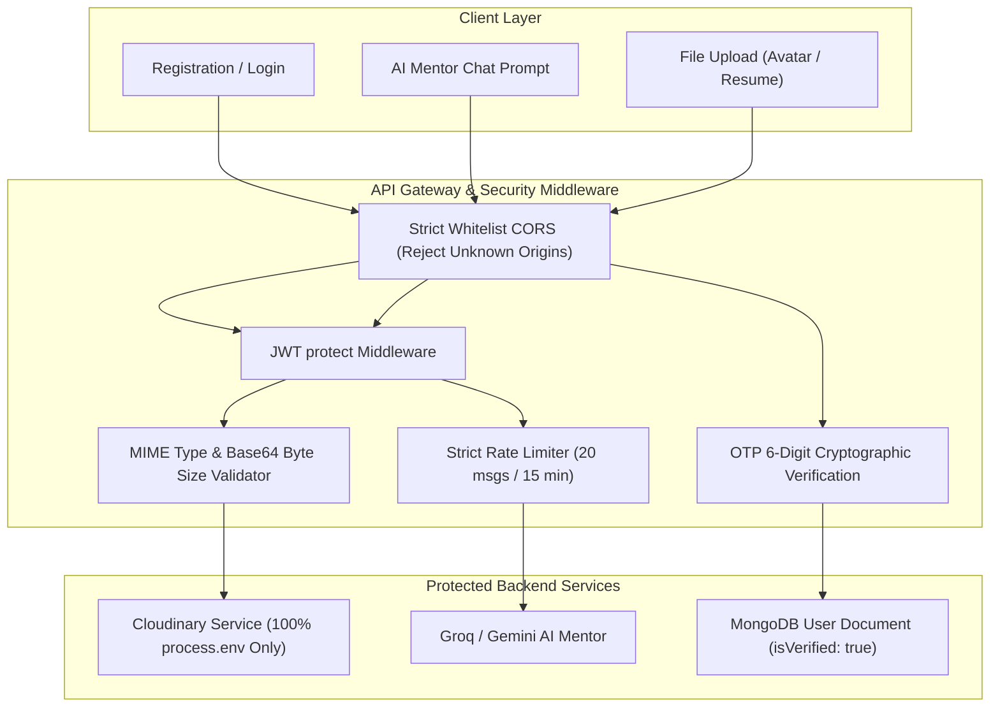

# Implementation Plan: Critical Security Blockers & Hardening
**CareerPath AI · Team 404 Brain Not Found**
*Hack2Ignite 2026-27*

---

## Goal Description

Resolve 5 critical security blockers identified in the codebase to make CareerPath AI production-hardened, compliant, and attack-resilient:
1. **Purge Hardcoded Cloudinary Credentials:** Completely remove hardcoded API key/secrets from `cloudinaryService.js` and enforce strict environment variable loading with credential rotation recommendations.
2. **Proper OTP Email Verification:** Remove the `isVerified: true` bypass in registration and login. Enforce genuine 6-digit OTP email verification with 10-minute expiry before granting access.
3. **CORS Hardening:** Replace permissive development wildcards and generic `.endsWith('.vercel.app')` matching with a strict, exact-match whitelist of approved frontend domains.
4. **Upload Validation (MIME & Size):** Enforce strict file size limits (2MB for avatars, 5MB for resumes) and whitelist allowed MIME types (`image/jpeg`, `image/png`, `image/webp` for avatars; `application/pdf`, `.doc`, `.docx` for resumes) before Cloudinary processing.
5. **AI Chat Protection & Rate Limiting:** Enforce JWT authentication on `/api/chat` and apply strict rate-limiting (20 requests per 15 minutes per user) to protect Groq/Gemini LLM quotas from token exhaustion and denial-of-service.

---

## User Review Required

> [!WARNING]
> **Action Required — Cloudinary Credential Rotation:**
> The API Secret previously committed to `cloudinaryService.js` (`0qEx5HzCZLLVLBjklRHu-HrKRLc`) is considered compromised because it was present in source control. We will purge it from code and read only from `process.env`. You should also log into your Cloudinary Dashboard and click **"Regenerate Secret"** to rotate the key.

> [!IMPORTANT]
> **OTP Verification for Existing Accounts:**
> To ensure you are not locked out during development, existing users who already have `isVerified: true` in MongoDB will continue to log in without disruption. Newly registered accounts via email/password will be required to verify their 6-digit OTP code before logging in. In local dev without SMTP configured, the OTP will be displayed prominently in the backend terminal console.

---

## Security Architecture & Defense Flow



---

## Proposed Changes

---

### Component 1: Cloudinary Credentials Purge & Safe Fallback

#### [MODIFY] `server/services/cloudinaryService.js`
* Remove hardcoded default values (`npuijcvt`, `959864665934574`, `0qEx5HzCZLLVLBjklRHu-HrKRLc`).
* Require `process.env.CLOUDINARY_CLOUD_NAME`, `process.env.CLOUDINARY_API_KEY`, `process.env.CLOUDINARY_API_SECRET`.
* Fail gracefully with an explicit configuration error if environment variables are not set, preventing crashes:

```javascript
const cloudinary = require('cloudinary').v2;

const isConfigured = Boolean(
  process.env.CLOUDINARY_CLOUD_NAME &&
  process.env.CLOUDINARY_API_KEY &&
  process.env.CLOUDINARY_API_SECRET
);

if (isConfigured) {
  cloudinary.config({
    cloud_name: process.env.CLOUDINARY_CLOUD_NAME,
    api_key: process.env.CLOUDINARY_API_KEY,
    api_secret: process.env.CLOUDINARY_API_SECRET,
    secure: true,
  });
} else {
  console.warn('⚠️  [WARN] Cloudinary credentials missing from environment. Media upload features are disabled.');
}
```

---

### Component 2: Proper OTP Verification Enforcement

#### [MODIFY] `server/controllers/authController.js`
1. **In `registerUser`:**
   - Create user with `isVerified: false`.
   - Generate secure 6-digit OTP code with 10-minute expiry:
     `user.verificationOtp = { code: otpCode, expiresAt: new Date(Date.now() + 10 * 60 * 1000) }`.
   - Dispatch OTP via `sendOtpEmail(email, name, otpCode)`.
   - Return `{ success: true, requiresOtp: true, email: normalizedEmail, message: 'Verification code sent to your email.' }` without a token.
2. **In `loginUser`:**
   - If user exists and password matches, check `if (!user.isVerified)`.
   - If unverified, reject login with HTTP 403:
     ```json
     {
       "success": false,
       "requiresVerification": true,
       "email": user.email,
       "message": "Your email address is not verified. Please verify your 6-digit OTP code to continue."
     }
     ```
   - Automatically trigger a fresh OTP dispatch so the user is never stranded.
3. **In `verifyOtp`:**
   - Validate 6-digit code and check `expiresAt > Date.now()`.
   - Upon match, set `user.isVerified = true`, clear `user.verificationOtp`, and issue JWT token.

#### [MODIFY] `client/js/register.js` & `client/js/login.js`
1. In `register.js`: When `response.requiresOtp === true`, call `showOtpStep(email)`. The user enters their 6 digits in the existing UI, calls `verifyOtp`, and proceeds to `assessment.html`.
2. In `login.js`: When `response.requiresVerification === true`, transition or redirect to `register.html?verifyEmail=${email}` so the user can immediately enter their OTP.

---

### Component 3: Strict Domain Whitelist CORS

#### [MODIFY] `server/server.js`
Replace loose origins with an explicit, secure whitelist:
```javascript
const allowedOrigins = [
  process.env.CLIENT_URL,
  'http://localhost:5500',
  'http://127.0.0.1:5500',
  'http://localhost:3000',
  'http://127.0.0.1:3000',
].filter(Boolean);

// Optional: specific production domain, e.g. 'https://careerpath-ai.vercel.app'
if (process.env.PROD_CLIENT_URL) {
  allowedOrigins.push(process.env.PROD_CLIENT_URL);
}

const corsOptions = {
  origin: function (origin, callback) {
    // Allow non-browser tools (Postman, server-to-server)
    if (!origin) return callback(null, true);

    if (allowedOrigins.includes(origin)) {
      return callback(null, true);
    }
    return callback(new Error(`CORS policy violation: Origin ${origin} not permitted.`));
  },
  methods: ['GET', 'POST', 'PUT', 'DELETE', 'PATCH', 'OPTIONS'],
  allowedHeaders: ['Content-Type', 'Authorization'],
  credentials: true,
};
app.use(cors(corsOptions));
```

---

### Component 4: Resume & Avatar MIME Type & Size Validation

#### [MODIFY] `server/controllers/userController.js`
Add strict pre-upload validation helper:
```javascript
function validateBase64Upload(dataUri, allowedMimes, maxBytes, fieldName) {
  if (!dataUri || typeof dataUri !== 'string') {
    throw new Error(`${fieldName} data is required.`);
  }

  // 1. Extract MIME from data URI: data:<mime>;base64,<data>
  const match = dataUri.match(/^data:([a-zA-Z0-9\/+-]+);base64,(.+)$/);
  if (!match) {
    throw new Error(`Invalid ${fieldName} format. Must be a base64 Data URI.`);
  }

  const mime = match[1].toLowerCase();
  const base64Data = match[2];

  if (!allowedMimes.includes(mime)) {
    throw new Error(`Unsupported ${fieldName} type (${mime}). Allowed: ${allowedMimes.join(', ')}`);
  }

  // 2. Calculate approximate byte size: (base64 length * 3) / 4
  const sizeBytes = Math.ceil((base64Data.length * 3) / 4);
  if (sizeBytes > maxBytes) {
    const maxMb = (maxBytes / (1024 * 1024)).toFixed(1);
    throw new Error(`${fieldName} exceeds maximum permitted size of ${maxMb}MB.`);
  }

  return { mime, sizeBytes };
}
```

Apply to endpoints:
* **Avatar Upload (`POST /api/users/avatar`):**
  - Allowed: `['image/jpeg', 'image/png', 'image/webp']`
  - Max Size: **2 MB** (`2 * 1024 * 1024` bytes)
* **Resume Upload (`POST /api/users/resume`):**
  - Allowed: `['application/pdf', 'application/msword', 'application/vnd.openxmlformats-officedocument.wordprocessingml.document']`
  - Max Size: **5 MB** (`5 * 1024 * 1024` bytes)

---

### Component 5: AI Chat Authentication & Dedicated Rate Limiting

#### [MODIFY] `server/routes/chatRoutes.js`
* Apply `protect` middleware to `/api/chat` and `/api/chat/message`.
* Apply dedicated `chatLimiter` middleware:
```javascript
const express = require('express');
const router = express.Router();
const rateLimit = require('express-rate-limit');
const { protect } = require('../middleware/authMiddleware');
const { handleChatMessage } = require('../controllers/chatController');

// Dedicated Chat Rate Limiter: 20 messages per 15-minute window per authenticated user
const chatLimiter = rateLimit({
  windowMs: 15 * 60 * 1000,
  max: 20,
  keyGenerator: (req) => req.user?._id?.toString() || req.ip,
  standardHeaders: true,
  legacyHeaders: false,
  message: {
    success: false,
    message: 'AI Career Mentor is currently cooling down. You have reached your 20-message limit for this 15-minute window. Please wait a few minutes before continuing.',
  },
});

router.post('/message', protect, chatLimiter, handleChatMessage);
router.post('/', protect, chatLimiter, handleChatMessage);

module.exports = router;
```

#### [MODIFY] `server/controllers/chatController.js`
* Use `req.user` directly from `protect` middleware (already populated).
* Remove the loose manual token regex parsing.

#### [MODIFY] `client/js/chat.js`
* Ensure `Authorization: Bearer <token>` is sent in headers on all chat requests.
* Handle HTTP 401 (redirect to login) and HTTP 429 (render friendly cooldown bubble in chat UI).

---

## Verification Plan

### Automated Tests
1. **CORS Rejection Test:**
   - Send request from unauthorized origin: `curl.exe -H "Origin: http://evil-site.com" http://localhost:5000/api/health`
   - **Expectation:** Rejected by CORS policy.
2. **Chat Authentication & Rate Limit Test:**
   - Attempt `POST http://localhost:5000/api/chat/message` without Authorization header.
   - **Expectation:** HTTP 401 Unauthorized (`Access denied. No token provided.`).
   - Send 21 requests with valid token.
   - **Expectation:** Request 21 returns HTTP 429 with cooldown message.
3. **Upload Size & MIME Rejection Test:**
   - Attempt avatar upload with `data:text/html;base64,...` or file > 2MB.
   - **Expectation:** HTTP 400 Bad Request with explicit validation message.
4. **OTP Enforcement Test:**
   - Register new user via `POST /api/auth/register`.
   - **Expectation:** Response returns `requiresOtp: true`, NO token issued.
   - Attempt login before verifying.
   - **Expectation:** HTTP 403 Forbidden (`requiresVerification: true`).
   - Verify OTP via `POST /api/auth/verify-otp`.
   - **Expectation:** HTTP 200 OK, token issued, subsequent login succeeds.

### Manual Verification
1. **User Sign Up Flow:** Register a new user on `register.html`, observe transition to 6-digit OTP step, input code from email/console, and confirm clean redirect to `assessment.html`.
2. **Resume & Avatar Upload:** Test uploading avatar and resume on profile settings; verify 2MB/5MB limits and rejection of invalid file formats.
3. **AI Chat Experience:** Open Mentor Chat, send messages, confirm authenticated personalization, and verify graceful cooldown warning on rapid submissions.
