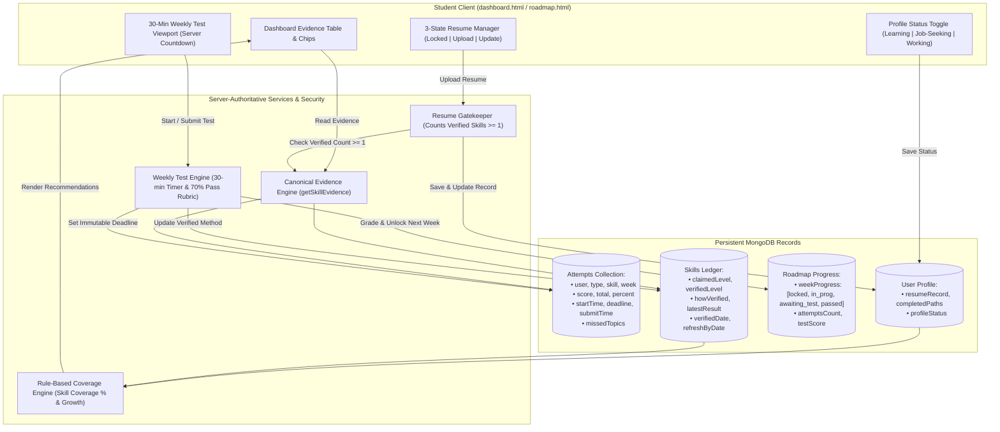

# Implementation Plan: Shared Foundation, Skill Evidence & Roadmap Verification System
**CareerPath AI · Team 404 Brain Not Found**
*Hack2Ignite 2026-27*

---

## Executive Summary

This plan unifies the CareerPath AI platform into a robust, server-authoritative credentialing and learning engine structured across 5 core pillars:
1. **Shared Foundation (Data Models):** Server-authoritative records for **Attempts**, **Skills**, **Resume**, **Roadmap Progress**, **Completed Paths**, and **Profile Status**.
2. **Canonical Skill Evidence:** A single server function `getSkillEvidence(userId)` that generates the official evidence ledger for the Dashboard table, interactive skill chips, and digital certificates.
3. **Resume Rules & Server Unlock:** Enforces that a student must have **at least 1 verified skill** before the server accepts a resume upload, supporting safe in-place replacement and PDF/DOCX validation ($\le 5\text{MB}$).
4. **Weekly Tests (70% Pass & 30-Min Server Clock):** Implements server-managed 30-minute countdowns (immune to page refresh), progressive answer saving, auto-submission at deadline, 70% pass threshold, and targeted retesting with fresh questions.
5. **Completed Paths & Rule-Based Next Steps:** Automatically records completed paths, issues credentials, captures user status (`Learning` | `Job-seeking` | `Working`), and computes mathematically grounded role coverage recommendations.

---

## User Review Required

> [!IMPORTANT]
> **Server-Authoritative Security Invariant:**
> The browser **NEVER** writes directly to `Attempts`, `Skills`, or `Roadmap Progress`. The client only requests actions and submits answers. All state transitions, grading, timers, and badges are strictly computed and committed by the server.

> [!NOTE]
> **Timer Durability:**
> The 30-minute test timer is locked to the server's `deadline` timestamp in MongoDB. Closing the browser tab or refreshing the page **does not reset or pause the countdown**.

---

## System Architecture Diagram



---

## Proposed Changes

---

### Component 1: Shared Foundation (Data Schemas)

#### [NEW] `server/models/Attempt.js`
Creates the central ledger for all testing events (Skill Checks & Weekly Roadmap Tests):

```javascript
const mongoose = require('mongoose');

const AttemptSchema = new mongoose.Schema(
  {
    user: {
      type: mongoose.Schema.Types.ObjectId,
      ref: 'User',
      required: true,
      index: true,
    },
    type: {
      type: String,
      enum: ['skill_check', 'weekly_test'],
      required: true,
    },
    skill: {
      type: String,
      trim: true,
      default: '',
    },
    roadmap: {
      type: mongoose.Schema.Types.ObjectId,
      ref: 'Roadmap',
      default: null,
    },
    roadmapWeek: {
      type: Number,
      default: null,
    },
    topicTags: {
      type: [String],
      default: [],
    },
    questionsAsked: [
      {
        questionId: String,
        prompt: String,
        topic: String,
        difficulty: String,
        selectedIndex: Number,
        correctIndex: Number,
        isCorrect: Boolean,
      },
    ],
    score: { type: Number, required: true },
    total: { type: Number, required: true },
    percent: { type: Number, required: true },
    passed: { type: Boolean, default: false },
    startTime: { type: Date, required: true, default: Date.now },
    deadline: { type: Date, required: true },
    submitTime: { type: Date, default: null },
    missedTopics: { type: [String], default: [] },
    status: {
      type: String,
      enum: ['in_progress', 'completed', 'timed_out', 'abandoned'],
      default: 'in_progress',
    },
  },
  { timestamps: true }
);

module.exports = mongoose.model('Attempt', AttemptSchema);
```

#### [MODIFY] `server/models/Roadmap.js`
Add `weekProgress` to track weekly milestone gates and attempts:

```javascript
// In RoadmapSchema:
weekProgress: [
  {
    weekNumber: { type: Number, required: true },
    title: { type: String, default: '' },
    status: {
      type: String,
      enum: ['locked', 'in_progress', 'awaiting_test', 'passed'],
      default: 'locked',
    },
    attemptsCount: { type: Number, default: 0 },
    passedAt: { type: Date, default: null },
    testScore: { type: Number, default: 0 },
    testPercent: { type: Number, default: 0 },
  },
],
```

#### [MODIFY] `server/models/User.js`
Add `resumeRecord`, `completedPaths`, `profileStatus`, and enhance `SkillSchema`:

```javascript
// In SkillSchema:
howVerified: {
  type: String,
  enum: ['self_rated', 'skill_check', 'weekly_test', 'github_repo', 'interview'],
  default: 'self_rated',
},
latestResult: { type: String, default: '' },
refreshByDate: { type: Date, default: null },

// In UserSchema:
resumeRecord: {
  fileLocation: { type: String, default: '' },
  fileName: { type: String, default: '' },
  fileSize: { type: Number, default: 0 },
  firstUploadedDate: { type: Date, default: null },
  lastUpdatedDate: { type: Date, default: null },
},
completedPaths: [
  {
    roadmap: { type: mongoose.Schema.Types.ObjectId, ref: 'Roadmap' },
    role: { type: String, required: true },
    slug: { type: String, required: true },
    completionDate: { type: Date, default: Date.now },
    skillsGained: { type: [String], default: [] },
  },
],
profileStatus: {
  status: {
    type: String,
    enum: ['learning', 'job_seeking', 'working'],
    default: 'learning',
  },
  currentRole: { type: String, default: '' },
},
```

---

### Component 2: Canonical Skill Evidence Engine (Single Source of Truth)

#### [NEW] `server/services/evidenceService.js`
Builds the canonical evidence ledger by combining `User.skills` and `Attempt` records:

```javascript
const User = require('../models/User');
const Attempt = require('../models/Attempt');

async function getSkillEvidence(userId) {
  const user = await User.findById(userId).lean();
  if (!user) throw new Error('User not found');

  const attempts = await Attempt.find({ user: userId, status: 'completed' })
    .sort({ createdAt: -1 })
    .lean();

  const evidence = (user.skills || []).map((skill) => {
    const skillAttempts = attempts.filter(
      (a) => (a.skill || '').toLowerCase() === (skill.name || '').toLowerCase()
    );
    const latest = skillAttempts[0] || null;

    const isVerified = Boolean(
      skill.isQuizVerified || 
      skill.isCodeVerified || 
      (latest && latest.passed)
    );

    let method = skill.howVerified || 'self_rated';
    if (skill.isCodeVerified) method = 'github_repo';
    else if (latest?.type === 'weekly_test') method = 'weekly_test';
    else if (skill.isQuizVerified || latest?.type === 'skill_check') method = 'skill_check';

    const verifiedDate = skill.quizVerifiedAt || latest?.submitTime || (skill.isCodeVerified ? user.updatedAt : null);
    const refreshByDate = verifiedDate 
      ? new Date(new Date(verifiedDate).getTime() + 180 * 24 * 60 * 60 * 1000) 
      : null;
    const isRefreshNeeded = refreshByDate && (Date.now() > new Date(refreshByDate).getTime());

    let status = 'self_rated';
    if (isRefreshNeeded) status = 'refresh_needed';
    else if (method === 'weekly_test') status = 'test_verified';
    else if (method === 'skill_check' || method === 'github_repo') status = 'quiz_verified';

    return {
      name: skill.name,
      displayName: skill.displayName || skill.name,
      claimedLevel: skill.selfRatedProficiency || skill.proficiency || 'intermediate',
      verifiedLevel: isVerified ? (skill.verifiedProficiency || skill.proficiency) : null,
      howVerified: method,
      methodLabel: method === 'weekly_test' ? 'Weekly Test' : (method === 'skill_check' ? 'Adaptive Skill Check' : (method === 'github_repo' ? 'GitHub Code AST' : 'Self-Rated')),
      latestResult: latest ? `${latest.score} of ${latest.total} (${latest.percent}%)` : (skill.quizScore ? `${skill.quizScore} pts` : 'No test taken'),
      verifiedDate,
      refreshByDate,
      status,
      attemptsCount: skillAttempts.length,
      hasEvidence: isVerified,
      missedTopics: latest?.missedTopics || skill.quizGaps || [],
    };
  });

  return {
    userId,
    userName: user.name,
    totalSkills: evidence.length,
    verifiedCount: evidence.filter((e) => e.hasEvidence).length,
    evidence,
  };
}

module.exports = { getSkillEvidence };
```

#### [NEW] `server/routes/evidenceRoutes.js`
Mounted at `GET /api/skills/evidence` with `protect` middleware.

---

### Component 3: Resume Security & Lifecycle Management

#### [MODIFY] `server/controllers/userController.js`
Enforce the unlock rule and safe in-place replacement:

```javascript
const { getSkillEvidence } = require('../services/evidenceService');
const { uploadResume: uploadToCloudinary, deleteResource } = require('../services/cloudinaryService');

const uploadResume = async (req, res, next) => {
  try {
    const { fileData, fileName } = req.body;

    // 1. Server Unlock Rule: Count verified skills
    const evidence = await getSkillEvidence(req.user._id);
    if (evidence.verifiedCount === 0) {
      return res.status(403).json({
        success: false,
        code: 'VERIFICATION_REQUIRED',
        message: 'Verify one skill to unlock resume upload.',
      });
    }

    // 2. Strict File Format & Size Validation (PDF / DOCX <= 5MB)
    const match = fileData.match(/^data:([a-zA-Z0-9\/+-.]+);base64,(.+)$/);
    if (!match) {
      return res.status(400).json({ success: false, message: 'Invalid file format. Base64 data required.' });
    }
    const mime = match[1].toLowerCase();
    const allowed = ['application/pdf', 'application/msword', 'application/vnd.openxmlformats-officedocument.wordprocessingml.document'];
    if (!allowed.includes(mime)) {
      return res.status(400).json({ success: false, message: 'Only PDF and DOCX documents are accepted.' });
    }
    const sizeBytes = Math.ceil((match[2].length * 3) / 4);
    if (sizeBytes > 5 * 1024 * 1024) {
      return res.status(400).json({ success: false, message: 'Resume size exceeds 5MB limit.' });
    }

    // 3. Upload new file first
    const uploadRes = await uploadToCloudinary(fileData, req.user._id);
    const newLocation = uploadRes.secure_url;
    const oldPublicId = req.user.resumeRecord?.publicId;

    // 4. Update Resume record in DB
    const now = new Date();
    const user = await User.findByIdAndUpdate(
      req.user._id,
      {
        $set: {
          resumeUrl: newLocation,
          'resumeRecord.fileLocation': newLocation,
          'resumeRecord.fileName': fileName || 'Resume.pdf',
          'resumeRecord.fileSize': sizeBytes,
          'resumeRecord.lastUpdatedDate': now,
          'resumeRecord.publicId': uploadRes.public_id,
        },
        $setOnInsert: {
          'resumeRecord.firstUploadedDate': now,
        },
      },
      { new: true }
    );

    // 5. Delete old file only after new one is successfully committed
    if (oldPublicId && oldPublicId !== uploadRes.public_id) {
      deleteResource(oldPublicId).catch(() => {});
    }

    res.status(200).json({
      success: true,
      message: 'Resume updated successfully.',
      data: { resume: user.resumeRecord },
    });
  } catch (error) {
    next(error);
  }
};
```

---

### Component 4: Weekly Tests (70% Pass Threshold & 30-Minute Server Timer)

#### [NEW] `server/data/weeklyTestQuestions.js`
Topic-tagged question bank for Roadmap Weeks (e.g. Week 1: Semantic HTML, Forms, CSS Flexbox/Grid):
* 20+ questions per week to ensure retests receive fresh variations.

#### [NEW] `server/services/weeklyTestService.js`
Manages the server-authoritative 30-minute timer and evaluation:
* `startWeeklyTest(userId, roadmapId, weekNumber)`:
  - Verifies Week $N-1$ is `passed`.
  - Sets `deadline = Date.now() + 30 * 60 * 1000`.
  - Pulls 10 random questions matching the week's topics.
  - Creates `Attempt` document with `status = 'in_progress'`.
* `saveWeeklyTestAnswer(attemptId, questionId, selectedIndex)`:
  - Saves individual answer choices progressively so no data is lost on disconnect.
* `submitWeeklyTest(attemptId, manual = true)`:
  - Verifies current time $\le$ `deadline + 60s grace period`.
  - Calculates score & percentage.
  - If $\ge 70\%$: Marks week `passed`, unlocks Week $N+1$, updates skill evidence.
  - If $< 70\%$: Week remains locked, returns missed topics and retake option with different questions.

#### [MODIFY] `server/routes/roadmapRoutes.js`
Expose endpoints:
- `POST /api/roadmaps/:id/weeks/:weekNumber/complete`
- `POST /api/roadmaps/:id/weeks/:weekNumber/test/start`
- `POST /api/roadmaps/test/save-answer`
- `POST /api/roadmaps/test/submit`

---

### Component 5: Completed Paths & Rule-Based Recommendations

#### [MODIFY] `server/services/roadmapService.js`
When the final week is passed:
1. Mark `roadmap.status = 'completed'`.
2. Append to `user.completedPaths`: `{ role, slug, completionDate: new Date(), skillsGained }`.
3. Check Job Ready criteria and update credential status.

#### [MODIFY] `server/services/recommendationService.js`
Implement rule-based coverage formula without external AI:
$$\text{Coverage Ratio} = \frac{\text{Count of verified skills matching role requirements}}{\text{Total required skills for role}}$$
* **Heading logic based on `user.profileStatus.status`:**
  - `working` ➔ *"Grow in your role"* & *"Explore a switch"* (for roles with $\ge 40\%$ coverage).
  - `learning` ➔ *"Your next path"*.
  - `job_seeking` ➔ *"Roles you're closest to"* (ranked by coverage, detailing missing skills & estimated weeks).

---

### Component 6: Frontend Experience & UI Views

#### [MODIFY] `client/js/dashboard.js` & `client/dashboard.html`
1. **Evidence Table:** Displays Skill Name, Claimed vs Verified Level, Verification Method, Date, Score Result, and Refresh Date.
2. **Interactive Skill Chips:** Clicking or hovering over any skill chip opens an evidence popover showing the exact verification audit trail.
3. **Resume 3-State Widget:**
   - State 1 (Unverified): Greyed-out with *"🔒 Verify one skill to unlock resume upload"*.
   - State 2 (Verified, no resume): *"Upload Resume"* button.
   - State 3 (Resume uploaded): Shows filename, last updated date, and *"Update your resume"* button.
4. **Completed Paths:** Renders the graduation showcase with verified credentials and badges.
5. **Profile Status Selector:** Allows students to toggle `Learning`, `Job-seeking`, or `Working as [role]`.

#### [MODIFY] `client/js/roadmap.js` & `client/roadmap.html`
1. **Week Gating UI:** Weeks displayed as `locked`, `in_progress`, `awaiting_test`, or `passed`.
2. **Weekly Test Modal:**
   - 30-minute server-clock countdown timer (synced to server deadline).
   - Progressive answer autosave indicator.
   - Auto-submit trigger on timer expiration.
   - Post-test score screen: $\ge 70\%$ celebration vs $< 70\%$ missed topics remediation with Retake CTA.

---

## Verification Plan

### Automated Tests
1. **Evidence Single-Source Test:**
   - Verify `GET /api/skills/evidence` returns matching verified data for skills validated in tests.
2. **Resume Unlock Gate Test:**
   - With 0 verified skills: `POST /api/users/resume` returns HTTP 403 `VERIFICATION_REQUIRED`.
   - With $\ge 1$ verified skill: `POST /api/users/resume` succeeds, sets `firstUploadedDate` and `lastUpdatedDate`.
3. **Weekly Test 30-Min Timer & 70% Pass Test:**
   - Start test: Confirm server sets `deadline = startTime + 30 mins`.
   - Score $\ge 70\%$: Confirm week status changes to `passed` and Week 2 changes to `in_progress`.
   - Score $< 70\%$: Confirm week remains locked and retake receives different questions.

### Manual Verification
1. **Evidence Uniformity:** Check that the Dashboard evidence table, skill chip popovers, and certificate all show identical verification details.
2. **Resume Upload States:** Confirm greyed-out state on brand-new account, upload on verified account, and safe in-place replacement with "Update your resume" label.
3. **Timer Refresh Resilience:** Start a weekly test, refresh the browser page, and verify the timer continues smoothly from the server's deadline without resetting.
4. **Completed Path Graduation:** Pass all weeks of a roadmap, confirm appearance in "Completed Paths", and check role recommendations updated for `Working` or `Job-seeking` status.
