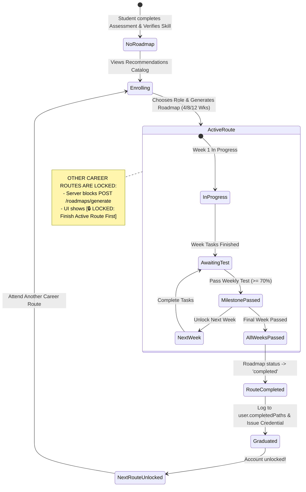

# Implementation Plan: Single Active Career Route per Account

**CareerPath AI · Team 404 Brain Not Found**  
*Hack2Ignite 2026-27*

---

## Goal Description

In CareerPath AI, students currently can select any career role on the Recommendations page at any time. When `POST /api/roadmaps/generate` is called, the server silently archives any existing active roadmap and starts a new one, allowing students to hop between incomplete tracks without mastering their chosen field.

This change implements a **strict, server-authoritative "One Active Route at a Time" progression model**:
1. **Single Focused Route:** An account can have **at most one active career roadmap** in progress at any given moment.
2. **Completion Gating:** A student **cannot switch or start a new career route** until they have **completed** their current route (`status === 'completed'` via finishing all weekly milestones and passing the 70% threshold weekly tests).
3. **Unlocking the Next Route:** Once a student graduates from their current career route, their achievement is recorded in `user.completedPaths`, their account is unlocked, and they can freely **attend their next career route** from the recommendations catalog.
4. **Transparent Guidance & UI Locking:** The recommendations catalog displays active status indicators, locks other tracks with clear informative tooltips, and provides a celebratory graduation bridge to the next route upon completion.

---

## User Review Required

> [!IMPORTANT]
> **Server-Authoritative Enrollment Gate:**
> `POST /api/roadmaps/generate` will strictly check if the student has an incomplete active roadmap (`status === 'active'`). If found, the server rejects new roadmap creation with **HTTP 409 Conflict** (`ACTIVE_ROUTE_IN_PROGRESS`), blocking API bypassing.

> [!WARNING]
> **What If a Student Made an Accidental Selection? (Abandon / Switch Option):**
> If a student selected a role by mistake (e.g. clicked *Data Analyst* when they intended *Full-Stack Developer*), should they be permanently locked until passing 4–12 weeks of tests, OR should we provide a deliberate **"Abandon / Reset Route"** confirmation option?  
> **Recommended Approach:** Enforce completion by default, but allow an explicit "Abandon Route" action (`DELETE /api/roadmaps/current`) behind a high-friction confirmation modal (*"Abandoning will archive your current progress and allow you to pick a new track"*).

---

## System Architecture & Progression Flow



---

## Proposed Changes

### Component 1: Server-Authoritative Roadmap Controller

#### [MODIFY] `server/controllers/roadmapController.js`

1. **Guard `generateRoadmap` against active incomplete roadmaps:**
   Instead of automatically archiving whatever active roadmap exists, check if an active roadmap is already in progress:
   ```javascript
   // Check if user already has an active, incomplete roadmap
   const activeRoadmap = await Roadmap.findOne({
     user: user._id,
     status: 'active',
   }).populate('career');

   if (activeRoadmap) {
     return res.status(409).json({
       success: false,
       code: 'ACTIVE_ROUTE_IN_PROGRESS',
       message: `You are currently pursuing the "${activeRoadmap.careerSnapshot?.title || 'active'}" route (${Math.round(activeRoadmap.progressPercentage || 0)}% completed). You must complete your current route before starting another career route.`,
       data: {
         activeRoadmap: {
           id: activeRoadmap._id,
           careerTitle: activeRoadmap.careerSnapshot?.title,
           slug: activeRoadmap.careerSnapshot?.slug,
           progressPercentage: activeRoadmap.progressPercentage,
           durationWeeks: activeRoadmap.durationWeeks,
         },
       },
     });
   }
   ```

2. **Enhance `getCurrentRoadmap` to expose route status & completion:**
   Return whether a user has an active roadmap, or if their most recent roadmap was completed:
   ```javascript
   const getCurrentRoadmap = async (req, res, next) => {
     try {
       let roadmap = await Roadmap.findOne({
         user: req.user._id,
         status: 'active',
       }).populate('career');

       let isCompleted = false;

       // If no active roadmap, check for the most recently completed roadmap
       if (!roadmap) {
         roadmap = await Roadmap.findOne({
           user: req.user._id,
           status: 'completed',
         }).sort({ completedAt: -1 }).populate('career');

         if (roadmap) {
           isCompleted = true;
         }
       }

       if (!roadmap) {
         return res.status(404).json({
           success: false,
           hasRoadmap: false,
           message: 'No active roadmap found. Generate a roadmap first.',
         });
       }

       const tasks = await RoadmapTask.find({ roadmap: roadmap._id })
         .sort({ weekNumber: 1, order: 1 })
         .select('-__v');

       const weeks = groupTasksByWeek(tasks, roadmap.durationWeeks);

       res.status(200).json({
         success: true,
         data: {
           hasRoadmap: true,
           isCompleted,
           canStartNewRoute: isCompleted || !roadmap || roadmap.status !== 'active',
           roadmap: { ... },
           tasks,
           weeks,
         },
       });
     } catch (error) {
       next(error);
     }
   };
   ```

---

### Component 2: Graduation & Next Route Unlocking

#### [MODIFY] `server/services/weeklyTestService.js`

Ensure graduation seamlessly marks the roadmap as `completed`, logs to `user.completedPaths`, and transitions the user state:
- When `roadmap.weekProgress.every(wp => wp.status === 'passed')`:
  - `roadmap.status = 'completed'`
  - `roadmap.completedAt = new Date()`
  - Push to `user.completedPaths` with `role`, `completionDate`, `skillsGained`, `roadmapId`.
  - Save both documents.

---

### Component 3: Recommendations Page UI & Gating

#### [MODIFY] `client/recommendations.html`
Add an Active Route Banner element above the career recommendation cards:
```html
<!-- Active Route Banner (Shown when user has an active incomplete route) -->
<div id="activeRouteLockBanner" class="d-none p-3 mb-4 rounded-3 border border-teal bg-teal bg-opacity-10 d-flex align-items-center justify-content-between flex-wrap gap-3 shadow-xs">
  <div class="d-flex align-items-center gap-3">
    <div class="rounded-circle bg-teal text-white d-flex align-items-center justify-content-center shadow-xs" style="width: 44px; height: 44px; flex-shrink: 0;">
      <i class="bi bi-compass fs-4"></i>
    </div>
    <div>
      <div class="fw-bold text-ink small">Active Career Track: <span id="bannerActiveCareerTitle" class="text-teal">Full-Stack Developer</span></div>
      <div class="text-muted small" style="font-size: 0.75rem;">
        You are currently attending this route (<span id="bannerActiveProgress">0%</span> complete). Complete all weekly milestones to graduate and unlock other career paths.
      </div>
    </div>
  </div>
  <a href="roadmap.html" class="btn cp-btn-primary btn-sm px-4">
    Continue Active Route <i class="bi bi-arrow-right ms-1"></i>
  </a>
</div>
```

#### [MODIFY] `client/js/recommendations.js`
1. **Fetch current roadmap state on page load:**
   ```javascript
   let userActiveRoadmap = null;
   try {
     const rmRes = await window.API.get('/roadmaps/current', { auth: true });
     if (rmRes.success && rmRes.data?.roadmap && rmRes.data?.roadmap.status === 'active') {
       userActiveRoadmap = rmRes.data.roadmap;
     }
   } catch (e) {
     // No active roadmap
   }
   ```
2. **Render Active Route Banner:**
   If `userActiveRoadmap` exists:
   - Populate `#bannerActiveCareerTitle` and `#bannerActiveProgress`.
   - Remove `d-none` from `#activeRouteLockBanner`.
3. **Card-Level Conditional Action Buttons:**
   Inside `createRecommendationCard(item)`:
   - **Case A: Current Active Career** (`item.career.slug === userActiveRoadmap?.career?.slug`):
     - Badge: `<span class="badge bg-teal text-white"><i class="bi bi-lightning-charge-fill me-1"></i> CURRENT ACTIVE ROUTE</span>`
     - Button: `<a href="roadmap.html" class="btn cp-btn-primary btn-sm w-100"><i class="bi bi-arrow-right-circle-fill me-1"></i> Continue Roadmap (${userActiveRoadmap.progressPercentage}%)</a>`
   - **Case B: Other Careers while an Active Route is Incomplete**:
     - Badge: `<span class="badge bg-secondary bg-opacity-25 text-muted"><i class="bi bi-lock-fill me-1"></i> LOCKED</span>`
     - Button: `<button class="btn btn-outline-secondary btn-sm w-100 disabled" title="Finish your current route first"><i class="bi bi-lock-fill me-1"></i> Locked (Finish Active Route First)</button>`
   - **Case C: Already Completed / Graduated Career**:
     - Badge: `<span class="badge bg-success bg-opacity-10 text-success border border-success border-opacity-25"><i class="bi bi-patch-check-fill me-1"></i> GRADUATED</span>`
     - Button: `<button class="btn btn-outline-success btn-sm w-100" disabled><i class="bi bi-check2-circle me-1"></i> Route Completed</button>`
   - **Case D: No Active Route (or previously graduated and choosing next)**:
     - Normal unlocked button: `<button class="btn cp-btn-primary btn-sm w-100 btn-select-career">Select Career Path →</button>`

---

### Component 4: Active Roadmap View & Completion Bridge

#### [MODIFY] `client/roadmap.html` & `client/js/roadmap.js`
1. **Render Graduation Celebration View when `status === 'completed'`:**
   When the final week is passed:
   - Banner:
     ```html
     <div class="card p-4 rounded-3 border-teal bg-teal bg-opacity-10 text-center mb-4">
       <div class="fs-1 mb-2">🎉</div>
       <h3 class="h4 fw-bold text-ink mb-1">Career Route Completed!</h3>
       <p class="text-muted small mb-3">
         You have successfully mastered the <strong>${currentRoadmap.careerSnapshot.title}</strong> curriculum and passed all weekly milestone assessments.
       </p>
       <div class="d-flex justify-content-center gap-3">
         <a href="dashboard.html" class="btn btn-outline-navy btn-sm px-4">
           <i class="bi bi-speedometer2 me-1"></i> View Credentials on Dashboard
         </a>
         <a href="recommendations.html" class="btn cp-btn-primary btn-sm px-4">
           <i class="bi bi-compass me-1"></i> Attend Your Next Career Route →
         </a>
       </div>
     </div>
     ```
2. **Abandon / Reset Route Confirmation (Safety Hatch):**
   - Provide an "Abandon Route" link in the roadmap settings dropdown:
     `"Abandon this route? Your current progress will be archived, and you will be able to select a new career route."`
     Calls `DELETE /api/roadmaps/current` and redirects to `recommendations.html`.

---

## Verification Plan

### Automated Tests
1. **Single Route Constraint Test:**
   - User generates `full-stack-developer` roadmap.
   - User immediately calls `POST /api/roadmaps/generate` with `careerSlug: "ai-ml-engineer"`.
   - **Verify:** Server returns **HTTP 409 Conflict** with code `ACTIVE_ROUTE_IN_PROGRESS`.
   - **Verify:** Database still has only 1 active roadmap (`full-stack-developer`).
2. **Progression & Unlock Test:**
   - Simulate user passing all weeks of `full-stack-developer` weekly tests.
   - **Verify:** `roadmap.status` changes to `'completed'`.
   - **Verify:** `user.completedPaths` contains `Full-Stack Developer`.
   - User now calls `POST /api/roadmaps/generate` with `careerSlug: "ai-ml-engineer"`.
   - **Verify:** Server returns **HTTP 201 Created**.
   - **Verify:** User now has 1 completed roadmap and 1 active roadmap (`ai-ml-engineer`).
3. **Abandon Route Test:**
   - User calls `DELETE /api/roadmaps/current`.
   - **Verify:** Roadmap status becomes `'archived'`.
   - **Verify:** User can now generate a new roadmap.

### Manual Verification
1. Log in to student account on `http://localhost:5500`.
2. Visit `recommendations.html` with an active roadmap:
   - Confirm the top banner shows the active route and completion percentage.
   - Confirm other career role cards show `[🔒 LOCKED: Finish Active Route First]` and disabled buttons.
   - Confirm only the active role shows `Continue Active Route →`.
3. Complete or test-graduate the active roadmap:
   - Confirm `roadmap.html` displays the graduation celebration card with "Attend Your Next Career Route →".
4. Click "Attend Your Next Career Route →":
   - Confirm `recommendations.html` now has all other career tracks unlocked and ready for enrollment.
