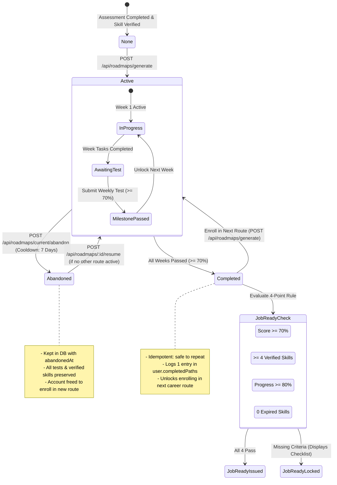

# Implementation Plan: Hardened Single Active Career Route & Gated Progression

**CareerPath AI · Team 404 Brain Not Found**  
*Hack2Ignite 2026-27*

---

## Executive Summary

This plan elevates the CareerPath AI career route system into a hardened, server-authoritative, sequential learning progression engine. It ensures students commit to and master one chosen career roadmap at a time, protecting data integrity at the database engine level while maintaining an open, browse-friendly discovery experience.

### Core Enhancements:
1. **Database-Level Partial Unique Index:** Guaranteed single active route via MongoDB partial filter expression index (`{ user: 1 }, { unique: true, partialFilterExpression: { status: 'active' } }`). Concurrent requests (double-clicks, multiple tabs) are rejected with **HTTP 409 Conflict** (`ACTIVE_ROUTE_IN_PROGRESS`).
2. **Non-Destructive Route Abandonment:** Calling `POST /api/roadmaps/current/abandon` marks the roadmap as `abandoned` with an `abandonedAt` timestamp. **Zero data is deleted**—all quiz attempts, test scores, and verified skills remain permanent evidence. Abandonment is rate-limited to **once every 7 days**, and abandoned routes can optionally be resumed if no other route is active.
3. **Idempotent Graduation:** Route completion is derived on the server from stored test records (all weeks passed $\ge 70\%$). Re-submitting the final test or concurrent grading calls never duplicate `completedPaths` entries or issue duplicate credentials.
4. **Decoupled 4-Rule "Job Ready" Certification:** Graduating a route verifies the skills proven and logs the path, but **does NOT automatically issue Job Ready**. Job Ready is certified only when all 4 strict criteria are satisfied:
   - Composite Readiness Score $\ge 70\%$
   - $\ge 4$ role-specific verified skills
   - Roadmap progress $\ge 80\%$
   - Zero expired required skills (`refreshByDate > Date.now()`)
   Otherwise, a locked Job Ready status card displays exact missing criteria.
5. **Lock Enrolling, Not Browsing:** On `recommendations.html`, students can freely browse all career requirements, review skills, and open details. Only the "Start this route" action is locked with clear messaging (*"Finish your current route or abandon it to start this one"*). Active route cards display live milestone progress (e.g. *"Week 2 of 4 · 45% Tasks"*).
6. **Pre-Flight Migration & Backup:** Cleanly back up existing roadmaps and reconcile statuses before index creation.
7. **Session-Only User Identity:** All endpoints exclusively extract `req.user._id` from the verified JWT session. Any user ID passed in request bodies or query parameters is strictly ignored.

---

## User Review Required

> [!IMPORTANT]
> **Database Engine Partial Index:**
> The index `{ user: 1 }, { unique: true, partialFilterExpression: { status: 'active' } }` handles race conditions directly in the MongoDB storage engine. Even if two identical requests arrive in the exact same millisecond, MongoDB guarantees that exactly one active document will ever exist.

> [!NOTE]
> **Non-Destructive Abandonment with 7-Day Cooldown:**
> When abandoning a route, the UI requires explicit confirmation explaining that all earned skills and test history remain saved. The server limits route abandonment to once every 7 days to maintain disciplined learning focus.

---

## State Transition Machine



---

## Proposed Changes

### Component 1: Data Model & Database Migration

#### [MODIFY] `server/models/Roadmap.js`
1. Add `'abandoned'` to status enum:
   ```javascript
   status: {
     type: String,
     enum: {
       values: ['active', 'completed', 'abandoned', 'archived'],
       message: 'Status must be active, completed, abandoned, or archived',
     },
     default: 'active',
   },
   abandonedAt: {
     type: Date,
     default: null,
   },
   ```
2. Define the partial unique index:
   ```javascript
   // Database-level guarantee: at most ONE active roadmap per user
   RoadmapSchema.index(
     { user: 1 },
     {
       unique: true,
       partialFilterExpression: { status: 'active' },
     }
   );
   ```

#### [MODIFY] `server/models/User.js`
Track route abandonment rate limiting:
```javascript
lastAbandonedRouteAt: {
  type: Date,
  default: null,
},
```

#### [NEW] `server/scripts/migrate_roadmaps_active_index.js`
A self-contained migration script executed before deploying code:
1. Connects to MongoDB Atlas and backs up current roadmaps to `roadmaps_backup_<timestamp>.json`.
2. Resolves any multiple active roadmaps per user (keeps the latest `updatedAt`, sets others to `'abandoned'`).
3. Sets any `status: undefined` roadmaps to `'archived'`.
4. Creates the partial unique index: `db.roadmaps.createIndex({ user: 1 }, { unique: true, partialFilterExpression: { status: "active" } })`.
5. Verifies index health.

---

### Component 2: Roadmap Controller & Routes

#### [MODIFY] `server/controllers/roadmapController.js`

1. **`generateRoadmap` (`POST /api/roadmaps/generate`)**:
   - Uses exclusively `req.user._id` from session.
   - Pre-check for active roadmap:
     ```javascript
     const existingActive = await Roadmap.findOne({ user: req.user._id, status: 'active' });
     if (existingActive) {
       return res.status(409).json({
         success: false,
         code: 'ACTIVE_ROUTE_IN_PROGRESS',
         message: `You already have an active career route in progress (${existingActive.careerSnapshot?.title || 'Current Route'}). You must complete or abandon your current route before starting another.`,
         data: {
           activeRoadmapId: existingActive._id,
           careerTitle: existingActive.careerSnapshot?.title,
           progressPercentage: existingActive.progressPercentage,
         },
       });
     }
     ```
   - Wraps `Roadmap.create(...)` in `try / catch`: if MongoDB returns error code `11000`, catches and returns identical **HTTP 409** response.

2. **`abandonRoadmap` (`POST /api/roadmaps/current/abandon`)**:
   - Replaces `DELETE /api/roadmaps/current`.
   - Checks 7-day rate limit:
     ```javascript
     const SEVEN_DAYS_MS = 7 * 24 * 60 * 60 * 1000;
     const user = await User.findById(req.user._id);
     if (user.lastAbandonedRouteAt && (Date.now() - user.lastAbandonedRouteAt.getTime()) < SEVEN_DAYS_MS) {
       const nextAllowed = new Date(user.lastAbandonedRouteAt.getTime() + SEVEN_DAYS_MS);
       return res.status(429).json({
         success: false,
         code: 'ABANDON_COOLDOWN_ACTIVE',
         message: `You can only abandon a career route once every 7 days. Your next route reset is available on ${nextAllowed.toLocaleDateString('en-US', { month: 'short', day: 'numeric', year: 'numeric' })}.`,
         nextAllowedAt: nextAllowed,
       });
     }
     ```
   - Sets `roadmap.status = 'abandoned'` and `roadmap.abandonedAt = new Date()`.
   - Sets `user.lastAbandonedRouteAt = new Date()`.
   - **Zero deletions**: test attempts, scores, and verified skills remain completely intact.
   - Returns confirmation.

3. **`resumeRoadmap` (`POST /api/roadmaps/:id/resume`)**:
   - Verifies `req.user._id`.
   - Confirms user has NO currently active roadmap (rejects with 409 if one is active).
   - Sets `roadmap.status = 'active'`, `roadmap.abandonedAt = null`.
   - Returns resumed roadmap.

4. **`getCurrentRoadmap` (`GET /api/roadmaps/current`)**:
   - Fetches active roadmap or most recently completed/abandoned roadmap.
   - Computes current week progress string (e.g. `"Week 2 of 4"`).
   - Returns `canEnrollNewRoute: (!activeRoadmap || activeRoadmap.status !== 'active')`.

#### [MODIFY] `server/routes/roadmapRoutes.js`
- Route `POST /api/roadmaps/current/abandon` $\to$ `abandonRoadmap`
- Route `POST /api/roadmaps/:id/resume` $\to$ `resumeRoadmap`
- Keep `DELETE /api/roadmaps/current` as a deprecated fallback forwarding to `abandonRoadmap`.

---

### Component 3: Idempotent Graduation & 4-Rule Job Ready Engine

#### [MODIFY] `server/services/weeklyTestService.js`
1. **Idempotent Graduation**:
   - Checks:
     ```javascript
     const allPassed = roadmap.weekProgress.every((wp) => wp.status === 'passed');
     if (allPassed) {
       if (roadmap.status !== 'completed') {
         roadmap.status = 'completed';
         roadmap.completedAt = new Date();
         await roadmap.save();
       }
       // Idempotent completedPaths logging
       const roleTitle = roadmap.careerSnapshot?.title || 'Engineering Role';
       const alreadyLogged = (user.completedPaths || []).some(
         (p) =>
           (p.roadmapId && p.roadmapId.toString() === roadmap._id.toString()) ||
           (p.role && p.role.toLowerCase().trim() === roleTitle.toLowerCase().trim())
       );
       if (!alreadyLogged) {
         if (!user.completedPaths) user.completedPaths = [];
         user.completedPaths.push({
           roadmapId: roadmap._id,
           role: roleTitle,
           completionDate: new Date(),
           skillsGained: (roadmap.weekProgress || []).map((wp) => wp.title || `Week ${wp.weekNumber}`),
         });
         await user.save({ validateBeforeSave: false });
       }
     }
     ```
2. **Issue Proven Skill Verifications**:
   - Marks test topic skills as verified on `User.skills` with `howVerified: 'weekly_test'`, `refreshByDate = now + 180 days`.

#### [MODIFY] `server/services/readinessService.js`
Implement the strict **4-Rule Job Ready Check**:
```javascript
async function evaluateJobReadyCertification(user, activeOrCompletedRoadmap) {
  const readiness = await computeStudentReadiness(user._id);
  const now = new Date();

  // Rule 1: Readiness score >= 70%
  const isScoreOk = readiness.readinessScore >= 70;

  // Rule 2: At least 4 verified skills required for the role
  const career = activeOrCompletedRoadmap?.career;
  const requiredSkillNames = (career?.requiredSkills || []).map(rs => 
    (rs.skill?.name || rs.skillName || '').toLowerCase().trim()
  ).filter(Boolean);

  const verifiedRoleSkills = (user.skills || []).filter(s => {
    const isVerified = s.isQuizVerified || s.isCodeVerified || s.verificationStatus === 'verified';
    const isRoleSkill = requiredSkillNames.includes((s.name || '').toLowerCase().trim());
    const notExpired = !s.refreshByDate || new Date(s.refreshByDate) > now;
    return isVerified && isRoleSkill && notExpired;
  });
  const isSkillsCountOk = verifiedRoleSkills.length >= 4;

  // Rule 3: Roadmap 80% or more complete
  const roadmapPct = activeOrCompletedRoadmap?.progressPercentage || 0;
  const isRoadmapOk = roadmapPct >= 80 || activeOrCompletedRoadmap?.status === 'completed';

  // Rule 4: No expired required skills
  const hasExpiredRequiredSkills = (user.skills || []).some(s => {
    const isRoleSkill = requiredSkillNames.includes((s.name || '').toLowerCase().trim());
    return isRoleSkill && s.refreshByDate && new Date(s.refreshByDate) <= now;
  });
  const isNotExpiredOk = !hasExpiredRequiredSkills;

  const isJobReady = isScoreOk && isSkillsCountOk && isRoadmapOk && isNotExpiredOk;

  const missingCriteria = [];
  if (!isScoreOk) missingCriteria.push(`Readiness score must reach 70% (currently ${readiness.readinessScore}%)`);
  if (!isSkillsCountOk) missingCriteria.push(`Requires at least 4 role-specific verified skills (currently ${verifiedRoleSkills.length} of 4)`);
  if (!isRoadmapOk) missingCriteria.push(`Roadmap must be at least 80% complete (currently ${roadmapPct}%)`);
  if (!isNotExpiredOk) missingCriteria.push(`One or more required role skills have expired and need refreshing`);

  return {
    isJobReady,
    missingCriteria,
    criteriaStatus: {
      score: { required: 70, actual: readiness.readinessScore, passed: isScoreOk },
      skills: { required: 4, actual: verifiedRoleSkills.length, passed: isSkillsCountOk },
      roadmap: { required: 80, actual: roadmapPct, passed: isRoadmapOk },
      expiration: { passed: isNotExpiredOk },
    }
  };
}
```

---

### Component 4: Frontend UI (Recommendations & Roadmap)

#### [MODIFY] `client/recommendations.html` & `client/js/recommendations.js`
1. **Lock Enrolling, Never Browsing**:
   - Every career card remains completely clickable and browsable. Students can click **"Explore Career Requirements"** or open the detail modal to view skills, salary, and curriculum for any role.
   - Only the **"Start this route"** button is disabled if another route is active:
     ```html
     <button class="btn btn-secondary btn-sm w-100 disabled" disabled title="Finish your current route or abandon it to start this one">
       <i class="bi bi-lock-fill me-1"></i> Locked (Finish or Abandon Active Route)
     </button>
     <div class="text-muted small text-center mt-1" style="font-size: 0.7rem;">
       Finish your current route or abandon it to start this one.
     </div>
     ```
2. **Active Route Card Display**:
   - Active career card displays an active banner:
     `[⚡ ACTIVE ROUTE · Week 2 of 4 (50% Tasks)]`
   - Primary action: `"Continue Active Roadmap →"` linking to `roadmap.html`.
3. **Completed / Graduated Cards**:
   - Roles in `user.completedPaths` display `[🎓 GRADUATED]` badges with completion dates.
4. **Active Route Top Banner with Abandon Option**:
   - Displays current active role and progress.
   - Includes a discreet `"Abandon Route"` button that triggers the confirmation modal.

#### [MODIFY] `client/roadmap.html` & `client/js/roadmap.js`
1. **Abandon Route Modal with Explicit Confirmation**:
   - Confirmation dialog text:
     > *"Are you sure you want to abandon the [Career Title] route?*  
     > ***Your verified skills and test history will be kept***. *Abandoning allows you to enroll in a new career route. You can abandon a route at most once every 7 days."*
   - Sends `POST /api/roadmaps/current/abandon`.
   - On success: redirects to `recommendations.html`.
2. **Graduation Card & Job Ready Status**:
   - When roadmap reaches 100%, displays the Graduation Card.
   - Shows Job Ready badge if all 4 criteria pass, OR a **Locked Job Ready Card** detailing the specific missing criteria.

---

## 9-Point Verification Plan

### Automated Test Suite (`server/tests/single_route_verification.js`)
We will create and run a comprehensive verification script testing all 9 points:

| # | Test Case | Expected Result |
|---|---|---|
| **1** | Start a 2nd route while one is active | Server rejects with **HTTP 409** and `code: ACTIVE_ROUTE_IN_PROGRESS`. Zero documents created. |
| **2** | Two simultaneous `POST /roadmaps/generate` requests | Exactly 1 active roadmap created; 2nd request throws MongoDB unique index error and returns **HTTP 409**. |
| **3** | Pass final week test $\ge 70\%$ | Roadmap status becomes `completed`, exactly 1 entry added to `user.completedPaths`, other cards unlock. |
| **4** | Re-submit final week test | Status remains `completed`, zero duplicate `completedPaths` entries added. |
| **5** | Job Ready evaluation without 4 criteria | Graduation succeeds, but `Job Ready` is NOT issued; returns structured `missingCriteria`. |
| **6** | Abandon active route | Roadmap status becomes `abandoned`, test history & skills remain intact, enrollment unlocks. |
| **7** | Browse locked career card | Career details, skills, and modal open normally; only the start action is disabled. |
| **8** | Database migration for multiple active roadmaps | All duplicate active roadmaps safely converted to `abandoned`; exactly 1 active roadmap per user. |
| **9** | Pass external `userId` in payload/query | Server strictly operates on `req.user._id` from token; spoofed user ID has zero effect. |

### Manual Verification
1. Open student dashboard on `http://localhost:5500`.
2. Navigate to `recommendations.html` with an active roadmap: verify that clicking any locked career card opens its curriculum and requirements, while only the "Start this route" button is disabled.
3. Test the "Abandon Route" flow: verify confirmation modal text informs that verified skills are preserved, and test that repeated abandon calls within 7 days trigger the cooldown alert.
4. Pass the final weekly test: verify graduation celebration view renders and other career tracks unlock.
