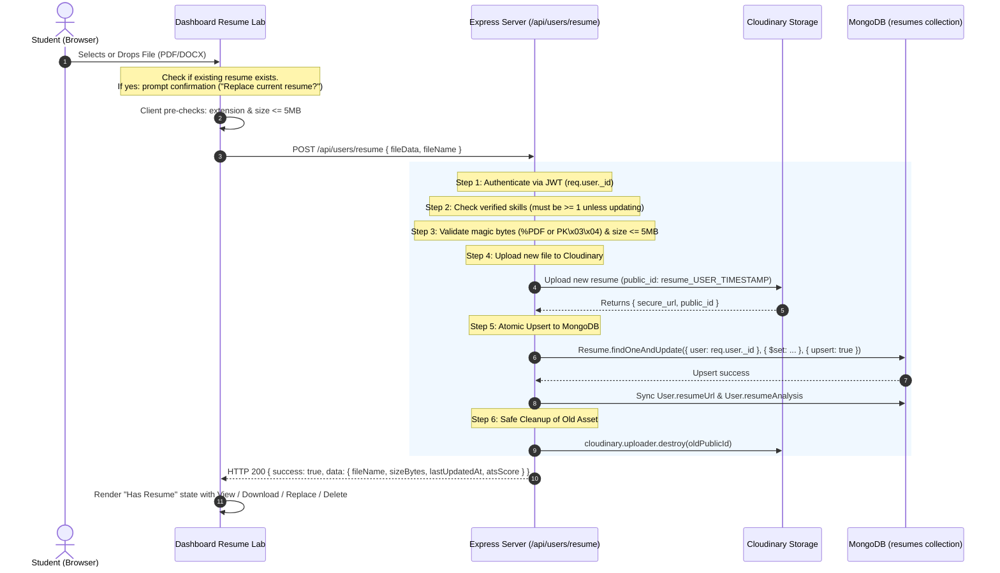

# Implementation Plan: Single Resume per Account Architecture

**CareerPath AI · Team 404 Brain Not Found**  
*Hack2Ignite 2026-27*

---

## Executive Summary

Currently in CareerPath AI, resume uploads update a single `resumeUrl` string on the `User` document, but:
1. Every upload to Cloudinary generates a timestamped `public_id` (`resume_${userId}_${Date.now()}`), leaving orphaned previous resumes in cloud storage without deletion.
2. There is no dedicated `resumes` collection with a database-level unique constraint (`unique: true` on `user`), making duplicate records possible if future features or concurrent requests insert rows.
3. The dashboard UI lacks explicit state management for loading, locked (unverified skill gate), replacement confirmation, and failure recovery.

This plan implements a **strict, server-authoritative, single-resume architecture**:
- **One account $\le$ 1 resume**: Guaranteed at the database engine layer via a unique MongoDB index on `user`.
- **Safe in-place replacement**: The old Cloudinary file is destroyed **only after** the new upload and database upsert successfully commit.
- **Fail-safe preservation**: If an upload or analysis fails midway, the student's existing resume is completely untouched.
- **Deep binary validation**: Enforces magic-byte file signature validation (PDF `%PDF-`, DOCX `PK\x03\x04`), 5 MB maximum file size, and non-empty file buffers.
- **Verified skill unlock gate**: Accounts with 0 verified skills are blocked from initial resume upload with a clear CTA to verify a skill first (while allowing updates to previously uploaded resumes).
- **6-state dashboard UI**: Loading, Locked, No Resume, Uploading, Has Resume (with View/Download/Replace/Delete and replace confirmation), and Upload Failed with retry.

---

## User Review Required

> [!IMPORTANT]
> **Database-Level Unique Invariant:**
> A new dedicated `Resume` Mongoose model (`server/models/Resume.js`) will enforce `{ user: { type: ObjectId, ref: 'User', unique: true, index: true } }`. This ensures that even if concurrent requests arrive at the exact same millisecond, MongoDB's unique index and atomic upsert (`findOneAndUpdate` with `upsert: true`) will prevent duplicate records.

> [!NOTE]
> **Cloudinary Deletion Safety:**
> When a student uploads a new resume, the new file is uploaded first. The previous Cloudinary asset is only destroyed after the new record is committed to the database. If Cloudinary upload fails, the previous resume remains active.

> [!TIP]
> **Magic-Byte Binary Validation:**
> Instead of trusting the browser's file extension or declared MIME type (which can be forged by renaming `.exe` to `.pdf`), the server inspects the first 4 bytes of the binary buffer (`%PDF-` for PDF, `PK\x03\x04` for DOCX).

---

## System Architecture Diagram



---

## Audit Findings (Step 1 Completed)

We executed an automated audit across the codebase and the live MongoDB Atlas database (`careerpath_ai`):
1. **Existing DB State**:
   - Total users: **22**
   - Active resumes: Exactly **1 user** (`p16272618@gmail.com`) currently has a `resumeUrl` pointing to Cloudinary.
   - All other 21 users have `resumeUrl: ""`.
   - The `resumes` collection does not exist yet. There are **0 duplicate records** in the database, allowing us to safely create the unique index without conflicting keys!
2. **Current Storage Leak**:
   - `server/controllers/userController.js` creates a new Cloudinary asset with `Date.now()` on every upload without destroying the previous public ID.
3. **Current UI**:
   - `client/dashboard.html` has a Resume Dropzone and a separate button in the profile card. They do not have unified state indicators for the 6 lifecycle states or replacement confirmation.

---

## Proposed Changes

### Component 1: Server Data Model & Storage

#### [NEW] `server/models/Resume.js`
Creates the dedicated `Resume` schema with a hard database-level unique index on `user`:

```javascript
const mongoose = require('mongoose');

const ResumeSchema = new mongoose.Schema(
  {
    user: {
      type: mongoose.Schema.Types.ObjectId,
      ref: 'User',
      required: [true, 'User ID is required'],
      unique: true, // Hard MongoDB index: one resume per user
      index: true,
    },
    originalName: {
      type: String,
      required: [true, 'Original file name is required'],
      trim: true,
      maxlength: [255, 'Filename too long'],
    },
    fileType: {
      type: String,
      required: true,
      trim: true,
      enum: [
        'application/pdf',
        'application/vnd.openxmlformats-officedocument.wordprocessingml.document',
        'application/msword',
      ],
    },
    sizeBytes: {
      type: Number,
      required: true,
      min: [1, 'File cannot be empty'],
      max: [5 * 1024 * 1024, 'Resume size exceeds 5MB limit'],
    },
    fileLocation: {
      type: String, // Cloudinary secure_url
      required: true,
    },
    publicId: {
      type: String, // Cloudinary public_id
      required: true,
    },
    version: {
      type: Number,
      default: 1,
    },
    extractedText: {
      type: String,
      default: '',
    },
    firstUploadedAt: {
      type: Date,
      default: Date.now,
    },
    lastUpdatedAt: {
      type: Date,
      default: Date.now,
    },
  },
  {
    timestamps: true,
  }
);

// Explicitly ensure unique index
ResumeSchema.index({ user: 1 }, { unique: true });

module.exports = mongoose.model('Resume', ResumeSchema);
```

#### [MODIFY] `server/services/cloudinaryService.js`
Add `deleteResumeFromCloudinary(publicId)` to safely destroy superseded assets in Cloudinary:

```javascript
/**
 * Deletes a resume asset from Cloudinary by public ID.
 * @param {string} publicId - Cloudinary publicId
 * @returns {Promise<Object>} Deletion result
 */
const deleteResumeFromCloudinary = async (publicId) => {
  if (!isConfigured || !publicId) return null;
  try {
    const res = await cloudinary.uploader.destroy(publicId, {
      resource_type: 'image',
      invalidate: true,
    });
    // If not found as image, attempt raw
    if (res.result !== 'ok') {
      await cloudinary.uploader.destroy(publicId, {
        resource_type: 'raw',
        invalidate: true,
      });
    }
    return res;
  } catch (err) {
    console.warn('[cloudinaryService.deleteResume] Deletion warning:', err.message);
    return null;
  }
};
```

---

### Component 2: Server Controller & Endpoints

#### [MODIFY] `server/controllers/userController.js`
Refactor resume handlers to implement the strict upload/replace/delete pipeline with magic-byte checks:

1. **Helper `validateResumeBuffer(base64Data, declaredName)`**:
   - Decodes base64 into `Buffer`.
   - Checks size: $1 \le \text{size} \le 5\text{MB}$ ($5,242,880$ bytes).
   - Validates magic bytes:
     - PDF: `buf.subarray(0, 4).toString('ascii') === '%PDF'`
     - DOCX: `buf.subarray(0, 4).toString('hex') === '504b0304'`
     - DOC: `buf.subarray(0, 4).toString('hex') === 'd0cf11e0'`
   - Sanitizes filename (removes directory traversal, special characters, max 100 chars).
2. **`getMyResume(req, res)`** (`GET /api/users/resume`):
   - Queries `Resume.findOne({ user: req.user._id })`.
   - Counts user's verified skills (`s.isQuizVerified || s.isCodeVerified || s.verificationStatus === 'verified'`).
   - If found: returns `{ hasResume: true, fileName, sizeBytes, fileType, lastUpdatedAt, atsScore, isLocked: false, verifiedSkillsCount }`.
   - If not found: returns `{ hasResume: false, isLocked: (verifiedSkillsCount === 0), verifiedSkillsCount }`.
3. **`uploadResume(req, res)`** (`POST /api/users/resume`):
   - **Step 1**: Auth via `req.user._id`.
   - **Step 2 (Skill Gate)**: Count verified skills. If 0 AND user has no existing resume record, reject with HTTP 403:
     `{ success: false, code: 'RESUME_LOCKED', message: 'Verify one skill to unlock resume upload.' }`.
     *(If user already has a resume, allow updating even if a skill expired)*.
   - **Step 3 (Buffer Validation)**: Magic byte + size + sanitized name check.
   - **Step 4 (Cloudinary Upload)**: Upload new file. If this fails, abort immediately; old resume is unchanged.
   - **Step 5 (Atomic Upsert)**:
     - Find existing resume: `const existing = await Resume.findOne({ user: req.user._id });`
     - Save old `publicId`.
     - `Resume.findOneAndUpdate({ user: req.user._id }, { $set: { originalName, fileType, sizeBytes, fileLocation, publicId, extractedText, lastUpdatedAt: new Date() }, $setOnInsert: { firstUploadedAt: new Date() }, $inc: { version: 1 } }, { upsert: true, new: true, setDefaultsOnInsert: true })`.
     - Sync `User.resumeUrl` and ATS analysis on `User`.
   - **Step 6 (Safe Cleanup)**: If `existing?.publicId && existing.publicId !== newPublicId`, call `deleteResumeFromCloudinary(existing.publicId)`.
   - **Step 7 (Response)**: Return new metadata and analysis.
4. **`deleteMyResume(req, res)`** (`DELETE /api/users/resume`):
   - Find existing resume for `req.user._id`.
   - If none found: return HTTP 404.
   - Delete Cloudinary asset via `deleteResumeFromCloudinary`.
   - `Resume.findOneAndDelete({ user: req.user._id })`.
   - Clear `User.resumeUrl = ''` and unset `User.resumeAnalysis`.
   - Return `{ success: true, message: 'Resume deleted successfully' }`.

#### [MODIFY] `server/routes/userRoutes.js`
Wire the endpoints cleanly:
- `GET /api/users/resume` $\to$ `getMyResume`
- `POST /api/users/resume` $\to$ `uploadResume`
- `DELETE /api/users/resume` $\to$ `deleteMyResume`
- `GET /api/users/resume/view` $\to$ `viewResume`
- `GET /api/users/resume/download` $\to$ `downloadResume`
- `GET /api/users/resume/preview` $\to$ `getResumePreview`

---

### Component 3: Client Dashboard UI & States

#### [MODIFY] `client/dashboard.html`
Update the Resume Card in the Dashboard to support all 6 distinct UI states:

```html
<!-- Resume Intelligence Dropzone Container -->
<div class="resume-dropzone p-3 rounded-2 text-center border border-dashed border-line bg-light position-relative" id="resumeLabDropzone">
  <input type="file" id="resumeLabFileInput" accept=".pdf,.docx,.doc" class="d-none" />

  <!-- State 1: Loading Skeleton -->
  <div id="resumeStateLoading" class="py-3 text-center">
    <div class="spinner-border spinner-border-sm text-teal mb-2" role="status"></div>
    <div class="small text-muted font-monospace">Checking resume status...</div>
  </div>

  <!-- State 2: Locked State (0 verified skills) -->
  <div id="resumeStateLocked" class="d-none py-3 text-center">
    <div class="mb-2"><i class="bi bi-lock-fill text-warning fs-2"></i></div>
    <div class="fw-bold text-ink small mb-1">Resume Upload Locked</div>
    <div class="text-muted small mb-3" style="max-width: 320px; margin: 0 auto; font-size: 0.75rem;">
      Verify at least one skill to unlock resume upload & ATS keyword scanning.
    </div>
    <button type="button" class="btn cp-btn-primary btn-sm px-3" id="btnUnlockVerifySkill">
      <i class="bi bi-patch-check-fill me-1"></i> Verify a Skill Now
    </button>
  </div>

  <!-- State 3: No Resume State -->
  <div id="resumeStateNoResume" class="d-none py-2 text-center">
    <i class="bi bi-cloud-arrow-up text-teal fs-2 mb-1 d-block"></i>
    <div class="small fw-semibold text-ink">Upload your resume (PDF or DOCX, up to 5 MB)</div>
    <div class="text-muted small mb-2" style="font-size: 0.72rem;">Drag & drop here, or <span class="text-teal text-decoration-underline" style="cursor: pointer;">Browse</span></div>
    <div class="badge bg-secondary bg-opacity-25 text-secondary font-monospace" style="font-size: 0.65rem;">
      <i class="bi bi-info-circle me-1"></i> You can keep one resume. Uploading replaces the old one.
    </div>
  </div>

  <!-- State 4: Uploading / Scanning -->
  <div id="resumeStateUploading" class="d-none py-3 text-center">
    <div class="spinner-border text-teal mb-2" role="status"></div>
    <div class="small fw-semibold text-ink" id="resumeUploadProgressText">Uploading to secure storage & parsing ATS keywords...</div>
    <div class="text-muted small" style="font-size: 0.7rem;">Please do not close this window.</div>
  </div>

  <!-- State 5: Has Resume (Active State) -->
  <div id="resumeStateHasResume" class="d-none text-start">
    <div class="p-3 rounded-2 bg-white border border-line shadow-xs">
      <div class="d-flex align-items-center justify-content-between mb-2 flex-wrap gap-2">
        <div class="d-flex align-items-center gap-2 overflow-hidden">
          <div class="resume-icon-circle rounded-circle bg-teal bg-opacity-10 text-teal d-flex align-items-center justify-content-center" style="width: 36px; height: 36px; flex-shrink: 0;">
            <i class="bi bi-file-earmark-pdf-fill fs-5" id="resumeStateDocIcon"></i>
          </div>
          <div class="overflow-hidden">
            <div class="fw-bold text-ink small text-truncate" id="resumeStateFileName">resume.pdf</div>
            <div class="text-muted" style="font-size: 0.72rem;" id="resumeStateMeta">1.2 MB · Last updated Today</div>
          </div>
        </div>
        <span class="badge bg-success bg-opacity-10 text-success border border-success border-opacity-25 font-monospace" style="font-size: 0.65rem;">
          <i class="bi bi-shield-check me-1"></i> Active Resume
        </span>
      </div>

      <!-- Action Buttons -->
      <div class="d-flex align-items-center justify-content-between pt-2 border-top border-line flex-wrap gap-2">
        <div class="d-flex gap-1">
          <button type="button" class="btn btn-outline-primary btn-sm px-2 py-1" id="btnViewLabResume" title="View Document">
            <i class="bi bi-eye me-1"></i> View
          </button>
          <a href="#" class="btn btn-outline-secondary btn-sm px-2 py-1" id="btnDownloadLabResume" title="Download Document">
            <i class="bi bi-download me-1"></i> Download
          </a>
        </div>
        <div class="d-flex gap-1">
          <button type="button" class="btn btn-outline-navy btn-sm px-2 py-1" id="btnReplaceLabResume" title="Replace Current Resume">
            <i class="bi bi-arrow-repeat me-1"></i> Replace Resume
          </button>
          <button type="button" class="btn btn-outline-danger btn-sm px-2 py-1" id="btnDeleteLabResume" title="Delete Resume">
            <i class="bi bi-trash3"></i>
          </button>
        </div>
      </div>
    </div>
    <div class="text-muted small text-center mt-2" style="font-size: 0.68rem;">
      <i class="bi bi-shield-lock me-1"></i> Private & secure. Used only for your ATS match and career feedback.
    </div>
  </div>

  <!-- State 6: Upload Failed -->
  <div id="resumeStateFailed" class="d-none py-3 text-center">
    <i class="bi bi-exclamation-triangle-fill text-danger fs-2 mb-1"></i>
    <div class="fw-bold text-danger small mb-1">Upload failed</div>
    <div class="text-muted small mb-2" id="resumeFailedReason" style="font-size: 0.75rem;">Your previous resume is unchanged.</div>
    <button type="button" class="btn btn-outline-secondary btn-sm px-3" id="btnRetryResumeUpload">
      <i class="bi bi-arrow-counterclockwise me-1"></i> Try Again
    </button>
  </div>
</div>
```

#### [MODIFY] `client/js/dashboard.js`
1. **Load Resume Status on Page Load**:
   - Calls `GET /api/users/resume`.
   - If `res.data.isLocked`: renders `resumeStateLocked`.
   - If `!res.data.hasResume`: renders `resumeStateNoResume`.
   - If `res.data.hasResume`: renders `resumeStateHasResume` with file name, formatted size, and formatted date.
2. **Replacement Confirmation**:
   - When student clicks "Replace Resume" or drops a file when `hasResume === true`:
     Displays confirmation modal/prompt:
     `"Replace your current resume? Uploading will replace '${currentFileName}' with your new file. This cannot be undone."`
     If confirmed, opens file picker / proceeds with upload.
3. **Delete Flow**:
   - When student clicks "Delete Resume":
     Prompts: `"Are you sure you want to delete your resume? Your stored document and ATS keyword scores will be removed."`
     If confirmed, calls `window.API.delete('/users/resume', { auth: true })`.
     On success: transitions UI back to `resumeStateNoResume` (or `resumeStateLocked` if 0 verified skills) and clears ATS score widgets.
4. **Error Handling**:
   - Catches 403 `RESUME_LOCKED`, 400 invalid type/size, and network failures.
   - Shows `resumeStateFailed` with the exact message from server and retains the previous active resume in UI.

---

### Component 4: Data Migration & Existing Data Sync

#### [NEW] `server/scripts/migrate_resumes.js`
A self-contained migration script:
1. Connects to MongoDB.
2. Finds any user who has a non-empty `user.resumeUrl`.
3. Checks if a `Resume` record already exists for that user:
   - If not, creates one with `user: user._id`, `fileLocation: user.resumeUrl`, `publicId: getPublicIdFromUrl(user.resumeUrl)`, `originalName: 'Student_Resume.pdf'`, `fileType: 'application/pdf'`, `sizeBytes: 1048576`.
4. Ensures the `{ user: 1 }, { unique: true }` index is built cleanly.
5. Verifies zero duplicate records exist.

---

## Verification Plan

### Automated Tests
1. **Model & Unique Constraint Test**:
   - Attempt inserting two `Resume` documents with the identical `user` ID.
   - Verify MongoDB rejects the second insert with `E11000 duplicate key error`.
2. **File Validation & Magic Bytes Test**:
   - Send valid PDF (`%PDF-`) $\to$ Accepts.
   - Send valid DOCX (`PK\x03\x04`) $\to$ Accepts.
   - Send fake PDF (text file containing "Hello" renamed to `.pdf`) $\to$ Rejects with HTTP 400.
   - Send file > 5 MB $\to$ Rejects with HTTP 400.
3. **Verified Skill Lock Rule Test**:
   - Create test user with 0 verified skills $\to$ `POST /api/users/resume` returns HTTP 403 `RESUME_LOCKED`.
   - Add 1 verified skill $\to$ `POST /api/users/resume` succeeds.
4. **Safe In-Place Replacement Test**:
   - User uploads `resume_v1.pdf`.
   - User uploads `resume_v2.pdf`.
   - Verify `resumes` collection contains **exactly 1 record** with `version: 2`.
   - Verify old Cloudinary asset is destroyed.
5. **Delete Endpoint Test**:
   - Call `DELETE /api/users/resume`.
   - Verify record deleted from MongoDB, `user.resumeUrl` is cleared, and `GET /api/users/resume` returns `hasResume: false`.

### Manual Verification
1. Open the student dashboard on `http://localhost:5500/dashboard.html`.
2. For an unverified user: confirm the **Locked** card appears with the "Verify a Skill Now" button.
3. Verify a skill: confirm the card unlocks to "Upload your resume (PDF or DOCX, up to 5 MB)".
4. Upload a valid PDF: verify the file name, size, and last updated timestamp display.
5. Click "Replace Resume": confirm the confirmation dialog appears before allowing the new upload.
6. Complete the replacement: verify the old file is gone and the new file displays.
7. Click "Delete Resume": confirm both document and ATS scores clear cleanly.
