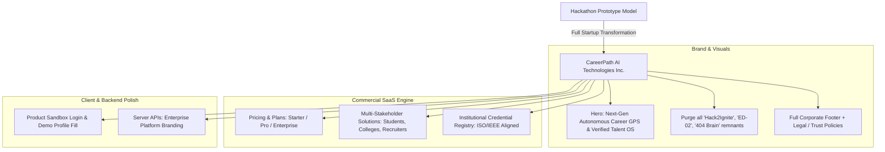

# Implementation Plan: Transformation to Full Commercial Startup (CareerPath AI Technologies)

## Goal Description
The user has established a major strategic pivot: **"Abhi ye hackathon model nahi hai, abhi ye startup hai hamara!"** (*"This is no longer a hackathon model; this is now our startup!"*).

This plan elevates the entire **CareerPath AI** platform from a collegiate hackathon prototype into a high-growth, commercial **EdTech & HRTech SaaS Startup** (**CareerPath AI Technologies Inc.**). 

This requires:
1. **Zero Hackathon Artifacts**: Complete purging of all hackathon text, problem statement codes (`ED-02`), competition tags (`Hack2Ignite 2026–27`), team handles (`Team 404 Brain Not Found`), and judge-specific buttons across all 20+ frontend and backend files.
2. **Commercial Brand Positioning**: Repositioning CareerPath AI as the **"World's 1st Autonomous Career GPS & Verified Talent Operating System"** solving the multi-billion-dollar college-to-workforce readiness gap.
3. **Startup Landing Page (`index.html`) Elevation**:
   - Modern SaaS Hero with investor/customer-ready messaging.
   - **Transparent Commercial Pricing & Plans** section (Free Student Tier, Pro Career Accelerator ₹499/mo, University/Recruiter Enterprise).
   - **B2B Multi-Stakeholder Solutions**: Dedicated value propositions for Students, Universities (Campus Placement OS), and Recruiters (Pre-Verified Talent Radar).
   - Comprehensive Corporate Footer with Legal (Privacy, Terms, Security), Company, Product, and Governance links.
4. **Institutional Trust & Credential Authority**:
   - Transforming certificates into **"CareerPath AI National Credential Registry"** backed by ISO/IEEE skill standards, cryptographic SHA-256 hashes, and verified proctoring audit trails.
5. **Investor & Customer Sandbox Experience**:
   - Rebranding judge 1-click test buttons on `login.html` and `assessment.html` into a polished **"Interactive Product Sandbox"** for prospective investors, universities, and enterprise recruiters.

---

## User Review Required

> [!IMPORTANT]
> **Commercial Pricing Model Selection**:
> The proposed commercial pricing section on the landing page includes 3 realistic SaaS tiers:
> 1. **Student Starter (₹0 / Free)**: Free 3D Career Universe, initial skill diagnostic, personalized roadmap, community access.
> 2. **Pro Career Accelerator (₹499 / $9 per month)**: Unlimited proctored weekly milestone tests, Focus Video Chamber, AI mock interviews, tamper-proof verified credential badge, and priority recruiter match.
> 3. **Enterprise & Campus (Custom Quote)**: For universities (placement cell analytics, bulk student tracking) and recruiters (unlimited verified candidate outreach, custom skill verification assessments).
> 
> *Please confirm if you want these exact tiers and price points displayed on the landing page.*

> [!TIP]
> **Preserving 1-Click Interactive Demos**:
> Rather than deleting the instant 1-click test fill features (which would make customer and investor demos tedious), they will be rebranded into a professional **"Product Sandbox"** / **"Interactive Demo Profile"** so anyone testing the startup platform can experience the full workflow instantly.

---

## Proposed Changes



---

### Component 1: Landing Page (`index.html`) SaaS Transformation

#### [MODIFY] [`client/index.html`](file:///c:/Users/PARTH/OneDrive/Documents/hackethon/Hack%202%20ignite/CareerPath%20AI/careerpath-ai/client/index.html)
- **Meta & SEO**:
  - Keywords: Remove `Hack2Ignite`, add `AI career platform, student career roadmap, verified skills, hiring radar, campus recruitment OS, EdTech SaaS`.
  - Author: Change `Team 404 Brain Not Found` to `CareerPath AI Technologies Inc.`.
- **Navigation Bar**:
  - Add navigation items: `Platform`, `Solutions` (Students, Universities, Recruiters), `Pricing`, `About Us`.
  - Primary CTA: `Get Started Free` and `For Recruiters`.
- **Hero Section**:
  - Meta Badge: Replace `<span class="pulse-dot"></span> HACK2IGNITE 2026–27` with `<span class="pulse-dot"></span> AUTONOMOUS CAREER NAVIGATION PLATFORM`.
  - Tagline: Replace `ED-02 · AI CAREER GUIDANCE & SKILL ROADMAP` with `THE OPERATING SYSTEM FOR EARLY-CAREER SUCCESS`.
  - Social Proof Banner: Add metrics strip: `10,000+ Skills Verified · 94% Career Transition Accuracy · 150+ Hiring Partners · Zero-Cheating Proctoring Engine`.
- **NEW: Commercial Pricing Section (`#pricing`)**:
  - Three distinct cards with monthly/annual toggle:
    1. **Starter (Free)**
    2. **Pro Accelerator (₹499/mo)** — Featured with "Most Popular" glow badge.
    3. **University & Enterprise (Custom)** — Dedicated for campus placement cells and enterprise recruiters.
- **NEW: Multi-Stakeholder Solutions Section (`#solutions`)**:
  - Tabs or 3-column bento showing:
    - *For Students*: Close skill gaps with proctored roadmaps and verified badges.
    - *For Universities*: Real-time campus readiness dashboard and curriculum gap intelligence.
    - *For Recruiters*: Pre-vetted candidates with proctored test results and GitHub repo proof.
- **Corporate Startup Footer**:
  - Columns:
    - **Product**: Career Universe, Skill Assessment, Proctored Roadmaps, AI Resume Builder, Job Radar.
    - **Solutions**: College Placement Cell, Enterprise Hiring, Bootcamps.
    - **Company**: About Us, Leadership, Careers, Press & Media.
    - **Legal & Security**: Privacy Policy, Terms of Service, Security Architecture, ISO/IEEE Alignment.
  - Colophon: `© 2026 CareerPath AI Technologies Inc. All rights reserved. Registered under Indian Companies Act.`

---

### Component 2: Complete Purge of Hackathon Remnants Across All HTML Files

#### [MODIFY] [`client/dashboard.html`](file:///c:/Users/PARTH/OneDrive/Documents/hackethon/Hack%202%20ignite/CareerPath%20AI/careerpath-ai/client/dashboard.html)
- Update Certificate Header:
  - `VERIFIED TALENT CREDENTIAL DIRECTORY · HACK2IGNITE 2026–27` $\rightarrow$ `VERIFIED TALENT CREDENTIAL DIRECTORY · CAREERPATH AI GLOBAL REGISTRY`.
- Update Certificate Signatory:
  - Signature SVG: `Team 404 Protocol` $\rightarrow$ `CareerPath AI Council`.
  - Signatory Name: `Team 404 Brain Not Found` $\rightarrow$ `Academic & Industry Council`.
  - Title: `Lead Protocol Stewards · Hack2Ignite 2026–27` $\rightarrow$ `National Board of Skill Standards · CareerPath AI`.
- Footer: Rebrand badges to `Enterprise Edition` and `CareerPath AI`.

#### [MODIFY] [`client/verify.html`](file:///c:/Users/PARTH/OneDrive/Documents/hackethon/Hack%202%20ignite/CareerPath%20AI/careerpath-ai/client/verify.html)
- Update accreditation badge text: `Official accreditation issued by CareerPath AI Global Verified Talent Registry.`.
- Update certificate sub-header, signatory lines, and governance text.
- Update footer copyright to `© 2026 CareerPath AI Technologies Inc.`.

#### [MODIFY] [`client/assessment.html`](file:///c:/Users/PARTH/OneDrive/Documents/hackethon/Hack%202%20ignite/CareerPath%20AI/careerpath-ai/client/assessment.html)
- Step 1 Demo Banner:
  - Replace `HACKATHON EVALUATION` with `<i class="bi bi-sparkles me-1"></i> INTERACTIVE SANDBOX`.
  - Replace `Judge Quick-Fill Mode` with `1-Click Sample Student Profile`.
  - Rephrase description: `Instantly pre-populate an engineering student profile to preview our diagnostic assessment and skill-gap recommendations.`.
- Footer: Update to clean startup colophon.

#### [MODIFY] [`client/login.html`](file:///c:/Users/PARTH/OneDrive/Documents/hackethon/Hack%202%20ignite/CareerPath%20AI/careerpath-ai/client/login.html) & [`client/register.html`](file:///c:/Users/PARTH/OneDrive/Documents/hackethon/Hack%202%20ignite/CareerPath%20AI/careerpath-ai/client/register.html)
- `login.html`:
  - Rebrand quick-login container to `Instant Demo Sandbox` with badges `Student Sandbox` and `Recruiter Sandbox`.
  - Remove `CareerPath AI · Team 404 Brain Not Found` branding.
- `register.html`:
  - Update branding header and footer.

#### [MODIFY] [`client/roadmap.html`](file:///c:/Users/PARTH/OneDrive/Documents/hackethon/Hack%202%20ignite/CareerPath%20AI/careerpath-ai/client/roadmap.html), [`client/quiz.html`](file:///c:/Users/PARTH/OneDrive/Documents/hackethon/Hack%202%20ignite/CareerPath%20AI/careerpath-ai/client/quiz.html), [`client/recommendations.html`](file:///c:/Users/PARTH/OneDrive/Documents/hackethon/Hack%202%20ignite/CareerPath%20AI/careerpath-ai/client/recommendations.html), [`client/404.html`](file:///c:/Users/PARTH/OneDrive/Documents/hackethon/Hack%202%20ignite/CareerPath%20AI/careerpath-ai/client/404.html)
- Remove `ED-02` problem statement references.
- Remove `Hack2Ignite 2026–27` and `Team: 404 Brain Not Found` from footers.
- In `resume-builder.html`: update placeholder from `Finalist at Hack2Ignite 2026 Hackathon` to `National Collegiate Innovation Challenge Finalist`.

---

### Component 3: Client Scripts & Console Log Cleansing

#### [MODIFY] [`client/js/chat.js`](file:///c:/Users/PARTH/OneDrive/Documents/hackethon/Hack%202%20ignite/CareerPath%20AI/careerpath-ai/client/js/chat.js)
- Update chat disclaimer: `<p class="cp-chat-disclaimer">CareerPath AI Assistant &middot; Enterprise Intelligence Engine</p>`.

#### [MODIFY] [`client/js/config.js`](file:///c:/Users/PARTH/OneDrive/Documents/hackethon/Hack%202%20ignite/CareerPath%20AI/careerpath-ai/client/js/config.js)
- Update `TEAM_NAME: '404 Brain Not Found'` $\rightarrow$ `COMPANY_NAME: 'CareerPath AI Technologies Inc.'`.

#### [MODIFY] [`client/js/main.js`](file:///c:/Users/PARTH/OneDrive/Documents/hackethon/Hack%202%20ignite/CareerPath%20AI/careerpath-ai/client/js/main.js)
- Update console splash to: `'%cCareerPath AI Technologies | Autonomous Career Navigation & Verified Talent Platform'`.

#### [MODIFY] [`client/js/verify.js`](file:///c:/Users/PARTH/OneDrive/Documents/hackethon/Hack%202%20ignite/CareerPath%20AI/careerpath-ai/client/js/verify.js)
- Update client fallback steward: `CareerPath AI Academic & Industry Certification Council`.

---

### Component 4: Backend API & Service Layer Modernization

#### [MODIFY] [`server/controllers/readinessController.js`](file:///c:/Users/PARTH/OneDrive/Documents/hackethon/Hack%202%20ignite/CareerPath%20AI/careerpath-ai/server/controllers/readinessController.js)
- Update certificate metadata payload:
  - `issuer: 'CareerPath AI Global Registry'`
  - `accreditation: 'National Skill Standards & ISO/IEEE Aligned'`
  - `leadSteward: 'Academic & Industry Standards Board'`

#### [MODIFY] [`server/services/careerInsightService.js`](file:///c:/Users/PARTH/OneDrive/Documents/hackethon/Hack%202%20ignite/CareerPath%20AI/careerpath-ai/server/services/careerInsightService.js)
- Update AI prompt from `You are an expert Career & Industry Talent Analyst for the Hack2Ignite 2026-27 hackathon.` to:
  `You are an expert Career & Industry Talent Analyst for CareerPath AI Technologies.`

#### [MODIFY] [`server/services/emailService.js`](file:///c:/Users/PARTH/OneDrive/Documents/hackethon/Hack%202%20ignite/CareerPath%20AI/careerpath-ai/server/services/emailService.js)
- Update transactional email signatures:
  `CareerPath AI Technologies Inc. · Next-Gen Career Navigation Platform`

#### [MODIFY] [`server/server.js`](file:///c:/Users/PARTH/OneDrive/Documents/hackethon/Hack%202%20ignite/CareerPath%20AI/careerpath-ai/server/server.js)
- Update health check endpoints to return `{ status: 'healthy', platform: 'CareerPath AI Technologies Inc.', version: '2.5.0' }`.
- Update startup console banner to: `🚀 Platform : CareerPath AI Production Server · CareerPath AI Technologies Inc.`.

---

## Verification Plan

### Automated Verification
```powershell
# 1. Audit entire client codebase for any remaining hackathon terms
git grep -i -E "hack2ignite|404 brain|ed-02" -- client/

# 2. Audit entire server codebase for any remaining hackathon terms
git grep -i -E "hack2ignite" -- server/controllers/ server/services/ server/server.js

# 3. Run full automated test suite to ensure no logic regressions
npm test
```

### Manual Verification
1. **Landing Page (`index.html`)**:
   - Check the new Startup Hero and verified social proof banner.
   - Check the new **Pricing & Plans** section with transparent tiers.
   - Check the **For Universities & For Recruiters** solutions section.
   - Check the new Corporate Startup Footer with Legal & Trust links.
2. **Dashboard & Certificate (`dashboard.html` & `verify.html`)**:
   - Open and inspect the Job-Ready Certificate. Verify the institutional seal, ISO/IEEE alignment, and authoritative signatory board.
3. **Assessment & Login (`assessment.html` & `login.html`)**:
   - Check that the sandbox demo buttons work cleanly with professional "Sandbox / Sample Demo Profile" copy.
4. **Console & Health Endpoints**:
   - Open DevTools console: verify corporate welcome message.
   - Call `/api/health`: verify corporate SaaS health response.
