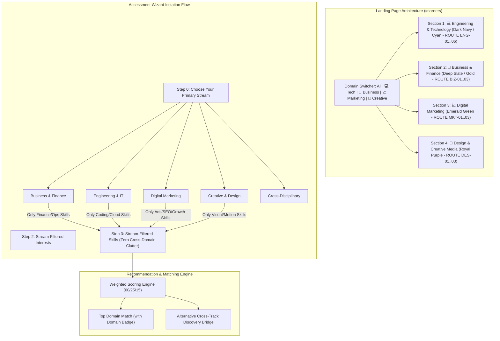

# Implementation Plan: Strict Section-Based Architecture (No Domain Mix-up)
**CareerPath AI · Team 404 Brain Not Found**
*Hack2Ignite 2026-27*

---

## Goal Description

Prevent confusion and domain clutter across CareerPath AI by implementing a **Strict Section-Based Architecture**. Currently, careers and skills are primarily tech-heavy, and mixing all disciplines into a single list alienates non-engineering students (Commerce, BBA, MBA, Arts) while forcing engineering students to filter through unrelated fields.

This plan enforces clean domain separation across three critical layers:
1. **Landing Page (`#careers` in `index.html`):** Divides the catalog into **4 visually distinct blocks** (Engineering, Business & Finance, Digital Marketing, Creative & Design) with custom color branding and a sticky domain switcher.
2. **Assessment Wizard (`assessment.html` & `assessment.js`):** Introduces **Step 0: Choose Your Primary Stream** which strictly filters Step 2 (Interests) and Step 3 (Skills). A commerce student will **never see React, C++, or Docker**, and an engineer will only see relevant technical skills.
3. **Recommendations & Matching Engine (`recommendations.html` & `recommendationService.js`):** Badges results by domain (`Domain: Business & Finance`) and provides intelligent **Alternative Cross-Track Suggestions** (e.g. suggesting *Data Analyst* to an analytical Finance student).

---

## User Review Required

> [!IMPORTANT]
> **Engineering Section Preservation:**
> The existing Engineering & Technology section (Front-End, Full-Stack, Data Analyst, UI/UX, Cybersecurity, AI/ML) will remain **100% intact and untouched**. We are adding 3 new dedicated blocks (Business, Marketing, Creative) alongside it.

> [!NOTE]
> **Step 0 Experience:**
> Step 0 will appear as 5 intuitive stream cards right at the start of the assessment. Selecting a stream instantly tailors the rest of the wizard, while selecting "Cross-Disciplinary" keeps all options accessible with filter tabs.

---

## System Architecture Diagram



---

## Proposed Changes

---

### Component 1: Landing Page Dedicated Sections & Switcher

#### [MODIFY] `client/index.html`
Replace the single career grid with a sticky domain filter bar and 4 visually distinct blocks:

1. **Domain Switcher Sub-Navbar:**
```html
<div class="career-domain-bar d-flex justify-content-center flex-wrap gap-2 mb-5">
  <button class="domain-tab-btn active" data-target="all">
    <i class="bi bi-grid-fill me-1"></i> All Tracks
  </button>
  <button class="domain-tab-btn" data-target="tech">
    <i class="bi bi-laptop me-1 text-cyan"></i> 💻 Tech & Engineering
  </button>
  <button class="domain-tab-btn" data-target="business">
    <i class="bi bi-briefcase me-1 text-gold"></i> 💼 Business & Finance
  </button>
  <button class="domain-tab-btn" data-target="marketing">
    <i class="bi bi-graph-up-arrow me-1 text-success"></i> 📈 Digital Marketing
  </button>
  <button class="domain-tab-btn" data-target="creative">
    <i class="bi bi-palette me-1 text-purple"></i> 🎨 Design & Creative
  </button>
</div>
```

2. **Section 1: 💻 Engineering & Technology (Existing — Untouched):**
   - Retains all existing cards (`ROUTE ENG-01` to `ROUTE ENG-06`).
   - Theme: Navy & Cyan (`border-cyan-subtle`).

3. **Section 2: 💼 Business, Finance & Management (NEW):**
   - Header: *"💼 Business, Finance & Corporate Operations"*
   - Subtitle: *"For BBA, B.Com, MBA, Economics, and Analytical Strategic Thinkers."*
   - Cards:
     - **Financial Analyst & Modeler (`ROUTE BIZ-01`):** DCF Valuation, Financial Statement Analysis, Excel Modeling, Power BI, Budgeting.
     - **Business Operations Manager (`ROUTE BIZ-02`):** Process Optimization, RevOps, KPI Tracking, Execution Strategy.
     - **Management Consultant (`ROUTE BIZ-03`):** Market Entry, Quantitative Advisory, Business Strategy, Executive Decks.
   - Theme: Deep Slate & Gold (`#F59E0B` border & accents).

4. **Section 3: 📈 Digital Marketing & Growth (NEW):**
   - Header: *"📈 Digital Marketing, Performance & Growth"*
   - Subtitle: *"For Growth Hackers, Performance Marketers, and Content Strategists."*
   - Cards:
     - **Performance Marketer & Media Buyer (`ROUTE MKT-01`):** Meta Ads, Google Ads, CAC/ROAS Scaling, Funnel Optimization.
     - **SEO & Organic Growth Strategist (`ROUTE MKT-02`):** Technical SEO, Keyword Intent, Search Analytics, Content Hubs.
     - **Social Media & Content Growth Manager (`ROUTE MKT-03`):** Viral Storytelling, Short-Form Algorithms, Community Engagement.
   - Theme: Emerald Green (`#10B981` border & accents).

5. **Section 4: 🎨 Design & Creative Media (NEW):**
   - Header: *"🎨 Design, Creative Media & Visual Storytelling"*
   - Subtitle: *"For Visual Storytellers, Motion Designers, and Creative Communicators."*
   - Cards:
     - **Brand & Visual Identity Designer (`ROUTE DES-01`):** Brand Guidelines, Logo Systems, Adobe Illustrator, Typography.
     - **Motion Graphics & 3D Designer (`ROUTE DES-02`):** After Effects, 3D Visuals (Blender), Kinetic Type, Commercial Motion.
     - **B2B Technical & Creative Copywriter (`ROUTE DES-03`):** High-Converting Copy, Pitch Decks, Case Studies, Storytelling.
   - Theme: Royal Purple & Violet (`#8B5CF6` border & accents).

#### [MODIFY] `client/css/pages.css`
Add styling for domain blocks, distinct glow borders, and sticky domain tab switchers:
- `.track-block-tech`: Cyan accents (`#22D3EE`)
- `.track-block-business`: Amber/Gold accents (`#F59E0B`)
- `.track-block-marketing`: Emerald accents (`#10B981`)
- `.track-block-creative`: Purple accents (`#8B5CF6`)

---

### Component 2: Assessment Stream Isolation (Step 0)

#### [MODIFY] `client/assessment.html`
Add **Step 0: Choose Your Primary Stream** before personal details:
```html
<div class="assessment-step-panel card p-4 p-md-5" id="stepPanel0">
  <div class="text-center mb-4">
    <span class="step-badge-circle mx-auto mb-2">00</span>
    <h2 class="h3 fw-bold text-ink">Choose Your Primary Stream / Interest</h2>
    <p class="text-muted">Select your field so we can show only relevant skills and questions — no clutter, no mix-up.</p>
  </div>
  <div class="row g-3 justify-content-center">
    <!-- Stream Cards -->
    <div class="col-md-6 col-lg-4">
      <div class="stream-card" data-stream="engineering">
        <div class="stream-icon text-cyan"><i class="bi bi-laptop"></i></div>
        <h4>Engineering & IT</h4>
        <p>Coding, Web, Mobile, Cloud, AI & Systems</p>
      </div>
    </div>
    <div class="col-md-6 col-lg-4">
      <div class="stream-card" data-stream="business">
        <div class="stream-icon text-gold"><i class="bi bi-briefcase"></i></div>
        <h4>Business & Finance</h4>
        <p>Financial Modeling, Valuation, Operations & Strategy</p>
      </div>
    </div>
    <div class="col-md-6 col-lg-4">
      <div class="stream-card" data-stream="marketing">
        <div class="stream-icon text-success"><i class="bi bi-graph-up-arrow"></i></div>
        <h4>Digital Marketing & Growth</h4>
        <p>Performance Ads, SEO, Content & Social Growth</p>
      </div>
    </div>
    <div class="col-md-6 col-lg-4">
      <div class="stream-card" data-stream="creative">
        <div class="stream-icon text-purple"><i class="bi bi-palette"></i></div>
        <h4>Creative & Design</h4>
        <p>Brand Identity, Motion Graphics & Visual Storytelling</p>
      </div>
    </div>
    <div class="col-md-6 col-lg-4">
      <div class="stream-card" data-stream="cross">
        <div class="stream-icon text-teal"><i class="bi bi-compass"></i></div>
        <h4>Cross-Disciplinary</h4>
        <p>Explore across all career streams</p>
      </div>
    </div>
  </div>
</div>
```

#### [MODIFY] `client/js/assessment.js`
* Store `selectedStream` in assessment state.
* Filter `ALL_INTERESTS` dynamically based on `selectedStream`:
  - `business`: Only shows Finance, Valuation, Operations, Consulting, Strategy.
  - `marketing`: Only shows Ads, SEO, Content Marketing, Social Media, Growth.
  - `creative`: Only shows Brand Identity, Motion Design, UI/UX, Copywriting.
  - `engineering`: Shows Web, Cloud, AI, Security, Systems.
* Filter `FALLBACK_SKILLS` & database skills dynamically:
  - If `business` is chosen: **Hides all programming/cloud skills**; displays only Excel, Financial Modeling, DCF Valuation, Financial Statement Analysis, Accounting, Power BI, Pitch Decks.
  - If `marketing` is chosen: Displays Google Ads, Meta Ads Manager, SEO Strategy, GA4, Copywriting, Email Marketing, CRO.
  - If `creative` is chosen: Displays Figma, Illustrator, Photoshop, After Effects, Motion Graphics, Typography, Blender.
  - If `engineering` is chosen: Displays existing tech stack.

---

### Component 3: Backend Careers & Recommendation Categorization

#### [MODIFY] `server/models/Career.js`
Update `category` enum to include `'business'`, `'finance'`, `'marketing'` and add `domain`:
```javascript
domain: {
  type: String,
  enum: ['engineering', 'business', 'marketing', 'creative'],
  default: 'engineering',
}
```

#### [MODIFY] `server/data/careersData.js` & `server/data/skillsData.js`
Add the 9 new non-engineering careers and their respective skills with clean descriptions and importance weights.

#### [MODIFY] `server/services/recommendationService.js`
* Detect user's stream from assessment inputs.
* Prioritize careers matching the user's primary domain.
* Add **Alternative Cross-Track Discovery**: If an analytical business student scored well on data/analytics, append a cross-track recommendation with explanatory copy:
  *"💡 Cross-Domain Discovery: Because of your strong quantitative skills, you also match 78% with Data Analyst in the Tech Track."*

#### [MODIFY] `client/js/recommendations.js` & `client/recommendations.html`
* Render clear color-coded domain badges on recommendation cards:
  - `<span class="badge badge-gold">💼 Domain: Business & Finance</span>`
  - `<span class="badge badge-cyan">💻 Domain: Engineering & Technology</span>`
  - `<span class="badge badge-emerald">📈 Domain: Digital Marketing</span>`
  - `<span class="badge badge-purple">🎨 Domain: Design & Creative</span>`

---

## Verification Plan

### Automated Tests
1. **Catalog Domain Query Test:**
   - Query `GET /api/careers?domain=business`: Returns the 3 business careers.
   - Query `GET /api/careers?domain=engineering`: Returns the 6 engineering careers.
2. **Recommendation Isolation Test:**
   - Run recommendation algorithm with a Business profile (Excel + Financial Modeling):
   - **Expectation:** Top recommendations are `Financial Analyst` and `Business Operations Manager`, NOT `Full-Stack Developer`.

### Manual Verification
1. **Landing Page Navigation:**
   - Open `index.html#careers`.
   - Click `[ 💼 Business & Finance ]` in the switcher: Verify screen filters/scrolls to the Business block with gold borders and `ROUTE BIZ-01` cards.
   - Click `[ 💻 Tech & Engineering ]`: Verify the original engineering cards remain completely intact.
2. **Assessment Stream-Gate (Step 0):**
   - Open `assessment.html`.
   - Select **Business & Finance** in Step 0.
   - Proceed to Step 2 (Interests) and Step 3 (Skills):
   - **Verify:** Only business-related interests and skills are shown. Zero programming or Docker options appear.
   - Change selection to **Engineering & IT**: Verify full technical skill grid appears.
3. **Recommendation Report Badges:**
   - Complete assessment as a Business student.
   - Inspect `recommendations.html`: Verify that cards carry the gold `Domain: Business & Finance` badge and the cross-track bridge card renders cleanly.
