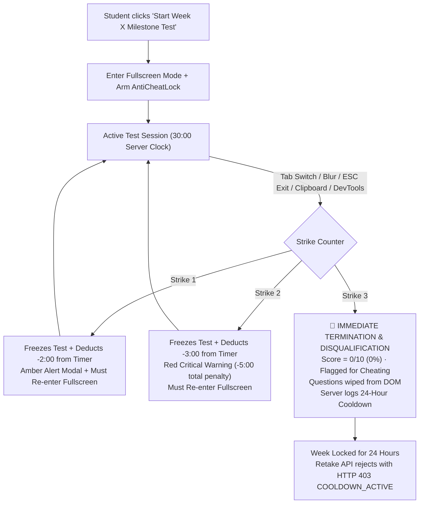

# Strict Anti-Cheating Lockdown Implementation Plan: Weekly Milestone Verification

## Executive Summary
This plan addresses the critical security gap identified in the **Weekly Milestone Verification Test** (`#weeklyTestModal` on [roadmap.html](file:///c:/Users/PARTH/OneDrive/Documents/hackethon/Hack%202%20ignite/CareerPath%20AI/careerpath-ai/client/roadmap.html) as shown in the user's screenshot). While adaptive skill checks in `quiz.html` have anti-cheating protection, the 30-minute, 10-question weekly milestone test—which permanently unlocks subsequent weeks and stamps skill evidence—currently operates **with zero proctoring deterrence**. Students can switch tabs, copy questions, use DevTools, or query LLMs completely undetected.

This plan binds the **Strict Anti-Cheating Lockdown Protocol** directly to `#weeklyTestModal`, backed by server-authoritative penalties, audit logging in MongoDB, and an unbreakable 24-hour retake lockout.

---

## 1. System Architecture & Penalty Mechanics



### Escalation Hierarchy:
1. **Strike 1 (Amber Caution)**:
   - Immediate session freeze (options disabled).
   - **-2 Minutes (-120 seconds)** deducted from the countdown clock synchronously on client and server.
   - High-friction acknowledgement modal: Requires user to acknowledge and re-engage fullscreen.
2. **Strike 2 (Red Critical Final Warning)**:
   - Immediate session freeze.
   - **-3 Minutes (-180 seconds)** deducted from the clock (cumulative **-5 minutes lost**).
   - High-friction acknowledgement modal: Warns that a single additional violation will trigger instant disqualification and a 24-hour retake lockout.
3. **Strike 3 (Immediate Disqualification & 24h Lockout)**:
   - Immediate test termination.
   - Questions are wiped from the DOM to prevent question harvesting or inspection.
   - Calls `POST /api/roadmaps/test/disqualify`: sets attempt score to **0% (FAILED - CHEATING DISQUALIFICATION)**, status to `disqualified_cheating`.
   - Backend sets `cooldownUntil = now + 24 hours` on `Roadmap.weekProgress[wNum - 1]`.
   - Any attempt to restart the milestone test within 24 hours is rejected with `403 Forbidden` (`COOLDOWN_ACTIVE`).
   - The roadmap UI reflects the lockout with a live countdown: `🔒 Retake locked for cheating (23h 45m remaining)`.

---

## 2. Detailed File Modifications

### A. Core Anti-Cheat Controller Enhancement
**File**: [`client/js/anti-cheat-lock.js`](file:///c:/Users/PARTH/OneDrive/Documents/hackethon/Hack%202%20ignite/CareerPath%20AI/careerpath-ai/client/js/anti-cheat-lock.js)
- Upgrade `AntiCheatController` to support parameterized endpoints and payloads:
  - Add options: `violationEndpoint` (default `'/quiz/violation'`), `disqualifyEndpoint` (default `'/quiz/disqualify'`).
  - Add options: `attemptId`, `roadmapId`, `weekNumber` to support milestone test sessions.
  - Add configurable strike penalties: `strikePenalties = [120, 180]` (seconds).
  - Add custom callback hooks: `onDeductTime(penaltySeconds)` so `roadmap.js` adjusts the live countdown in sync.
  - Enhance modals to reflect customized penalties (displaying "-2 Minutes" and "-3 Minutes" for weekly tests).

### B. Milestone Modal UI & HUD Additions
**File**: [`client/roadmap.html`](file:///c:/Users/PARTH/OneDrive/Documents/hackethon/Hack%202%20ignite/CareerPath%20AI/careerpath-ai/client/roadmap.html)
1. **Header HUD**:
   - Add `<span id="testProctorBadge" class="badge bg-danger-subtle text-danger border border-danger-subtle font-mono px-2.5 py-1 small"><i class="bi bi-shield-lock-fill text-danger me-1"></i>STRICT PROCTOR: ACTIVE</span>`.
   - Add `<span id="testStrikesBadge" class="badge bg-success-subtle text-success border border-success-subtle font-mono px-2.5 py-1 small"><i class="bi bi-shield-check me-1"></i>Strikes: <span id="testStrikesCount">0</span>/3</span>`.
   - Add `<span id="testFullscreenBadge" class="badge bg-secondary-subtle text-muted font-mono px-2 py-1 small d-none d-md-inline-flex"><i class="bi bi-fullscreen me-1"></i>Fullscreen Locked</span>`.
2. **Modal Body Strike Overlay**:
   - Insert modal-level strike backdrop overlay `#testStrikeOverlay` inside `#weeklyTestModal` for seamless in-modal freezing and recovery.
3. **Scripts Inclusion**:
   - Add `<script src="js/anti-cheat-lock.js?v=2.1"></script>` right before `<script src="js/roadmap.js"></script>`.

### C. Client Roadmap Test Controller Integration
**File**: [`client/js/roadmap.js`](file:///c:/Users/PARTH/OneDrive/Documents/hackethon/Hack%202%20ignite/CareerPath%20AI/careerpath-ai/client/js/roadmap.js)
1. **Instantiation & Arming in `openWeeklyTestModal(weekNumber)`**:
   - Upon successful test start response, request fullscreen: `await antiCheatLock.requestFullscreen()`.
   - Initialize and arm `antiCheatLock` with:
     ```javascript
     antiCheatLock = new window.AntiCheatLock({
       attemptId: activeAttempt.attemptId,
       roadmapId: currentRoadmap._id,
       weekNumber: weekNumber,
       violationEndpoint: '/roadmaps/test/violation',
       disqualifyEndpoint: '/roadmaps/test/disqualify',
       strikePenalties: [120, 180],
       onStrike: handleMilestoneStrike,
       onLockout: handleMilestoneDisqualification,
       onDeductTime: handleMilestoneTimerPenalty
     });
     antiCheatLock.arm();
     ```
2. **Dynamic Timer Penalty Deduction**:
   - Update `deadlineMs -= penaltySeconds * 1000`.
   - Flash timer badge in red with animation: `animate-shake`.
   - Show floating notice: `⚡ -2:00 Penalty Applied! Focus loss recorded.`
3. **Disqualification Handler**:
   - Clear countdown interval.
   - Wipe `#testQuestionsContainer` to prevent question copying.
   - Show disqualified verdict with 0% score and 24-hour lockout notice.
   - Disarm proctoring sensors.
   - Refresh roadmap overview to display cooldown status.
4. **Roadmap View Cooldown Guard**:
   - In `renderMilestoneCard`: if `weekProgress.cooldownUntil && new Date(weekProgress.cooldownUntil) > new Date()`, render disabled button: `🔒 Retake Locked (Cheating Cooldown: Xh Ym)` with remaining time.

### D. Server Roadmap Controller & Routes
**Files**:
- [`server/routes/roadmapRoutes.js`](file:///c:/Users/PARTH/OneDrive/Documents/hackethon/Hack%202%20ignite/CareerPath%20AI/careerpath-ai/server/routes/roadmapRoutes.js)
- [`server/controllers/roadmapController.js`](file:///c:/Users/PARTH/OneDrive/Documents/hackethon/Hack%202%20ignite/CareerPath%20AI/careerpath-ai/server/controllers/roadmapController.js)
- Add endpoints:
  - `POST /roadmaps/test/violation`: validates attempt ownership, logs violation type, deducts penalty seconds from server deadline.
  - `POST /roadmaps/test/disqualify`: marks attempt as `disqualified_cheating`, zeroes scores, activates 24-hour week lockout.

### E. Server Weekly Test Service & Mongoose Models
**Files**:
- [`server/models/Roadmap.js`](file:///c:/Users/PARTH/OneDrive/Documents/hackethon/Hack%202%20ignite/CareerPath%20AI/careerpath-ai/server/models/Roadmap.js)
  - Add fields to `weekProgress`:
    - `cooldownUntil: { type: Date, default: null }`
    - `lastDisqualifiedAt: { type: Date, default: null }`
    - `disqualifiedReason: { type: String, default: '' }`
- [`server/models/Attempt.js`](file:///c:/Users/PARTH/OneDrive/Documents/hackethon/Hack%202%20ignite/CareerPath%20AI/careerpath-ai/server/models/Attempt.js)
  - Add `'disqualified_cheating'` to `status` enum.
  - Add `violationLog: [{ type: String, penaltySeconds: Number, timestamp: Date, details: String }]`.
  - Add `strikesCount: { type: Number, default: 0 }`.
- [`server/services/weeklyTestService.js`](file:///c:/Users/PARTH/OneDrive/Documents/hackethon/Hack%202%20ignite/CareerPath%20AI/careerpath-ai/server/services/weeklyTestService.js)
  1. **Enforce Cooldown in `startWeeklyTest`**:
     - Check `weekProgress[wNum - 1].cooldownUntil`.
     - If `Date.now() < cooldownUntil`, reject immediately:
       ```javascript
       const remainingHours = Math.ceil((cooldownUntil - Date.now()) / (1000 * 60 * 60));
       const err = new Error(`Cheating Disqualification Lockout: Week ${wNum} retake is locked for 24 hours. Available in ~${remainingHours} hours.`);
       err.statusCode = 403;
       err.code = 'COOLDOWN_ACTIVE';
       throw err;
       ```
     - Cheating lockouts cannot be bypassed by demo accounts.
  2. **Implement `recordWeeklyTestViolation(userId, attemptId, violationType, penaltySeconds)`**:
     - Push violation event to `attempt.violationLog`.
     - Deduct `penaltySeconds * 1000` from `attempt.deadline`.
     - Increment `attempt.strikesCount`.
     - Save attempt to MongoDB.
  3. **Implement `disqualifyWeeklyTest(userId, attemptId, reason)`**:
     - Set `attempt.score = 0`, `attempt.percent = 0`, `attempt.passed = false`, `attempt.status = 'disqualified_cheating'`.
     - Set `weekProgress.status = 'awaiting_test'`.
     - Set `weekProgress.cooldownUntil = new Date(Date.now() + 24 * 60 * 60 * 1000)`.
     - Save roadmap and attempt.

---

## 3. Step-by-Step Implementation Sequence

1. **Step 1: Schema Updates**
   - Add `cooldownUntil`, `lastDisqualifiedAt`, `disqualifiedReason` to `Roadmap.weekProgress`.
   - Add `'disqualified_cheating'` status and `violationLog` array to `AttemptSchema`.
2. **Step 2: Backend Logic in `weeklyTestService.js`**
   - Implement `recordWeeklyTestViolation` and `disqualifyWeeklyTest`.
   - Add 24-hour `cooldownUntil` verification check to `startWeeklyTest`.
3. **Step 3: Controller & Routes**
   - Export and wire `recordWeeklyTestViolationController` and `disqualifyWeeklyTestController` in `roadmapController.js` and `roadmapRoutes.js`.
4. **Step 4: Shared Controller Upgrades in `anti-cheat-lock.js`**
   - Parameterize endpoints and penalties, add custom timer deduction callbacks.
5. **Step 5: Frontend Template & UI in `roadmap.html`**
   - Include `js/anti-cheat-lock.js`.
   - Add Proctoring HUD badges (`STRICT PROCTOR: ACTIVE`, `Strikes: 0/3`, `Fullscreen Locked`).
   - Add Strike Modal overlay elements inside `#weeklyTestModal`.
6. **Step 6: Frontend Wiring in `roadmap.js`**
   - Wire fullscreen launch and `AntiCheatLock` lifecycle on modal open/close/submit.
   - Implement timer penalty animations and strike counter HUD updates.
   - Implement DOM wipe and disqualification handling on Strike 3.
   - Update roadmap week card rendering to display live cooldown countdown for locked weeks.
7. **Step 7: Automated Verification Testing**
   - Create `server/tests/weekly_milestone_anticheat_test.js` to verify:
     - Violation logging and server deadline deduction (-120s / -180s).
     - Strike 3 disqualification: 0% score and 24-hour lockout.
     - Rejection of retake attempts with `403 COOLDOWN_ACTIVE`.

---

## 4. Verification Commands

```powershell
# 1. Run Automated Verification Test Suite
node server/tests/weekly_milestone_anticheat_test.js

# 2. Run Existing Strict Anti-Cheat Verification Suite
node server/tests/strict_anticheat_test.js

# 3. Type-check / Lint Verification
npm test
```
